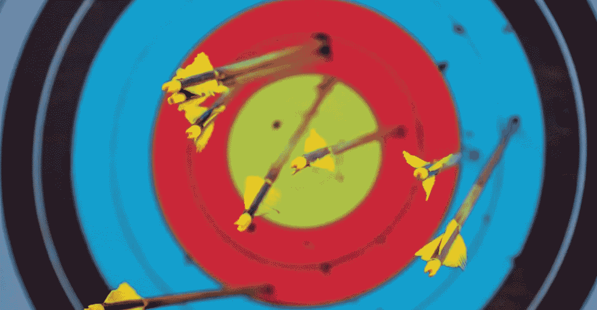
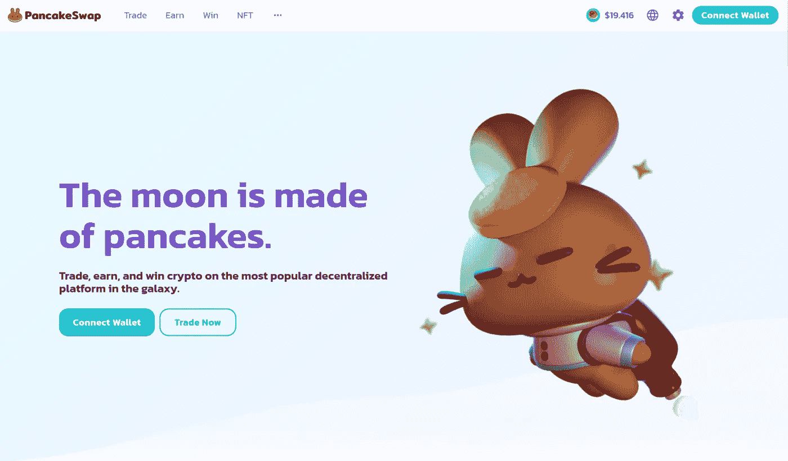
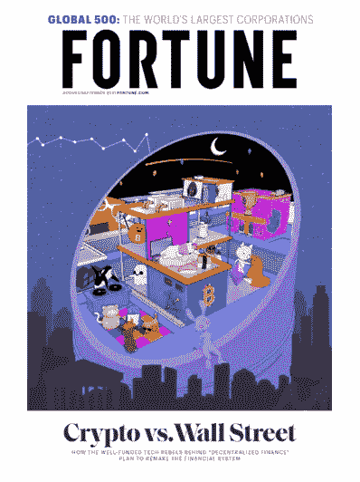
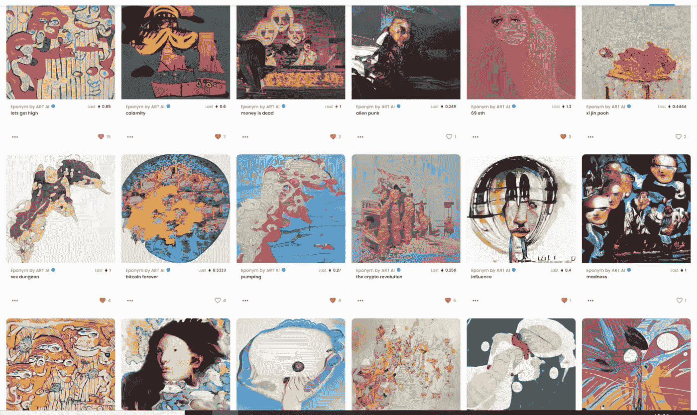

# 在 crypto bear 的最后 3 个月——我最大的成功和最严重的错误(第 3 部分)

> 原文：<https://medium.com/coinmonks/the-last-3-months-in-crypto-my-biggest-hits-and-worst-mistakes-part-3-9746f3588519?source=collection_archive---------10----------------------->

自从三个月前我写了一篇关于投资加密的最大成功和最大错误的文章以来，这是多么大的变化啊！在熊市的核冬天，市场从接近顶部一直下跌到新的底部。

我的表现遵循了这个趋势——从对 BTC*上涨 40%，到现在只上涨了 10%。无论如何，这都不是一个很好的轨迹，但实际上，考虑到最近 ETH 跌至 800 美元的严重崩盘，情况可能会更糟。事实上，我不是 rekt，仍然在相对利润是值得骄傲的事情。

现在让我们仔细检查一下我的位置—

# 我的 3 大赌注

# [1。变异猿游艇俱乐部(NFT)](https://www.coingecko.com/en/coins/iron-titanium-token)

r 倍数:2.64(包括$APE & Otherdeed airdrops)
总体收益:投资组合的 39%(全部包括)
持有时间:7 个月

持有这些股票是我迄今为止最疯狂的经历——从 2011 年 10 月写文章时的-6%到现在的+39%。我很高兴我跟随了我的直觉，在 5 月份卖掉了所有的空投物资以及接近最高点的猿猴，让我获得了将近 100 ETH(完全实现)的利润！更多关于那个[这里](https://twitter.com/m_goes_distance/status/1522613428598177793)。

这个单一的赌注基本上拯救了我的整个投资组合——否则，我可能会输给 BTC。这也是对未来的一个警告——我的运气和技术一样好。

# [2。俏皮岛](https://www.coingecko.com/en/coins/iron-titanium-token)

r 倍数:2.09
总体收益:11.74%投资组合
持有时间:11 个月

我在 9 个月前的文章中已经写了这个，所以我将不再赘述。也就是说，从那时起，我的相对利润略有下降，因为我没有卖掉所有的东西——这是我应该在接近顶部时立即做的事情。

# [3。蛋糕](https://www.coingecko.com/en/coins/iron-titanium-token)

r 倍数:2.23
总体收益:投资组合的 8.26%
持有时间:13 个月

我在 9 个月前也写过这个，所以我也将跳过细节。同样的教训也适用于 Nifty Island——我应该在价格上涨时卖掉所有东西，我的利润会更高。

> 交易新手？试试[加密交易机器人](/coinmonks/crypto-trading-bot-c2ffce8acb2a)或者[复制交易](/coinmonks/top-10-crypto-copy-trading-platforms-for-beginners-d0c37c7d698c)

总而言之，有趣的是，自从三个月前和九个月前写下这两篇文章以来，表现最好的人没有太大变化(除了猿类！)，让我每个季度都有一次真正的点击。这是我下注时需要注意的一点。此外，幂定律仍然适用——我的第四个最佳选择的利润比第三个几乎少 3 倍。

# 我最糟糕的 3 次下注

# [1。ETH](https://www.coingecko.com/en/coins/iron-titanium-token)

r 倍数:-0.09
总损失:投资组合的 15.12%
持有时间:1 年以上

这是变种人猿游艇俱乐部的反向故事。以太坊已经从三个月前我第二大赢家变成了我最大的输家。为什么？仅仅是因为在最近的熊市中，与比特币相比，比特币的跌幅相对更大，以及我的头寸规模。

也就是说，这不是恐慌的理由，我继续持有，因为我相信 ETH 将恢复其相对优势，然后更多。此外，如果我没有在 5 月份暴跌发生之前将我持有的大量其他股票出售给瑞士联邦银行，我可能会有其他一些损失更严重的头寸。

# [2。财富传媒 NFT](https://www.coingecko.com/en/coins/iron-titanium-token)

r 倍数:-0.64
总损失:投资组合的 11.43%
持有时间:11 个月

这里不多补充了。三个月前最大的输家一直排在第二位。相对损失变得稍微严重一些，因为我的投资组合的总价值在这次熊市中下跌了。

# [3。齐名 NFT](https://www.coingecko.com/en/coins/iron-titanium-token)

r 倍数:-0.88
总损失:投资组合的 4.91%
持有时间:8.5 个月

我的第三大损失仍然是我的第三大损失，这并不奇怪。随着同名图书的价格持续下跌，这种损失实际上已经加深。不过没关系，正如我在上一篇文章中解释的那样，这是我的一次激情购买，如果需要的话，我准备一路骑到零。

# 结论

由于 5 月份不幸事件后突然出现的深度熊市，我本季度的总体表现一直是负面的。也就是说，在最大的暴跌之前把我最有价值的 NFT 和一些可替代的代币卖给 ETH 是天赐良机——相信你的直觉，在繁荣时卖出，并总是获利，这已被证明是我需要继续坚持的信条。

除此之外，我相信耐心和长期思考仍然是关键——我每隔几个月才会有一次真正的成功，如果我在其他方面没有损失太多钱，这就足够了。此外，如果有信念，最大的输家也可能成为最大的赢家，反之亦然。

作为奖励，我列出了我迄今为止最大的错误，供你欣赏。不管怎样，避开，避开，避开！：

*   头寸太大(NFT 财富损失 10%)
*   价格快速波动后的 FOMO，而不是等待修正(即 10 月 21 日在 4，000 美元时做多，在 6 月 22 日价格下跌 50%后过于激进地做空，而不是在救援反弹后做空)
*   验证偏差，而不是获利(即，在 6 月 22 日的一周内，空头头寸迅速达到 40%的利润后，继续增加空头头寸，而不是在反弹后获利并重新建仓)
*   一次全部转移，而不是 DCA(即一次性将 2%转换为银行存款，而不是以 0.5%的增量)
*   动作太慢(观察时间太长，错过了一个突然的泵，而不是进行象征性的投资)
*   反向风险回报比(即，通过利用 ETH 获得 3%的投资组合收益，风险为 90%的资本，从 ETH 获得 30%的风险，年利率为 4%)
*   (任何形式的)杠杆作用
*   考虑太短(即只看 4 小时图而不看 3 个月图，不考虑中期会发生什么)
*   手头没有任何现金用于 DCA、生活和业务开支

-

**注:*

*我用比特币来命名我所有的盈利和亏损，因为我从来没有卖回给菲亚特。因此，所有的%收益和损失都是针对 BTC，而不是美元。这使得记录相对利润变得更加困难，但也抹杀了大部分市场范围内的波动。同样，以上所有的 R 倍数都是以 BTC 为单位的。这意味着，比方说，如果 R 的倍数是 3.88——在把我的头寸卖回 BTC 后，我收到的比特币是我最初投入的 4.88 倍。*

-

要了解更多关于我的加密之旅，请查看我在这里或➡️的其他文章[在 twitter 上关注我](https://twitter.com/m_goes_distance)🐦。如果你喜欢这篇文章，请鼓掌-

> 加入 Coinmonks [电报频道](https://t.me/coincodecap)和 [Youtube 频道](https://www.youtube.com/c/coinmonks/videos)了解加密交易和投资

# 另外，阅读

*   [block fi vs Celsius](/coinmonks/blockfi-vs-celsius-vs-hodlnaut-8a1cc8c26630)|[Hodlnaut 审核](/coinmonks/hodlnaut-review-best-way-to-hodl-is-to-earn-interest-on-your-bitcoin-6658a8c19edf) | [KuCoin 审核](https://coincodecap.com/kucoin-review)
*   [Bitsgap 评审](/coinmonks/bitsgap-review-a-crypto-trading-bot-that-makes-easy-money-a5d88a336df2) | [Quadency 评审](/coinmonks/quadency-review-a-crypto-trading-automation-platform-3068eaa374e1) | [Bitbns 评审](/coinmonks/bitbns-review-38256a07e161)
*   [加密复制交易平台](/coinmonks/top-10-crypto-copy-trading-platforms-for-beginners-d0c37c7d698c) | [Coinmama 审核](/coinmonks/coinmama-review-ace5641bde6e)
*   [印度的加密交易所](/coinmonks/bitcoin-exchange-in-india-7f1fe79715c9) | [比特币储蓄账户](/coinmonks/bitcoin-savings-account-e65b13f92451)
*   [OKEx vs KuCoin](https://coincodecap.com/okex-kucoin) | [摄氏替代品](https://coincodecap.com/celsius-alternatives) | [如何购买 VeChain](https://coincodecap.com/buy-vechain)
*   [币安期货交易](https://coincodecap.com/binance-futures-trading)|[3 comas vs Mudrex vs eToro](https://coincodecap.com/mudrex-3commas-etoro)