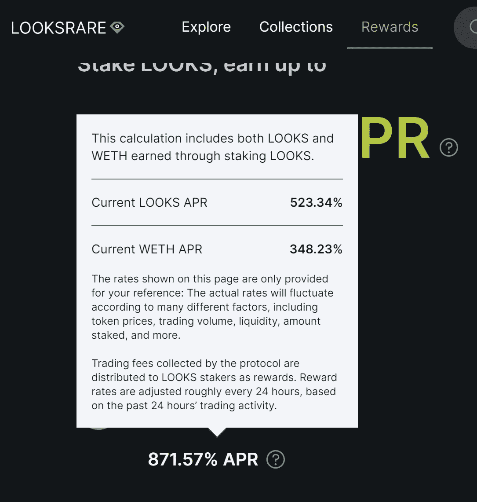
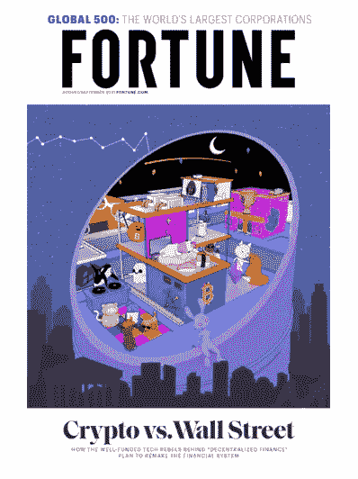
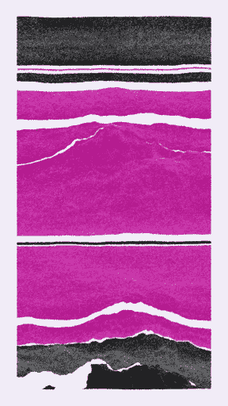
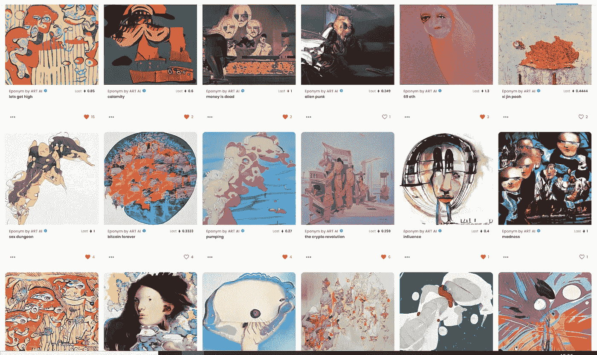
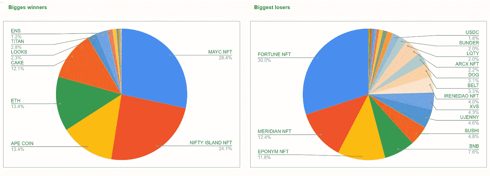
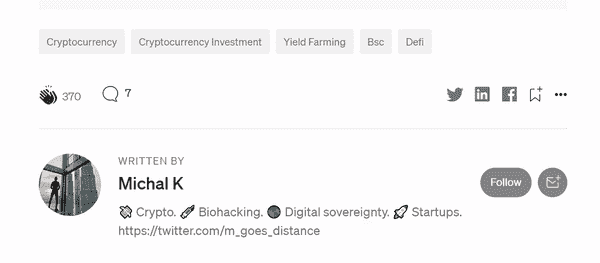

# 在 crypto 的过去 6 个月——我最大的成功和最严重的错误(第二部分)

> 原文：<https://medium.com/coinmonks/the-last-6-months-in-crypto-my-biggest-hits-and-worst-mistakes-part-2-ce8c1f50658c?source=collection_archive---------7----------------------->

六个月前，我花了一些时间来反思我投资 crypto 的最大成功和最大失误。它非常有助于我反思和找出哪些策略有效，哪些无效。

是时候用一些新的数字来更新这个了。首先，让我说，我不是一个交易者，一直更注重持有，而不是翻转令牌。投资和交易也不是我的主要活动——尽管我全职从事加密工作，但首先也是最重要的，我一直在忙于构建。就这样，让我们开始吧。

剧透:自从一年前开始以来，我对 BTC 的表现已经有了 40%的了解。

## 我的 3 大赌注

## [1。变异猿游艇俱乐部(NFT)](https://www.coingecko.com/en/coins/iron-titanium-token)

r 倍数:1.75 (2.58 包括$APE 空投)
整体收益:投资组合的 14.8%(21.8%包括$APE 空投)
持有时间:7 个月

非常有趣的一个。这个赌注从我 6 个月前写最后一篇文章时的最大错误，到我最大的胜利。耐心是有回报的，这是一个活生生的例子。点击此处查看故事详情—[https://Twitter . com/m _ goes _ distance/status/1505810444228780032](https://twitter.com/m_goes_distance/status/1505810444228780032)

接下来，我将跳过我上次写过的 Nifty Island(目前收益为总投资组合的 12.58%)，直接进入下一个话题

## [2。ETH](https://www.coingecko.com/en/coins/iron-titanium-token)

r 倍数:0.08
整体收益:6.97%投资组合
持有时间:1 年

尽管 ETH 的收益很小(主要是价格横向波动)，但相对于我整个投资组合的头寸规模已经足够大，足以进入前三名。这是一个简单的故事，我一直认为这是我最重要的立场之一，这证明了简单是有用的。

接下来，我将跳过蛋糕(目前收益为总投资组合的 6.31%)，这是我上次写的，直接进入下一个

## [3。外观](https://www.coingecko.com/en/coins/iron-titanium-token)

r 倍数:2.37
总体收益:投资组合的 1.48%
持有时间:3 个月

我的大部分容貌都是通过空投获得的，因此，如果我没有用自己的钱再买一些的话，R 的倍数应该是∞。尽管如此，前两个月 400 %- 800%的赌注回报是惊人的，因此我已经赚回了我投资的所有额外的钱。我继续持有代币，作为我目前最大的收益来源。

Sweet, sweet APRs.

此外，请注意，与前两个位置相比，总回报递减(总投资组合的 1.48%)。幂律真的起作用了，我的回报是冒险式的——前两个赌注比其他任何东西加起来都重要。

# 我最糟糕的 3 次下注

## [1。财富媒体 NFT](https://www.coingecko.com/en/coins/iron-titanium-token)

r 倍数:-0.64
总损失:投资组合的 8.76%
持有时间:8 个月

我怎么会在这一次赌博中输掉这么多钱呢？简单。我太鲁莽了，头寸太大了。我不应该那样做。我不会再那样做了。实际情况是，我买了一辆 NFT，它的价格迅速上涨。我做了更多。然后就失败了。早该知道的…

尽管如此，这是一个经典的 pplpleasr 作品，标志着加密史上的一个里程碑时刻，所以我决定不卖，并长期持有。希望这能像 MAYC 一样，在即将到来的一次报道中，作为我的前三名赌注卷土重来。敬请期待！

The first Fortune Magazine cover issued as an NFT, commemorating the rapid rise (and mainstream attention) of DeFi.

## [2。子午线 NFT](https://www.coingecko.com/en/coins/iron-titanium-token)

r 倍数:-0.69
总损失:投资组合的 3.62%
持有时间:6 个月

和上面类似的故事。当价格快速上涨时进场，仓位过大。同上，坚持期待最终的回归。

A money burner as of now… but isn’t it a beautiful piece of generative art?

## [3。齐名 NFT](https://www.coingecko.com/en/coins/iron-titanium-token)

r 倍数:-0.80
总损失:投资组合的 3.44%
持有时间:6 个月

同样，位置有点太大。人工智能+人类生成系列在我看来是如此独特和高质量，以至于我无法抗拒，并不断用我喜欢的作品补充我的收藏，直到它达到 24 件。我确实相信价值会继续上升，但我也让我的情绪超越了我的理智——我买了更多的作品，因为我喜欢它们，无法抗拒，尽管头寸很大。

My collection I will proudly brag with and keep holding just for the art, any day!

## 结论

总的来说，我的 BTC 投资组合的价值比我一年前开始积极跟踪它的时候高出了 40%——比我上次写文章的时候高出了 21%。也许不令人惊讶，但非常体面，因为我没有翻盘，从一个已经相当大的位置开始，并且在 NFT 的比赛中迟到了。

我的哲学一直是——走得稳，走得远。如果我能继续以这种速度复利，事情会变得非常非常有趣。随着比特币的美元价格不断上涨，情况就更是如此。赞美已经够多了，我在这段时间里学到了什么？

1.  **职位规模决定一切**。如果我没有大举进入，我最大的损失可能会小得多。我的一些收益也会受到抑制(尤其是变异猿类)，但总的来说，上下不对称会更大。
2.  **幂律为王**。我最大的 3 次失败比我其他 21 次失败加起来还多。我最大的两次收获比我其他 17 次胜利的总和还要多。此外，我最大的 2 个收益几乎弥补了我所有的 24 个损失。这是什么意思？关注表现最好的人，让收益最大化，尽早遏制最大的输家——这是一个比试图充分利用每个头寸更有效的策略。
3.  **实现你的收获**。我不能强调这件事的重要性。每当我的一个头寸对 BTC 大幅上涨时，随之而来的是最终的下跌，在许多情况下，随之而来的并不是接近之前高点的反弹。

*   当某样东西的价格快速上涨时，人们的本能总是继续投资，或者更糟糕的是，以更多的钱双倍下注。这种本能几乎总是错误的。在我没有实现任何收益的情况下，我几乎总是会后悔，反之则不会。也有例外——比如突变猿，在我看来，尽管价格大幅上涨，但这一论点仍然一如既往地有力。即便如此，我还是通过出售空投的 2/3 的 APE 代币获得了一些收益。
*   反之亦然——当我的论点发生变化，不再相信某项资产时——尽管亏损，卖掉它总是正确的决定，尽管它总是难以下咽。吸收一点到中等程度的损失比一路下跌到零要好，尤其是如果这意味着持有一项我不再信任的资产。

Adding in two pie charts to illustrate my point (2).

就是这样！我离顶级交易者/投资者还差得远，我可能永远也不会成为——因为这不是我的主要关注点。尽管如此，我相信通过不断的学习、严格的反思和在市场中的时间，我可以继续为自己做得很好，并继续使用收益来资助我的生活方式，并花时间去做我真正热爱的事情。

-

要了解更多关于我的加密之旅，请查看我在这里或➡️的其他文章[在 twitter 上关注我](https://twitter.com/m_goes_distance)🐦。如果你喜欢这篇文章，请鼓掌-

> 加入 Coinmonks [电报频道](https://t.me/coincodecap)和 [Youtube 频道](https://www.youtube.com/c/coinmonks/videos)了解加密交易和投资

# 另外，阅读

*   [印度最佳 P2P 加密交易所](https://coincodecap.com/p2p-crypto-exchanges-in-india) | [柴犬钱包](https://coincodecap.com/baby-shiba-inu-wallets)
*   [八大加密附属计划](https://coincodecap.com/crypto-affiliate-programs) | [eToro vs 比特币基地](https://coincodecap.com/etoro-vs-coinbase)
*   [最佳以太坊钱包](https://coincodecap.com/best-ethereum-wallets) | [电报上的加密货币机器人](https://coincodecap.com/telegram-crypto-bots)
*   [交易杠杆代币的最佳交易所](https://coincodecap.com/leveraged-token-exchanges)
*   [最佳加密分析或链上数据](https://coincodecap.com/blockchain-analytics) | [Bexplus 评论](https://coincodecap.com/bexplus-review)