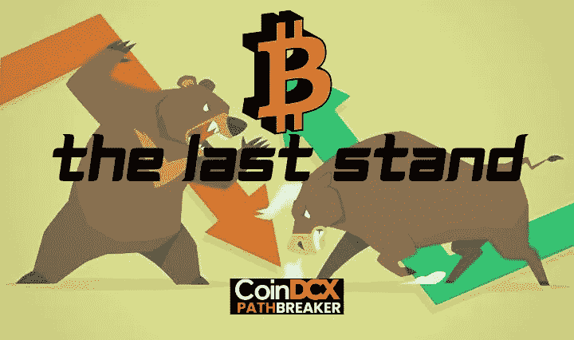
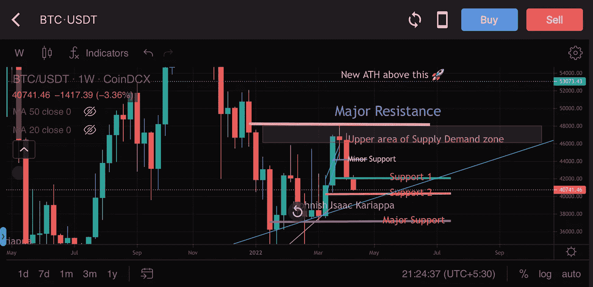
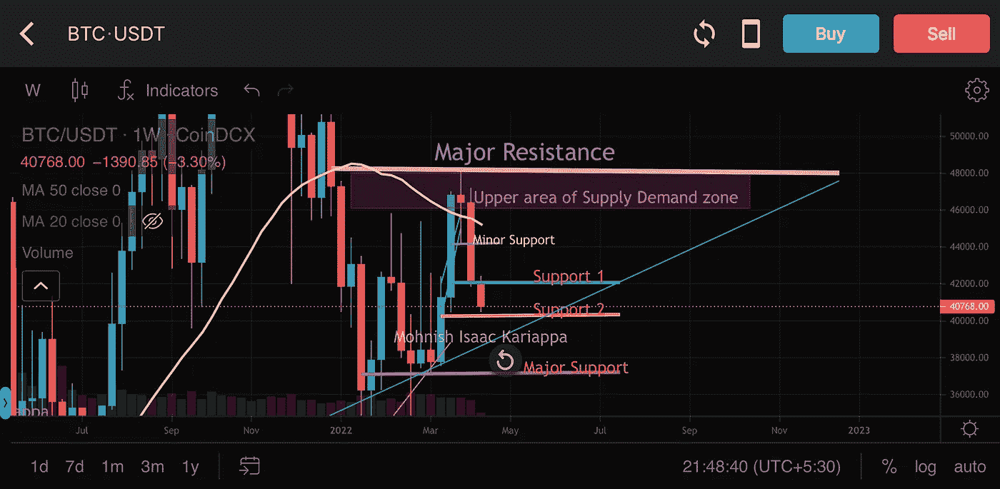
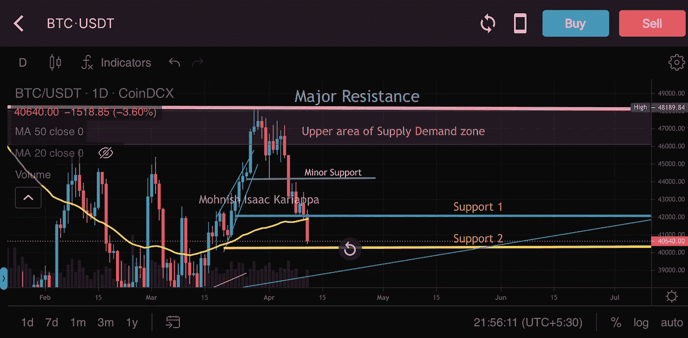
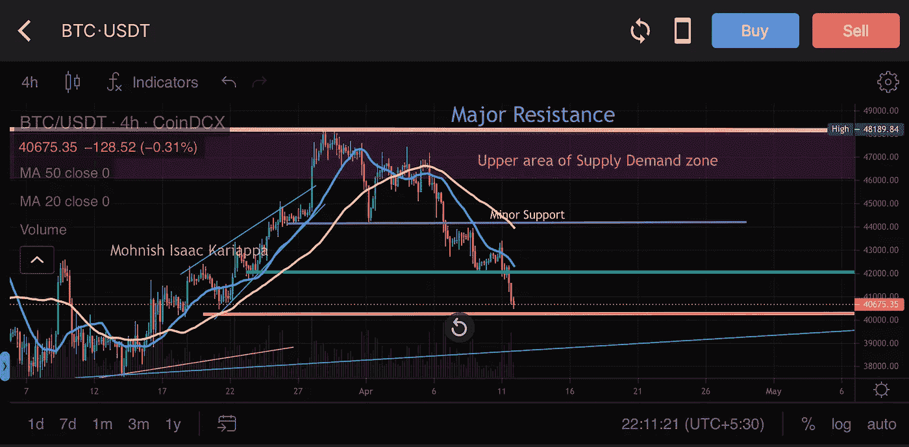
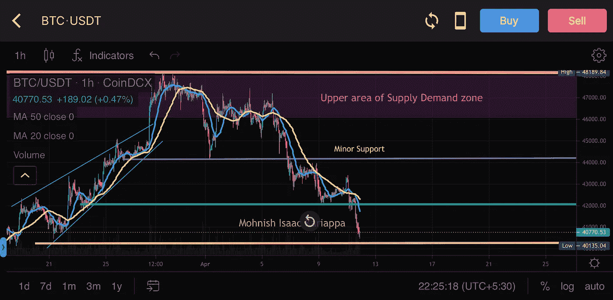
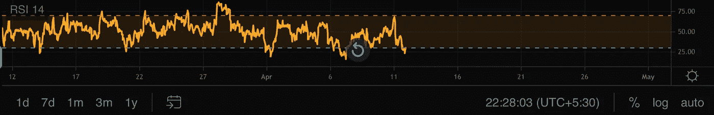
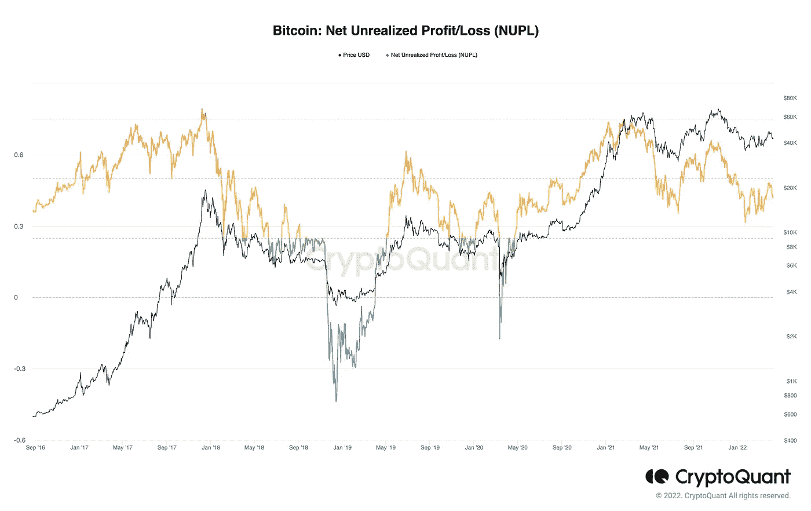
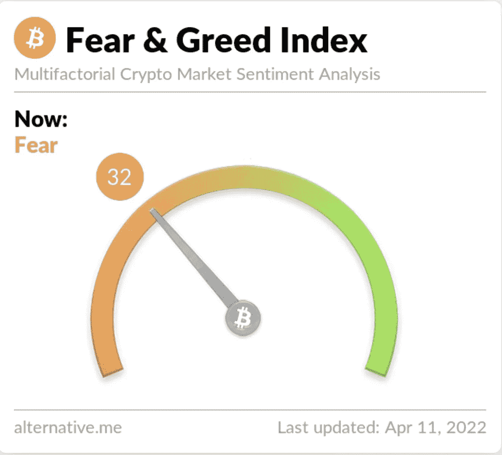
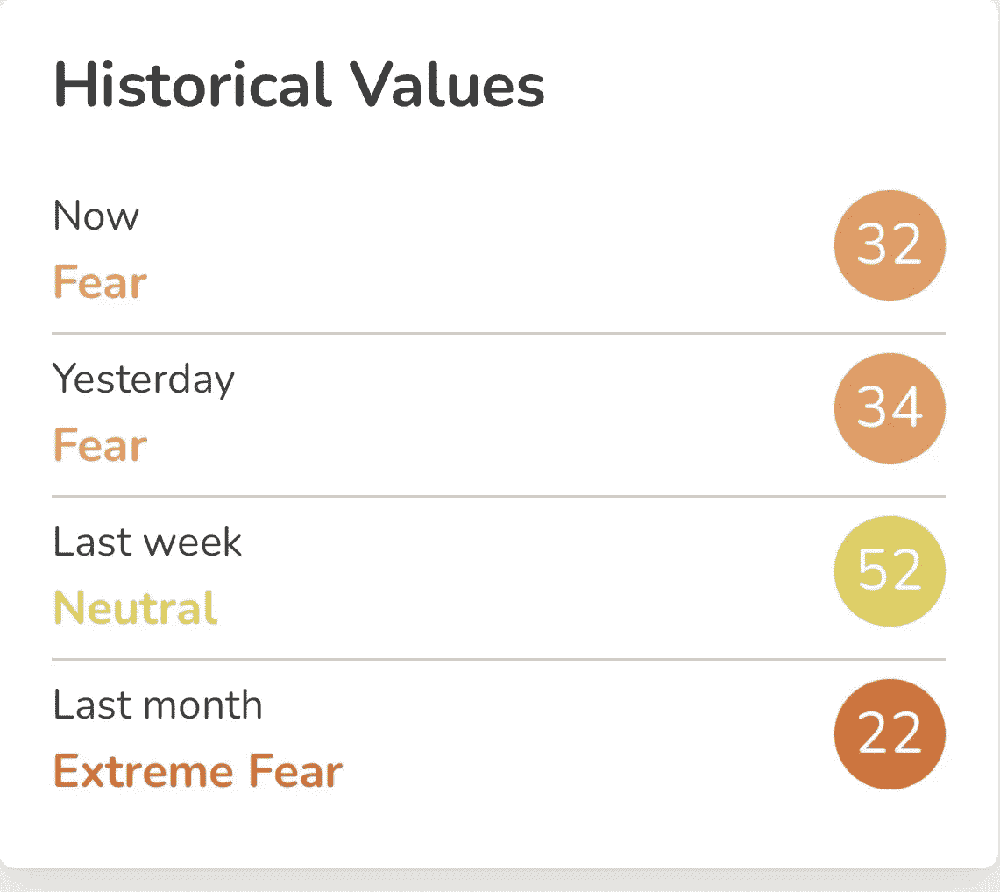

# 比特币的最后阵地

> 原文：<https://medium.com/coinmonks/the-last-stand-for-bitcoin-45033f37778?source=collection_archive---------68----------------------->

是的，你没看错，目前的局势是 BTC 的最后一战。我已经设定了清晰的关卡，无论是对多头还是对空头来说，这都将是一场绝对的胜利，现在的战斗看起来超级疯狂。

在本文中，我们将涵盖以下数据:

*   **BTC 1W，1D 4H&1H(兑换:**[**CoinDCX**](http://coindcx.com)**)**
*   **恐惧&贪婪指数**
*   **链上数据**

## BTC 1W 图表展望

BTC/USDT 1W on CoinDCX

根据我的专业技术分析，上面的图表是我能设定的最干净的价格水平。每一层的支持:阻力在每一个交汇点都得到了价格的尊重。

如果我们缩小上图，我们可以看到

*   48，200 美元水平是主要阻力(粉红色水平线)
*   就在主要阻力区的下方是供应箱(红箱),我在之前的比特币报告中提到过，如果多头未能推动价格上涨，卖家将会快速强硬地介入
*   在价格跌破供应箱后，我们在周线图上看到一个熊市吞没蜡烛形态&我们在 1 号支撑处停下来
*   价格在支撑位 1 附近盘整了几天，由于没有什么利多消息，价格得以维持，我们立即看到价格跌破支撑位 1
*   现在我们可以清楚地看到价格在支撑位 2(黄色趋势线)附近看起来很弱，位于 40，600 美元水平。失去这一点将是本轮牛市的主要担忧。

进一步看周线图，我们可以清楚地看到价格的局部疲软，每个主要支撑位都在被一个接一个地打破。另一方面，我也看到 BTC 和美国股市之间有很强的相关性，这也不是一个很好的迹象。在写这份报告的时候，股票开始下跌，我们看到 BTC 也是如此。

# 精神食粮

我更倾向于看跌的一方，这个价格行为仅仅基于一个标准，那就是价格行为，尽管有看涨的消息。还记得 2021 年的上涨吗，当时我们让 Microstrategy 宣布他们在资产负债表上积累了 BTC，然后是 Square &然后是 Tesla。这些消息反映在 BTC 的价格行动上。

快进到 2022 年，我们看到跆拳道用数百万美元购买 BTC 的 UST 储备，价格仍然没有看到任何看涨的势头。实力在哪里？买家在哪里？卷在哪里？

BTC/USDT (CoinDCX Pro app)

上面的图表有 50 毫安(黄线)在价格上方，收回它对多头来说是一个艰难的任务。BTC 2021 年的形态价格范围一直在 29，000 美元(波动低点)到 69，000 美元(ATH)的宏观范围内，只要我们保持在 50 毫安以下，就有重新回到 30，000 美元低位的重大风险，但失去 37，000 美元的水平将打破一个主要的宏观结构形成，然后 20，000 美元以下的水平将不会被取消。

## BTC 1D 图表展望

BTC/USDT 1D on CoinDCX Pro app

上图中的 1D 蜡烛线也形成了另一根吞噬熊市的蜡烛线，这样的收盘会给我们带来更大的下跌压力。正如你在上面看到的，BTC 已经回撤并抹去了过去几天的所有收益，这让我们相信这一切都是假的。

在 1D 图上，价格在支撑位 2(黄线)40，200 美元上方盘整，这是另一个看跌信号。价格在支撑位以上的盘整有很高的打破支撑位的风险，尤其是在没有反弹迹象的时候。

在整个假泵期间发生的最大问题是，BTC 在上涨过程中没有任何回调，这导致价格无法创造任何形式的主要支撑位。抛物线价格行为是最糟糕的一种价格结构，尤其是当我们没有处于全面牛市的时候。

在 1D 图上，BTC 需要立即收复 46，700 美元的价格水平，以避免下跌风险，稍后我们可以谈论突破其他阻力。目前的情况并不好，如果未来 3-4 天内价格没有回升，我们可能会投降。

## BTC 4H 图展望

BTC/USDT 4H on CoinDCX

BTC 4H 图向我们展示了一个更加看跌的结构形态。20 毫安和 50 毫安也处于下降趋势，如果我们看到价格上涨，它们将是非常强的阻力。

在目前 40，600 美元的价格水平，我们有 4 个主要的阻力集群打破:

*   42，300 美元水平(绿线)是以前的支撑位，现在变成了阻力
*   44，200 美元级别(紫色线)
*   供应区域(红框)也将对价格产生重大阻力，我们可能会在该区域经历大幅波动以及多头和空头之间的争斗
*   关键级别区域 48，200 美元(粉色线)，这是一场巨大的硬仗

目前的价格水平将经历很大的波动，但收盘低于 40，500 美元的水平将是丑陋的，然后我们的主要支撑位将在 37，000 美元的水平。支持水平的宏观区域。

根据我图表上的自定义指标，阻力水平为:

*   $45,400
*   $44,920
*   $43,467
*   $41,776

无论如何，以上都是较高的水平，我们应该更多地关注较低的水平，并建立强有力的风险管理，避免高杠杆多头从市场中被冲走。

## BTC 1H 图表展望

BTC/USDT 1H chart on CoinDCX Pro app

chart 图表显示价格是一个持续的下降趋势，一路设定更低的低点和更低的高点。MAs 在这个时候是一个明显的阻力。

RSI of BTC/USDT 1H

上面的图表是当前 BTC 价格行动的 RSI，我们可以看到它进入超卖区。如果我们看不到大量买进，这里可能会出现死猫反弹。

BTC 目前仅有的两个相关水平是 42，000 美元和 43，700 美元。这些是 BTC 需要尽快恢复的关键水平，以避免进一步的下行风险。

如果 BTC 多头没有突破上述两个水平，明天公布的 CPI 数据将对整个市场的资产产生重大影响，我们可能会看到 BTC 从这里开始有很多下行风险。

我们不应不惜任何代价突破 37，000 美元。如果发生这种情况，我们将看到牛市的结束，并不幸进入熊市。

## 链上数据

**比特币 NUPL-** 我在链上数据分析上强调了很多，在上面的图表中，我们也将关注净未实现利润/损失(NUPL)指标。

目前，BTC 的 NUPL 比率为 0.418，反映了绝对休眠。这与交易者的价格行为和情绪一致，既不支持多头，也不支持空头。

## 恐惧和贪婪指数

恐惧和贪婪指数目前处于 32，这反映出市场情绪在这一点上明显是怀疑和悲观的。交易者会觉得这可能是一个底部指标，但在任何情况下，这个指数都不能保证价格不会再低了。老实说，随着看涨消息的传播和最近结束的 BTC 会议对 BTC 的影响，我们绝对没有看到任何反映在价格行动中的情况。所以还是谨慎观望为好

从 [CoinDCX](https://coindcx.com/signup) 开始您的 BTC 交易之旅:

*   用您的姓名、电子邮件和手机号码注册
*   接受 CoinDCX 的服务条款
*   完成您的 KYC 验证并添加您的银行帐户详细信息
*   一旦批准，存款菲亚特通过您批准的银行帐户或转移加密从您的其他加密钱包，你就完成了。

# CoinDCXpathbreaker

> 加入 Coinmonks [电报频道](https://t.me/coincodecap)和 [Youtube 频道](https://www.youtube.com/c/coinmonks/videos)了解加密交易和投资

# 另外，阅读

*   [3 商业评论](/coinmonks/3commas-review-an-excellent-crypto-trading-bot-2020-1313a58bec92) | [Pionex 评论](https://coincodecap.com/pionex-review-exchange-with-crypto-trading-bot) | [Coinrule 评论](/coinmonks/coinrule-review-2021-a-beginner-friendly-crypto-trading-bot-daf0504848ba)
*   [莱杰 vs Ngrave](/coinmonks/ledger-vs-ngrave-zero-7e40f0c1d694) | [莱杰 nano s vs x](/coinmonks/ledger-nano-s-vs-x-battery-hardware-price-storage-59a6663fe3b0) | [币安评论](/coinmonks/binance-review-ee10d3bf3b6e)
*   [Bybit Exchange 评论](/coinmonks/bybit-exchange-review-dbd570019b71) | [Bityard 评论](https://coincodecap.com/bityard-reivew) | [Jet-Bot 评论](https://coincodecap.com/jet-bot-review)
*   [3 commas vs crypto hopper](/coinmonks/3commas-vs-pionex-vs-cryptohopper-best-crypto-bot-6a98d2baa203)|[赚取加密利息](/coinmonks/earn-crypto-interest-b10b810fdda3)
*   最好的比特币[硬件钱包](/coinmonks/hardware-wallets-dfa1211730c6) | [BitBox02 回顾](/coinmonks/bitbox02-review-your-swiss-bitcoin-hardware-wallet-c36c88fff29)