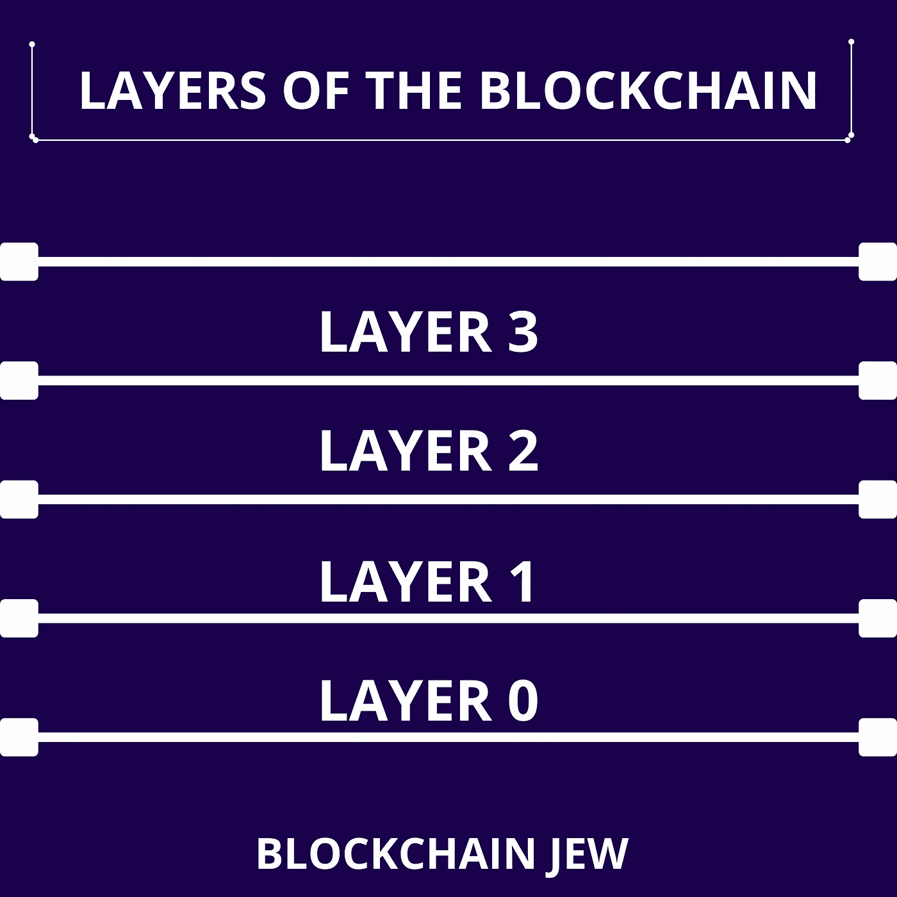

# 嵌段链的层次。第 0、1、2 和 3 层。

> 原文：<https://medium.com/coinmonks/the-layers-of-the-block-chain-layers-0-1-2-3-3d41a9bda69e?source=collection_archive---------43----------------------->

区块链的各层基本上是这种分布式账本技术的不同层次。正如大气有不同的层次；区块链的每一层都有特定的功能，所有 4 层都是相互连接的；功能上几乎独立。

**第 0 层:**

**第 0 层**是区块链技术的基础。这一层包含第 1 层区块链需要的所有技术资源。请将此视为构建区块链的区块链。Cosmos 就是一个很好的 0 层区块链的例子；它使开发者更容易构建自己的第 1 层区块链，同时，它允许在其上构建的区块链(Cosmos)相互交互。智能合约、数据、Dapp 和其他套利文件可以轻松地在构建于第 0 层的区块链之间来回传输。开发人员无需浪费时间或资源在一个区块链上重新构建另一个版本的 Dapp。

一个友好的例子来解释第 0 层的概念:见第 0 层有 WordPress，允许用户建立他们的网站(第 1 层区块链)。有了第 0 层，建立在其上的每个区块链可以相互交互，这允许数据，智能合同和链上资源在这些建立的链之间转移。

第 0 层使区块链更容易扩展到更高的级别，变得更加安全。

**第一层**

**第 1 层**区块链像比特币和以太坊是区块链，处理交易和数据的记录、处理和验证。这是存储实时数据的区块链的主要层。第 1 层区块链采用工作证明或利益一致证明方法，用于验证数据块和保持生态系统更新。第 1 层区块链有 3 个核心方面；去中心化、安全性和可扩展性。到目前为止，还没有第一层区块链能够独自实现这一点，这导致区块链需要相互交互。比如说；比特币是去中心化的，也是安全的，但是不那么可扩展。Etheruem 是去中心化的，可扩展的(在一定程度上)但是不那么安全(他们之前被黑过)。

**第二层**

见**第二层**向第一层区块链伸出了援助之手。第 2 层是与第 1 层合并的区块链，它们存在的唯一目的是通过加速交易和使生态系统可扩展来帮助第 1 层。例如，Polygon 是以太坊区块链的第二层区块链，以太坊区块链是第一层。以太坊很贵；有时它的煤气费可以是你交易价值的 3 倍，这是因为以太坊区块链高度拥堵。与第 2 层缩放解决方案一样的多边形；现在可以将事务从主链转移到副链，这样可以加快速度并增加可伸缩性。

> 加入 Coinmonks [电报集团](https://t.me/joinchat/Trz8jaxd6xEsBI4p)，了解加密交易和投资

**第三层**

**第 3 层**是区块链的最后一层，也是大多数人熟悉的一层。第 3 层也称为应用层。它由 Dapps、网站和连接我们和区块链的 UI 组成。把这看作是使用谷歌应用程序，这个应用程序把你连接到谷歌服务器，帮助你根据你的查询在互联网上搜索答案；你不需要费心去理解搜索引擎机制是如何使用谷歌应用的。

在第三层的情况下，这些应用程序包括你的 web3 钱包、元宇宙网站、Nft 市场网站、Defi Dapps 等