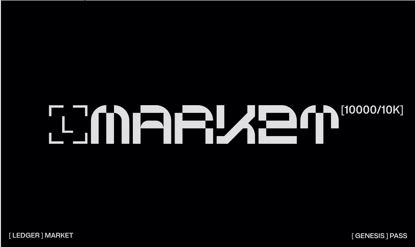
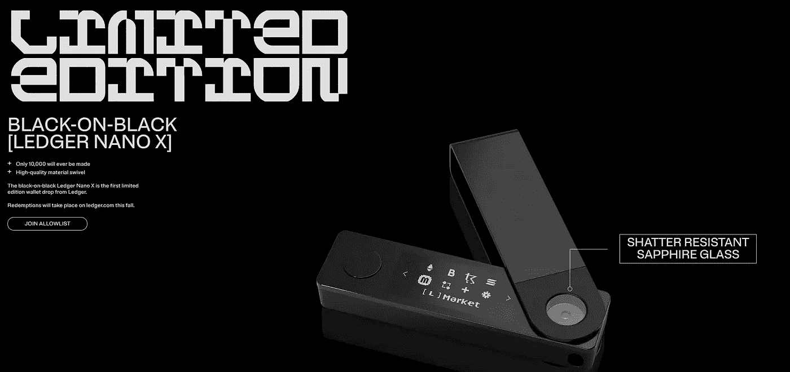

# 《分类账》市场通票:你需要知道的一切

> 原文：<https://medium.com/coinmonks/the-ledger-market-pass-all-you-need-to-know-1b521a34de97?source=collection_archive---------1----------------------->

web3 安全公司的 NFT。

5 月初，Ledger 宣布将在不久的将来推出自己的软件钱包，名为 Ledger Connect，它在硬件钱包市场的表现令人难以置信。本周早些时候，该公司宣布将推出自己的市场，随之推出的还有[分类账]市场通行证。

《分类账》市场通行证——创世纪版将是第一个数字资产，由 10000 个 NFT 组成，来自承诺访问、产品等的公司。在造币厂，创世纪版持有者将能够兑换一个限量版的黑色对黑色 Nano X，莱杰的顶级硬件钱包。持有人将优先获得市场合作，以及我个人最喜欢的，新的账本硬件的特权。莱杰的艺术家驻场计划空投的艺术 NFTs 对艺术家以及整个艺术空间来说是一个更大的激励。值得称赞的莱杰这样做，以确保 NFTs 的艺术方面的重要性得到支持，作为一个公司不断向前迈进。

**TL；DR [LEDGER]市场通行证实用程序**

*   限量版黑底黑字 Nano X
*   优先获得[ L ]市场合作
*   对新分类账硬件的特权访问
*   莱杰艺术家常驻计划的艺术 NFT 空投
*   还会有更多…

我一如既往地对 Market Pass 的 Genesis 版本持乐观态度，正如我对 Ledger 推出的任何产品一样，考虑到他们计划向持有人提供价值的水平，我可以看到这将成为销售实物产品的公司寻求扩张到元宇宙的基准。

莱杰的跟踪记录、对合作项目的关注以及对 web3 中的个人进行安全教育的努力，对于任何希望为自己获得市场通行证的人来说，都应该是一个直接的奖励。我可以看到，交易员、现有账本持有者、收藏家和各类投资者在二级市场一上市就蜂拥而至，为自己争取一张市场通行证。

> 交易新手？试试[密码交易机器人](/coinmonks/crypto-trading-bot-c2ffce8acb2a)或者[复制交易](/coinmonks/top-10-crypto-copy-trading-platforms-for-beginners-d0c37c7d698c)

《分类帐》市场通行证将在 7 月的某个时候发行，要加入 allowlist，你可以在他们的 premint 页面注册。你可以在他们的 [**官网**](https://market.ledger.com/) **上找到它的链接。**要了解更多关于[LEDGER]市场的信息以及我对即将到来的 NFT 市场的看法，请阅读下面的文章。

 [## [LEDGER]市场:它能击败 Opensea 吗？

### 这是我始料未及的举动。

medium.com](/@zatakster/ledger-market-the-opensea-killer-cef2a710fb94) 

> **披露:我拥有一辆莱杰 Nano S**

## 重要的

任何由 Zatakster 撰写或与之相关的文章都是**而非财务建议**。**永远做自己的研究**。我所写的公司/项目没有支付我报酬。如果我是，我会在文章的副标题中提到这是一个广告。