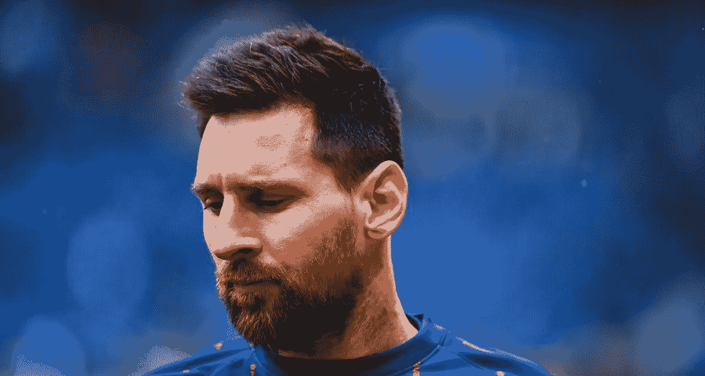
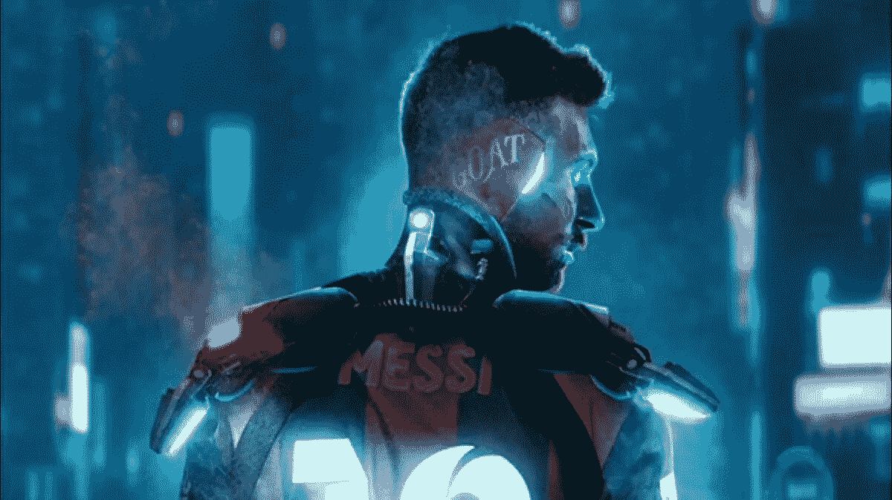

# 莱昂内尔·梅西·NFT 系列将由以太链推出

> 原文：<https://medium.com/coinmonks/the-lionel-messi-nft-collection-will-be-launched-by-ethernity-chain-dabd3fd39ebb?source=collection_archive---------25----------------------->

## 阿根廷足球传奇人物莱昂内尔·梅西(Lionel Messi)与 Ethernity Chain 合作制作了 Messiverse，这是一个由梅西本人授权的 NFT 数字化图纸集。

8 月 4 日，昨天，梅西在他的 Instagram 账户上发布了一段短视频，他在视频中透露了梅西维。

在视频中，梅西邀请他的观众“寻找他的第一个关于以太的 NFT 系列”，他说:“足球就像一门艺术:它是永恒的”。根据新闻稿，这位超级巨星的收藏包括四件艺术品，每一件都是他的肖像:

*   “未来之人”——对梅西的未来主义描述，在蓝色背景下，他有着明亮的眼睛和控制论的外观。
*   “值得重量”描绘了一个金色的梅西在空中举起一个巨大的足球，就像阿特拉斯在天上做的那样。
*   在“国王棋子”中，梅西被一个足球环框住，这是一个以国际象棋为主题的图像。
*   尚未公开的作品

展出的每一件 NFT 作品都是由一位澳大利亚艺术家创作的，这位艺术家在社交媒体上被称为“Bosslogic”，他曾与漫威和迪士尼合作。最终的 NFT 还没有公布，将于 8 月 20 日公布，这一天 Messiverse 首映。

【token 的爆发式增长
NFT 已经获得了极其良好的反响，或者说有望获得:梅西宣布之后，ERN 符号——以太链的本土象征——的价值已经上涨了 45%以上。

以太网连锁对于这种幅度的物价上涨并不陌生。2021 年 3 月，这种代币价值 74 美元，甚至在整整一周内超越比特币成为美国的最高货币。此外，区块链平台因其与其他名人的合作而闻名。其他人，包括职业冰球运动员亚历克斯·奥韦奇金和前 UFC 冠军安德森·席尔瓦，都与以太网合作推出了自己的系列。根据他们的网站，以太链“旨在建立最独特的 NFT 图书馆，奖励生产者和社区”。

**签名金牌密码**

> *加入 Coinmonks* [*电报频道*](https://t.me/coincodecap) *和* [*Youtube 频道*](https://www.youtube.com/c/coinmonks/videos) *了解加密交易和投资*

# 另外，阅读

*   [3 商业评论](/coinmonks/3commas-review-an-excellent-crypto-trading-bot-2020-1313a58bec92) | [Pionex 评论](https://coincodecap.com/pionex-review-exchange-with-crypto-trading-bot) | [Coinrule 评论](/coinmonks/coinrule-review-2021-a-beginner-friendly-crypto-trading-bot-daf0504848ba)
*   [莱杰 vs n rave](/coinmonks/ledger-vs-ngrave-zero-7e40f0c1d694)|[莱杰 nano s vs x](/coinmonks/ledger-nano-s-vs-x-battery-hardware-price-storage-59a6663fe3b0) | [币安评论](/coinmonks/binance-review-ee10d3bf3b6e)
*   [Bybit Exchange 审查](/coinmonks/bybit-exchange-review-dbd570019b71) | [Bityard 审查](https://coincodecap.com/bityard-reivew) | [Jet-Bot 审查](https://coincodecap.com/jet-bot-review)
*   [3 commas vs crypto hopper](/coinmonks/3commas-vs-pionex-vs-cryptohopper-best-crypto-bot-6a98d2baa203)|[赚取加密利息](/coinmonks/earn-crypto-interest-b10b810fdda3)
*   最好的比特币[硬件钱包](/coinmonks/hardware-wallets-dfa1211730c6) | [BitBox02 回顾](/coinmonks/bitbox02-review-your-swiss-bitcoin-hardware-wallet-c36c88fff29)
*   [BlockFi vs 摄氏度](/coinmonks/blockfi-vs-celsius-vs-hodlnaut-8a1cc8c26630) | [Hodlnaut 审核](/coinmonks/hodlnaut-review-best-way-to-hodl-is-to-earn-interest-on-your-bitcoin-6658a8c19edf) | [KuCoin 审核](https://coincodecap.com/kucoin-review)