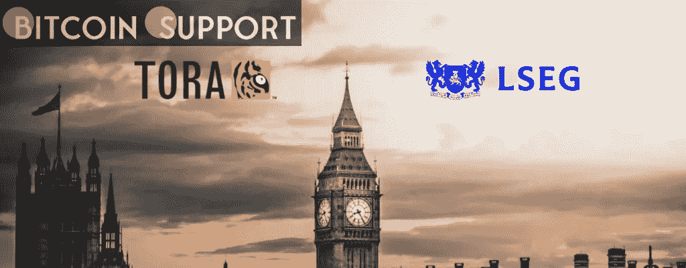

# 伦敦证券交易所集团已经为金融科技公司 TORA 支付了 3.25 亿美元

> 原文：<https://medium.com/coinmonks/the-london-stock-exchange-group-has-paid-325-million-for-the-fintech-firm-tora-bea01ced70a?source=collection_archive---------53----------------------->

[**https://bitcoinsupports.com/**](https://bitcoinsupports.com/)

此次收购的结果是，伦敦证交所未来可能能够提供加密或不可替代的令牌(NFT)交易。伦敦证券交易所集团(LSEG)已支付 3.25 亿美元收购 TORA，TORA 是一家交易多种资产类别(包括加密货币)的技术提供商。伦敦证交所周二宣布，此次收购将扩大该公司的交易能力，将数字资产纳入其中。作为协议的结果，伦敦证券交易所将能够在未来提供加密或不可替代的令牌(NFT)交易。NFT 是位于区块链的数字资产，反映虚拟或实物商品的所有权。在本文发表时，LSEG 尚未回复置评请求。如果获得监管机构的批准，这笔交易可能会在今年下半年完成。

LSEG 是全球金融市场数据和基础设施的提供商，是伦敦证券交易所的母公司。

对于股票、固定收益和衍生品以及数字资产的交易，TORA 提供订单和执行管理以及投资组合管理的解决方案。

**访问我们的网站:-**[**https://bitcoinsupports.com/**](https://bitcoinsupports.com/)

**免责声明:以上为作者观点，不应视为投资建议。读者应该自己做研究。**

> 加入 Coinmonks [电报频道](https://t.me/coincodecap)和 [Youtube 频道](https://www.youtube.com/c/coinmonks/videos)了解加密交易和投资

# 另外，阅读

*   [麻雀交换评论](https://coincodecap.com/sparrow-exchange-review) | [纳什交换评论](https://coincodecap.com/nash-exchange-review)
*   [维护卡审核](https://coincodecap.com/uphold-card-review) | [信任钱包 vs 元掩码](https://coincodecap.com/trust-wallet-vs-metamask)
*   [Exness 评测](https://coincodecap.com/exness-review)|[moon xbt Vs bit get Vs Bingbon](https://coincodecap.com/bingbon-vs-bitget-vs-moonxbt)
*   [如何开始用加密贷款赚取被动收入](https://coincodecap.com/passive-income-crypto-lending)
*   [加密货币储蓄账户](/coinmonks/cryptocurrency-savings-accounts-be3bc0feffbf) | [加密交易机器人](https://coincodecap.com/best-crypto-trading-bots)
*   [BigONE 交易所评论](/coinmonks/bigone-exchange-review-64705d85a1d4) | [CEX。IO 审查](https://coincodecap.com/cex-io-review) | [交换区审查](/coinmonks/swapzone-review-crypto-exchange-data-aggregator-e0ad78e55ed7)
*   [最佳比特币保证金交易](/coinmonks/bitcoin-margin-trading-exchange-bcbfcbf7b8e3) | [比特币保证金交易](https://coincodecap.com/bityard-margin-trading)
*   [加密保证金交易交易所](/coinmonks/crypto-margin-trading-exchanges-428b1f7ad108) | [赚取比特币](/coinmonks/earn-bitcoin-6e8bd3c592d9)