# 加密马拉松。历史能告诉我们什么？

> 原文：<https://medium.com/coinmonks/the-long-term-run-what-history-can-tell-us-about-cryptocurrencies-80c42ec1f64b?source=collection_archive---------21----------------------->

实际的经济宏观前景是大家都知道的东西。

> 历史可能不会重演，但看起来很像

那么，当一切结束时，比特币会有什么结果呢？

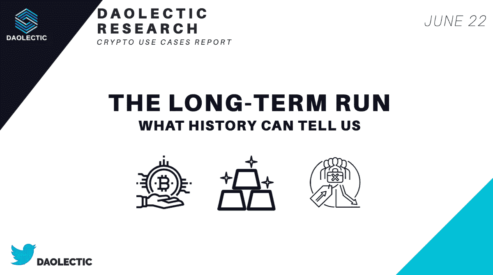

让我们从第一个主题开始。

# **🔍比特币叙事看起来像黄金:**

> 反通胀对冲央行货币扩张

【1974 年以前，在美国买黄金是不可能的。

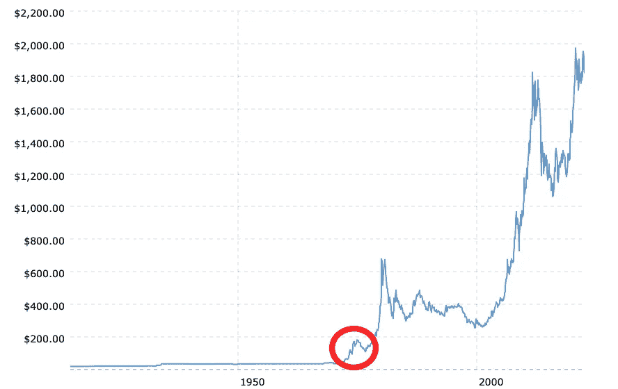

供给和需求水平决定了产品的稀缺性。就比特币而言，其不可改变的本质决定了满足需求的稀缺性。从这些角度来看，比特币也可以被视为一种长期的反通胀对冲工具。正如 [BlockwareTeam](https://www.blockwaresolutions.com) 所强调的，我们还为时过早。

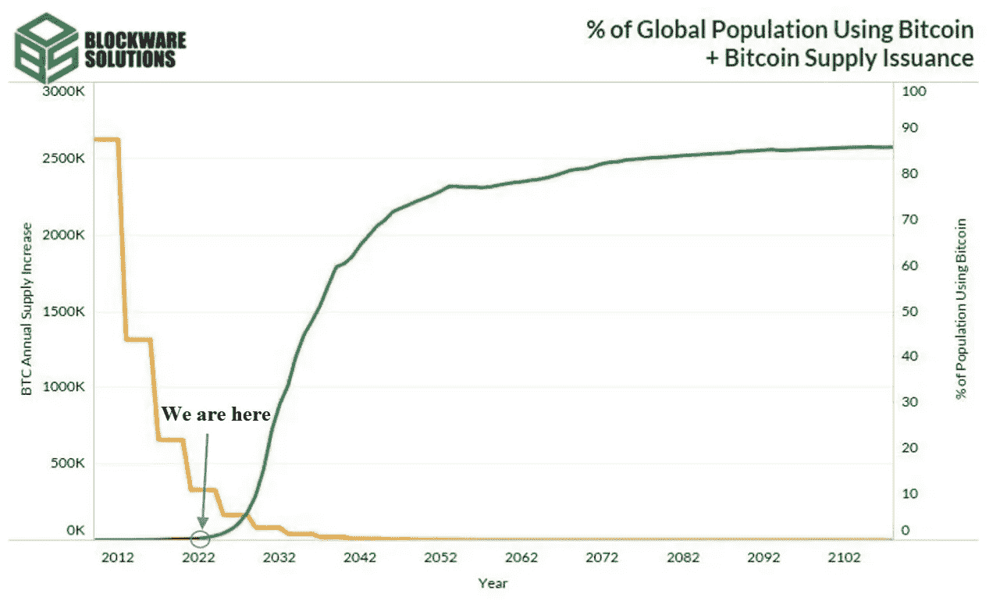

**黄金增长**发生在**之后**:

1.  美国滞胀时期(70 年代的几十年)
2.  互联网泡沫(2000 年初)

现在，它完成了向机构资产的转变。

让我们深入到 20 世纪 70 年代

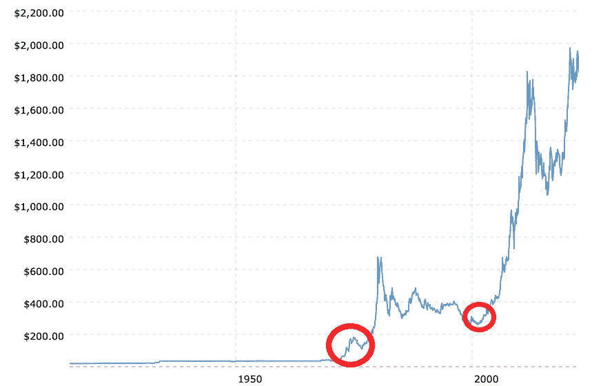

今天，**滞胀**依然是热门话题。

在接下来的几周里，每个人都会谈论它。简而言之，这是停滞和通胀的混合体。

又名: ***购买力过度丧失的低增长。***

美国最大的滞胀发生在 70 年代:通胀水平达到 12%，经济发展甚微。整整十年都保持在较高水平。

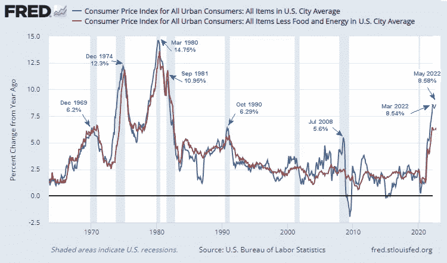

在 70 年代:

*   由于石油输出国组织禁运，石油价格猛涨
*   产品成本增加
*   人们失去了工作
*   花更少的钱

所有这些宏观经济因素推动了滞胀的出现。

今天的情况有一些相似之处，但也有一些不同之处:

> 实际工资与 CPI 通胀率:

20 世纪 70 年代，通胀率远高于工资水平。

2022 年 5 月，通胀刚刚开始略高于工资。

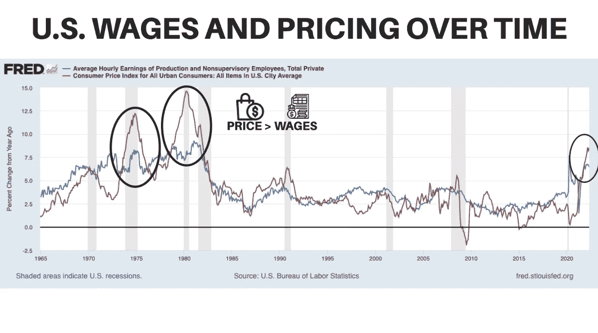

> 美国失业率

20 世纪 70 年代的失业率为 8-10%。

今天，在新冠肺炎造成的峰值后，反弹至 3.5%

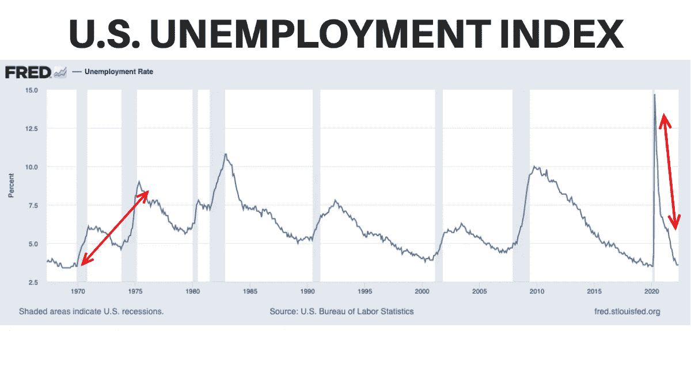

在接下来的几个月里，有几件事情需要关注:

➤货币政策:中央银行提高利率以降低通货膨胀

➤供应链拥堵

➤能源和商品定价

下一步是什么？

> 到目前为止，你喜欢阅读吗？在 Twitter 上关注我们！

# 🔍网络泡沫创造了经久不衰的产品。

亚马逊、微软和易贝是今天的蓝筹股。

事实证明，它们符合你的投资组合。

这些现在被认为是你投资组合的防弹投资。

NB: ***同一时代，80%的 IPO 都是负 EPS。*** (鸣谢杰伊·里特尔教授)

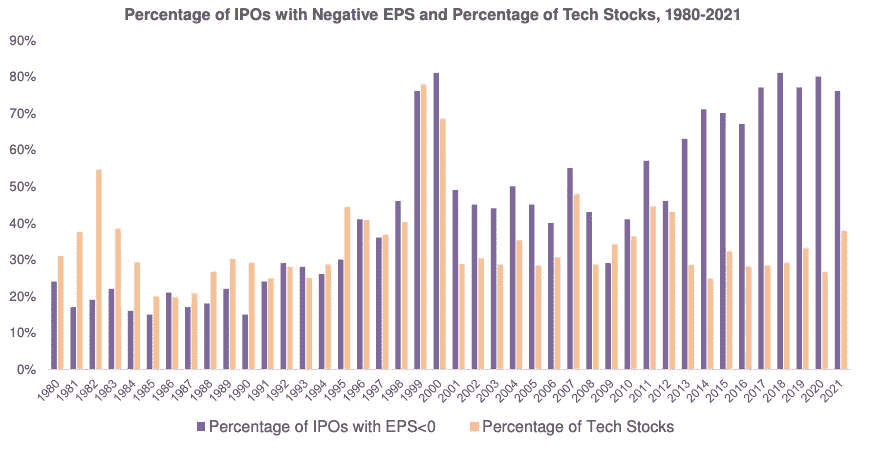

今天的加密情况和网络公司的历史模式有相似之处。

*   高通货膨胀率
*   未完成的评价
*   全球炒作
*   美联储提高利率

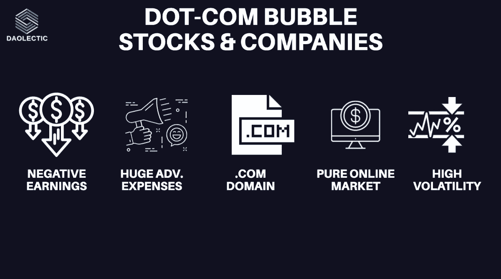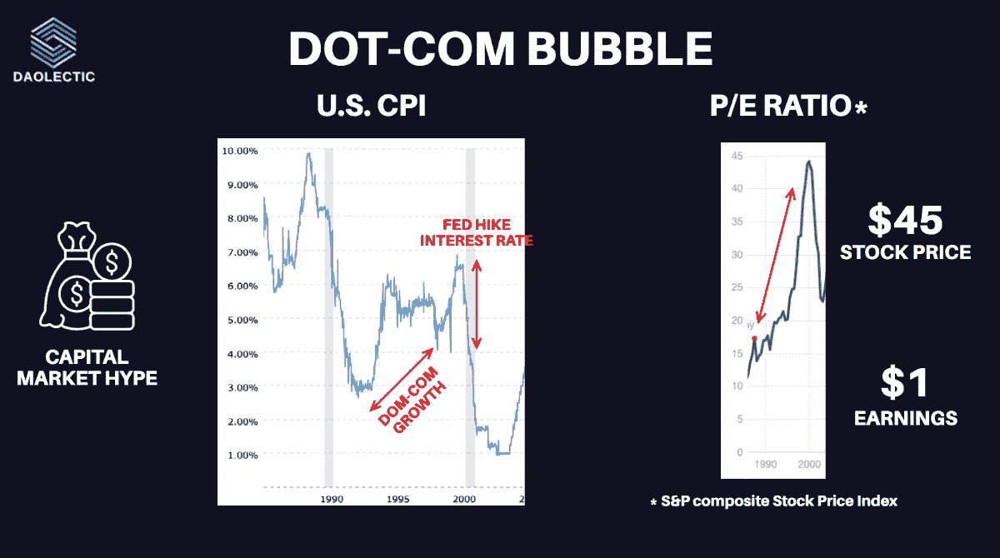

@TaschaLabs 描述了网络时代与当今加密市场形势之间的相似之处。

泡沫已经破裂。

但是技术和采用曲线仍然出现。

其他相似之处？

*   秘密风险投资的钱随着估价膨胀了一切

Terra、3AC 和 Celsius 证明了真正的分权和透明的必要性。

网络公司首席执行官的失败一代接受了比哈佛 MBA 更好的商业教育。他们不打算学习，但他们今天更聪明。

滑动门。

# **🔍比特币用户增长**

***BTC 的采用正跟随手机订阅的趋势。***

大多数成功的新技术都有 S 形的接受曲线和快速的用户增长。

历史表明，随着用户群的增长，网络的价值也会增加。

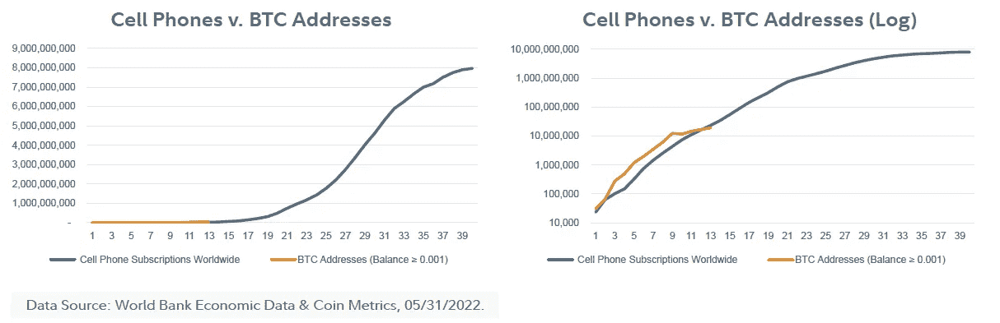

# 🔍Web3 技术发展

**区块链**正显示出**对技术发展**日益增长的需求。

[a16z](https://a16z.com) 最后的分析带来了积极的见解，突出了增长。

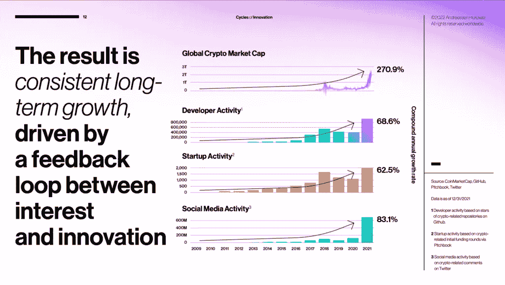

一些国家监管加密货币。

在最近的事件之后会有更多的消息。

可能的结果？

*   市场更加稳定
*   更安全的生态系统
*   由于以上几点，投资者参与度更高。

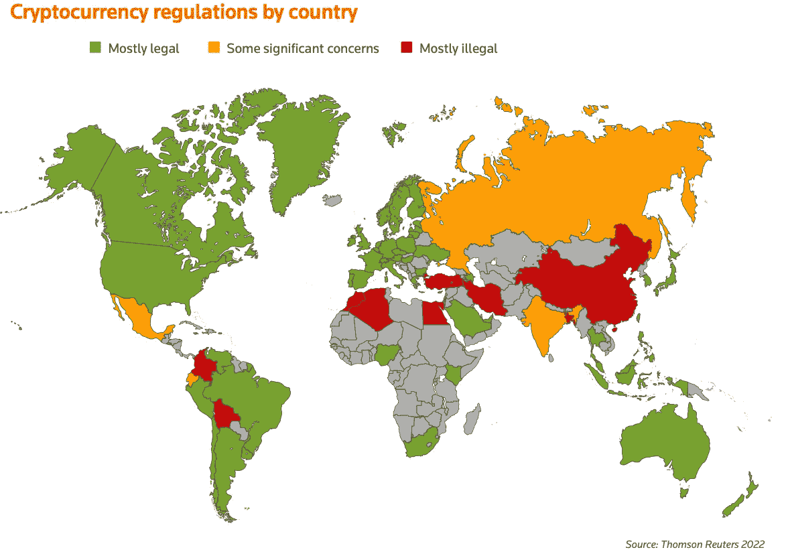

# 🔍证券投资领域的 BTC 怎么样？

引用[《经济学人》](https://impact.economist.com/projects/digimentality-2022/wp-content/uploads/2022/05/ECO154-Crypto-Digimentality-2022-11.pdf):

> " 85%的机构投资者认为投资组合必须包括加密货币."

他们认为加密是:

*   资产多样化
*   资本增值工具
*   对冲通货膨胀

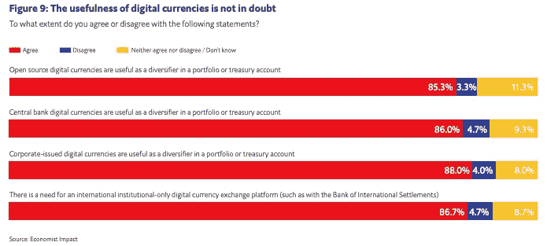

这一趋势在最近的普华永道报告中也可以看到:

*   30%的传统对冲公司以 4%的比例投资数字资产(同比增长 20%)。
*   29%不投资数字资产的对冲基金经理计划或寻求投资。

# 🔍60/40 投资组合内的比特币有多好？

尽管市场波动较大，散户投资者仍希望获得更高的回报。

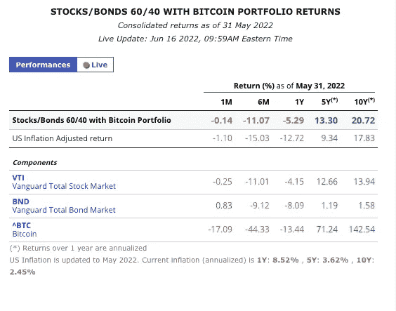

[雷伊·达里奥接触了比特币，宣称这是他投资组合的一部分。](https://twitter.com/SquawkCNBC/status/1529067726282571776)

总而言之，这是从以下方面进行转变的最佳时机:

**“如何快速致富。”**

> 收件人:

**“如何建立个人财富。”**

# 放弃

无论如何，这不是财务建议；我们研究的目标永远是深入项目，从不同的角度研究它们；我们确实包含了基于我最近了解到的类似项目经验的个人观点。

我们现在和将来都愿意讨论。

**在 Twitter 上关注我们:@ Dao Xin**

**在投资任何东西之前，请务必做好调查**。

> 加入 Coinmonks [电报频道](https://t.me/coincodecap)和 [Youtube 频道](https://www.youtube.com/c/coinmonks/videos)了解加密交易和投资

# 另外，阅读

*   [Pionex 双重投资](https://coincodecap.com/pionex-dual-investment) | [AdvCash 审查](https://coincodecap.com/advcash-review) | [支持审查](https://coincodecap.com/uphold-review)
*   [面向开发者的 8 个最佳加密货币 API](https://coincodecap.com/best-cryptocurrency-apis)
*   [7 个最佳零费用加密交易平台](https://coincodecap.com/zero-fee-crypto-exchanges)
*   [最佳网上赌场](https://coincodecap.com/best-online-casinos) | [期货交易机器人](/coinmonks/futures-trading-bots-5a282ccee3f5)
*   [分散交易所](https://coincodecap.com/what-are-decentralized-exchanges) | [比特 FIP](https://coincodecap.com/bitbns-fip) | [宾邦评论](https://coincodecap.com/bingbon-review)