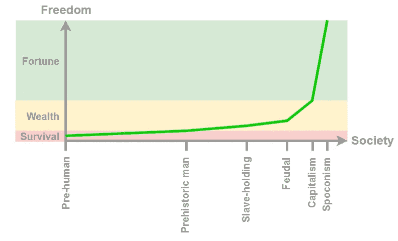

# 通往胜利的漫长道路*

> 原文：<https://medium.com/coinmonks/the-long-way-to-spoconism-51602968f3fd?source=collection_archive---------73----------------------->

## 或者:社会形态的遗产以及它与比特币的关系

德国版。)

**Spoconism 由拉丁词 spontaneitas 和 conducibile 组成，意思是:为了共同利益的自主行动。*

人类的历史就是技术进步和我们试图适应技术进步的历史。为了这种适应，我们需要几十年、几百年，有时甚至几千年。当我们成功时，黄金时代就在我们面前。

这一观察背后有两个重要的发现。其中比较著名的是查尔斯·达尔文。他首先谈到了“适者生存”[1]。根据他的观点，那些最能适应环境的人在生存斗争中占有优势。作为人类，我们是适应环境的大师，因为我们可以创造必要的工具。

第二个发现来自于达尔文进化论到我们社会技术发展的转移[2]。这种发展遵循一个循环:

1.  人们发明工具来帮助他们适应环境。
2.  新工具改变环境。
3.  人们适应变化了的环境。->循环从 1 开始…

技术进步伴随着社会进步，反之亦然。就像一根橡皮筋把社会和技术成就连接在一起，谁也离不开谁，谁也离不开谁[2]。

我们被剥夺了繁荣和文化进步，以至于我们无法适应技术进步。**在这篇文章中，我将表明，一万多年来，我们与生俱来的性格特征一直与作为一种技术的金钱相冲突。以及我们如何在比特币的帮助下解决冲突。**

## 前人类

我们的发展始于大约 380 万年前[3]身高 1.10 至 1.50 米的南方古猿，更广为人知的是前人类[4]。我提到体型是为了指出它们的脆弱。在人类出现前与猛犸象的战斗中，人类毫无希望地处于劣势。

这就提出了我们祖先生存优势的问题。他们的适者生存秘诀是什么？南方古猿物种互相照顾。他们互相提醒，互相帮助。部落中的互相帮助发展到了前人类分享他们的第一技术和原始工具的程度。分散的知识作为对遗忘的保护，确保了嘎嘎嘎的生存。

如果每个部落只有一个知识持有者，那么失去经验的风险会更大。共享知识可以最好地防止这种损失。同时，社会交换刺激了技术和工具的进一步发展。

这种凝聚力和进步的社会技术相互作用使得前人类能够过渡到原始社会[5]。

## 原始社会

每个人学习并用于自身利益的技术和工具确保了所有人的生存。这种自身利益也导致了联合狩猎，反过来，也为共同利益服务。

作为一个群体，智人可以比一个人杀死更多的猛犸象或巨型树懒。此外，集体狩猎给它们带来的食物比猎人需要的还要多。他们与部落中的其他人分享猎物。每个人都知道他们的机会会在下次狩猎时重新分配。这培养了互惠的文化[6]:给予今天就能获得明天。这种互惠只不过是以恩惠的形式来挽救社会安全。

随着新石器时代向农业的过渡，分工开始了。智人的专门化导致了贸易的出现和对货币的需求[7]。

金钱使贸易变得更容易。当然，你不能想象今天的货币。盐、贝壳和谷物属于第一种支付工具。迄今为止，耐用且稀有的受欢迎商品最适合作为货币[8]。

约翰·耶伦(John Yellen)观察到了钱给社会结构带来的变化，他提到了当地的孔人。价值的货币储存而不是社会储存将氏族成员从分享食物、技术和工具的生存策略中解放出来[9]。在一次不成功的狩猎或收获后，他们不再依赖他人的帮助。相反，他们能够通过货币储蓄来确保自己的安全。

金钱在一定程度上促进了个人主义，也导致了社会凝聚力的下降。这就是我所说的金钱反社会的一面。它因人类自主的动机而得到加强。自主动机概括了三种动机的本质:权力、有效性和成就[10]。今天，这些性格特征是获得巨大财富的人的特征[11]。

贷款和遗产进一步扩大了财富的差距。缺少谷物种子的农民不得不借有利息的种子。富人把他们一生的工作传给了他们的后代。这些富人组成了第一个上层阶级。

## 蓄奴社会

劳动、贸易和私有财产的分工导致了一种认识:财富是由(劳动)成本和销售收入之间的差额创造的。寻找降低自身劳动力成本的方法导致了史前时期的奴隶制。俘虏不再被杀害，而是被迫劳动[13]。

自主的上层阶级意识到了这种潜力。他们将行动导向组织工作和进步。另一方面，追求安全的下层阶级努力避免负债。如果人们有太多的债务，他们就会失去自由，成为奴隶，形成最底层的社会阶层。

纵观所有蓄奴社会，进步都步履蹒跚。例如，亚历山大的海伦没有发明蒸汽机，尽管他用蒸汽打开了寺庙的门[14]。奴隶制在当时是被整个社会所接受的，所以没有必要用机器来代替奴隶劳动。第一台蒸汽机是在整整 1500 年后发明的。

类似的进展滞后在美国南部各州也很明显。在北方各州，工业蓬勃发展，而南方则固守农业[15]。奴隶让南方各州的农民没有理由去寻找其他方法来提高生产力或实现工业化。

按照社会技术依赖，不自由的人意味着社会停滞。被迫工作的人对工作的兴趣和对进步的兴趣一样小。

相比之下，奴隶主的自由导致了相对较高的文化。最大的飞跃无疑发生在希腊罗马世界[16]。

不自由人群中的社会停滞阻碍了技术发展的进步，反之亦然。这种社会技术依赖性在以下社会形式中也很明显。

## 封建社会

奴隶制终结的原因是多方面的。它们从缺乏认可到生产力不令人满意。奴隶社会被封建社会所取代。

在封建主义初期，自由农民为了自己的利益而种田。这种利己主义重新激发了他们对自身生产力的兴趣。农民们试图用他们的聪明才智来增加产量。那些在他们的土地所在地也很幸运的人获得了最好的成功。生产力的提高增加了财富，而财富的分配是不均衡的，有利于封建贵族[17]。

随着时间的推移，封建贵族发现土地是一种新的权力手段。他们找到了将自由农民的土地转为自己所有的方法。从那时起，封建领主要求为使用他们的土地纳税[18]。

纳税义务的形式对农民的生产力和进步都有重大影响。什一税激励农民改进他们的工作方法。失去动力的剩余农民的运送。在前一种情况下，农民必须交出他们收成的十分之一，在后一种情况下，超过他们自己需要的一切东西[17]。

社会限制减缓了提高生产率的技术进步。如果所有人都是自由的，封建社会的繁荣会有多大？

## 资本主义

封建社会能达到什么程度的繁荣，谁也说不准。为了估计答案，也许看一看资本主义会对你有所帮助。劳动分工、贸易和私有财产在过去已经得到了证明。资本主义采用了它们。人们仍然在寻找的是如何最好地利用这三个要素来造福社会。

从奴隶社会到封建社会，繁荣增加了，因为人们被给予更多的自由来为自己的利益而行动。劳动力生活的私有制变成了劳动力土地的私有制。与此同时，少数人以牺牲他人为代价，最大限度地扩大了自己的自由。

资本主义在生产资料私有制方面碰了碰运气。这在自决的意义上给了人们更多的自由，因为与自己的生命或土地相比，生产资料是多种多样的。每个人都可以自己创业。

生产资料的私有制不可避免地造成了商品生产者之间的竞争[18]。此后，独立竞争创造了人类历史上最大的繁荣、普遍的健康和长期的和平[19]。

尽管我们的繁荣达到了新的高度，我们的幸福感却在逐渐消失。随着贫富差距的扩大，社会对未来的担忧也在增加。这有很多原因，但最终都是社会原因，而不是金钱原因。

这从别人比自己富有的社会比较开始，接着是加剧对自己和后代生活恐惧的气候问题[20]，最后是因社会孤独而产生的恐惧[21]。像奴隶制和封建制一样，资本主义找到了集中财富和限制多数人自由的方法。

我们的原始大脑错过了原始社会的安全和平等。对安全的渴望反映在人类的主导关系动机中[10]。这是世界上最普遍的人格特征，然而我们的社会并没有以幸福为导向。

相反，人们关注的焦点是 GDP，这符合那些具有主导独立动机的人的利益——那些为成就、权力或声望而奋斗的人。他们有一个简单的游戏，因为他们的独立动机不是大多数人的天性。或者用博弈论的术语来说，具有主导自主动机的人更不看重和谐。对于那些强调牢固关系以满足安全动机的人来说，这是一个问题。他们寻求弥补不和谐，而不是以牺牲他人为代价获得优势。

## Spoconism

因此，自主的个性动机是我们在生活、商业和政治中的领导者能够在他们的安全动机追随者面前维护自己的原因[11]。他们的自身利益压倒了其他人的利益。对他们来说，为了所有人的利益，独立比社会合作更重要。

只要自主动机不导致垄断，亚当·斯密的市场这只看不见的手就保持不变。根据斯密的观点，自私的奋斗会带来整个社会的利益[22]。然而，当自主动机能够限制市场竞争并对其有利时，看不见的手就会失灵。

如果你看看我们的领导人独立的基础是什么，你总是会归结到钱。直到今天，货币是我们还没有完全社会化处理的技术。如果没有货币的发明，原始社会的领导者就不会有足够的价值储备来使他们从部落其他成员的福利中解脱出来。没有钱，奴隶主和封建贵族就没有理由剥削奴隶和农奴。同时，金钱成了他们用来积累更多财富的工具。对自治的渴望像磁铁一样吸引着金钱，笼罩着一切。

比特币可以在一定程度上解决少数领导人权力集中的社会问题。点对点货币分散了这种权力，给了每个人更多的自主权，更多的自由，因为没有人能把比特币变得对自己有利。

尽管比特币的协议比法定货币更好地分散了货币的权力，但它继续集中了比特币所有者的权力。对于那些在交易中特别成功的人来说，比特币提供了一个钱包，增加了他们的购买力。比特币的这种完全基于技术的属性将继续束缚我们的社会技术进步。在分配问题得到不可逆转的解决之前，人们将无法为了所有人的利益生活在完全自决的环境中。

再分配可以通过基于比特币的[无条件基本收入来完成，这是基于微交易费。2016 年德国金融交易额约为 3189769 亿欧元[23]。即便如此，每千分之 4.8 的微交易费也足以支付每个德国人每月 1500 欧元的无条件基本收入。](/coinmonks/14-reasons-why-bitcoin-leads-to-an-unconditional-basic-income-fa44a43fb75e)

我要说清楚:再分配应该只给人们从出生到死亡的教育、食物、衣服和住所。它不是帮助所有人实现平等繁荣。他们只需要自决的自由。在原始时代，在奴隶制、封建制和资本主义时期，这种自由推动了技术进步。在 spoconism 中也会如此，因为进步最终总是解决(并引发)社会问题。

## 再分配推动进步

随着财富的重新分配，人们将回到他们的根本。他们可以互相帮助，而不是只关注自己的财富。为了所有人的利益，他们可以共同追求进步。他们可以更容易地分享他们的知识，因为他们的生活不再直接与它联系在一起。然而，以成就为动机的人可以获得更大的成功，以权力为动机的人可以为所有人的利益带来改变，而以有效性为动机的人可以为自己赢得比他们的生命更长久的名声。为了我们的进步，我们需要自主的个性，就像需要受关系驱动的个性一样。我们唯一不需要的是金钱的集中。

只有当金钱自动重新分配时，我们才能成为一个全球共同体。我们将经历有史以来最伟大的技术进步，并能够更快地适应它们。

***

我的 14，496 个字符是否给了你新的见解？通过闪电捐赠来纪念他们。你想从我这里读到更多？用几只小智支持我的工作。理解需要时间。你的提升让我有时间整理思路，写下来。

Lightning address: LNURL1DP68GURN8GHJ7MR9VAJKUEPWD3HXY6T5WVHXXMMD9AKXUATJD3CZ7CTSDYHHVVF0D3H82UNV9UMNYWFNC2GDKG

***

## 来源

[1][https://de.wikipedia.org/wiki/Darwinismus](https://de.wikipedia.org/wiki/Darwinismus)状态:2022 年 3 月 14 日

[埃里克[2]。d .拜因霍克(2007 年)。世界舞台艺术中心。ISBN-10: 3636030868](https://www.amazon.de/Entstehung-Wohlstands-Evolution-Wirtschaft-antreibt/dp/3636030868/ref=sr_1_3?&_encoding=UTF8&tag=eltankred-21&linkCode=ur2&linkId=a9dca7837b595b48a56976c6d635593d&camp=1638&creative=6742)

[3][https://www . br . de/nachrichten/wissen/vormensch-Australopithecus-ein-gesicht-fuer-lucys-vorfahr，RaKqvZA](https://www.br.de/nachrichten/wissen/vormensch-australopithecus-ein-gesicht-fuer-lucys-vorfahr,RaKqvZA) 状态:2022 年 3 月 14 日

[4][https://www . kinderzeitmaschine . de/vorgeschichte/ereignisse/die-wie ge-der-menschheit/Australopithecus-afarensis/](https://www.kinderzeitmaschine.de/vorgeschichte/ereignisse/die-wiege-der-menschheit/australopithecus-afarensis/)状态:2022 年 3 月 14 日

[5] [尤瓦尔·诺亚·哈拉里(2015)。曼施海特的一个村庄。ISBN-10: 3570552691](https://www.amazon.de/kurze-Geschichte-Menschheit-Yuval-Harari/dp/3570552691/ref=sr_1_1?&_encoding=UTF8&tag=eltankred-21&linkCode=ur2&linkId=f49f605f9075053667892c81ca5de5cf&camp=1638&creative=6742)

[6][https://lexikon.stangl.eu/507/reziprozitaet](https://lexikon.stangl.eu/507/reziprozitaet)状态:2022 年 3 月 18 日

[7] [https://www.bpb.de/shop/magazine/izpb/8520/von-der-自给自足的世界市场/](https://www.bpb.de/shop/zeitschriften/izpb/8520/von-der-selbstversorgung-zum-weltmarkt/) 状态: 15.03.2022

赛义德·阿姆斯 Saifedean Ammous (2019)比特币标准:中央银行系统的分散替代品。ISBN-10:3982109507

[9] [https://www.academia.edu/4290535/The_Transformation_of_the_Kalahari_Kung](https://www.academia.edu/4290535/The_Transformation_of_the_Kalahari_Kung) 状态: 2020 年 1 月 4 日

[10] [https://de.wikipedia.org/wiki/Z%C3%BCrcher_Model_der_social_motivation](https://de.wikipedia.org/wiki/Z%C3%BCrcher_Modell_der_sozialen_Motivation) 状态: 15.03.2022

[11] [https://www.businessinsider.de/职业/工作生活/学习-显示在哪种-由公司-特别-许多精神病患者的工作-2018-2/](https://www.businessinsider.de/karriere/arbeitsleben/studie-zeigt-in-welcher-art-von-unternehmen-besonders-viele-psychopathen-arbeiten-2018-2/) ;[https://www.piqd.de/volkswirtschaft/Psychopathen-in-der-Wirtschaft-ein-日常历史](https://www.piqd.de/volkswirtschaft/psychopathen-in-der-wirtschaft-eine-alltagliche-geschichte)状态:17.03.2022

[12] [https://de.wikipedia.org/wiki/Kredit](https://de.wikipedia.org/wiki/Kredit) 状态:15.03.2022

[13] [http://political-ökonomie.org/教科书/chapter_2.htm](http://politische-oekonomie.org/Lehrbuch/kapitel_2.htm) 状态: 15.03.2022

[14] [https://www.spiegel.de/科学/人/自动机-der-antique-wie-die-goetter-die-temple-oeffneten-a-618229.html](https://www.spiegel.de/wissenschaft/mensch/automaten-der-antike-wie-die-goetter-die-tempeltueren-oeffneten-a-618229.html) ; [https://de.wikipedia.org/wiki/Heron_von_Alexandria](https://de.wikipedia.org/wiki/Heron_von_Alexandria) 状态:15.03.2022

[15] [https://de.wikipedia.org/wiki/Sessionskrieg](https://de.wikipedia.org/wiki/Sezessionskrieg) 状态:15.03.2022

[16] [https://de.wikipedia.org/wiki/Antike#含义和后续效果](https://de.wikipedia.org/wiki/Antike#Bedeutung_und_Nachwirken_der_Antike) 状态: 28.03.2022

[17] [http://political-ökonomie.org/教科书/chapter_4.htm](http://politische-oekonomie.org/Lehrbuch/kapitel_4.htm) 状态: 16.03.2022

[18] [http://political-ökonomie.org/教科书/chapter_5.htm](http://politische-oekonomie.org/Lehrbuch/kapitel_5.htm) 状态: 17.03.2022

[19] [https://www.welt.de/economy/article4017664/为什么资本主义-保留-必须.html](https://www.welt.de/wirtschaft/article4017664/Warum-der-Kapitalismus-beibehalten-werden-muss.html) 状态:17.03.2022

[20] [https://www.boeckler.de/zh-magazin-mitdenomination-2744-capitalism-and-glueck-11379.htm](https://www.boeckler.de/de/magazin-mitbestimmung-2744-kapitalismus-und-glueck-11379.htm) 状态:17.03.2022

[21] [https://www.rheingold-marktforschung.de/zukunftstudie-2021-wie-deutsch-in-die-明天-look-2](https://www.rheingold-marktforschung.de/zukunftsstudie-2021-wie-deutsche-in-die-zukunft-blicken-2) ;[https://www.quarks.de/society/psychology/so-sehr-can-uns-寂寞-生病-做](https://www.quarks.de/gesellschaft/psychologie/so-sehr-kann-uns-einsamkeit-krank-machen) 状态: 17.03.2022

[22] [https://de.wikipedia.org/wiki/Invisible_Hand](https://de.wikipedia.org/wiki/Unsichtbare_Hand) 状态:20.03.2022

[23] [https://www.bundestag.de/resource/blob/644068/d64aef241b13ec90885f2dea317e6285/WD-4-008-19-pdf-data.pdf](https://www.bundestag.de/resource/blob/644068/d64aef241b13ec90885f2dea317e6285/WD-4-008-19-pdf-data.pdf) 状态: 2020 年 3 月 17 日

[图像] [https://pixabay.com](https://pixabay.com/) , [https://www.loc.gov/pictures/item/2022635506/resource/](https://www.loc.gov/pictures/item/2022635506/resource/)

> Join Coinmonks [Telegram Channel](https://t.me/coincodecap) and [Youtube Channel](https://www.youtube.com/c/coinmonks/videos) 了解加密货币交易和投资

# 因此,Read

*   [Bookmap 点评](https://coincodecap.com/bookmap-review-2021-best-trading-software) | [美国 5 大最佳加密交易所](https://coincodecap.com/crypto-exchange-usa)
*   [如何在 FTX 交易所交易期货](https://coincodecap.com/ftx-futures-trading) | [OKEx vs 币安](https://coincodecap.com/okex-vs-binance)
*   [CoinLoan 评论](https://coincodecap.com/coinloan-review) | [YouHodler 评论](/coinmonks/youhodler-4-easy-ways-to-make-money-98969b9689f2) | [BlockFi 评论](https://coincodecap.com/blockfi-review)
*   [XT.COM 评论](https://coincodecap.com/profittradingapp-for-binance)币安评论 |
*   [SmithBot 评论](https://coincodecap.com/smithbot-review) | [4 款最佳免费开源交易机器人](https://coincodecap.com/free-open-source-trading-bots)