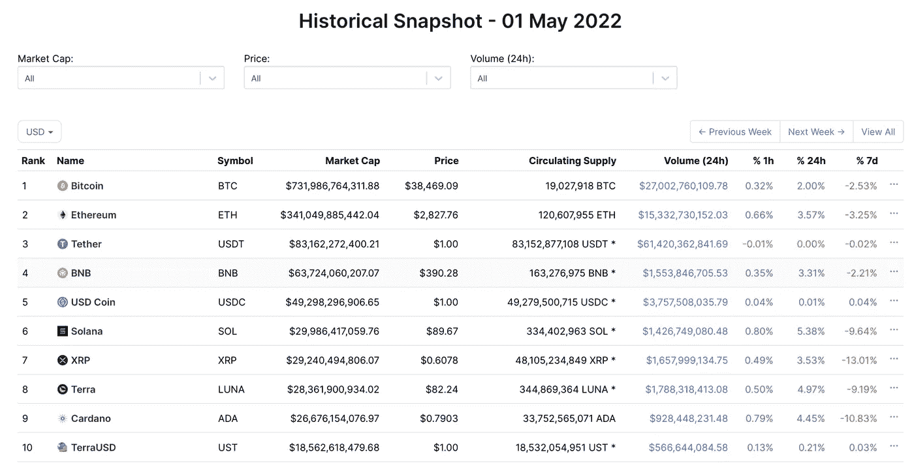
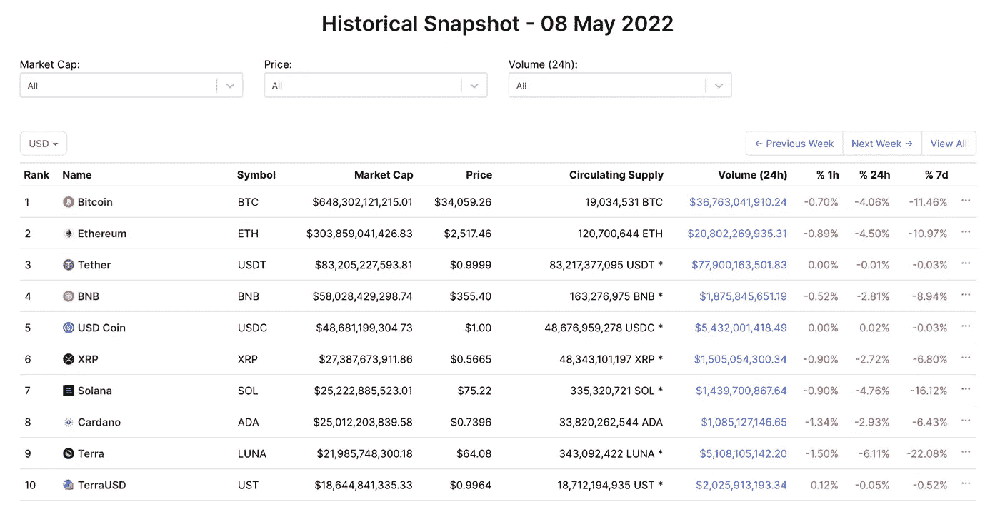
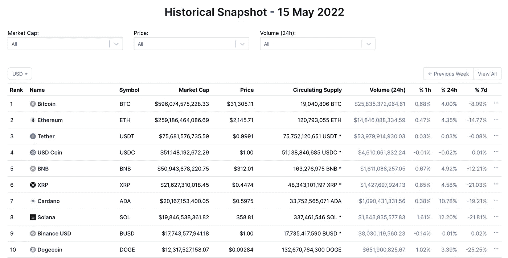

# Luna 崩溃并没有影响到 crypto，因为 crypto 还不成熟

> 原文：<https://medium.com/coinmonks/the-luna-collapse-and-why-it-didnt-really-affect-crypto-6c9986aa3aa4?source=collection_archive---------19----------------------->

在卢娜和 UST 被摧毁后，人们一直在谈论加密的弹性。正如争论所言，Luna 崩溃并没有真正影响到更广泛的加密生态系统，尽管货币价值(约 40-500 亿美元)变成了 0。

5 月 1 日，Terra 和 Luna 的总价值约为 500 亿美元，到 5 月 15 日，它们的价值已经缩水(双关语)。尽管如此，密码市场相对未受影响。

Coinmarketcap snapshot on May 1st 2022 of top 10 coins — pre-Luna

如果我们算上 5 月 8 日和 5 月 15 日之间的 7 天——卢娜和 UST 结束的开始，BTC 和 ETH 分别下跌了 8%和 14%;其他受欢迎的硬币如 BNB 币、索尔币和点币分别下跌了 12%、19%和 21%。

Coinmarketcap snapshot on May 1st 2022 of top 10 coins on May 8 — start of UST Depeg

虽然如上所述，BTC、瑞士联邦理工学院、BNB、SOL 和 DOT 的下降幅度很大，但对于加密来说，它们并没有什么异常。一年前，我们看到了类似的下降——而且前十名中没有两枚硬币消失。因此，深入研究加密的人提出的论点是，加密比传统金融更有弹性。

Coinmarketcap snapshot of top 10 coins on May 15 — post Luna

甚至有人将 Luna 与雷曼兄弟(Lehman Brothers)相提并论。雷曼兄弟是美国投资银行，引发了 2007 年至 2008 年的螺旋上升，导致了经济衰退。在巅峰时期，它们价值 600 亿美元，但却引发了巨大的问题；5 月 1 日，UST 和卢娜的身价为 500 亿美元，但他们的暴跌并没有带来任何影响。不管怎样，这就是故事，而且是个好故事。但不是无知就是误导。也许两者都有。

正如我们很想相信的那样，加密技术现在并不比传统的金融/资本市场更有弹性。幸运的是，Luna 没有像雷曼兄弟在全球金融领域那样涉足加密领域。确实有野心向露娜揭露所有的秘密；他想有效地让 Luna 崩溃对所有 crypto 公司造成系统性危险。他购买比特币是迈向这一目标的第一步。但幸运的是，卢娜在完成他的目标之前就倒下了。

Do announcing a BTC purchase

由于 UST 80%的地区都处于稳定状态，崩溃对更广泛的加密生态系统的影响微乎其微。UST 和卢娜的崩溃并不是系统性的，因为他们毫无用处。UST 被用来做船锚。露娜用来保护 Terra 网络并推测。除此之外，这两个代币没什么用处。UST 并不是真正的交易对手。卢娜不是一个真正的资产借款。当然有雄心壮志，但卢娜和 UST 从未实现。我和其他人一样是 crypto 的超级粉丝，但我们没有看到传染的确切原因是因为 UST 和卢娜没有用。他们仍然被困在地球上。

虽然 crypto 在过去的几年里取得了长足的进步，但大多数东西仍然是独立存在的。是的，资产是桥接的，但我们还没有达到可以定义某些东西具有系统重要性的规模(比特币可能是唯一的例外，这是出于历史原因)。我们还没有创造出很少有人理解的奇异金融产品和衍生品。我们还没有将复杂性叠加到其他复杂性上——还没有；虽然我们正在慢慢地实现像 stAsset，wAsset 和 veAsset 这样的东西。这样做的机会是无限的，但就目前而言，crypto 仍处于起步阶段，因此，某些代币的下跌——无论规模有多大——不会影响整个 cryto 市场，这也不足为奇。

将 crypto 从卢纳和 UST 手中拯救出来的不是它强健的资本结构，也不是因为 Tradfi 是最差的。密码因其不成熟而得救。我认为，如果有什么的话，对加密的冲击，当它达到成熟，大多数东西都被令牌化时，甚至会比传统金融更大——但这是另一天的想法。

如果您有任何意见、问题或批评，请在 Twitter @Lawrence_Ou 上给我发消息，我很乐意与您聊天和讨论！

*以上表达的所有观点完全是我个人的观点，不代表过去或现在的雇主。*

> 加入 Coinmonks [电报频道](https://t.me/coincodecap)和 [Youtube 频道](https://www.youtube.com/c/coinmonks/videos)了解加密交易和投资

# 另外，阅读

*   [分散交易所](https://coincodecap.com/what-are-decentralized-exchanges) | [比特 FIP](https://coincodecap.com/bitbns-fip) | [宾邦评论](https://coincodecap.com/bingbon-review)
*   [用信用卡购买密码的 10 个最佳地点](https://coincodecap.com/buy-crypto-with-credit-card)
*   [加拿大最佳加密交易机器人](https://coincodecap.com/5-best-crypto-trading-bots-in-canada) | [Bybit vs 币安](https://coincodecap.com/bybit-binance-moonxbt)
*   [阿联酋五大最佳加密交易所](https://coincodecap.com/best-crypto-exchanges-in-uae) | [SimpleSwap 评论](https://coincodecap.com/simpleswap-review)
*   购买 Dogecoin 的 7 种最佳方式 | [ZebPay 评论](https://coincodecap.com/zebpay-review)
*   [最佳期货交易信号](https://coincodecap.com/futures-trading-signals) | [流动性交易回顾](https://coincodecap.com/liquid-exchange-review)
*   【Huobi 的加密交易信号 | [Swapzone 审查](/coinmonks/swapzone-review-crypto-exchange-data-aggregator-e0ad78e55ed7)