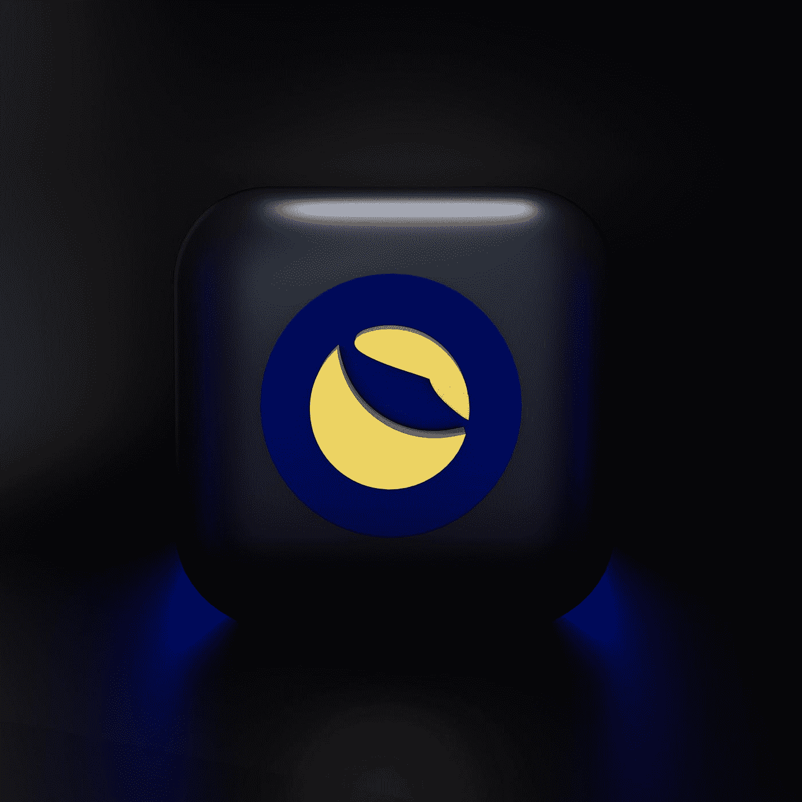

# 卢娜之路(卢娜坠毁事件透视)

> 原文：<https://medium.com/coinmonks/the-luna-way-a-perspective-about-the-luna-crash-6bbff06555c0?source=collection_archive---------19----------------------->

## 许多人可以从 luna 那里学到的关于加密投资之旅的重要一课

Photo by [Mariia Shalabaieva](https://unsplash.com/@maria_shalabaieva?utm_source=medium&utm_medium=referral) on [Unsplash](https://unsplash.com?utm_source=medium&utm_medium=referral)

在五月初的时候，加密爱好者被比特币的下跌震惊了，紧接着 Luna 在几天内从 60 美元跌到了 0.00003569 美元。这是一个重大的痛苦在接下来的一年的秘密历史；然后，因为这次露娜坠机事件，出现了自杀的报道。这些事件是悲剧性的。然后其他报道无家可归，失去了很多钱，甚至有巨额债务。这是不应该发生的；另一方面，它希望得到的钱比你失去的多。

但这是加密的。一秒钟可能是泵，一秒钟可能是泵。作为投资者或密码爱好者，我们必须知道并意识到这一基本原则；因此，我们不会将所有资产放在一个篮子里(加密)。我认为这种意识和基本原则被许多密码爱好者忽略了。它忘记了基本的投资原则，比如使用闲钱、理财等等。很多人专注于赚大钱；然后，他们忽略了该投资组合最糟糕的可能性，全部亏损；贪婪地管理它们。

Photo by [Bermix Studio](https://unsplash.com/@bermixstudio?utm_source=medium&utm_medium=referral) on [Unsplash](https://unsplash.com?utm_source=medium&utm_medium=referral)

下面这个原则你可以用在你的加密投资之旅中；

# **利用闲钱**

Photo by [Fabian Blank](https://unsplash.com/@blankerwahnsinn?utm_source=medium&utm_medium=referral) on [Unsplash](https://unsplash.com?utm_source=medium&utm_medium=referral)

这是一项基本的投资技巧。这是肯定的开始投资，你需要钱来投资。但是接下来的事情就是钱从哪里来；有些人用自己的积蓄，向父母要，甚至拿一些债务。开始投资最理想的方式是使用闲钱，因为如果你失去投资，它不会影响你的日常生活。更重要的是，加密具有很大的波动性，风险也更大。你可以在几秒钟或几分钟内输赢。

# 知道你的极限

Photo by [Yassine Khalfalli](https://unsplash.com/@yassine_khalfalli?utm_source=medium&utm_medium=referral) on [Unsplash](https://unsplash.com?utm_source=medium&utm_medium=referral)

你知道哪里有足够的钱投资，哪里有足够的钱让你获利。如果你担心投入 1000 美元，这对你来说太大了；也许你可以从 200 美元甚至 100 美元开始，这让你不担心，享受你的投资，它可以根据你的准备情况随时调整。这和设置哪里足以获利是一回事；如果没有设定，你会贪图利润；这对你的心态不好。

# 使不同

Photo by [Tengyart](https://unsplash.com/@tengyart?utm_source=medium&utm_medium=referral) on [Unsplash](https://unsplash.com?utm_source=medium&utm_medium=referral)

利润最大化的关键是分散资产，获得不同的防御性、温和性和攻击性资产。设定一个好的命题取决于你自己。如果它把所有都放在激进上，那么它的波动性会很大，不适合长期投资。随着时间的推移，您不会想到投资组合会出现上升和下降。它会影响日常生活，甚至你与他人的社会关系；你将关注投资组合，而不是你周围的人。

# 做最坏的打算。

Photo by [Clay Banks](https://unsplash.com/@claybanks?utm_source=medium&utm_medium=referral) on [Unsplash](https://unsplash.com?utm_source=medium&utm_medium=referral)

在你开始投资之前，最坏的一步已经存在了。如果你的投资失败了，你会怎么做？备用计划是有帮助的，如果一件可怕的事情发生，你不会惊慌，因为你已经准备好了。如果你没有后备计划，它会在情绪上影响你，做出有偏见的决定，因为你不再被教导看到精确的方向。这是情绪控制了你的决定，忽略了逻辑。那么我希望这个计划不会被采用，因为最坏情况还没有发生。

从技术和创意的角度来看，Crypto、Blockchain、Web3 和其他技术非常适合使用和开发。但这仍然是这项技术的开端。这就跟 90 年代末的互联网入侵一样，引发了[dot.com](http://dot.com/)泡沫，击垮了很多公司和投资人，但是有一家公司可以熬过那个时代，获得巨大的利润。我认为它和 crypto 是一回事；有一个代币或者硬币可以通过崩溃，很多都不是。所以，请在投资之前做好自己的研究(DYOR)。

最后，我为那些在这个秘密中迷失的人感到难过。我希望你会因为这些事件变得更强大，你会得到更多的教导，与这些损失相比，你是伟大的。然后有一天，你会成为一个伟大的人，你会因为能度过这段暗恋而幸福。我希望你们都好。

谢谢，

干杯。

> 加入 Coinmonks [电报频道](https://t.me/coincodecap)和 [Youtube 频道](https://www.youtube.com/c/coinmonks/videos)了解加密交易和投资

# 另外，阅读

*   [八大加密附属计划](https://coincodecap.com/crypto-affiliate-programs) | [eToro vs 比特币基地](https://coincodecap.com/etoro-vs-coinbase)
*   [最佳以太坊钱包](https://coincodecap.com/best-ethereum-wallets) | [电报上的加密货币机器人](https://coincodecap.com/telegram-crypto-bots)
*   [交易杠杆代币的最佳交易所](https://coincodecap.com/leveraged-token-exchanges) | [购买 HTZ 代币](https://coincodecap.com/how-to-buy-htz-token)
*   [5 大最佳社交交易平台](https://coincodecap.com/best-social-trading-platforms) | [瓦济克斯 NFT 印度](https://coincodecap.com/wazirx-nft-india)
*   [10 本关于加密的最佳书籍](https://coincodecap.com/best-crypto-books) | [英国 5 个最佳加密机器人](https://coincodecap.com/uk-trading-bots)