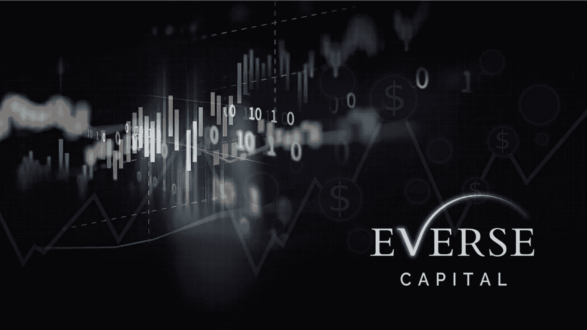
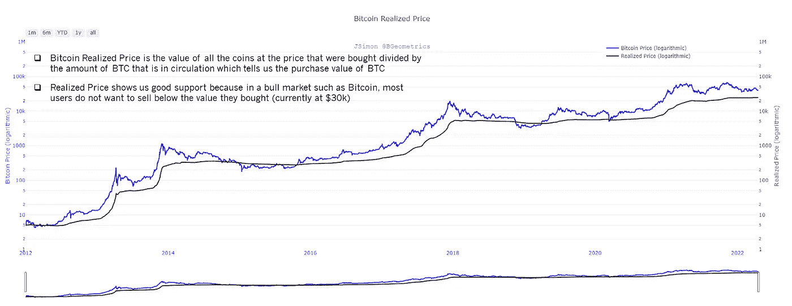
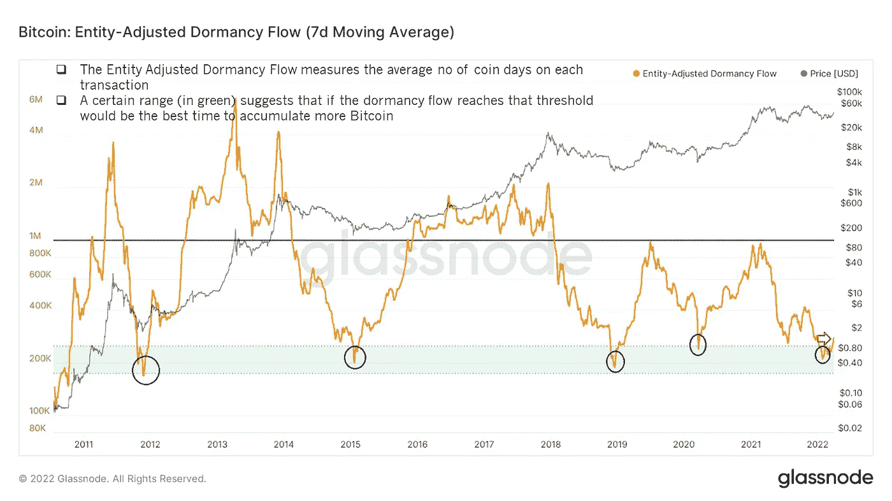
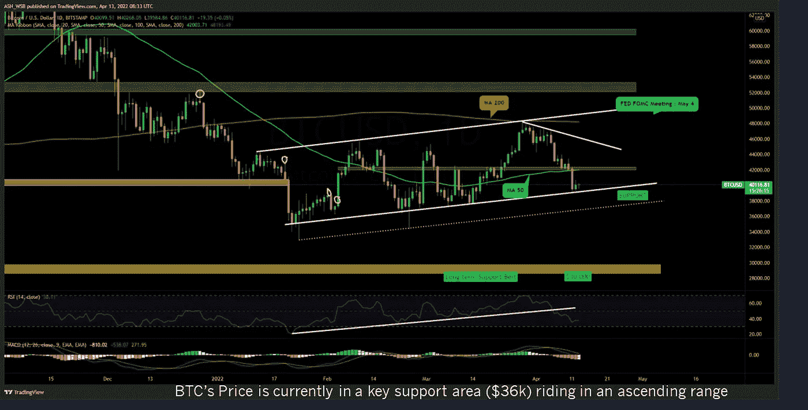
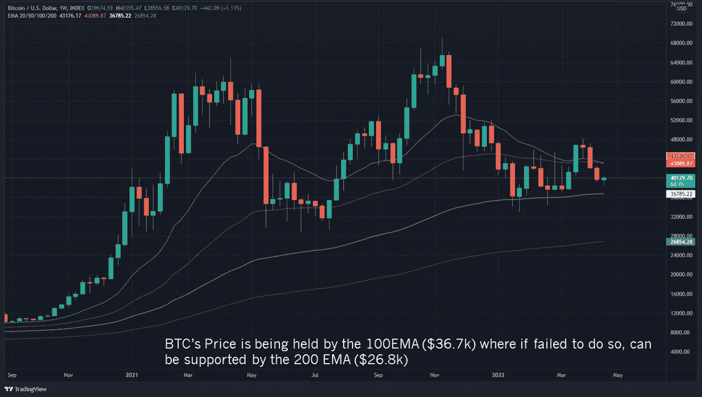
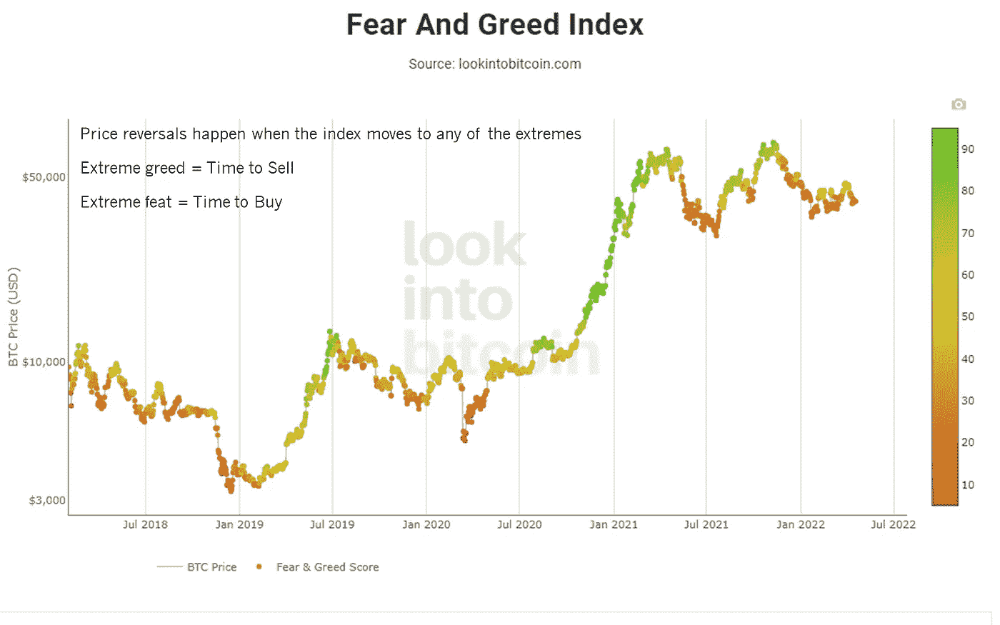
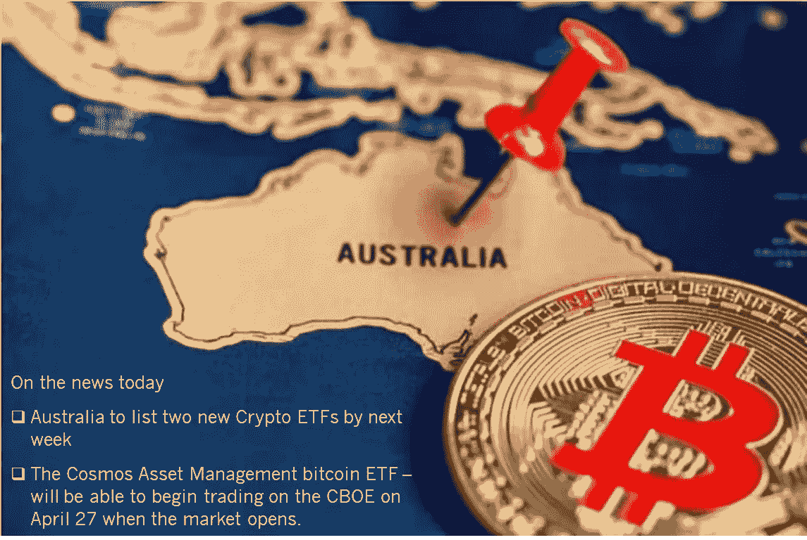

# BTC 的宏观分析

> 原文：<https://medium.com/coinmonks/the-macro-analysis-of-btc-5d48d52c23f7?source=collection_archive---------35----------------------->

密码正从推测走向机遇，现在又被采用。这一阶段将新人带入这个领域，为“早”创造世代财富

命运偏爱勇敢的人，但是没有思考的行动是愚蠢的

我们对理解$BTC 的宏观看法

这个空间充满了坏人，他们通过欺骗或欺骗性的承诺转移你的注意力

我们对 BTC 的方法是基于实际数据的方向偏差；通过 ff 提供:

▫️On-chain 指标
▫️Technical 分析
▫️Market 情绪
▫️News 更新

**在链指标**

链上指标是在区块链上发生的交易，可以提取这些交易以形成各种分析并促进更好的决策制定

以下是一些流行的链上指标，请查看
指标在[https://glassnode.com/](https://glassnode.com/)上可用

Bitcoin Realized Price

Entity-Adjusted Dormancy Flow

**技术分析**

或者 TA 是一门交易学科，用于通过研究过去的市场数据和各种统计指标图表模式的组合来预测价格的方向。这是我们目前的想法

BTC’s price in a rising trending channel

BTC’s price through Moving Averages

**市场情绪**

这是指投资者对某一特定市场的总体态度，与大众心理同义

一个伟大的洞见源于沃伦·巴菲特的“当别人贪婪时恐惧，当别人恐惧时贪婪”

Market Fear & Greed Index

**新闻更新**

这个区域可以被认为是一个滞后指标(图表已经在新闻之前识别了市场情绪),但仍然与创建相对于市场的叙述相关

Latest news for Bitcoin

**总体**
🔸在链上:两个指标都显示了具有强有力支持的累积

🔸TA: 30k-37k 被认为是宏观支持范围

🔸观点:“极度恐惧”暗示买入机会

🔸全球市场:随着 BTC 交易所交易基金在澳大利亚的推出，市场开始采用这种产品

**我们的判决:**

宏加密市场显示出积极的势头，因为我们预计关键价格区间将支持#BTC 并走高。

任何“下跌”或回撤都可以被认为是积累的新机会。我们也期待其他的替代硬币也能效仿

喜欢我们的分析吗？在推特上关注我们[https://twitter.com/EverseHQ](https://twitter.com/EverseHQ)

> 加入 Coinmonks [电报频道](https://t.me/coincodecap)和 [Youtube 频道](https://www.youtube.com/c/coinmonks/videos)了解加密交易和投资

# 另外，阅读

*   [如何购买 Monero](https://coincodecap.com/buy-monero) | [IDEX 评论](https://coincodecap.com/idex-review) | [BitKan 交易机器人](https://coincodecap.com/bitkan-trading-bot)
*   [CoinDCX 评论](/coinmonks/coindcx-review-8444db3621a2) | [加密保证金交易交易所](https://coincodecap.com/crypto-margin-trading-exchanges)
*   [红狗赌场评论](https://coincodecap.com/red-dog-casino-review) | [Swyftx 评论](https://coincodecap.com/swyftx-review) | [CoinGate 评论](https://coincodecap.com/coingate-review)
*   [Bookmap 评论](https://coincodecap.com/bookmap-review-2021-best-trading-software) | [美国 5 大最佳加密交易所](https://coincodecap.com/crypto-exchange-usa)
*   [如何在 FTX 交易所交易期货](https://coincodecap.com/ftx-futures-trading) | [OKEx vs 币安](https://coincodecap.com/okex-vs-binance)
*   [CoinLoan 评论](https://coincodecap.com/coinloan-review) | [YouHodler 评论](/coinmonks/youhodler-4-easy-ways-to-make-money-98969b9689f2) | [BlockFi 评论](https://coincodecap.com/blockfi-review)