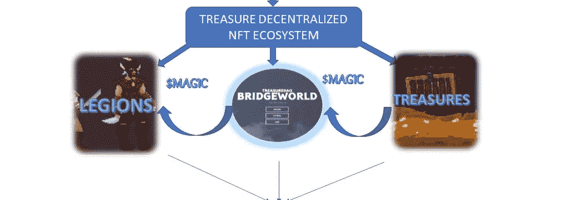

# $魔桥-宝藏的世界

> 原文：<https://medium.com/coinmonks/the-magic-bridge-world-of-treasures-1994b76a1f1?source=collection_archive---------79----------------------->

**魔法**令牌连接着元宇宙中部被称为**桥**世界的宝藏，魔法在这里被释放和收获。
BRIDGE WORLD 利用三种资源经济:

> **$魔力——动力/燃料。
> 宝藏——NFT 资源。
> 军团——NFT |玩家。**

在舰桥世界，军团利用被称为宝藏的 NFT 资源来挖掘魔法和建造更大的装备。魔法是一种允许军团使用财宝狩猎和制造新物品的力量。
宝藏生产继续开采$魔法所需的仪器和材料。
魔法变得越来越稀少，因为它需要释放能量来“开启”宝藏，以保持桥梁世界的有效性。

神奇的是，宝藏生态系统上的所有物品: ***军团******宝物******魔法*** 都是免费发放的。虽然他们是公平的午餐，价值仍然保持一流。
宝岛认为，元宇宙的资产之所以变得有价值，是因为埋藏着使之成为可能的作品和活动。

总之:宝藏和魔法之间的裂痕形成了一个元宇宙的基础层，其他元宇宙经济体可以在此基础上建立和连接。然而， **$MAGIC** 在宝藏保护伞下充当整个元宇宙网络的储备货币。

**关注并继续关注更多关于宝藏的消息。由于 Trove 市场即将到来……..**

在推特上关注 [**宝藏**](https://twitter.com/Treasure_DAO)

加入 [**社区关注**](https://discord.gg/sK2CzHzSkD)

> 加入 Coinmonks [电报频道](https://t.me/coincodecap)和 [Youtube 频道](https://www.youtube.com/c/coinmonks/videos)了解加密交易和投资

# 另外，阅读

*   [币安 vs FTX](https://coincodecap.com/binance-vs-ftx) | [最佳(SOL)索拉纳钱包](https://coincodecap.com/solana-wallets)
*   [比诺莫评论](https://coincodecap.com/binomo-review) | [斯多葛派 vs 3Commas vs TradeSanta](https://coincodecap.com/stoic-vs-3commas-vs-tradesanta)
*   [Capital.com 审查](https://coincodecap.com/capital-com-review) | [港加密借贷平台](https://coincodecap.com/crypto-lending-hong-kong)
*   [如何在 Uniswap 上交换加密？](https://coincodecap.com/swap-crypto-on-uniswap) | [A-Ads 审核](https://coincodecap.com/a-ads-review)
*   [WazirX vs coin dcx vs bit bns](/coinmonks/wazirx-vs-coindcx-vs-bitbns-149f4f19a2f1)|[block fi vs coin loan vs Nexo](/coinmonks/blockfi-vs-coinloan-vs-nexo-cb624635230d)
*   [本地比特币审核](/coinmonks/localbitcoins-review-6cc001c6ed56) | [加密货币储蓄账户](https://coincodecap.com/cryptocurrency-savings-accounts)
*   [什么是保证金交易](https://coincodecap.com/margin-trading) | [美元成本平均法](https://coincodecap.com/dca)