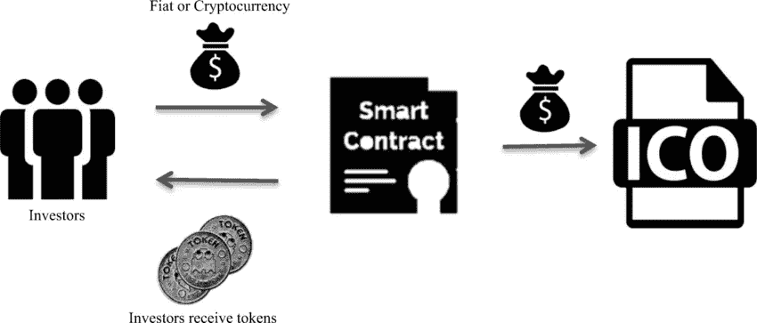

# 推动 ico 成功的九大因素

> 原文：<https://medium.com/coinmonks/the-major-factors-that-can-determine-the-success-of-a-crypto-ico-d394bc761fdd?source=collection_archive---------54----------------------->

***ICO 与 IPO(首次公开募股)非常相似，是用于新股在证券交易所上市的术语***

***投资者想知道硬币发行的分配模式，比如早期投资者、发行者和开发者会得到多少代币***

***与 IPO 不同，ico 不受监管，这意味着尽职调查的责任完全落在了潜在投资者的肩上***

在过去的几年中，许多加密项目已经开始，其中一些已经取得了显著的成功，而其他许多已经明显失败。

根据最近的统计，有超过 10000 个密码，更多的密码正在出现。新的加密货币是通过一个叫做 ICO(初始硬币发行)的过程推出的。ICO 与 IPO(首次公开募股)非常相似，后者是用于在证券交易所上市新股票的术语。因此，ICO 是开发者/初创公司为他们的加密项目筹集资金的过程。

> 如果在 ICO 期间筹集的资金没有达到最低资金要求，潜在投资者可以获得退款。因此，ICO 将被视为不成功

**ico 如何工作**

通过 ICO 筹资模式，初创公司可以通过在区块链上发行代币来筹集资金，代币也可以兑换成财务捐款。这些代币可以通过网络转移，并在加密货币交易所交易。它还可以发挥其他功能，包括允许持有人获得特定的服务，他们可以有权获得红利。

但是随着这么多 ICO 的出现，开发人员必须了解推动项目成功的重要因素，以及为什么他们必须密切关注这些因素。

**ICO 如何工作**

如果在 ICO 期间筹集的资金没有达到最低资金要求，潜在投资者可以获得退款。因此，ICO 将被视为不成功。但是，如果筹集的资金在特定的时间范围内满足了资金需求，实现的资金将被用于追求[加密项目](https://sgrlaw.com/what-are-icos-and-how-do-they-work/)的目标。

ICO Process

与 IPO 不同，ico 不受监管，这意味着尽职调查的责任完全落在了潜在投资者的肩上。说到这里，让我们深入了解使 ICO 成功的必要因素。

它解决了现实世界的问题吗？

自比特币问世以来，许多加密项目都缺乏真正的创新；他们只是复制了比特币开创的去中心化货币模式。比特币最初被发明时是一个革命性的想法，但投资者正在寻找一个能给老项目带来新旋转的项目。

key points in ICO

项目背后的理念就是价值所在；它必须具有创新性，并解决现实生活中的问题。当一个项目背后的想法是鼓舞人心的，它的执行是优秀的和有价值的，它改善了投资者对 ICO 的看法，增加了采用和价格上涨的机会。

> **比特币最初被发明时是一个革命性的想法，但投资者正在寻找一个能给老项目带来新旋转的项目**

这一方面是成功推出 ICO 的重要基础，因为它可以在社区内创造激情，并为项目创造动力，这反过来又会提高价值。

**团队简介**

我们不能低估这一点的重要性，因为 ICO 和它背后的团队一样优秀。这个团队应该是专业知识和经验的混合体。我指的是技术和商业方面的经验。团队成员都是前谷歌(google)、前 facebook 之类的人是不够的，他们还必须有管理成功企业的经验。

List of needed ICO skills

**透明度**

在 ico 的世界里，没有法律来管理这一过程，保护投资者免受武器攻击。这是象征性购买者的责任。因此，投资者密切关注 ICO 发行者表现出的透明度。

许多标榜为 ICO 的项目都是欺骗投资者的陷阱，因此发行者必须通过提高透明度和沟通来应对信任缺失。

在 Nair 和 Mamgain 的 2018 年[研究论文](https://www.vernimmen.net/ftp/Aakash_NAIR_and_Ashish_MAMGAIN.pdf)中，散户投资者和专家都认为透明度是成功的最关键因素。

确保透明度的方法之一是发布一份关于加密项目的白皮书。白皮书通常是任何潜在投资者的首选，因为它回答了关于加密项目的所有关键和技术问题。白皮书必须易于投资者阅读，并且应尽可能用简单的语言编写，避免不必要的技术术语，这些术语需要第三方进行解释。

另一种确保透明的方法是构建开源代码。众所周知，大多数 ico 都是自动化的，并且严重依赖智能合约，用户强烈倾向于开源代码平台，并被证明是安全的。

如果团队的最高管理层愿意接受媒体采访，或者可以通过 Linked-In、Reddit 或 Discord 等各种社交媒体渠道轻松联系到他们，也会有所帮助。

**令牌的分发**

投资者想知道硬币的发行模式。像早期投资者、发行者和开发商将获得多少代币这样的问题。如果高层管理团队独享大部分股权，可能会阻碍投资。但是，如果大部分代币都分发给社区，这可能会鼓励投资并推动项目的发展。

**区块链的选择**

除非初创公司决定建立自己的区块链(这种情况很少见)，否则大多数新项目都是从现有的区块链启动的。这决定了将用于获取 ICO 的加密货币。如果一个新的 ICO 使用模糊的区块链，可能会影响投资者对该项目的看法，并损害其价值。

> T **白皮书必须便于投资者阅读，并尽可能使用简单易懂的语言，避免使用不必要的技术术语，以免需要第三方进行解释**

**有效营销**

在任何项目中，第一印象都很重要，确保一个强烈而积极的第一印象的方法是通过有效的营销活动。重要的是要明白，传统的营销方法可能不会带来成功的加密，活动必须有真实的内容，并激发有意义的互动。

ICO marketing

而且根据 Nair 和 Mamgain 的报告，该项目的网站 Alexa 排名和他们的 Telegram 活动也可以作为受欢迎程度的最佳衡量标准。

**社区建设**

## 社区建设是 ICO 的一个关键成功因素，因为一个充满活力和宣传的社区可以让一个项目受欢迎，即使底层技术并不令人鼓舞。

## 一枚硬币受到的炒作与它的最终价格有着密切的关系，因为谈论它的人通常是投资者自己。

## 因此，对于试图通过 ico 筹集资金的发行人来说，建立一个活跃的社区，积极参与利用和创造对该项目的认识，应该是重中之重。

> 加入 Coinmonks [电报频道](https://t.me/coincodecap)和 [Youtube 频道](https://www.youtube.com/c/coinmonks/videos)了解加密交易和投资

# 另外，阅读

*   [如何在 FTX 交易所交易期货](https://coincodecap.com/ftx-futures-trading) | [OKEx vs 币安](https://coincodecap.com/okex-vs-binance)
*   [CoinLoan 评论](https://coincodecap.com/coinloan-review) | [YouHodler 评论](/coinmonks/youhodler-4-easy-ways-to-make-money-98969b9689f2) | [BlockFi 评论](https://coincodecap.com/blockfi-review)
*   [XT.COM 评论](https://coincodecap.com/profittradingapp-for-binance) | [币安评论](https://coincodecap.com/xt-com-review)
*   [SmithBot 评论](https://coincodecap.com/smithbot-review) | [4 款最佳免费开源交易机器人](https://coincodecap.com/free-open-source-trading-bots)
*   [比特币基地僵尸工具](/coinmonks/coinbase-bots-ac6359e897f3) | [AscendEX 审查](/coinmonks/ascendex-review-53e829cf75fa) | [OKEx 交易僵尸工具](/coinmonks/okex-trading-bots-234920f61e60)