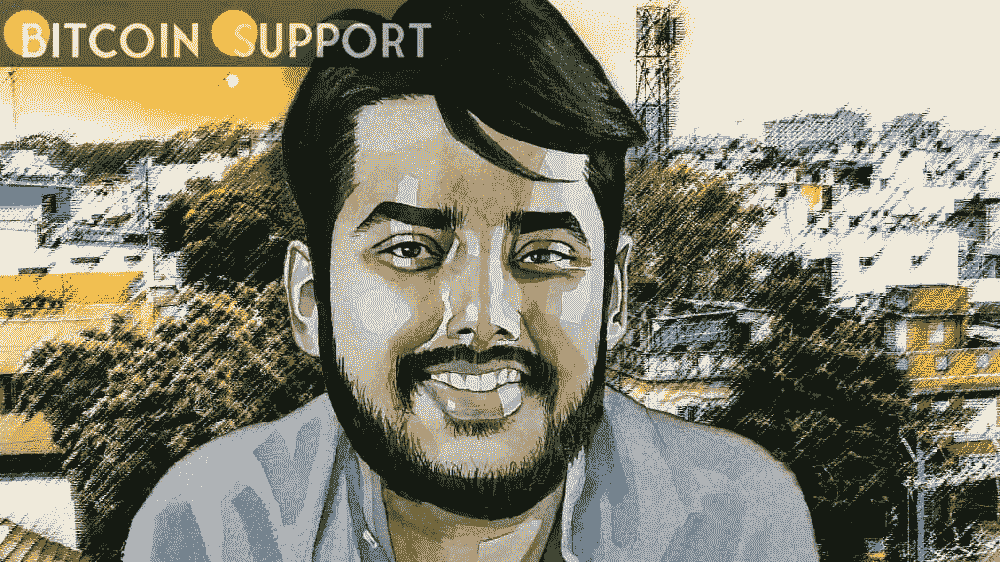
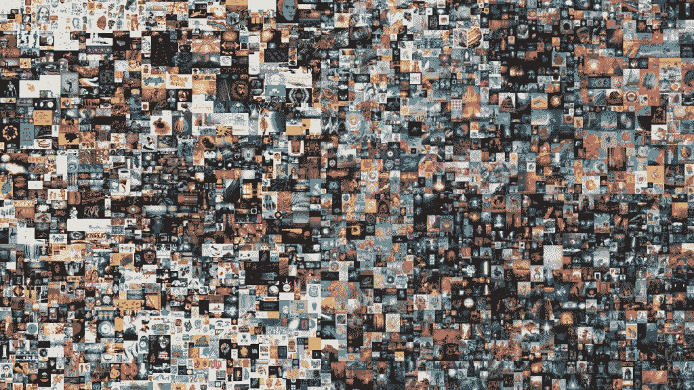

# 拥有世界上最昂贵的 NFT 的人

> 原文：<https://medium.com/coinmonks/the-man-who-owns-the-most-expensive-nft-in-the-world-afe00ed74192?source=collection_archive---------97----------------------->

**Visit our website:-** [**https://bitcoinsupports.com/**](https://bitcoinsupports.com/)

一个价值 6930 万美元的房地产投资信托公司的所有者的心态和动机。Vignesh Sundaresan 不太可能很快成为一个家喻户晓的名字。尽管如此，这位连续创业家在加密货币市场上以别名 Metakovan 为自己创造了一个名字。几乎就在一年前，Sundaresan 获得了世界上最昂贵的 NFT，以及在世艺术家的第三昂贵的作品。他以 6930 万美元收购了 Beeple 开创性的“Everydays: The First 500 Days”震惊了业界，并被认为是将 NFTs 推向主流的原因。

**Visit our website:-** [**https://bitcoinsupports.com/**](https://bitcoinsupports.com/)

比伯的旅程真的是由美好的愿望铺成的。

几个月来，公众一直在努力理解这笔交易，并确定刚刚获得世界上最昂贵的不可替代代币的个人的身份。

而且，尽管梅塔科万购买背后的化名身份很快被披露，但购买的原因仍基本不为人知。在那次历史性收购后的几天里，Sundaresan 表示，他收购 Beeple 作品的部分原因是为了向印度人和有色人种证明，他们也可以成为艺术品消费者。

**“考虑一个投资者、金融家或者艺术赞助人。你的调色板十有八九是单色的。他当时解释道:“我们赢得了佳士得拍卖行的《每一天:第一个 5000 天》，为这个配色方案增添了一抹桃花心木的色彩。”。然而，另外一些因素也在起作用。Sundaresan 说他认为这次购买是对自己的投资，因为他认为自己正在创造历史。

**“我很荣幸能为 NFTs 的全球认可做出贡献。也是为了回报这个给予我如此多的系统，”他向 Anastasia Chernikova 解释道。**

Sundaresan 在加密货币市场的运势主要是未知。他强调，他只投资于他相信的项目，并且只关心项目的成功。他认为这笔钱是事后想到的。他在 2013 年开始活跃于加密业务，当时他正在寻找新的资金转移方法。比特币在当时还是一种不为人知的新货币，它自称是货币编程的理想解决方案。

Sundaresan 通过为比特币支付提供托管服务取得成功后，创立了 Coins-e。时机非常理想——在 2013 年牛市期间，该交易所在 6 个月内增加了 14，000 名用户。第二年夏天，他以 16 万美元的价格卖掉了交易所，并迅速投资于另一家企业。他共同创立了 BitAccess，这是一个由 Y-Combinator 资助的项目，后来在全球范围内安装了数百台比特币自动取款机。

2016 年，在寻找有趣的想法时，他偶然发现了以太坊，并在它的首次硬币发行(ICO)中投入了相当多的资金。

**“我更关心生产和影响世界，我是一个技术布道者。当时，保存硬币是为了不失去理智，但现在看来这是一个谨慎的选择。”**

**“我没想到会涨到 100 美元，更别说 1000 美元了。我渴望融入社区。我记得在以太 15 美元的时候庆祝，因为我们相信以太坊取得了成功，而不是因为我们变得富有。这是我一直怀有的想法，”他说。他随后补充道，同样的情绪几乎肯定会阻止他出售皮普尔的作品。****

**Visit our website:-** [**https://bitcoinsupports.com/**](https://bitcoinsupports.com/)

此外，还有情感价值——Sundaresan 声称，毕普艺术背后的故事吸引了他，促使他在佳士得的拍卖会上以高于创的贾斯汀·孙(Justin Sun)的价格成交。“吸引我的是这项任务的努力，而不是能力、技术或美学承诺，”他在谈到 Beeple 的 13 年项目时说，该项目包括 5000 幅图像。“它召唤着我，因为就在 13 年前，我身无分文。我开始编码是因为这感觉和我自己的旅程很相似——从一无所有开始，以努力工作的美好结果结束。我钦佩它更多的是因为它的美学深度或其他任何东西。”

**非英语专业有着光明而激动人心的未来。除了产生巨大的财富之外，NFT 的出现还导致了投资者之间的分化。最初由关系密切的艺术家社区占据，NFT 的设施现在是各种投资者的家园，其中大多数人将他们视为无限的现金矿。

这导致了一类新的 NFT 项目的出现，被称为炒作项目，在这些项目中，单个 NFT 的售价高达数千万美元，并产生了数十亿美元的交易量。这类 NFT 的努力通常会进入媒体，因为像像素化的 Twitter 个人资料照片以 2300 万美元的价格拍卖这样的新闻获得了最大的关注。Sundaresan 声称这种关注对更广泛的 NFT 生态系统是有害的。相反，它们营造出一种排外的氛围，将该地区描绘成富人的专属，这与商业的所有主张相矛盾。

**“我并不热衷于神秘朋克、游艇俱乐部或其他为个人资料拍照的活动。我不再希望成为私人俱乐部的成员。相反，我想成为包容性团体的一员，引入新成员并建立一个个人可以聚集在一起并欣赏某些东西的系统。结果，我个人都避开了他们。”**

这并不是说没有一部分市场是私营部门筹资和伙伴关系举措所针对的。然而，几乎可以肯定的是，这些举措将无法熬过另一个秘密的冬天。

**“潮流来来去去，层出不穷。我认为，分配不平等的方案不是永久的，没有人能够阻止新的和更好的项目的扩散。我对公私合作的替代方案感兴趣。”尽管他追求有意义和有前途的事业，但孙达雷森断言，他也容易受到 FOMO 的影响。

“即使你拥有世界上的一切，你也无法回避 FOMO。FOMO 是一种精神状态。”然而，任何错过的焦虑都会很快消失。他观察到，如果他嫉妒 buzz 项目的赚钱，他会考虑项目未来几年的发展轨迹。“如果我不相信它，我会袖手旁观，”他补充道。“例如，我避开了 Cardano 和 Solano，因为我不同意他们的令牌分发模型。我会想，‘哦，伙计，如果我投资的话，我早就赚到那笔钱了。’但那样我就放弃了我的价值观。”根据他的想法，并不是所有的加密业务都应该被视为投资，尤其是非加密技术。他预测，随着行业开始增加 NFT 的实用性，购买 NFT 以从中获利的趋势将很快逆转。随着这种资产类别从钱包中脱离出来，变得与现实世界更加融合，人们将以各种不同的方式来体验他们的非传统艺术。融入现实世界将带来一系列新问题，其中最重要的将是监管。另一方面，Sundaresan 认为，委婉地说，任何试图控制虚拟 NFT 世界的努力都是徒劳的。加密业务已经习惯的快速发展速度意味着政府和监管机构将无法跟上。监管机构需要三年时间来制定法律，到那个时候，密码社区将会继续前进。你可以调节匝道和匝道，这是可以接受的。然而，禁止你不理解的东西是不正确的。当立法者想出如何监管 NFT 时，另一个问题就会出现。我不知道接下来会发生什么。监管往往落后于创新，我认为这是有意为之。”

**访问我们的网站:-**[**https://bitcoinsupports.com/**](https://bitcoinsupports.com/)

**免责声明:以上为作者观点，不应视为投资建议。读者应该自己做研究。******