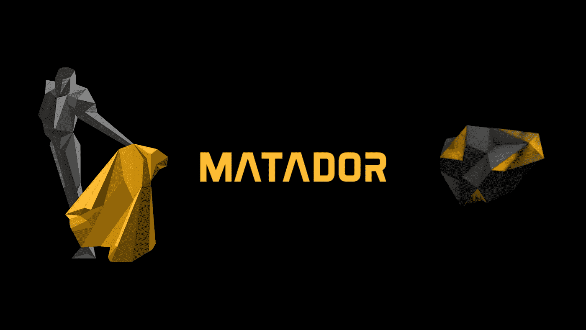
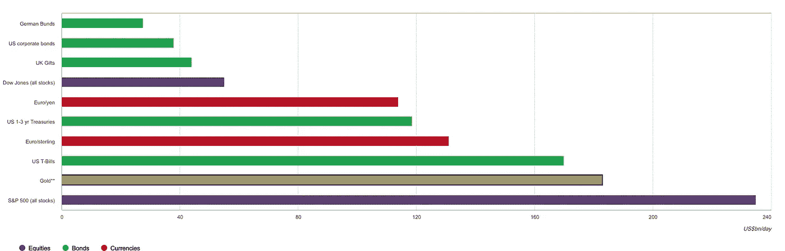
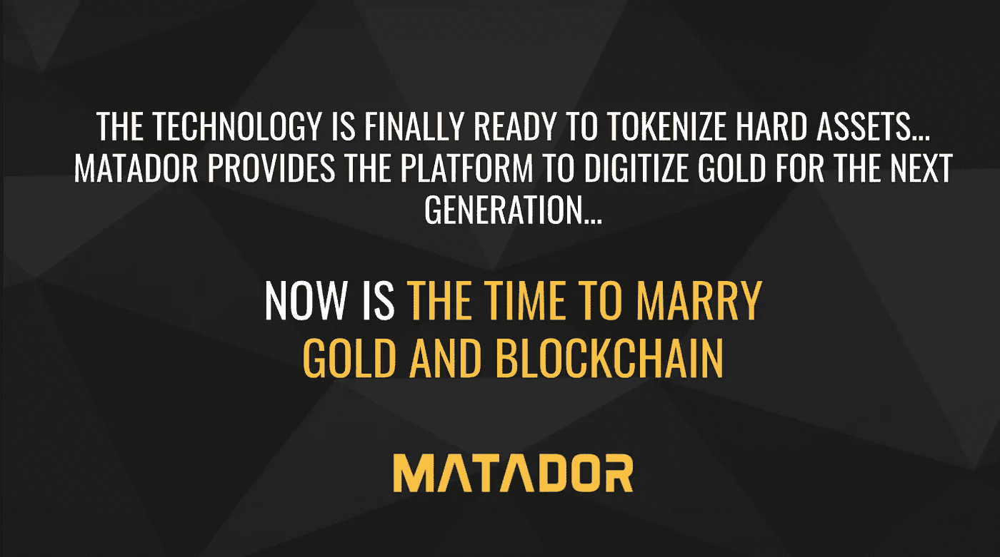

# 斗牛士网络

> 原文：<https://medium.com/coinmonks/the-matador-network-gold-nfts-716716b7e778?source=collection_archive---------34----------------------->

## 提升黄金市场的计划

Image Credit — [Matador.Network](https://www.matador.network/)

> “尽管互联网和加密货币兴起，黄金市场 25 年来一直没有变化，需要一场革命。”斗牛士。网络

斗牛士试图通过建立一个平台和生态系统来成为新的黄金标准，在这个平台和生态系统中，黄金投资者可以更透明和更容易的方式进行交易。用户将铸造代表他们实物黄金的 NFT，斗牛士网络将保管他们的黄金，储存在斗牛士认证的金库中。像*永久黄金版税*这样的激励措施奖励黄金持有者和发行者将他们的黄金上传到网络。

# 黄金市场的现状

Image Credit —[Goldhub](https://www.gold.org/goldhub/data/trading-volumes)

根据 [Goldhub](https://www.gold.org/goldhub/data/trading-volumes) 的数据，按交易量计算，黄金是第二大资产类别，通过交易所交易基金、衍生品和实物市场每天交易 1830 亿美元。随着斗牛士网络等现代技术解决了黄金市场目前面临的关键问题，这些数字有望增加。

**根据** [**斗牛士**](https://www.matador.network/) **、**

*   实物黄金储存成本高，搬运麻烦，而且不容易分割
*   纸黄金市场让投资者更容易交易黄金，但并没有赋予他们对基础资产的所有权
*   由于更大的纸市场，实物黄金缺乏透明度和可追溯性
*   黄金在很大程度上是一种非生产性资产；不会产生产量
*   过去十年，股票和加密货币的表现一直优于黄金
*   越来越多的投资者青睐比特币等加密货币和高收益 DeFi 资产，而非黄金

# 斗牛士网络为什么要在区块链上令牌化黄金

Image Credit — [PixelPlex.io](https://pixelplex.io/blog/tokenized-gold-and-financial-industry/)

在分布式和加密保护的分类账上标记真实世界资产的趋势与日俱增。[斗牛士网](https://www.matador.network/)认为黄金令牌化可以为投资者提供传统黄金市场所缺乏的优势。

## 透明度和可追溯性

NFTs 可以存储和证明不可变的交易数据，如黄金所有权的出处和其他特定信息，如原产地和当前保险库位置。

## 轻便

任何人都可以在世界上任何地方 24/7/365 以数字方式访问和转移他们的黄金，而不必接触或移动底层的实物黄金。

## 提高可访问性

允许细分，这导致更好的流动性，并增加较小的散户投资者的参与。

## 创收

投资者可以用他们的黄金作为借贷的抵押品来赚取收益。

# 斗牛士网络计划如何执行

Image Credit — [Matador.Network](https://www.matador.network/corporate-presentation)

## 永恒的金色皇族

斗牛士计划用*永久黄金版税*吸引黄金发行商和金主。每次他们的黄金在斗牛士网络上交易，他们都会收到将黄金加入网络的版税。这是通过智能合同自动化来实现的——它被编程为每笔交易都有一笔费用计入版税。然后版税在原始发行人和斗牛士公司金库之间分配。

这是向网络运送大量黄金的动机。网络中更多的黄金意味着更多的交易，更多的交易意味着更多的版税。斗牛士也计划有自己的黄金储备来分配。

## NFT 功能

当黄金装船时，铸造 NFT 来代表黄金所有权。这些 NFT 存储关于每笔交易的数据以及它代表的具体金条或金币。它还跟踪位置，例如储存实物黄金的特定金库。这些 NFT 可以在斗牛士认证的金库兑换实物黄金。

## 创收

黄金投资者不再需要等待价格升值来出售他们的黄金以实现利润。他们将能够抵押他们的黄金，并通过在斗牛士网络上或通过他们的合作伙伴将黄金借出赚取收益。斗牛士让黄金多产。

未来的计划包括向网络中添加更多的商品，如银、铂、工业金属和石油，以及一个向用户提供折扣和其他优惠的忠诚度计划。

*了解更多* [*斗牛士。网络*](https://www.matador.network/) *和他们的团队请访问他们的* [*网站*](https://www.matador.network/) *。*

> 加入 Coinmonks [电报频道](https://t.me/coincodecap)和 [Youtube 频道](https://www.youtube.com/c/coinmonks/videos)了解加密交易和投资

# 另外，阅读

*   [我的密码交易经验](/coinmonks/my-experience-with-crypto-copy-trading-d6feb2ce3ac5) | [比特币基地评论](/coinmonks/coinbase-review-6ef4e0f56064)
*   [CoinFLEX 评论](https://coincodecap.com/coinflex-review) | [AEX 交易所评论](https://coincodecap.com/aex-exchange-review) | [UPbit 评论](https://coincodecap.com/upbit-review)
*   [AscendEx 保证金交易](https://coincodecap.com/ascendex-margin-trading) | [Bitfinex 赌注](https://coincodecap.com/bitfinex-staking) | [bitFlyer 点评](https://coincodecap.com/bitflyer-review)
*   [麻雀交换评论](https://coincodecap.com/sparrow-exchange-review) | [纳什交换评论](https://coincodecap.com/nash-exchange-review)
*   [支持卡审核](https://coincodecap.com/uphold-card-review) | [信任钱包 vs 元掩码](https://coincodecap.com/trust-wallet-vs-metamask)
*   [Exness 回顾](https://coincodecap.com/exness-review)|[moon xbt Vs bit get Vs Bingbon](https://coincodecap.com/bingbon-vs-bitget-vs-moonxbt)