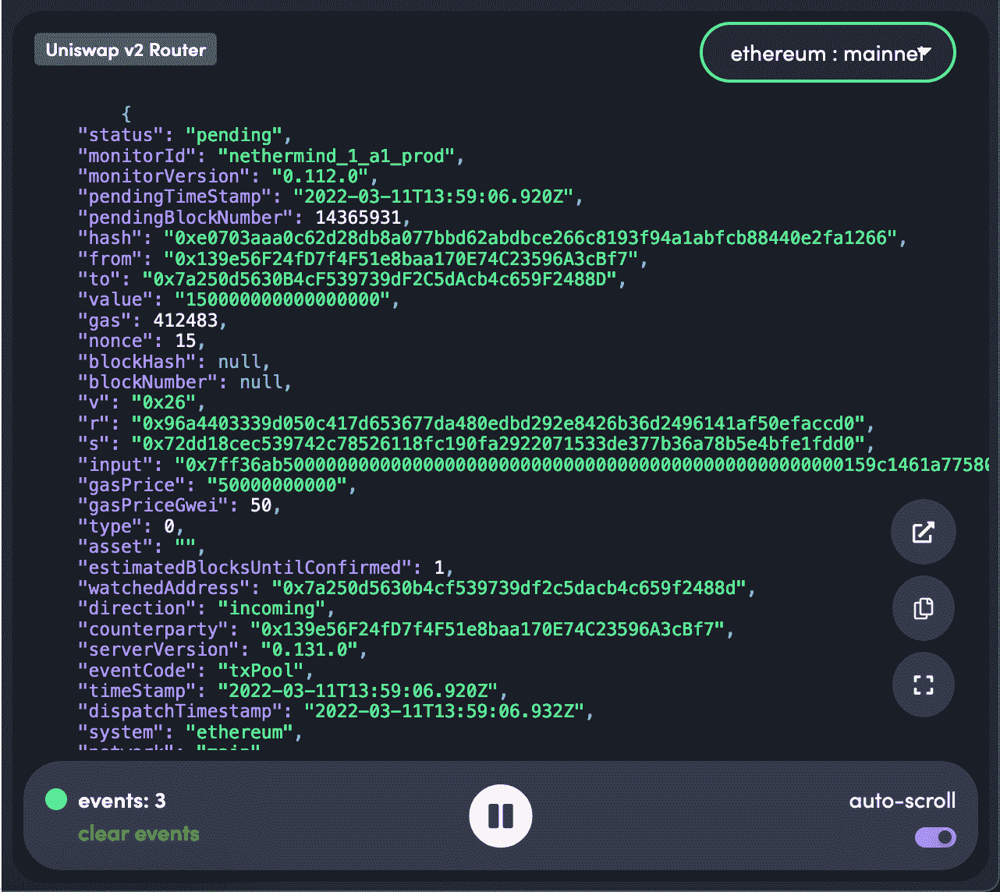
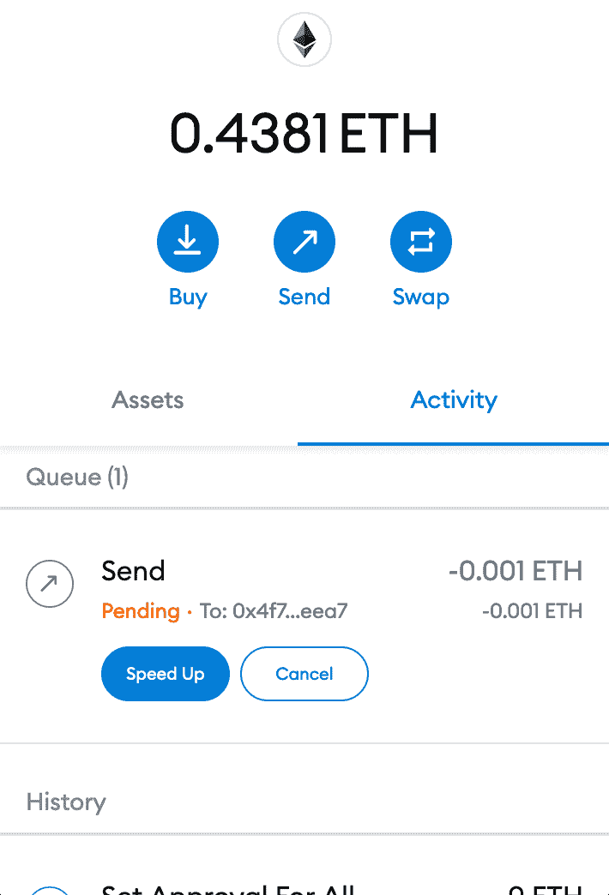
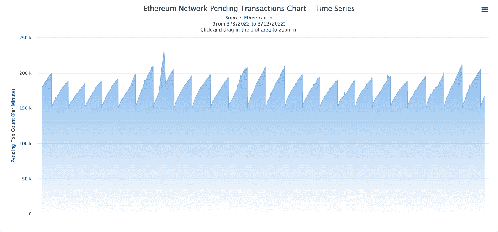
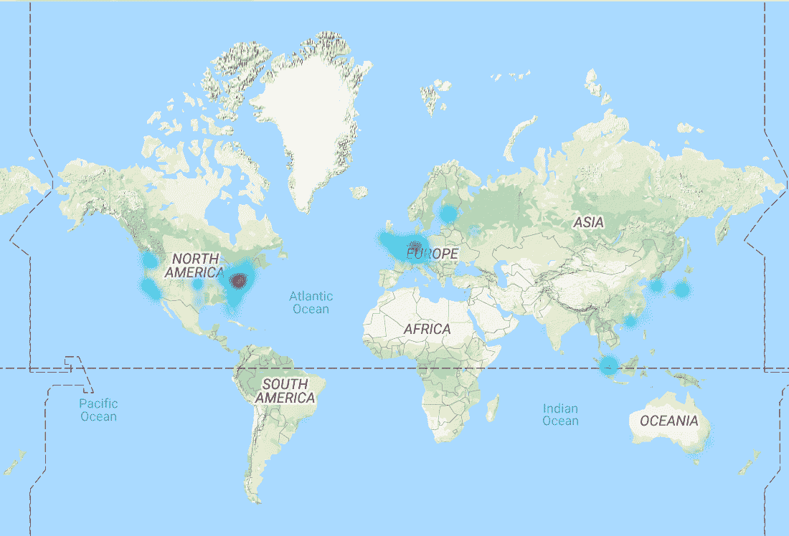

# 记忆池——创造历史的战场

> 原文：<https://medium.com/coinmonks/the-mempool-the-battleground-where-history-is-made-dc3d99132421?source=collection_archive---------6----------------------->

区块链以其不变性和刚性而闻名，然而交易被记录在区块链上的过程却不是这样，整个过程经常被忽视。

在我的交易被确认之前，其他人可以查看/影响我的交易吗？
*我能通过访问 mempool 数据获得优势吗？*

在这个技术潜水中，我们将仔细研究以太坊内存池，看看以太坊生态系统中的开发者是否有任何方法来利用这一资源获得优势，并更好地了解以太坊区块链。

以太坊内存池数据

# 什么是内存池，为什么以太坊有内存池？

当用户在以太坊上发送交易时，交易从钱包或 Dapp 发送到节点。我们许多开发人员(不运行节点)使用像 Infura 或 Alchemy 这样运行自己的节点的服务。如果您运行自己的节点，您可以将事务直接发送到 mempool。

节点是网络上的自愿验证者，不要与挖掘者混淆，(挖掘者试图从内存池中移除事务，这将在后面讨论)。该交易将由该节点进行“审查”,以检查其是否合法以及是否有资格被包括在区块链中。

一切正常后，节点会将事务存储在其不断更新的内存池(mempool)中，准备好在区块链上永久保存。mempool 是通往区块链的门户和等候室，所有交易都必须通过它才能包含在区块链的一个块中。

术语“内存池”是一个方便的社会结构，因为它不是传统意义上的单一、连贯的池。mempool 的每个部分都保存在每个单独的节点上，这些节点可能与网络上的其他节点一致或不一致。

# 待定交易…

如果您正在使用元掩码，您可能会看到类似这样的内容:

元掩码中的挂起事务

您可能也使用过 MetaMask 提供的“加速”功能。这通过向其添加更多气体来加速交易。也有可能取消交易。这怎么可能呢？一个常见的误解是，从你按下发送键的那一秒起，交易就已经确定了。他们不是。

未决事务是当前在 mempool 中的事务，并且将保持在那里，直到它们被包括在一个块中，或者，如果一个事务被阻塞太久，它将被节点丢弃，并且实际上被取消。只要事务在内存池中，就有可能加速或取消它。

在撰写本文时，可以在 [Etherscan](https://etherscan.io/txsPending) 上查看当前未决的事务，mempool 中有大约 20 万个事务。

待定交易

在一个节点处理完事务并将其作为未决事务输入 mempool 后，它会将该事务广播给其他对等节点。每个对等体将把事务添加到它们的内存池中，并再次广播事务以获得最大分布。每个节点将拥有不同的内存池，这些内存池可能与其对等节点有很大不同。内存池绝不是同质的。节点运行在许多不同类型的软件上。以太坊节点及其运行的软件的完整列表(和地图)可以在[这里](https://www.ethernodes.org/)找到。

全球以太坊节点

# 矿工们来了

交易将在 *X* 秒/分钟小时的时间内保持挂起状态，对所有进入的交易可见。该交易将等待一个矿工捡起来。挖掘器是一种特殊类型的节点，它试图将事务添加到区块链中。交易在内存池中花费的时间将取决于附加的费用，因为这主要是矿工如何选择要拾取的交易，费用越高=交易越快。

最终，一个挖掘器将成功地解决工作证明任务，并在区块链上添加一个包含该事务的新块。只有在这一点上，交易不能再加速或取消。求解后的块会在整个网络中广播，详细描述其中包含的所有事务。然后，网络中的每个节点从它们的内存池中删除所有包含在新块中的事务。

# 警告

尽管技术上可以绕过 mempool，将事务直接发送给 miner 以包含在一个块中，但没有标准化的方法来做到这一点。这种方法是否有益并不明显，因为发送者将不得不等待特定的挖掘者成功地利用事务挖掘块，而不是将其转发到 mempool 以供任何挖掘者拾取，从而使其有更大的机会被包括在即将到来的块中。

# 我们能用这种智慧做什么？

知道 mempool 中的当前交易，我们可以估计理论上的最佳天然气价格，因为我们可以查看当前交易天然气费用的范围。像 [Eth 加油站](https://ethgasstation.info/)这样的服务利用了这一点。

我们可以看到其他用户和其他机器人的未决事务，如果有必要，可以利用这些信息来避免一场气体战争或领先于其他事务。还可以分析像 Uniswap 这样的 dex 的未决交易。

我们还可以监视内存池中的 Oracles。他们可能正在向区块链发送信息，这些信息可能会影响定位或其他一些依赖于神谕信息的协议。这给了我们一个潜在的机会，在信息袭击区块链之前采取行动。

# 进入黑暗森林

对 Mempool 的访问可以让我们看到下一个块中包含的所有潜在事务，这可能是有价值的信息。有几种方法可以访问它。

Quick Node 提供了一个使用 web socket 服务的向导[这里](https://www.quicknode.com/guides/defi/how-to-stream-pending-transactions-with-ethers-js)

Blocknative 提供了许多访问内存池数据的选项，包括这个浏览器内流监听 dex[这里](https://explorer.blocknative.com/?v=1.30.5&0=ethereum&1=main&s=%7B%22name%22%3A%22Uniswap+v2+Router%22%2C%22address%22%3A%220x7a250d5630b4cf539739df2c5dacb4c659f2488d%22%7D&s=%7B%22name%22%3A%22SushiSwap+Router%22%2C%22address%22%3A%220xd9e1ce17f2641f24ae83637ab66a2cca9c378b9f%22%7D&s=%7B%22name%22%3A%22Balancer%22%2C%22address%22%3A%220x3e66b66fd1d0b02fda6c811da9e0547970db2f21%22%7D&s=%7B%22name%22%3A%22Curv.fi%22%2C%22address%22%3A%220xdf5e0e81dff6faf3a7e52ba697820c5e32d806a8%22%7D&fr=%7B%22status%22%3A%22pending%22%7D)

对运行自己的节点感兴趣:

如果你运行的是一个完整的 Geth 节点，关于如何查询内存池的细节可以在[这里](https://geth.ethereum.org/docs/rpc/ns-txpool)找到。如果你运行的是 OpenEthereum 节点，关于如何查询内存池的细节可以在[这里](https://openethereum.github.io/JSONRPC)找到。

# 关闭

希望这是一个有用的入门读物。充分利用内存池是一个深入的技术话题，在以后的文章中会有更深入的探讨。

同时，请随时在 Twitter 上联系我:[沃伦·杜伯瑞](https://twitter.com/WarrenDubery)

> *加入 Coinmonks* [*电报频道*](https://t.me/coincodecap) *和* [*Youtube 频道*](https://www.youtube.com/c/coinmonks/videos) *了解加密交易和投资*

# 另外，阅读

*   [Bookmap 评论](https://coincodecap.com/bookmap-review-2021-best-trading-software) | [美国 5 大最佳加密交易所](https://coincodecap.com/crypto-exchange-usa)
*   最佳加密[硬件钱包](/coinmonks/hardware-wallets-dfa1211730c6) | [Bitbns 评论](/coinmonks/bitbns-review-38256a07e161)
*   [新加坡十大最佳加密交易所](https://coincodecap.com/crypto-exchange-in-singapore) | [收购 AXS](https://coincodecap.com/buy-axs-token)
*   [红狗赌场评论](https://coincodecap.com/red-dog-casino-review) | [Swyftx 评论](https://coincodecap.com/swyftx-review) | [CoinGate 评论](https://coincodecap.com/coingate-review)
*   [投资印度的最佳加密软件](https://coincodecap.com/best-crypto-to-invest-in-india-in-2021)|[WazirX P2P](https://coincodecap.com/wazirx-p2p)|[Hi Dollar Review](https://coincodecap.com/hi-dollar-review)