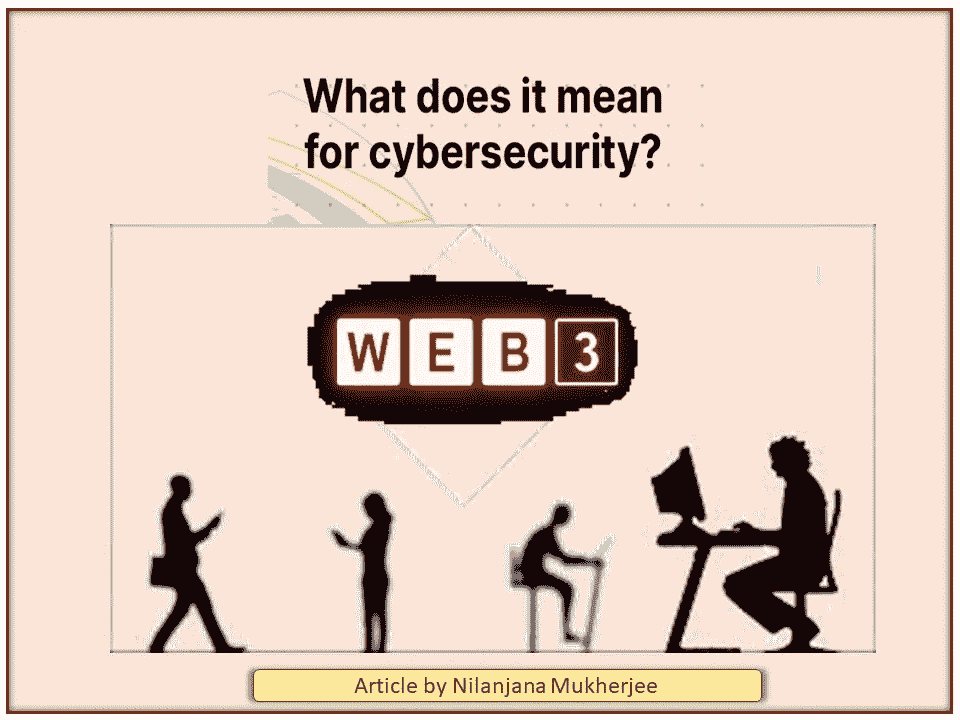

# 网络安全和 WEB 3 的心理健康

> 原文：<https://medium.com/coinmonks/the-mental-health-of-cyber-security-and-web-3-26bfd1a30fb8?source=collection_archive---------24----------------------->

对技术的恐惧，被称为 technophobia，是对先进技术或复杂设备，尤其是计算机的恐惧或厌恶。令人惊讶的是，技术恐惧症非常普遍，影响到三分之一的人口，这可能会导致健康问题和无法有效工作。

传统上，青少年是第一个接受新产品的人，也是第一个熟练使用新产品的人，随后是更小的孩子。成年人接受新技术的速度通常较慢，一些老年人可能永远也不会接受新技术。

从一心想要毁灭的机器人到导弹，电影、文学和电视节目充斥着“技术出错”。我们害怕不确定的未来，我们的头脑开始填空。

随着 Web2.0 的发展和改进，Web 3.0 建立在涉及去中心化、开放性和更大用户效用的概念之上。例如:

虽然当前的 Web 2.0 更加关注应用程序，但 Web3 将互联网转变为一个更加以消费者为中心的系统，具有更好的用户效用、体验、隐私和更好的网络安全。

Web 3.0 允许使用区块链技术简化网站登录。

由于端到端的加密，Web3 区块链技术使黑客很难获取信息。更好的是，为公司网站提供了额外的安全层。

这些规范可能有助于用户感受到更多尝试技术的鼓励，因为他们将成为公司提供的数据的所有者。在工作场所，基于社区的环境应该帮助人们掌握各种技术，并为这个新世界接受培训。

但好事也有坏事，根据安联风险晴雨表，网络风险是 2022 年全球公司最大的担忧。勒索软件攻击和数据泄露的威胁在过去一年中严重影响了公司。自 2020 年以来，企业每周遭受的网络攻击次数增加了 50%。

因此，人们应该停下来思考不稳定的网络安全会对心理健康产生什么样的负面影响。比如:

被黑客攻击、数据和金钱被盗会导致焦虑、抑郁和创伤后应激障碍。

根据 ITProPortal 报道的 2021 年的一份报告，大约 80%的网络安全人员表示，与之前相比，他们在疫情之后面临更高水平的压力。

网络攻击会损害你企业的声誉，侵蚀客户对你的信任。反过来，这可能会导致客户流失和销售损失。

因此可以预测—

从 2021 年到 2025 年的五年间，全球在网络安全产品和服务上的支出将累计增加到 1.75 万亿美元，

疫情提出了许多新的网络安全问题，公司正在努力工作，以确保他们为未来发生的任何事情做好准备。

因此，确保身份的真实性和私密性至关重要。因此，分散身份数据的想法越来越流行。

1.这种方法——通常建立在零信任安全方法的基础上——结合了分布式数字技术，通常是通过私有的 T2 区块链。

2.这种方法确保有价值的数据不会存储在中央存储库中，并且它充当不可变的验证系统。

3.Web3 基于这样一个概念，即用户应该在网上拥有自己的身份，并且只有当他们决定这样做的时候才透露部分身份。

4.分散的 ID 带来了显著的好处。该框架减少了数据碎片和密码重用；它通过主权身份将第三方排除在外；最重要的是，它在提供更便捷的用户体验的同时，提供了更好的黑客防护。

5.这是所有公司向网络安全零信任框架过渡的最佳时机。

*稳健的&安全可靠的网络平台对心理健康的积极影响-*

*   保护您的企业-网络安全到位，企业的数字保护将得到保证。员工不会面临广告软件和勒索软件等潜在威胁的风险。
*   提高工作效率——病毒会让计算机慢如蜗牛，几乎无法工作。一个有效的平台消除了这种可能性，最大化了企业的潜在产出。
*   激发客户信心-有效防范各种网络入侵的企业，激发客户对其个人数据不会被泄露的信任。

总之，Web2 基本上被所有权威机构所接受。Web3 被任何法院或银行接受和认可还需要一段时间。但是随着时间和经验的积累，可以肯定 Web 3 会积极地帮助人类。

> 加入 Coinmonks [电报频道](https://t.me/coincodecap)和 [Youtube 频道](https://www.youtube.com/c/coinmonks/videos)了解加密交易和投资

# 另外，阅读

*   [Bookmap 评论](https://coincodecap.com/bookmap-review-2021-best-trading-software) | [美国 5 大最佳加密交易所](https://coincodecap.com/crypto-exchange-usa)
*   最佳加密[硬件钱包](/coinmonks/hardware-wallets-dfa1211730c6) | [Bitbns 评论](/coinmonks/bitbns-review-38256a07e161)
*   [新加坡十大最佳密码交易所](https://coincodecap.com/crypto-exchange-in-singapore) | [收购 AXS](https://coincodecap.com/buy-axs-token)
*   [红狗赌场评论](https://coincodecap.com/red-dog-casino-review) | [Swyftx 评论](https://coincodecap.com/swyftx-review) | [CoinGate 评论](https://coincodecap.com/coingate-review)
*   [投资印度的最佳加密软件](https://coincodecap.com/best-crypto-to-invest-in-india-in-2021)|[WazirX P2P](https://coincodecap.com/wazirx-p2p)|[Hi Dollar Review](https://coincodecap.com/hi-dollar-review)