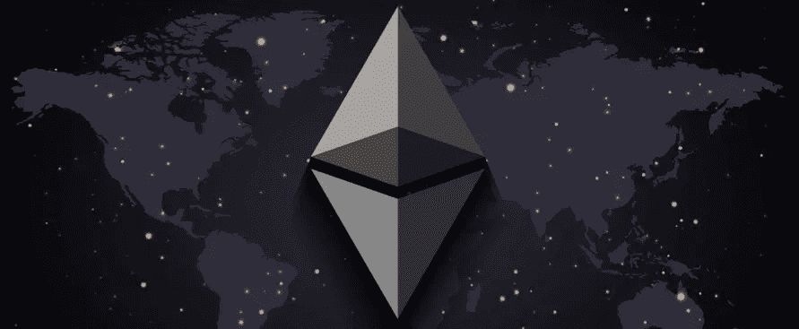
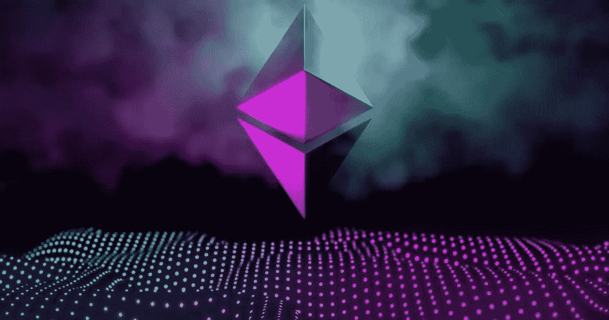

# 以太坊的合并即将到来

> 原文：<https://medium.com/coinmonks/the-merge-is-coming-for-ethereum-298d1edf251f?source=collection_archive---------26----------------------->

我们应该在短时间内合并 beacon 连锁店和 Ethereum 连锁店，最终使新的 PoS 系统投入使用。如前所述，这将为以太网带来划时代的变化。

今天，区块链是基于 PoW 系统，需要能量才能生效，矿工必须有计算单元才能成为以太坊矿工。随着合并，将不再需要有一个 GPU / ASIC 成为一个验证器，但你将需要有至少 32 个 ETH。

就安全性而言，新协议将增加一些有趣的消息。如果攻击者试图篡改网络，他的赌注资金将被削减。

如果你问自己“我没有 32 ETH，我还能成为一个验证者吗？”—答案是肯定的。通过堆叠允许它的池，你可以将你的 ETH 与其他人的 ETH 结合起来，形成正确的总和，成为验证器。

至于更大的可扩展性和降低费用，我们将不得不等待碎片链的更新。目前定于 2023 年。

这种合并是为了减少以太坊网络运行所需的能量，这种更新是 Buterin 在 2013 年提出的路线图计划的一部分。致力于费用和可扩展性的更新将很快到来。

> 加入 Coinmonks [Telegram group](https://t.me/joinchat/Trz8jaxd6xEsBI4p) 并了解加密交易和投资