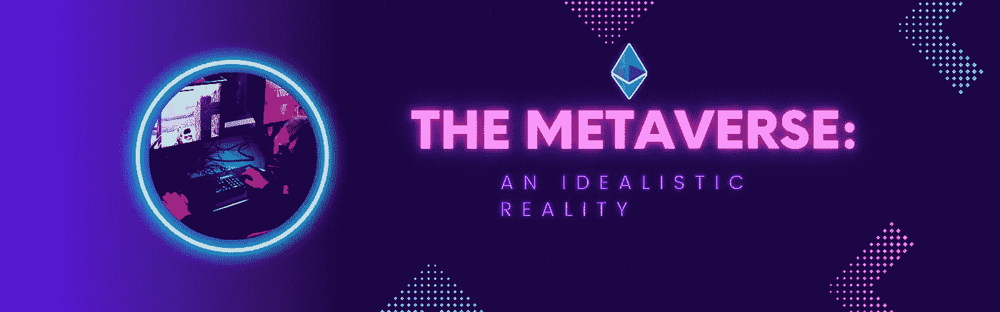

# 元宇宙:

> 原文：<https://medium.com/coinmonks/the-metaverse-5dec395e8656?source=collection_archive---------11----------------------->

## 理想主义的现实

## 为什么是元宇宙？

嗯，现实让*有很多*不尽如人意。

有时候，现实就是很糟糕。

唉，你看世界的任何一个角落，那里都是腐朽、腐败和**死亡**。*一切事物的必然熵。*

不幸的人生来就陷入混乱，被扔进紧张的生活中，被扔进战区，被扔进贫困中——被推到远远超出他们能力的责任中。生活迅速摧毁了他们。

而有些人出生于特权阶层，含着银汤匙。这些人出生在由历史胜利者建立的社会中。对于少数幸运者来说，简单地说，现存就是胜利——有足够的可持续性和财富来创造稳定。

但是即使对他们来说，生活也不会一直很好。最终，混沌找到了 ***每个人*和*众生:***

富有的人会生病，健康的人会遇到财务问题，快乐积极的人会遭遇悲惨的事故——圣人会因罕见的疾病而溃烂，好人会抑郁并有自杀倾向。

生活是不公平的，而且常常是悲惨的。

## 创新ˌ革新

深刻地了解这一点，也许在我们的 DNA 中，人类有意识地与熵的力量作斗争。通过思想和技术——我们最强大的武器——我们不断努力让现实变得不那么糟糕。哪怕只是少一点点。

在我们发明的帮助下，我们努力为自己和未来的自己创造一个理想的现实。因此，我们的遗产是通过解决关系到人类的问题而建立起来的。

从宏观的角度来看，你可以说整个经济只是一个网络，人们互相帮助处理严酷的，看似残酷的，不可避免的现实规则。

几个世纪以来，我们已经想出了更新更好的工具来做这件事，建立了一层又一层的创新来对抗现实的熵恐怖。

## 我们已经走了很远。

想象一下将 *3M Scotchguard* 应用到一辆全新的*宝马上所需要的创新——应用一层*保护*对抗熵，自然的力量从它的透明外衣上剥落。*

当然，为了达到历史上的这一点，我们必须营养充足，因为——工业***农业和畜牧业* **。为了正确地相互合作，并在我们的环境中感到安全，我们创造了科学和工程学校来保护我们。****

**这些仅仅是难以想象的大量创新技术的基础*基础*，最终达到我们在汽车上应用*保护膜*的程度。**

**道路用的**水泥**的创新，刹车灯和汽车仪表用的**电子设备**，以及汽车本身的所有部件…**

***层层叠叠。层层叠叠。***

**最初的反抗残酷自然的斗争——寻求食物、住所和安全——变成了人类处理所有熵环境的困扰。**

## **文 M *etaverse？***

**元宇宙也许是人类对抗熵的最新最伟大的创新。另一个*伟大的想法*，建立在许多其他伟大的想法之上，帮助我们创造一种稍微可以忍受的生活。**

**元宇宙是如何做到这一点的？**

**这个新工具在我们不断与现实的困难——所有的困难——作斗争的过程中处于什么位置呢？**

## **它始于加密货币技术。**

**有了*比特币—* 加密协议，建立在高速互联网上的区块链、P2P(点对点)网络…**

**正是通过不可变代码和 P2P 共识，我们*轻松*确定所有对**拥有值**的权利主张的合法性。**

**在此之前，我们依赖于摇摇欲坠的机构——易受任人唯亲和明显腐败影响的机构。我们依赖这些旧系统和它们的价值流失。**

**现在有了区块链技术，允许元宇宙的参与者确定资产的合法性，因为它的来源将被永久记录。**不可变**。**

**要在元宇宙验证真实性，不需要咨询官僚机构，也不需要中央权威机构来规定参与规则——只有对等的共识。**

**最后，最终用户会看到一个连接到互联网的图形用户界面，类似于我们在 web2.0(互联网，元宇宙时代之前)中使用的界面。**

**对许多人来说，这比他们在现实生活中所经历的要理想化得多。在腐败的经济中，任人唯亲盛行，经济增长的机会很少——积累的资本被通货膨胀稀释，就在他们眼前被偷走。**

**不管是因为效率低下还是纯粹的恶意，这种经济基础设施的守旧派将世界人口的很大一部分排除在外。**

**而元宇宙，不管你怎么称呼这种技术——web 3.0、加密货币、区块链技术——覆盖了一个*替代宇宙*，在我们现有的宇宙之上有着自己严格的法律和原则。**

**没有中间人，这些新的高效网络可以帮助我们准确而持续地*传达价值*——以所有权、货币、契约和权利的形式——通过让世界各地数百万人参与公平而多样的经济网络，永远改变他们的生活。**

## **通过计算机代码实现公平**

**像所有的工程壮举一样，我们的计算机是*可预测的*——只有人为的错误和人为的判断才能破坏它的运行。打个比方，你更可能因为人为疏忽而发生车祸，而不是，比如说，刹车或其他车辆部件出故障。**

**数字技术消除了我们沟通的低效，让我们能够*瞬间*互动。但是历史上，中央实体**拥有**这项技术的基础设施。**

**因此，网络 2.0, *元宇宙之前的公司，如脸书和推特，向我们提供了这项服务，以换取我们的关注和行为统计，让他们管理我们的**虚拟身份。*****

**现在，我们已经看到，这对于公司来说是太大的力量了，这些公司本质上只是像你和我这样的小个人团体，为人类提供计算机代码，这样我们就可以*高效地相互交流*。腐蚀基础设施的腐败现在已经浮出水面，让许多人看到了。**

**因为互联网是社会的基础设施，就像道路和管道一样，运行在互联网上的应用也是如此。它应该完全**透明和平等**——所有人都可以访问。**

**一旦这个基础建立起来，我们就可以充分利用数字技术。*当我们能够平等地* *交流价值观时，就像我们能够交流任意信息一样容易*我们就能够真正地**自由**。从世界的每一个角落，我们都将能够恰当地颂扬那些为人类提供价值的人。**

## **结论:价值的持久性**

**效率储蓄使元宇宙不可避免。**

**归根结底，金钱万能。更大更丰富的实体出现在顶端，这些实体将通过使用高效的价值沟通系统来发展。**

**经济摩擦将被消除，价值将在元宇宙持续存在。虽然一些机构会加入竞争，但有些机构将被完全取代，过时，在市场上竞争过度，完全被*取代。***

***想想*柯达、*和*大片*。但对于政府和银行来说。***

**同样，在个人层面上，将会有选择服用红色药丸或蓝色药丸，引用被过度使用的陈词滥调*矩阵*神话。这是一个选择，要么成为社会经济革命的尖端，要么只是被动地跟随其*不可避免的*方向。**

> **加入 Coinmonks [电报频道](https://t.me/coincodecap)和 [Youtube 频道](https://www.youtube.com/c/coinmonks/videos)了解加密交易和投资**

## **也阅读**

** [## 杠杆代币[多头代币]终极指南

### 杠杆化令牌是具有杠杆化风险敞口的 ERC20 令牌，不考虑保证金、要求、管理…

medium.com](/coinmonks/leveraged-token-3f5257808b22)  [## 最佳加密交易所| 2022 年十大加密货币交易所| CoinCodeCap

### 哪一个是最好的加密交换？在本文中，我们将根据多种加密货币列出 10 大加密货币交易所

coincodecap.com](https://coincodecap.com/crypto-exchange)  [## 2022 年最佳加密交换平台| CoinCodeCap

### 随着时间的推移，我们大多数人将转向 dex 以获得更好的安全性和隐私。因此。在这里，我们将讨论…

coincodecap.com](https://coincodecap.com/best-swap-platforms)  [## 10 大最佳在线赌场|赢得并赢取免费 BTC 2022 | CoinCodeCap

### 接收、支付和赚取加密货币| |有各种各样的最佳在线赌场可供选择，有可能…

coincodecap.com](https://coincodecap.com/best-online-casinos)  [## 2021 年最佳加密借贷平台| 6 大比特币借贷平台

### 获得比特币和其他加密货币的最佳贷款利率

medium.com](/coinmonks/top-5-crypto-lending-platforms-in-2020-that-you-need-to-know-a1b675cec3fa)**