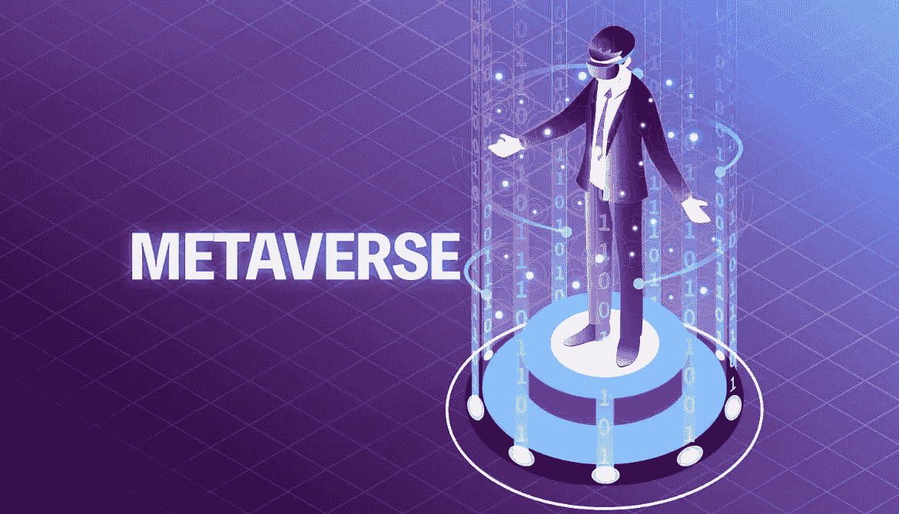

# 元宇宙将从根本上改变内容创作的方式。

> 原文：<https://medium.com/coinmonks/the-metaverse-will-fundamentally-alter-the-way-content-is-created-b55495252a6a?source=collection_archive---------20----------------------->

Source photo [metaverse — Căutare Google](https://www.google.ro/search?q=metaverse&sxsrf=APq-WBsalof2eyrkYAYDWda8MusB9dbiAg:1647764492777&source=lnms&tbm=isch&sa=X&ved=2ahUKEwjUqo-KodT2AhW6S_EDHTCbDkgQ_AUoAXoECAIQAw&biw=1366&bih=649&dpr=1#imgrc=aMJ4MgSLyPzdhM)

互联网的核心是内容，它以当前 Web2 互联网迭代支持的多种格式出现——文本、音频、视频或三者的组合。另一方面，内容很少是免费资源。内容制作者已经发展成为意见领袖、影响者以及包括广告在内的一系列关键商业服务的中坚力量…