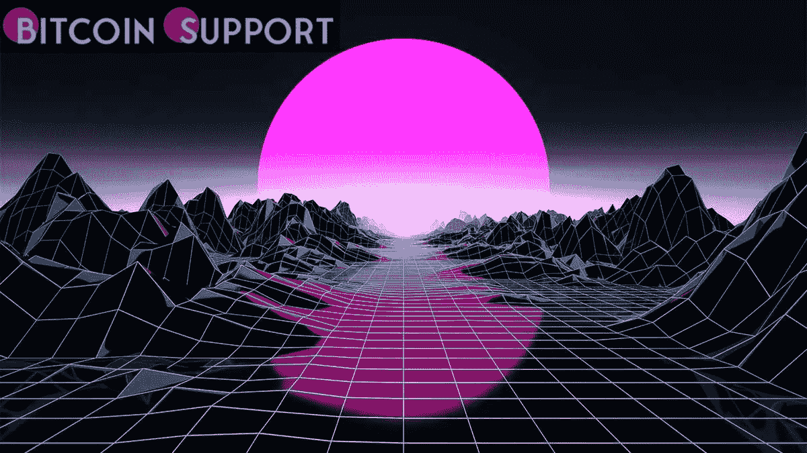
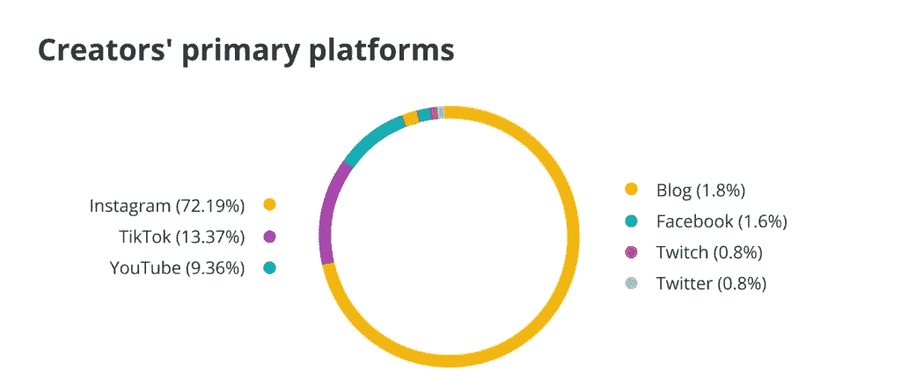
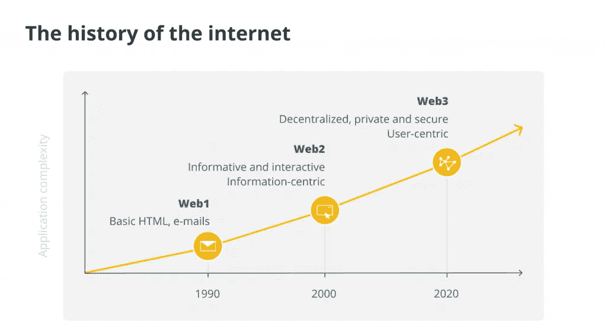

# 元宇宙将从根本上改变内容创作的方式

> 原文：<https://medium.com/coinmonks/the-metaverse-will-fundamentally-alter-the-way-content-is-created-c185d01f6b86?source=collection_archive---------25----------------------->

**Visit our website:-** [**https://bitcoinsupports.com/**](https://bitcoinsupports.com/)

元宇宙是一个新的商业前沿，艺术家们将首先从向追随者展示商品和服务中获益。

互联网的本质是内容，它以当前 Web2 互联网迭代支持的多种形式出现——文本、音频、视频或三者的组合。另一方面，内容很少是免费资源。内容创作者已经发展成为意见领袖、影响者和一系列关键商业服务的骨干，包括广告、营销和公共关系管理。

数百万博客作者和独立表演者表达的对物质的渴望和对独立的渴望，创造了一个巨大的互联网市场，这个市场交换人才，并经常创造让任何顶级音乐家都垂涎三尺的销售水平。这种经济被戏称为创造者经济(creator economy):一种金融结构，通过向观众提供他们愿意付费的内容，使自主的个人能够从创造性的自我表达中赚钱。

**一股正在崛起的力量**

创造者经济是一股巨大的力量:一种独一无二的在线现象，到 2021 年底将超过 1040 亿美元的市场规模门槛。鉴于抖音等流行平台上对新鲜素材的需求呈指数级增长，这些平台赋予了独立艺术家和表演者权力，专家们对不久的将来创意经济的潜在市场规模持谨慎态度。

**Visit our website:-** [**https://bitcoinsupports.com/**](https://bitcoinsupports.com/)

缺乏具体预测是因为创造者经济是一个相对较新的现象，始于新冠肺炎疫情。封锁引发了那些被关在室内的人技能的迸发，最终导致创造力的迸发，那些与他们关在一起的人准备消费急需的娱乐。鉴于微型企业家与影响者营销有着千丝万缕的联系，这是一个价值约 138 亿美元的行业，很容易看到这一现象未来的扩展可能产生的机会。更重要的是，分析师预测，向新技术媒介的转移将使内容创作者能够为市场和行业提供更多新的产品和服务促销机会。

**人才去中心化**

超过 5000 万的创作者正在推动他们自己的人才经济，产生超过 8 亿美元的风险投资。这些数字只是它们未来可能成为的一小部分，因为更多的地点正在快速变得可以访问。

区块链科技的出现给金融体系带来了翻天覆地的变化，赋予个人而非机构权力，并重新分配数据和资产的所有权。区块链运营的不变性、完全透明和不可信任的特点已经渗透到了许多行业，使商业导向的天平从集中的企业依赖向分散化倾斜。在智能合约的帮助下，管理参与者与交易关系的基本概念的这种范式转变在创造者经济中没有被忽视。

随着去中心化的金融和 GameFi 部门重塑各自的行业，并从传统的银行和游戏领域吸引大量用户，有影响力的人和内容创作者决定改变各自运营环境的范式只是时间问题。区块链技术的引入，已经不可逆转地彻底改变了内容创作的概念，它让用户能够激励内容创作者，同时也让创作者能够将自己的作品商业化，而不必与集中化、往往不公平的托管平台分享利润。

**走进元宇宙**

meta verses——由 Web3 上的区块链和虚拟现实驱动的完全数字化的环境——将迎来一个内容创作的新时代。在此之前，人才从未接触过如此复杂的工具集，来增强处于物理和数字世界尖端的最大胆的想法。

**Visit our website:-** [**https://bitcoinsupports.com/**](https://bitcoinsupports.com/)

元诗句使设计师能够以壮观的图形细节表现任何东西，从星云背景下浩瀚太空中的歌剧音乐会到荒凉岛屿上的博客流。任何想象得到的东西都可以为了所有利益攸关方的共同利益而在元宇宙实施。通过利用元宇宙整合虚拟现实的无限可能性，内容制作者将能够释放他们的创造力，让其尽情发挥。这种迄今闻所未闻的物质质量保证只能被视为渴望观看内容类型更多样化——更重要的是，渴望新体验——的热切观众的金银花。

元宇宙的区块链基金会为内容创作者提供了额外的福利，因为由于内部硬币的适应性，它使他们能够通过各种技术将他们的作品货币化。用户可以将他们的数字资产押在特定的作者身上，以鼓励他们创作更多特定类型的内容。其他人可能会付费获取优质内容，而其他人可以向他们最喜欢的创作者捐款。有多种收入来源，内容创作者可以始终确定他们的工作将得到补偿，没有托管平台会剥夺他们的收入。

**Visit our website:-** [**https://bitcoinsupports.com/**](https://bitcoinsupports.com/)

更有利可图的是与元宇宙无处不在的内容生产者经济相关的商业机会。有了可以以无限多种方式定制并无缝整合到精选艺术家的渠道中的材料，营销、广告和推广总体上呈现出新的生机。元宇宙为公司部署和受众接触开辟了一个全新的领域，创作者可以作为企业向其追随者展示产品和服务的跳板——以收取费用。

回顾过去，元宇宙是我们所知的互联网的下一次进化:一个完全以用户为中心的生态系统，致力于将创造力提升到新的高度。然而，观众不会是内容创作者的唯一收入来源，因为企业热衷于利用这一有利可图的领域，并利用虚拟现实内容中本地、有机和适应性极强的广告插页所带来的机会。
**访问我们的网站:-**[**https://bitcoinsupports.com/**](https://bitcoinsupports.com/)

**免责声明:以上为作者观点，不应视为投资建议。读者应该自己做研究。**

> 加入 Coinmonks [电报频道](https://t.me/coincodecap)和 [Youtube 频道](https://www.youtube.com/c/coinmonks/videos)了解加密交易和投资

# 另外，阅读

*   [比特币基地 vs 瓦济克斯](https://coincodecap.com/coinbase-vs-wazirx) | [比特鲁点评](https://coincodecap.com/bitrue-review) | [波洛涅克斯 vs 比特鲁](https://coincodecap.com/poloniex-vs-bittrex)
*   [德国最佳加密交易所](https://coincodecap.com/crypto-exchanges-in-germany) | [Arbitrum:第二层解决方案](https://coincodecap.com/arbitrum)
*   [币安交易机器人](/coinmonks/binance-trading-bots-d0d57bb62c4c) | [OKEx 评论](/coinmonks/okex-review-6b369304110f) | [Atani 评论](https://coincodecap.com/atani-review)
*   [最佳加密交易信号电报](/coinmonks/best-crypto-signals-telegram-5785cdbc4b2b) | [MoonXBT 评论](/coinmonks/moonxbt-review-6e4ab26d037)
*   [如何在 Bitbns 上购买柴犬(SHIB)币？](https://coincodecap.com/buy-shiba-bitbns) | [买弗洛基](https://coincodecap.com/buy-floki-inu-token)
*   [CoinFLEX 评论](https://coincodecap.com/coinflex-review) | [AEX 交易所评论](https://coincodecap.com/aex-exchange-review) | [UPbit 评论](https://coincodecap.com/upbit-review)