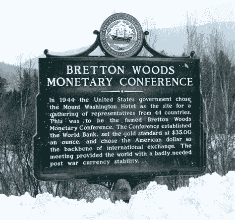
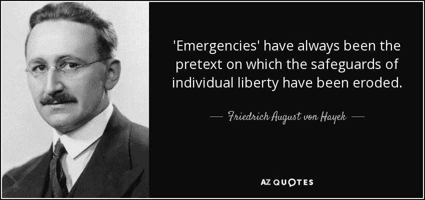
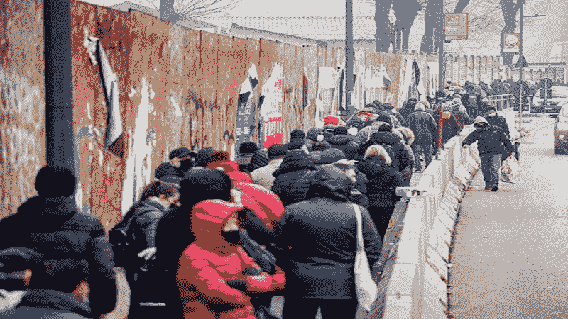
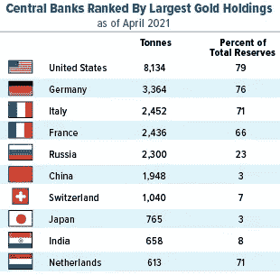
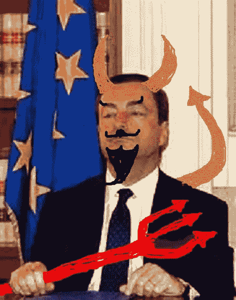
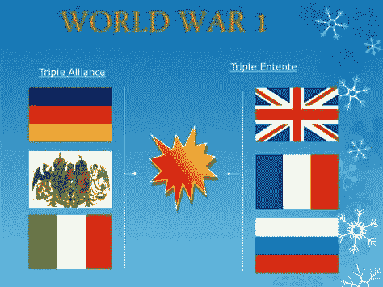

# 货币重置，中央银行和意大利大抢劫。黄金 18k 美元，比特币 65 万美元

> 原文：<https://medium.com/coinmonks/the-monetary-reset-cbdcs-and-the-great-italian-robbery-gold-18k-bitcoin-650k-285e5d49e9f4?source=collection_archive---------5----------------------->

这是一系列文章的第二部分，旨在解释一个纯粹基于法定货币的货币体系如何扭曲激励机制，并在长期损害我们所有人，以及比特币如何修复这一点。新的布雷顿森林货币重置会是什么样子。价值 15 亿英镑和 2.450 吨黄金的意大利大劫案，以及精英们如何计划引入€·乌罗·CBDC 以牺牲你们的自由来挽救他们的特权。敬请关注所有文章。

# 介绍

[在第一部分“法定货币体系的太多谬误”](https://andreabianconi.medium.com/the-too-many-fallacies-of-the-fiat-currency-system-7f883b25f28c)中，我强调了 1971 年后以美元为中心的法定货币体系的许多谬误，这些谬误导致了巨大的财富不平等——通过*坎蒂隆*效应和通货膨胀——任人唯亲、系统性腐败、纯粹资本主义体系的死亡，它促成了消费主义、环境灾难和无休止的战争和颜色革命。实质上，假法定货币体系是“万恶之母”，因为它扭曲了所有的激励机制。每个主流经济学家或政治家都会迅速回避这个基本问题，原因很简单，因为这是他们权力和特权的基础。在这个系统保持活力之前，他们的特权是安全的。当然，人们不能指望他们为 99.9%的人口提供解决方案，他们是这一体系的受害者。在第二部分中，我们将探讨新布雷顿森林体系的结果，以及黄金和比特币在“货币重置”中可能扮演的角色。以及为什么解决方案必须来自 99.9%的人。

# 新布雷顿森林体系？别太快，他们还需要另一次电击

《货币之死》和《毁灭之路》的作者詹姆斯·里卡德斯(James Rickards)一直主张货币体系重置是不可避免的。“[休克疗法](https://dailyreckoning.com/shock-doctrine-order-trumps-personal-freedom/)是它的重要组成部分:

> “休克主义是理解权力精英如何在幕后推进其议程的一个基本概念。
> 
> *这也是为什么今天的世界会很快变成* [*我写的*](https://dailyreckoning.com/a-glimpse-into-the-year-2024/?r=milo) *的反乌托邦 2024 场景。这不是阴谋贩卖或科幻小说；这是事实。休克学说很简单。政治领导人利用危机来推行在正常时期没有人会接受的政策。*
> 
> 当冲击发生时……人们开始将秩序置于自由之上。
> 
> 权力精英的议程需要几十年甚至几个世纪才能实现。这些议程包括世界货币、全球税收、实物黄金控制、人口控制和其他旨在以牺牲你的利益为代价增加少数人权力和财富的计划。
> 
> *他们知道他们的议程非常不受欢迎。他们也明白，民主赋予了普通公民权力，让他们不得人心的计划难以实施。这就是休克学说有用的地方。”*

听起来很熟悉？

议程包括以下目标:

-占领银行系统(2009 年至 2010 年)

-向中国重新分配黄金储备(2009 年至 2016 年)

-重新命名、印刷和分发[特别提款权](https://www.imf.org/en/About/Factsheets/Sheets/2016/08/01/14/51/Special-Drawing-Right-SDR)(2015–2018–2021)

-通过通货膨胀摧毁累积的债务(2018 年至 2025 年)

> 那些准备牺牲自由来换取安全的人最终会失去自由和安全

# CBDCs，自由棺材上的最后一颗钉子

为了推进这一议程，需要运用休克理论。2008 年金融危机、英国退出欧盟以及最终的 Covid 疫情等事件提供了实现这一目标的绝佳机会。根据一句老话“永远不要浪费一个好的危机”,全球寄生虫阶级做得很出色，不为大众所知。

但是，为了为新布雷顿森林会议做好充分准备，他们仍然需要做一些工作，做一些收尾工作。没有这一点，整个议程就有分崩离析的危险。

需要的最后但重要的修正是:

**1。实施 CBDCs。我已经在第一部分[中描述了为什么 CBDCs 将很快到来，特别是数字€uro。从本质上讲，这完全是自动执行资本管制，从而防止退出特定货币或将该货币兑换为实物资产，以防范货币贬值和通货膨胀(如黄金和比特币)。实质上，这将防止货币恶性通货膨胀的风险。一旦实施了 CBDCs，实施资本管制或禁止某些资产就变得多余了，就像中国、土耳其和俄罗斯今天仍在试图对比特币做的那样(顺便说一句，收效甚微。).](https://andreabianconi.medium.com/the-too-many-fallacies-of-the-fiat-currency-system-7f883b25f28c)**

> [*出自第一部分*](https://andreabianconi.medium.com/the-too-many-fallacies-of-the-fiat-currency-system-7f883b25f28c) *”由于“你的”钱包并不是真正属于你的，它可能会被发卡方轻易地任意冻结。同样，由于现金也将被禁止，负利率可以很容易地应用到您的正钱包余额。因此，你将被多次征税。首先是负利率，然后是货币通胀。由于你将没有办法摆脱这个系统，而且通过将资本控制编程到数字协议中，大门将自动关闭，你将无法将你的资金配置到黑名单上的资产，如黄金或比特币。他们将决定你能买什么或不能买什么，以及你将如何消费。”*

**2。加强对人口的监视和控制，以防止和减少金钱骚乱的可能性。Covid 通行证是这一战略的一部分，它将与数字身份证以及您的所有个人数据和 CBDC 钱包融为一体。因为它将采用共产主义中国风格的个人社会信用评分系统。**

**3。减缓或完全停止比特币的应用。同样，比特币是扔在货币体系车轮上的扳手，因此任何宣传或工具都将被用于惩罚、定罪或使其不被社会接受。**

然而，为了实现上面的第一点，他们需要确保人们乐意接受 CBDCs 的引入，就像他们乐意接受禁止现金、上锁、疫苗和 Covid Pass 监控工具一样，因为他们害怕，因为这是为了人民的“更大利益”。由于大量虚假的免费法定货币投向腐败的男男性接触者(见第一部分)，恐惧可以被巧妙地灌输，人口被操纵到恐惧的人只是断开大脑和非理性行为的程度。Covid 疫情的另一个目标是——通过限制活动和商业封锁——导致人口普遍贫困，主要针对中小型企业阶层。一旦贫困增加到开始产生社会冲突的水平，那么政府将通过把免费的钱装进他们的 CBDC 新钱包，用大规模的财政刺激注入来“拯救”有需要的人口。然后，即使那些今天原则上反对 CBD 的人，也会很乐意接受他们，因为一旦被迫陷入贫困，政府的假币将决定他们是吃还是饿。

Bread lines in Milan today

上面的照片不是在民主德国或 80 年代的共产主义俄罗斯拍摄的，而是在今天的新共产主义意大利，在那里，新的穷人排队数公里领取免费食物。

由于地方傀儡政府的完全控制，世界上没有任何一个国家的寄生全球主义精英能够像意大利那样以更大的犯罪决心和效率来执行议程。意大利的实验将被载入史册，因为它成功地在教科书中应用和实施了休克学说、行为控制技术、大规模形成精神病和戈培尔纳粹宣传手册，以对付其被遗忘和受到恐吓的民众。

> *对国家的崇拜就是对武力的崇拜。对于文明来说，没有比无能、腐败或卑鄙的政府更危险的威胁了。人类不得不忍受的最严重的罪恶是由政府造成的。~路德维希·冯·米塞斯*

# 意大利最大的抢劫奖:€ 1.5 万亿储蓄，2.450 吨黄金和数字€·乌罗·CBDC

在我写这篇文章的时候,“震惊学说”事件——它将揭开谜底的最后一个重要部分——仍在如火如荼地进行着。出于许多令人信服的原因，意大利被挑选为试验场。

**首先**，就累计储蓄而言，意大利是所有欧盟国家中最富有的国家之一。超过 15.00 亿欧元以零利率或负利率存在意大利银行。从这个角度来看，这种非生产性流动性加上€20.00 亿美元的年 GDP 远远超过了公共债务(€28.00 亿美元)。因此，总是被描绘成濒临破产的意大利相当有偿付能力。如此有偿付能力，以至于意大利人明天就可以离开€欧元，用这笔钱为他们的公共债务自我融资，而不会被欧洲央行和他们的全球寄生虫朋友敲诈，这样会好得多。这显然是意大利人永远不应该理解的，它代表着众所周知的欧盟官僚的达摩克利斯之剑。因此，必须不惜一切代价没收这些财富。

第二，意大利银行(由 globo-寄生虫私人拥有)拥有世界第三大黄金储备，超过 2.450 吨，以今天的黄金价格计算，价值约为。1550 亿美元。这也必须不惜一切代价予以没收。

第三，意大利就像一个炫耀昂贵珠宝的人漫步在城镇的阴暗处，一个容易被抢劫的无保护的猎物。这是计划成功的关键。对他们有利的是，他们可以依靠[统计证明的对人口的无知](https://www.cnbc.com/2014/10/29/most-ignorant-countries-revealed-in-new-poll.html)，以及普遍强烈的自私态度。不幸的是，意大利人也缺乏爱国主义和对公共利益的感情。自罗马帝国衰落以来，外国统治的历史和内部自相残杀的斗争造就了这种性格。此外，所有政府行政机器及其机构(如司法机构)都是由一群高度意识形态化的后共产主义者和平庸的官僚操纵的。最后，意大利政客历来不忠、腐败，并习惯于为外国*主人的利益服务。自古以来，他们总是背叛自己的人民。未经选举的孔戴和德拉吉傀儡政府非常有资格为全球寄生虫议程服务。他们做了令人震惊的工作，将会得到丰厚的回报。*

Draghi: The Davos Economic Hitman

马里奥·德拉吉(Mario Draghi)对此至关重要，他被欧盟和达沃斯精心挑选，在关键时刻继续孔戴的工作，以推动该计划进入最后阶段。他确实是最适合这项任务的人。自上世纪 90 年代以来，他一直是一个受人尊敬的公务员——从字面上来说——他为国内外的主人提供了惊人的服务，完成了最大规模的私有化和国家皇冠上的珠宝的出售。借用约翰·珀金斯的话来说，他是一个真正的“经济杀手”。

以至于弗朗切斯科·科西加——一位以爱国和反共立场闻名的意大利前总统——将他定义为一个“卑鄙的讨价还价者”，一个没有道德和忠诚的傀儡，如果不是对他的金钱主子的话。

> 你必须记住，有些法律上正确的事情在道德上并不正确~亚伯拉罕·林肯

今天，德拉吉被派回来，带着复仇和三重目的完成这项工作:

**1。把剩下的几件值钱的东西卖给他的亲信，换成花生。**

**2。**通过锁定降低国内生产总值，人为提高债务与国内生产总值的比率，以便(a)通过利息偿还和增加税收，没收意大利银行中 15.00 亿€卢比的储蓄，(b)通过抵押意大利黄金储备等实物资产，担保欧洲央行(PNRR)的额外虚假法定信贷。

这不是什么新鲜事，这是过去 60 年来国际货币基金组织和世界银行在发展中国家以及欧盟和三驾马车在希腊实施的经过充分验证的剧本:腐败的当地政客接受信贷，用有价值的实际资产/资源交换毫无价值的假钞。

**3。任意的 Covid 封锁和限制的额外好处是摧毁中产阶级，从而让大部分贫困人口愿意接受补贴和补助(总是由欧洲央行资助)。一旦很大一部分人变得依赖政府补贴和拨款，那么他们将很容易提交和接受数字货币 CBDC 及其所有缺点。当这一目标实现时，他们将永远告别自由。**

当我写这篇文章的时候，意大利的实验进行得非常顺利，很少受到民众的反对。

“全球寄生虫”现在希望在其他国家玩同样的把戏(见上图 3 ),这对过渡到数字€至关重要。

事实上，奥地利、德国和荷兰也在同样的道路上走得不远(这里有一个非常令人不安的三国联盟相似之处，它不会带来美好的回忆)。

但感谢上帝，法国和西班牙正在进行比预期更强烈的抵抗，葡萄牙也处于更好的位置，可能是因为那里没有太多的财富可以窃取，而且他们也与保持欧盟的团结无关。瑞典人也退出了€，并已经采用了数字克朗，因此他们免受 Covid 恐怖宣传和锁定。至于英国人——幸运的是，他们及时退出了欧盟/达沃斯机制的危险——他们似乎正在回归正常生活，而以捷克共和国、匈牙利和保加利亚为首的东欧人也在进行激烈的斗争，这应该给我们带来一些希望。

# 货币重置:特别提款权作为世界货币，还是老样子

当一个新的布雷顿森林体系出现时，全球寄生的精英们很可能试图通过出售同样的旧东西来掩饰向新货币体系的过渡:例如使用[特别提款权](https://www.imf.org/en/About/Factsheets/Sheets/2016/08/01/14/51/Special-Drawing-Right-SDR)作为全球中央银行债务的锚。这一次的目标将是一种[“全球法定货币”](https://www.zerohedge.com/geopolitical/towards-single-world-currency)。

然而，这只是一个变种的老庞氏骗局，我们今天有。这一次将由国际货币基金组织以数字方式印刷特别提款权，并将其贷记给受益国。

> *[*2021 年 3 月 19 日 G7 工业国集团决定帮助受疫情打击的中低收入国家。…新的资本注入确保了“没有一个国家掉队”。国际货币基金组织总裁克里斯塔琳娜·乔治耶娃表示，计划中的特别提款权分配将于下月敲定，将伴随针对“债务脆弱性”和优惠融资的措施*T5 T6 ](https://www.omfif.org/2021/03/sdr-proposals-could-reset-international-monetary-system/)*

*简而言之，这个计划实质上意味着特别提款权将通过发展中国家，这样他们就可以最终购买那些他们一开始并不需要，现在仍未售出的疫苗。这只是另一种方式，把更多的假钱扔进他们大型制药公司的口袋。*

*一旦接收国需要使用特别提款权，它们将与新数字印刷的美元、€乌罗和构成特别提款权一篮子货币的其他货币进行兑换。因此，最终货币篮子会出现更多的通货膨胀，货币篮子国家的人口会出现更多的通货膨胀，财富会从货币篮子国家重新分配到发展中国家——取决于特别提款权最终是如何使用的——以满足它们的需求，或者更有可能的是，分配到大型制药公司的口袋里，以购买它们未售出的疫苗。从那里，他们将购买实物资产，从而为他们的利益提高价格，并由于“ *Cantillon* ”效应而为我们其余的人制造通胀，以同样的旧的不可持续的致命螺旋。*

*我相信你现在已经明白了。*

# *货币重置意味着 18000 美元的黄金和 650000 美元的比特币*

*然而，正如詹姆斯·里卡德斯所指出的，黄金有可能被纳入篮子。在《货币之死》一书中，里卡德务实地考虑了黄金在以特别提款权为基础的世界货币体系中的作用。里卡德预测黄金价格为 9.000 美元 x 盎司，以便用 50%的黄金储备支持货币体系。但那是 2014 年的事了。自那以后，黄金价格上涨了 40%,货币供应量在过去的 2 年里“飞向月球”。所以我会试着再算一遍。首先，我将计算组成 SDR 货币篮子的五个国家(美国、日本、英国、欧盟和英国)的 M2 货币供应量。狭义的 M2 指标包括 M1(流通中的硬币和纸币以及其他容易转换为现金的货币等价物)，加上银行短期定期存款和 24 小时货币市场基金。因此，五个特别提款权国家的 M2 约为 90 万亿美元。然后让我们看看黄金目前的市值。据估计，地下的黄金供应量约为 197.000 吨。其中约 75，000 吨是货币金属，存放在金条中，作为储备资产。按目前市场价格大约。每盎司 1.800 美元我们的货币金属市值为 4.7 万亿美元。如果我们必须以 50%的比例支持当前 90 万亿美元的 M2 特别提款权篮子，这意味着黄金价格应该至少重估 10 倍，以覆盖 M2 价值的 50%(45 万亿美元)。当然，如果不是狭义的 M2，而是广义的货币供应 M3 或 M4，或者加上资产负债表外的负债和衍生品，这个数字就会上升到万亿，那么金价也应该会呈指数级上涨。由于目前地球上只有两种货币资产可以发挥货币储备的作用，并且没有任何人的责任——实物黄金和比特币——另一种可能性是两者都使用，而不是只使用黄金。*

*因此，让我们假设使用比特币来备份 10%的 M2，以及 50%的黄金，如我们所见。该系统的总后备储备资产将达到 60%,只有 40%的部分。比特币在协议层面的固定供应量是 2100 万。然而，许多私钥已经丢失，更好的计算方法是[目前市场上可获得的自由浮动供应量约为 1430 万 BTC 单位](https://coinmetrics.io/introducing-free-float-supply/)。假设比特币用于支持 9 万亿美元的 M2(90T 的 10%)，比特币的价格必须上涨 16 倍，达到 65 万美元，才能达到 9.3 万亿美元的市值。这在理论上。因为与黄金不同，比特币没有潜在的供应量，在市场上可能会以合适的价格增加报价并限制价格。比特币的价格完全没有弹性，可能要比霍德勒在市场上出售比特币的价格高出许多倍。霍德林，加上旺盛的需求，[可以把价格挤到月亮上](https://www.whatbitcoindid.com/podcast/chaos-in-the-bond-market)。还要考虑这一简单的计算假设所有的浮动供应量(1430 万英镑)可以由国际货币基金组织和五个特别提款权篮子中央银行积累起来，以支持 10%的 M2。不太可能。*

*然而，更有可能的是，在货币重置中，政府不会使用比特币，而只会使用黄金，毕竟这是最大的央行拥有的真实资产。届时，比特币将成为所有非主权机构以及黄金储备很少或没有黄金储备的小型发展中国家的首选储备资产。在这种情况下，比特币标准可能会被传统金融部门、商业银行(可以将比特币作为储备资产，为[提供新一轮商业免费银行服务](https://andreabianconi.medium.com/bitcoin-and-the-lost-art-of-commercial-banking-6057442da435))、企业和个人所采用。基本上，世界可能会使用两种相互融合的货币体系:上层是政府和央行，以特别提款权作为世界货币，由黄金储备提供部分支持；下层是小主权国家、银行和个人，使用国家法定货币和比特币作为储备资产，在法定货币和比特币之间无摩擦地流动，用于支出和储蓄。这将是理想的解决方案。*

# *结论*

*然而，除非从根本上强制采用比特币等真正的标志性变革，否则向基于硬通货的更公平货币体系的过渡不太可能发生。这就是为什么从基础采用它是必不可少的。微观战略、亚马逊或华尔街不是这个过程的关键。是的，它们在某种程度上是有益的，但它们也带来了不利的一面，比如太大的集中托管和比特币金融化。相反，像萨尔瓦多这样的发展中国家在 T2 要重要得多。每一个发展中的经济体都能带来数以百万计的公民，他们学会自我保管他们一生的积蓄，并且[逃脱美元化或欧元化的危险。每一个加入比特币行列的新自治市，如迈阿密或里约都会增加基数。“平民”成为未来货币体系的“精英”。他们的储蓄不会被贪婪的政府没收，也不会因为货币膨胀而被盗走。他们将获得自由。](https://andreabianconi.medium.com/which-country-will-first-enter-the-multi-trillion-bitcoin-adoption-race-a1d071d95edb)*

*[www.bianconiandrea.com](http://www.bianconiandrea.com)—2022*

********************************************************************

*如果你喜欢这篇文章，请在左下角“鼓掌”x 次，这样会有更多的人分享。非常感谢*

********************************************************************

***法律免责声明**:本网站及其中包含的信息仅供一般指导，不构成法律意见。因此，它不应被用来替代就具体问题与律师的磋商。本文中的所有信息均按“原样”提供，不保证完整性、准确性、及时性或任何形式的明示或暗示的担保。*

***投资免责声明**:本网站及其中包含的信息无意成为与所提交材料相关的建议或信用分析的来源，本网站中包含的信息和/或文件不构成投资建议。*

*www.bianconiandrea.com—2022 年*

**原载于 2022 年 2 月 7 日*[*【https://andreabianconi.medium.com】*](https://andreabianconi.medium.com/the-monetary-reset-cbdcs-and-the-great-italian-robbery-gold-18k-bitcoin-650k-cf7a7793849e)*。**

> *加入 Coinmonks [电报频道](https://t.me/coincodecap)和 [Youtube 频道](https://www.youtube.com/c/coinmonks/videos)了解加密交易和投资*

## *另外，阅读*

*   *[非洲最佳加密交易所](https://coincodecap.com/crypto-exchange-africa) | [Hoo 交易所评论](https://coincodecap.com/hoo-exchange-review)*
*   *[eToro vs robin hood](https://coincodecap.com/etoro-robinhood)|[MoonXBT vs by bit vs Bityard](https://coincodecap.com/bybit-bityard-moonxbt)*
*   *[Stormgain 回顾](https://coincodecap.com/stormgain-review) | [Bexplus 回顾](https://coincodecap.com/bexplus-review) | [币安 vs Bittrex](https://coincodecap.com/binance-vs-bittrex)*
*   *[Bookmap 评论](https://coincodecap.com/bookmap-review-2021-best-trading-software) | [美国 5 大最佳加密交易所](https://coincodecap.com/crypto-exchange-usa)*
*   *[如何在 FTX 交易所交易期货](https://coincodecap.com/ftx-futures-trading) | [OKEx vs 币安](https://coincodecap.com/okex-vs-binance)*
*   *[如何在势不可挡的域名上购买域名？](https://coincodecap.com/buy-domain-on-unstoppable-domains)*
*   *[印度的加密税](https://coincodecap.com/crypto-tax-india) | [altFINS 审查](https://coincodecap.com/altfins-review) | [Prokey 审查](/coinmonks/prokey-review-26611173c13c)*
*   *[区块链 vs 比特币基地](https://coincodecap.com/blockfi-vs-coinbase) | [比特坎评论](https://coincodecap.com/bitkan-review) | [币安评论](/coinmonks/binance-review-ee10d3bf3b6e)*
*   *[Coldcard 评论](https://coincodecap.com/coldcard-review) | [BOXtradEX 评论](https://coincodecap.com/boxtradex-review)|[uni swap 指南](https://coincodecap.com/uniswap)*
*   *[阿联酋 5 大最佳加密交易所](https://coincodecap.com/best-crypto-exchanges-in-uae) | [SimpleSwap 评论](https://coincodecap.com/simpleswap-review)*
*   *[最佳加密分析或链上数据](https://coincodecap.com/blockchain-analytics) | [Bexplus 评论](https://coincodecap.com/bexplus-review)*
*   *[NFT 十大市场造币集锦](https://coincodecap.com/nft-marketplaces)*
*   *[7 大副本交易平台](https://coincodecap.com/copy-trading-platforms) | [BuyCoins 点评](https://coincodecap.com/buycoins-review)*
*   *[XT.COM 评论](https://coincodecap.com/profittradingapp-for-binance)币安评论 |*