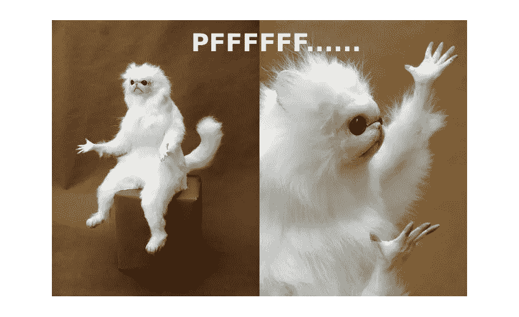

# Luna 投资者的钱被血本无归——加密货币投资者该怎么办？

> 原文：<https://medium.com/coinmonks/the-money-of-luna-investors-has-been-wiped-out-what-should-cryptocurrency-investors-do-7367413d019?source=collection_archive---------63----------------------->

在一个不稳定的开始后， ***卢娜被币安*** 除名，随后陷入类似津巴布韦的恶性通货膨胀。之后，猜测转移到了贝莱德、Citadel 和 Gemini。南非加密货币 YouTuber 的冉·诺伊纳告诉 Layah Heilpern，尽管他们都否认参与了 Luna 攻击。

> Stablecoin 提倡谨慎，现在不是把婴儿和洗澡水一起抛弃的时候。

稳定硬币的一个流行例子是以太坊支持的系绳。这些数字资产不依赖储备，而是使用智能合约来监控供需。价格上涨时，他们发行新的稳定货币。这是对抗困扰加密市场的波动性的一个很好的方法。但是这些硬币的支持者警告说，现在不是把婴儿和洗澡水一起倒掉的时候。

一些对稳定圈的批评者说，应该对它们进行监管，但其他人警告说，现在不是“把婴儿和洗澡水一起倒掉”的时候。例如，**证券交易委员会** (SEC)警告称，不受监管的数字货币给美国金融体系带来风险。然而，支持者认为，现在不是放弃一个完美想法的时候，因为它有助于使加密货币行业更加稳定。此外，SEC 主席加里·詹斯勒(Gary Gensler)表示，密码行业对于诈骗和滥用来说已经“成熟”。他还警告说，他的机构需要更多的资金来监管该行业。

# TerraUSD

Luna 和 Terra 的投资者的钱已经化为乌有，让许多人除了绝望一无所有。一些人转向互联网发泄他们的悲伤，在论坛上发布他们的故事。有些人甚至自残了。不幸的是，对 terra 生态系统的破坏不止于此。比特币等其他加密资产的投资者也抛售了大部分投资组合，拖累了整个加密市场。

第一步是让 UST 与美元脱钩。自从第一次月神 ICO 以来，UST 已经贬值超过 20 亿美元。如果发生这种情况，Terra 协议将无法正确处理这种情况。它将需要出售更多的比特币储备，以让比特币重新挂钩。此外，投资者将争相抛售 UST 股票，以获得其价值的一定比例。

## 泰拉钉住美元的稳定货币

[如果你仍然持有你的加密货币](https://cryptosoftwares.com/how-to-invest-in-cryptocurrency-everything-you-need-to-know/)，那么是时候看看 Terra 与美元挂钩的稳定硬币了。这种算法加密货币应该保持其价值接近 1 美元。在最近的一份声明中，Terraform Labs 表示将暂停生产区块链，这意味着该货币将不再能够处理交易。然而，这并不意味着 Terra 作为稳定货币的潜力已经消失。

不像传统的加密硬币，它与储备相联系，像 Terra 这样的稳定硬币是完全分散的。它们不受中央实体的控制或支持，这意味着它们不会遭遇传统实体所面临的同样问题。然而，传统稳定资本和算法资本之间的主要区别在于，算法稳定资本不依赖于中央实体为其储备资金提供支持。

## Terra 的算法过程是创造然后停止一个 Luna 硬币的供应

Terra 的去中心化性质使其免受审查，但它的去中心化也意味着它很容易被破坏。如果分散的网络被破坏，主流访问被切断的可能性可能会阻止爱丽丝和贝壳的采用。Terra 和韩国之间也有联系。无论截止日期如何，月神币都有进一步扩张的潜力。

一个 Terra 投资者可以通过买入 Terra，然后卖给 Luna，从他们的 UST 价格上涨中获利。只要有足够多的人愿意用他们的 UST 来交换露娜，Terra 的价格就会上涨。然而，如果 UST 增加，露娜的价格会降低。最终，Luna 的价格将跌破 1.10 美元。这种波动趋势的原因是，Terra 的算法铸造的硬币也是其持有者的收入来源。

> 加入 Coinmonks [电报频道](https://t.me/coincodecap)和 [Youtube 频道](https://www.youtube.com/c/coinmonks/videos)了解加密交易和投资

# 另外，阅读

*   [如何匿名购买比特币](https://coincodecap.com/buy-bitcoin-anonymously) | [比特币现金钱包](https://coincodecap.com/bitcoin-cash-wallets)
*   [币安 vs FTX](https://coincodecap.com/binance-vs-ftx) | [最佳(SOL)索拉纳钱包](https://coincodecap.com/solana-wallets)
*   [比诺莫评论](https://coincodecap.com/binomo-review) | [斯多葛派 vs 3Commas vs TradeSanta](https://coincodecap.com/stoic-vs-3commas-vs-tradesanta)
*   【Capital.com】|[港加密借贷平台](https://coincodecap.com/crypto-lending-hong-kong)
*   [如何在 Uniswap 上交换加密？](https://coincodecap.com/swap-crypto-on-uniswap) | [A-Ads 评论](https://coincodecap.com/a-ads-review)
*   [WazirX vs CoinDCX vs bit bns](/coinmonks/wazirx-vs-coindcx-vs-bitbns-149f4f19a2f1)|[block fi vs coin loan vs Nexo](/coinmonks/blockfi-vs-coinloan-vs-nexo-cb624635230d)