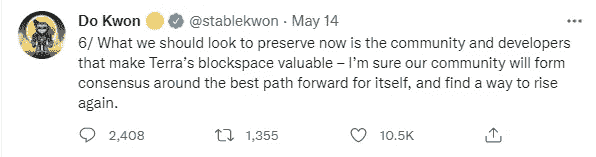
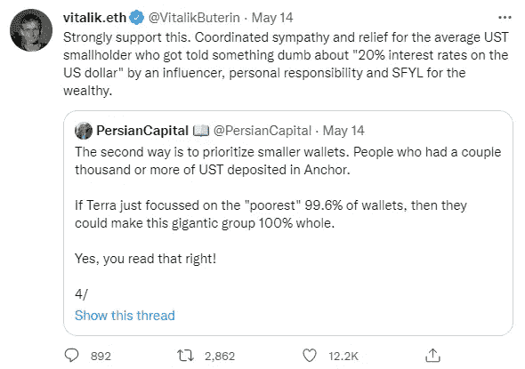
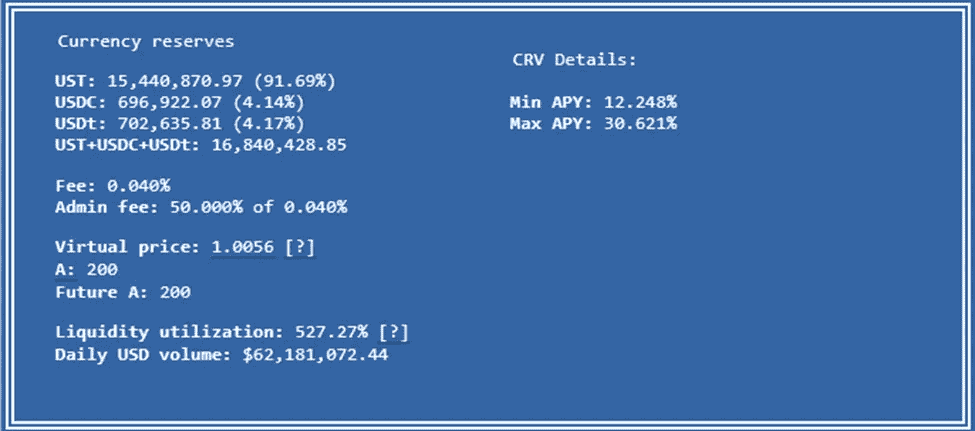
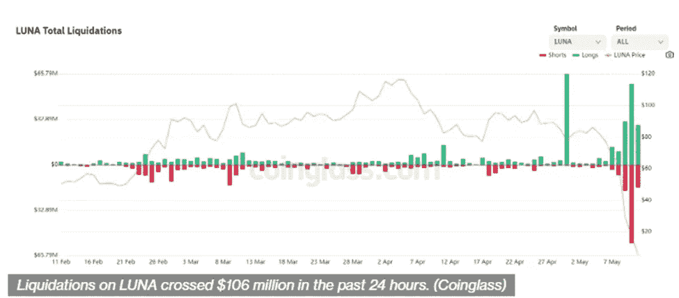
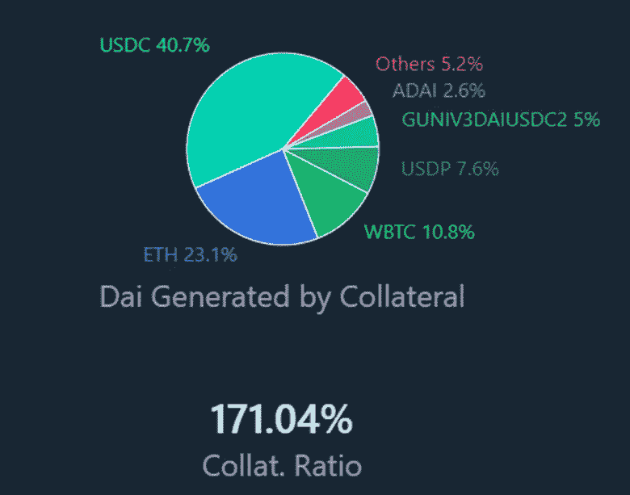
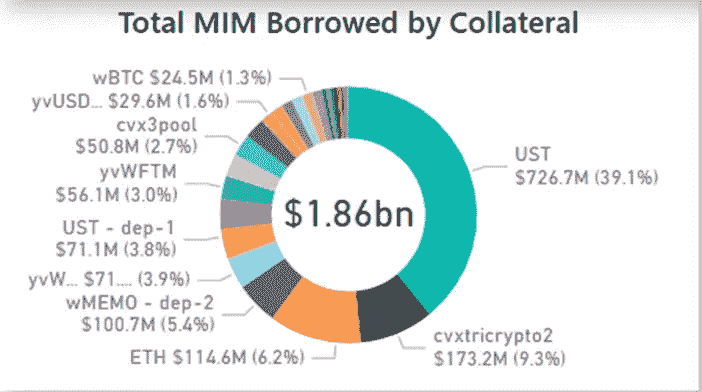
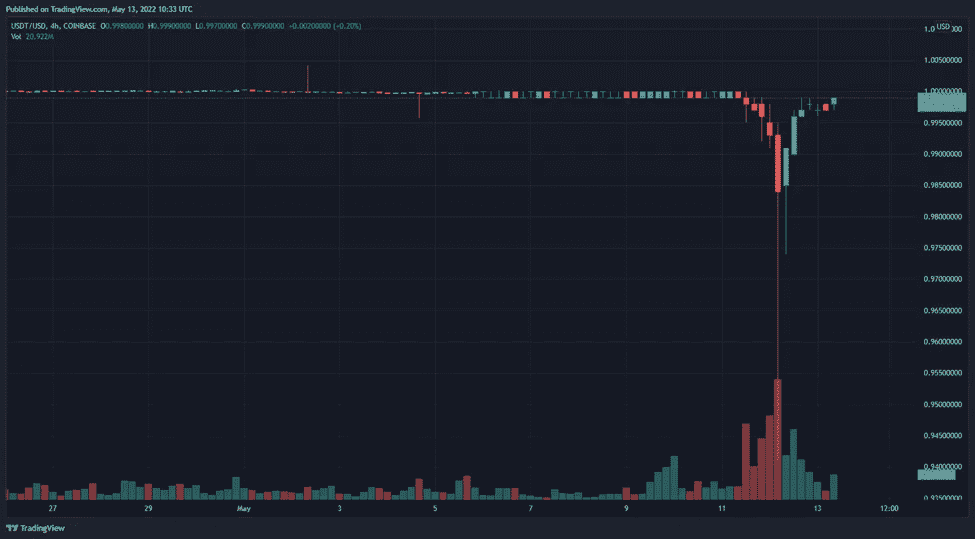

# 月亮落下了——接下来会发生什么？

> 原文：<https://medium.com/coinmonks/the-moon-luna-has-set-what-comes-next-4368a9430dcc?source=collection_archive---------14----------------------->

对于 crypto 来说，这绝对是疯狂的一周。看到第二大的以 DeFi 为中心的区块链在几天内从英雄变成字面上的零真是一个景象。截至今天 5 月 16 日，LUNA 的价格不到 0.0002 美元，Terra 区块链在 7.603.700 的高度停止。尽管 Do Kwon 努力进行重建，并在 Agora 上提议对受 depeg 事件影响的人进行赔偿，但似乎没有任何办法让损失最大的人实际上收回他们的资金。

我真的想不出在 crypto(或其他行业中的许多其他公司)的任何实例中，股东们因为一个实际上变成 0 的项目而得到补偿。即使这种情况真的发生了，它也倾向于把钱还给鲸鱼，正如 Vitalik Buterin 也暗示的那样。

Terra 崩溃的连锁反应影响深远，而且还没有结束。随着比特币上周四跌至 25.298 美元，整个市场都陷入了低谷。UST 还被广泛用于其他协议，并由许多其他资产和稳定的债券作为抵押。随着所有这些资金基本上从市场上消失，许多其他潜在的协议在不远的将来显然有失败的危险。

**地球、熊和系绳——UST 对 crypto 的影响**

UST 不再盯住美元，这在稳定的货币市场和更广泛的加密市场引发了一场蔓延事件。其他算法稳定币和铸币税项目也完全脱钩(例如 Cronos 上的 DARK)或暂时脱离挂钩(FTM 上的 TOMB)。其他稳定货币，如 DEI，也失去了与美元 1:1 的比率。

按市值计算，USDT 是迄今为止最大的稳定货币——810 亿美元。其次是 USDC，约 480 亿美元，然后是 BUSD，170 亿美元。其他稳定货币和市场受到 UST 脱钩影响的原因如下:

1.  **UST 参与了大量的 Defi 协议**，并被用于资金池、货币市场和赌博。这意味着每一个提供稳定货币流动性的池子现在都遭受了巨大的非永久性损失。举例来说，原本应该是 USDT 和 UST 各占一半的资金，现在变成了 90%+ UST 和 10%的 USDT。请参见下图中的示例，这是加密领域最大的流动性池之一。这意味着“好的”稳定资本正在被清算，以弥补 UST 的损失。这反过来给非 UST 稳定债券带来抛售压力，使其价格下跌。人们看到这一点，他们感到恐慌，想卖出更多，从而进一步施加抛售压力。如果各自 stablecoin 背后的基金会/算法没有足够的财政部抵押品来将硬币买回 repeg，他们将面临一场大规模的脱钩事件。

2.**因借出/借入而导致的清算级联**。许多主要的货币市场协议支持主要的稳定货币:USDT/UST/USDC/BUSD/FRAX/TUSD 等。通常，许多钱包借出他们的稳定币，以获得不同稳定币或资产的抵押品。随着 UST 与美元脱钩，这些策略中的许多正在经历所谓的清算级联。借 UST，借 USDT 做抵押，放弃星际之门的 USDT 农场来获得 STG 奖励，卖掉 STG。UST depegs，因此清算 STG 和 USDT 的头寸。清算=资产的卖出压力=价格下跌。

3. **Stablecoins 信托运行**。我们本质上是在处理非常方便使用的令牌化菲亚特。然而，这也意味着他们面临着同样的不利条件，即信任。如果人们对一种货币的价值失去了信任，他们就会试图换一种不同的货币。最近的一个例子是，在对俄罗斯联邦的制裁中，俄罗斯人试图出售他们的碎石换取美元，结果却被[中央银行禁止出售](https://www.themoscowtimes.com/2022/03/09/russia-bans-foreign-currency-sales-a76835)，并人为地试图制造购买压力来支撑它。这种情况现在也发生在加密领域，因为从许多其他铸币税/再基础和算法稳定币项目到感知的安全港有一个强大的迁移。

4.UST 被用作其他稳定货币国债的抵押品。不管是不是算法，每一种稳定的硬币都需要证明它有足够的流动性，才能成为一种流动的可交换资产。例如，在戴的案例中，大约 40%的资金是由支持的，而又是一种(不可否认的)抵押资产。

戴是相当了不起的，因为它是一个由道经营的真正分散的稳定的社区。我们都有偏见，我诚实地承认我的偏见。

这些都很好，但是让我们看看另一个过度抵押的稳定货币 MIM。我想在这里指出一些东西，在史蒂文的 Youtube 频道上看到的(顺便说一下，分析很棒)。 *MIM 通常有一个非常棒的分析标签，可以看到 MIM 的实时链上数据。该分析选项卡现在被禁用，并显示“工作进行中”。但是，如果您在* [*上单击右键*](https://app.powerbi.com/view?r=eyJrIjoiOGFjN2QyMDgtMzRhMy00NDkzLTk2NDctNTBkZTQ0NzQ3ZjJkIiwidCI6IjYyZTU1MTgwLTQzNmQtNDYyZC1hMWIwLTZkMTg2NjRlZDAxNSJ9) *并在新标签页中打开，您将获得自三月份以来的最新更新版本。我们可以看到，大多数 MIM 都有 UST 作为抵押品。不酷阿布拉卡达布拉钱，不酷。*

**这对 USDT 意味着什么**

长期以来，加密领域最大的噩梦之一就是 USDT 的潜在脱钩。大约 70%的资金和所有主要集中交易的基金全部或部分暴露于 Tether。由于 Tether 从未被适当地审计过，我们不知道他们能重复多少次。它经历了低至 0.95 美元的 depeg 事件，目前已经恢复稳定。这并不是 USDT 第一次失去联系汇率制，它总是会恢复联系汇率制。

然而，在 2017 年和 2018 年，USDT 没有 800 亿美元以上的市值。今年 5 月，UST 发生了完全相同的事情，UST 失去了盯住美元的汇率机制，算法发挥了魔力，人们为了 UST 而炒掉了卢娜，但盯住美元的汇率机制又恢复了。然而，当时锚定的存款总额为 2.6 亿美元。在本周早些时候挂钩打破之前，有价值 140 亿美元的 UST 存款。

这带来了两个潜在的结果:

1. **USDT 大到不能倒**，意思是好歹；**咳* *咳*幕后交易*咳* *咳** 将被用来对 USDT 进行再抵押，以使其重新获得 1:1 的联系汇率。在这种情况下，一切都好，市场信心得到恢复。

2. **USDT 经历了一场强大的 depeg 事件**,这场事件的影响将比 UST 大得多，并将导致加密市场的很大一部分下滑。这意味着集中交易、其他项目的国债、估值、协议、流动性池等。将会经历一场史无前例的危机。

不管 Terra failing 离开市场的位置在哪里，在我看来有些事情是肯定的:crypto 正在经历又一个动荡的时期，情绪很高，因为许多人都损失了钱，指责无处不在，从缺乏监管到人们认为 crypto 固有的投机性质，再到人们太天真。在这一点上，UST depeg 的来源已被非官方证实是两家对冲基金，我不会点名，因为他们否认这些指控。我开玩笑的，显然是[黑石和城堡](https://dailyhodl.com/2022/05/14/citadel-securities-blackrock-push-back-against-rumors-of-involvement-in-terra-luna-collapse-report/)。Crypto 将挺过这次危机，因为它在过去经历过许多次下跌。算法稳定将不得不改变很多。DeFi 不会去任何地方，监管它的呼声将会被听到，并得到坚决的赞同。随着月亮的下沉，太阳将在几个月甚至几年后的不同项目中升起。欢迎来到加密。

> 加入 Coinmonks [电报频道](https://t.me/coincodecap)和 [Youtube 频道](https://www.youtube.com/c/coinmonks/videos)了解加密交易和投资

# 也读了，

*   [如何在 FTX 交易所交易期货](https://coincodecap.com/ftx-futures-trading) | [OKEx vs 币安](https://coincodecap.com/okex-vs-binance)
*   [CoinLoan 评论](https://coincodecap.com/coinloan-review) | [YouHodler 评论](/coinmonks/youhodler-4-easy-ways-to-make-money-98969b9689f2) | [BlockFi 评论](https://coincodecap.com/blockfi-review)
*   [XT.COM 评论](https://coincodecap.com/profittradingapp-for-binance)币安评论 |
*   [SmithBot 评论](https://coincodecap.com/smithbot-review) | [4 款最佳免费开源交易机器人](https://coincodecap.com/free-open-source-trading-bots)
*   [比特币基地僵尸程序](/coinmonks/coinbase-bots-ac6359e897f3) | [AscendEX 审查](/coinmonks/ascendex-review-53e829cf75fa) | [OKEx 交易僵尸程序](/coinmonks/okex-trading-bots-234920f61e60)
*   [如何在印度购买比特币？](/coinmonks/buy-bitcoin-in-india-feb50ddfef94) | [瓦济克斯审查](/coinmonks/wazirx-review-5c811b074f5b)