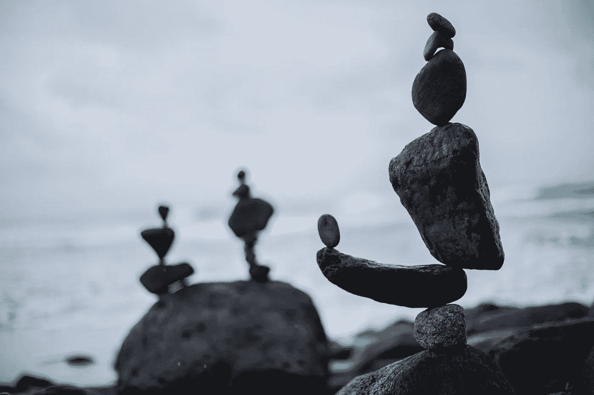

# 过去 40 年来最不对称的投资理念

> 原文：<https://medium.com/coinmonks/the-most-asymmetrical-investment-idea-in-the-last-40-years-786bc5196085?source=collection_archive---------8----------------------->

## 你后悔没有买比你后悔买了并让它达到 0 美元更多。

Source: Pexels

今天我们想和你谈谈我们遇到过的最不对称的投资理念之一。

**是比特币**。作为区块链技术和代币的比特币。这是一个被…讨厌的想法