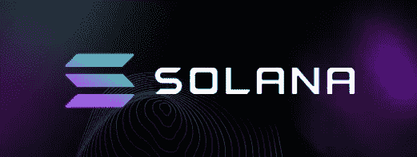
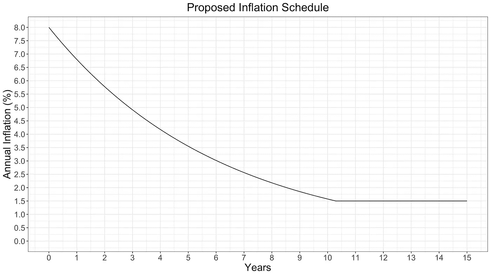
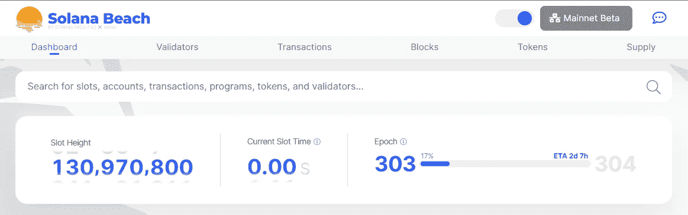
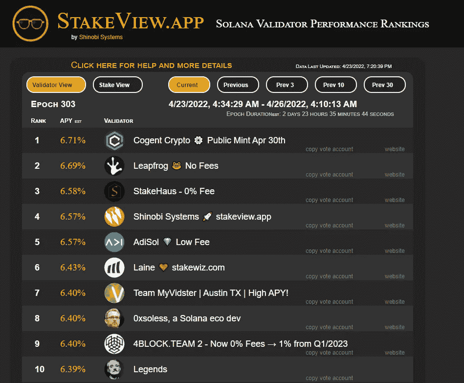
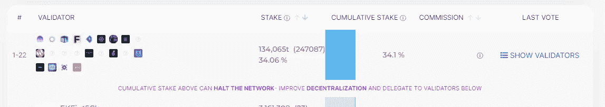
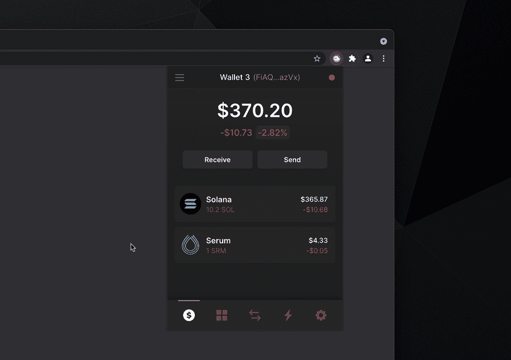
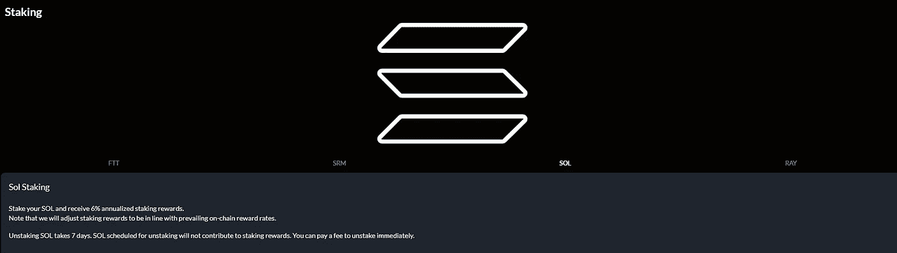
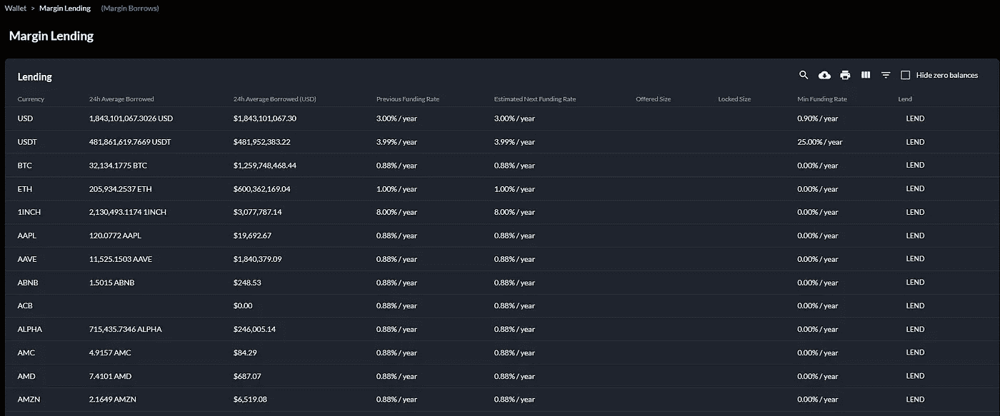
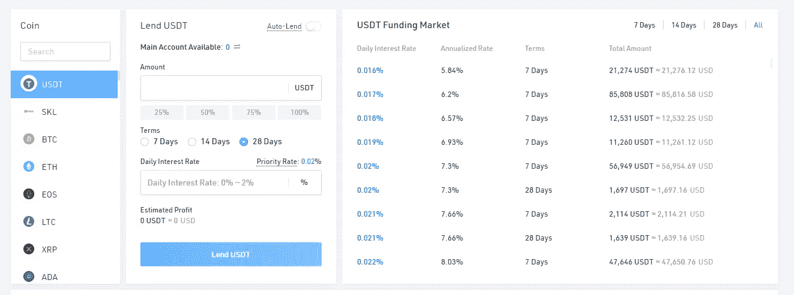

# 你能做的最基本的事情就是防止你的硬币随着时间的推移而贬值…

> 原文：<https://medium.com/coinmonks/the-most-basic-thing-you-can-do-to-prevent-your-coins-from-losing-value-over-time-9c2748dc1352?source=collection_archive---------22----------------------->

在花了很多时间研究之后，你终于发现了一枚值得投入金钱的硬币。

令牌经济学看起来很合理，没有太多的分配偏向开发团队、风险投资或早期采用者。他们的 Github 页面经常更新，社区充满活力。你决定长期持有它，因为你看到了它的巨大潜力。

但是有一件事被忘记了。
由于本质上是通货膨胀，目前的持有量被稀释了，虽然缓慢但肯定。
要是有办法解决这个问题就好了。

Photo by [AbsolutVision](https://unsplash.com/@freegraphictoday?utm_source=medium&utm_medium=referral) on [Unsplash](https://unsplash.com?utm_source=medium&utm_medium=referral)

# 立桩标界

其核心是锁定你的硬币。这有助于通过验证保护生态系统，同时获得赌注奖励。

现在“奖励”这个词可能不是正确的选择，因为你实际得到的不是奖励。

为什么这样

想象一个场景，所有硬币的持有者都参与赌注并获得 10%的红利。如果网络的通货膨胀率设定为 10%，即使供应量增加，它们的总体%也不会发生变化。

> *如果没有赌注或者赌注 APY%低于通货膨胀率，那些加入网络的新硬币将会稀释用户的持有量*

由此我们可以看出，赌注已经变得必要，这不仅仅是为了获得被动收入的“回报”(尽管你总是可以卖掉它来获得利润)，而是为了减少你所持股份的稀释。

谁不想拥有比你以前更多的硬币呢？为了简单起见，我们不会在本文中讨论流动性池。由于他们的奖励通常是平台代币的形式，在某些情况下，我们还必须考虑非永久性的损失。

# **索拉纳**

对于索拉纳来说，通货膨胀率被设定为 8%,并将每年下降 15%,直到达到大约 1.5%的长期稳定水平。
此次通货膨胀的 95%将作为奖励给予验证人，其余 5%留作运营费用。

Solana documentation

有 3 个[阶段](https://docs.solana.com/implemented-proposals/staking-rewards)用于锁定茄果。

**准备期(直到当前纪元结束)** —存放的 Sol 尚未开始获得赌注奖励

**有效期**——立即获得奖励，可削减股份(但削减尚未实施)

**冷却期(直到当前时期结束)** —类似于预热。在此期间，你将不能撤回股份，但仍将继续赚取奖励

一个**时期**是 432，000 个块，因此由于 1 个时隙所需的最小时间大约是 400 毫秒，一个时期大约是 2 到 3 天。这取决于该时期网络当前经历的速度。

Epoch 303, 2d 7hrs more to go

Solana 上有很多验证器，所以你必须选择一个最适合你需要的。(通常，在大多数情况下，它将是能够提供高 APY 的那个😆)

您可以使用 [StakeView](https://stakeview.app/) 来查看由 Solana 上的验证器提供的当前 APY%。APY%在每个时期都会改变，所以用它来大致了解应该选择哪些验证器。

**选择验证器时我要注意的事情**

*   平均“稳定”的高 APY 百分比(通常出现在前 10 位)
*   与他们有利害关系的土壤总量很高(尽管目前没有实施砍伐，他们的利害关系越大，他们就越不可能做一些损害生态系统的事情)
*   佣金低或为 0%(APY 显示已扣除佣金，如果有的话)
*   我们也可以**有目的地选择委托给那些股份较少的验证者**来提高网络的分散性。因此，赌注权重可以来自许多不同的验证器，从而降低了网络中断的可能性

Choosing a validator aside from those in the grp would help with the decentralization

**通过钱包下注**

[https://phantom.app/blog/solana-staking-in-just-3-clicks](https://phantom.app/blog/solana-staking-in-just-3-clicks)

如果你碰巧在索拉纳生态系统中使用 Phantom wallet，那么参与赌注真的很容易。

只需点击几下，你的赌注就会被委托给你选择的验证人。你所需要做的就是等待热身结束，然后你就可以获得“奖励”了。

要解散，只需点击你的股份帐户，会有一个解散按钮

有一种东西叫做**租金储备。**它的作用类似于存款，一旦你从这个股票账户中完全取出你的股票，你就可以取回这笔钱。如果你想赌一个 100 索尔的整数，你需要输入 100 . 000。36860 . 88868888686 否则，实际赌注金额将少于 100 索尔，但这不应该是任何大的问题。

每当您想下注时，就会创建一个新的下注帐户。这意味着你的 SOL 被“锁定”在这个账户中，专门用来下注。

> SOL 被**委托给**选择的验证者，他们没有控制权。这只会有助于增加他们的股份权重，使他们的总股份更大，能够更经常地投票或成为领导者。

无论验证器是否突然离线(没有获得奖励)或性能开始下降，您仍然可以始终控制您的赌注。您可以随时选择取消删除和撤回。

从赌注中获得的奖励将自动添加到您当前的赌注中，因此您无需做任何事情，就可以随着时间的推移获得复利。

对于那些对赌注有很多疑问或担心的人，您可以访问[此](https://help.phantom.app/hc/en-us/sections/4406351831571-Staking)了解更多信息。

Photo by [Emil Kalibradov](https://unsplash.com/@emkal?utm_source=medium&utm_medium=referral) on [Unsplash](https://unsplash.com?utm_source=medium&utm_medium=referral)

如果由于一些未知的原因，你不能用你的私人钱包来赌你的硬币，你仍然可以在交易所“赌”那些硬币来获得一些 APY%,尽管这取决于每个交易所。

**交易所跑马圈地**

交易所有时也会提供“赌注”。这并不被认为是真正的赌注，因为它通常被借给其他用户，以产生 APY%来偿还给用户。

那么，在交易所下注是不是不好？这个问题的答案是视情况而定。

*   比如你有多信任交易所，因为所有的硬币仍然属于他们。
*   没有真正做你的一部分，帮助保护网络，但有些人可能不关心这一点，只要他们得到他们的 APY%
*   更易于管理，因为所有交易都在同一个交易所进行，需要为每枚硬币创建多个钱包
*   对于某些交易所，可能会有一段时间不能借出或提取您的硬币。(由于“维护”😆)

> **FTX**

Staking of SOL on FTX

FTX 在 APY 提供了相当可观的 6%的 SOL 赌注。
APY 现在保持在 6%,并将在不久的将来改变(不是按纪元)
请注意，有一个 7 天的锁定期，在这 7 天内，这些硬币不会获得任何“赌注”奖励。
您也可以选择立即支付费用进行拆分。

FTX Lending

这可能是值得去看看 FTX 提供的贷款功能，因为你也可以从那里得到一些 APY%。这样做的一个好处是，只要你的硬币被借走，FTX 就会保证支付利息，即使借款人被清算。因此，这消除了交易对手风险。

> **库币**

Kucoin 也提供贷款功能
,尽管 APY%将与你锁定这些硬币的时间挂钩

**结论**

由于你所发现的硬币具有通货膨胀的性质，因此，将你的硬币下注以防止其价值随着时间的推移而进一步稀释是必要和有益的。
当然，在 DeFi 世界里有很多方法可以获得更高的 APY%,但这是最简单快捷的方法之一。

请注意，以上不是财务建议，只是我认为如果我打算长期持有某些硬币应该做的事情。

如果你喜欢你所读的，请留下评论或关注我以获取更多相关文章，谢谢！😄

 [## 每当约翰·方德伯克发表文章时，就收到一封电子邮件。

### 每当约翰·方德伯克发表文章时，就收到一封电子邮件。如果您喜欢您正在阅读的内容，请务必注册，以便在……

medium.com](/subscribe/@thissideup35mm) 

> 加入 Coinmonks [电报频道](https://t.me/coincodecap)和 [Youtube 频道](https://www.youtube.com/c/coinmonks/videos)了解加密交易和投资

# 另外，阅读

*   [3 商业评论](/coinmonks/3commas-review-an-excellent-crypto-trading-bot-2020-1313a58bec92) | [Pionex 评论](https://coincodecap.com/pionex-review-exchange-with-crypto-trading-bot) | [Coinrule 评论](/coinmonks/coinrule-review-2021-a-beginner-friendly-crypto-trading-bot-daf0504848ba)
*   [莱杰 vs n rave](/coinmonks/ledger-vs-ngrave-zero-7e40f0c1d694)|[莱杰 nano s vs x](/coinmonks/ledger-nano-s-vs-x-battery-hardware-price-storage-59a6663fe3b0) | [币安评论](/coinmonks/binance-review-ee10d3bf3b6e)
*   [Bybit Exchange 审查](/coinmonks/bybit-exchange-review-dbd570019b71) | [Bityard 审查](https://coincodecap.com/bityard-reivew) | [Jet-Bot 审查](https://coincodecap.com/jet-bot-review)
*   [3 commas vs crypto hopper](/coinmonks/3commas-vs-pionex-vs-cryptohopper-best-crypto-bot-6a98d2baa203)|[赚取加密利息](/coinmonks/earn-crypto-interest-b10b810fdda3)
*   最好的比特币[硬件钱包](/coinmonks/hardware-wallets-dfa1211730c6) | [BitBox02 回顾](/coinmonks/bitbox02-review-your-swiss-bitcoin-hardware-wallet-c36c88fff29)