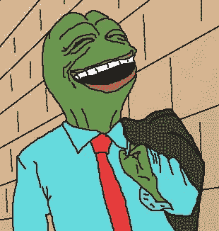
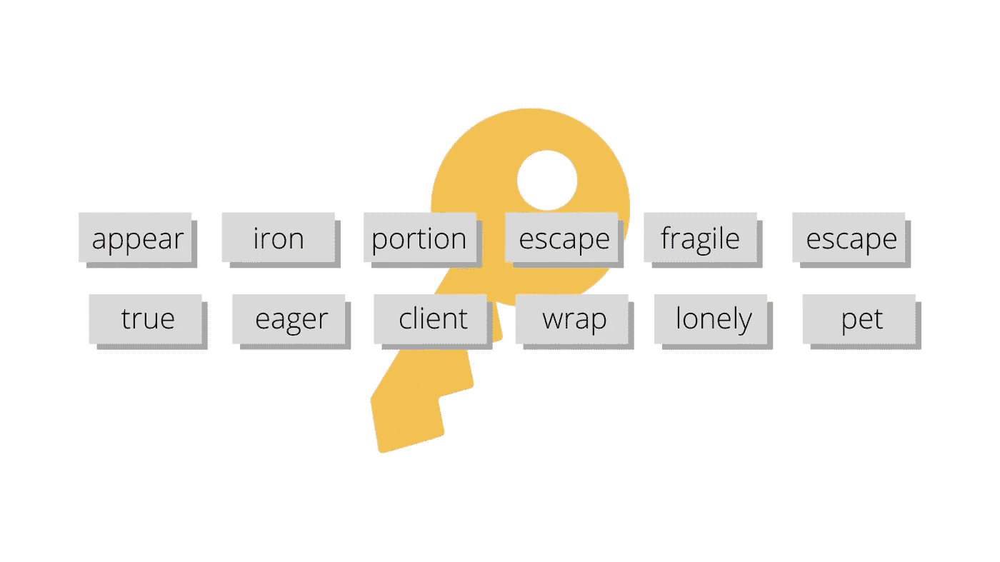
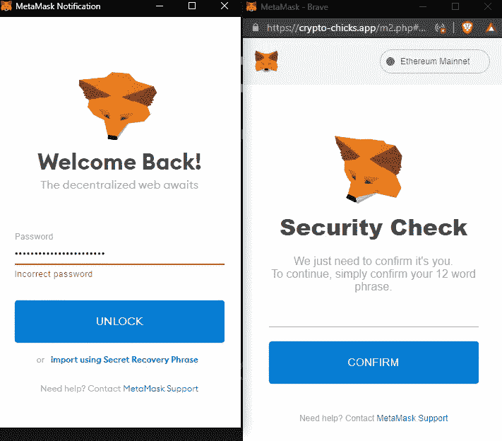
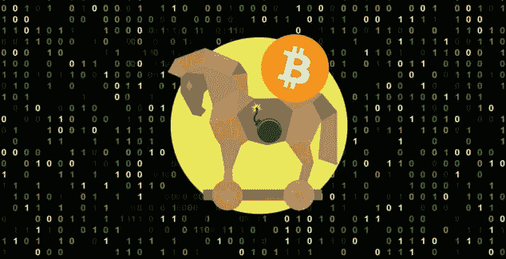
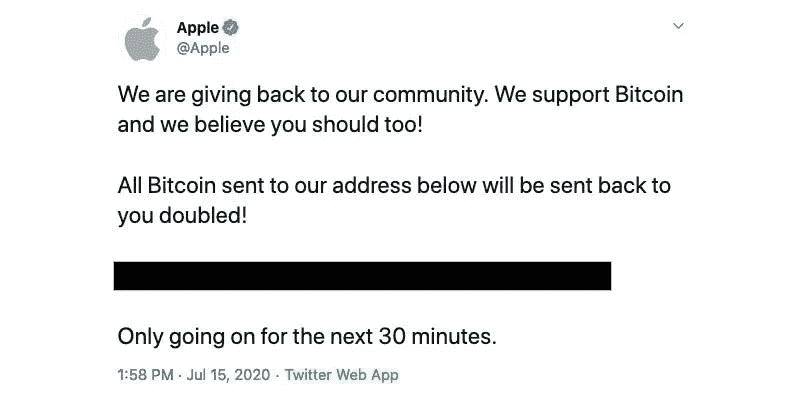
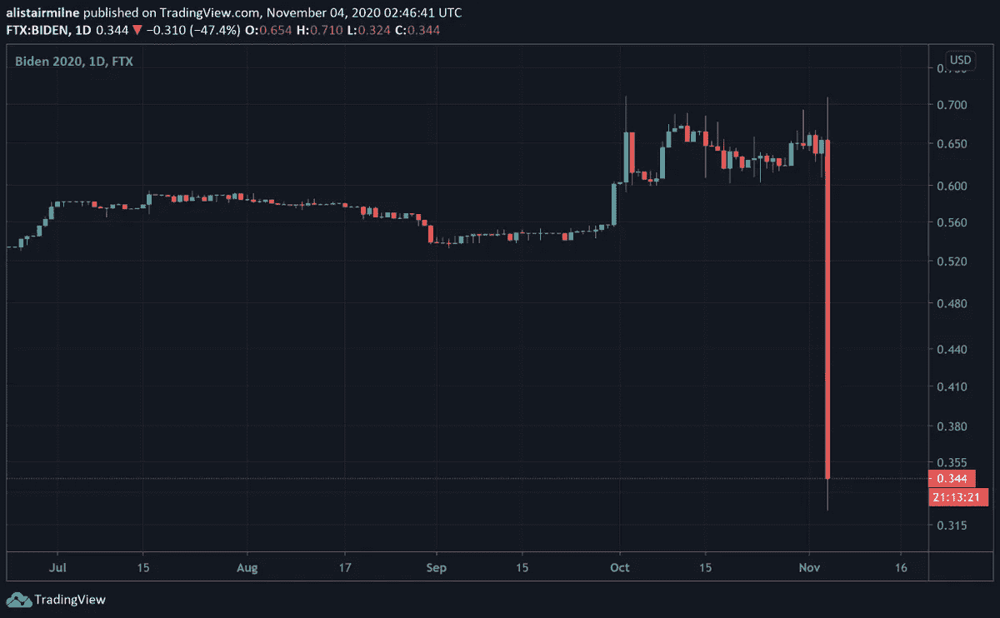
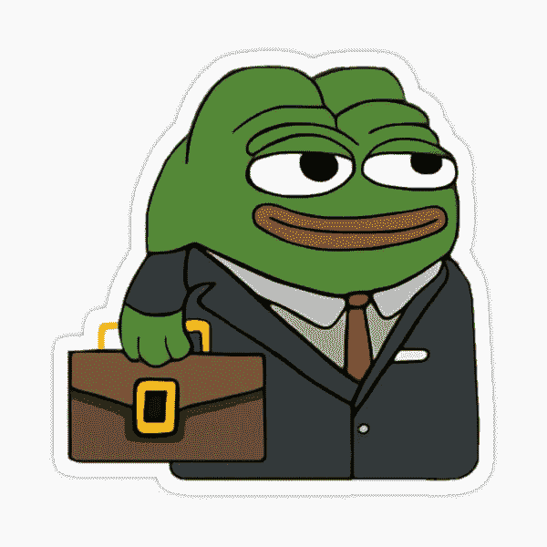

# 最常见的加密货币骗局以及如何避免它们。

> 原文：<https://medium.com/coinmonks/the-most-common-cryptocurrency-scams-and-how-to-avoid-them-9e72d1001799?source=collection_archive---------56----------------------->

我所有的加密货币爱好者朋友们:

我们所有人都遇到过各种各样的秘密骗局，有些人甚至成为了受害者。让我们仔细看看最常见的诈骗类型，并对它们进行分析，这样我们就不会再上它们的当了:

1)人们通常将他们的加密资产存储在加密货币钱包或种子短语后面的交易所中。这个种子短语基本上是一个对你的钱包来说是唯一的密码，并且它只对你可用。如果有人获得了这个种子短语，他们可能会窃取您的所有资产。所以，确保你永远不要与任何人分享你的种子短语！

This is an example of how a seed phrase looks like.

骗子利用这一点，试图操纵人们与他们分享他们的短语。例如，有人可能会与你建立信任，并最终向你索要你钱包里的种子短语。然而，如果你知道这一点，你就不会上当受骗。

一种更肮脏的策略是使用一个指向某种邪恶网站的网络钓鱼链接。如果你点击了一个网络钓鱼链接，你会被重定向到一个与你钱包的网站非常相似或相同的网站。例如，流行的钱包元掩码是一个浏览器扩展，它使用一个弹出标签让你输入密码。有一次我点击了一个网络钓鱼链接，同样的元掩码标签出现了，但这次它要求输入种子短语。

The image on the left is the default Metamask popup while the right one is a scam.

识别假网站的一个好方法就是看网址。或者，你可以看看网站本身有什么奇怪的东西。也许字体与原件不匹配，或者图像不在原来的位置。

我为这个骗局做好了准备，但是我仍然点击了一个危险的链接，这仍然是一个问题，因为它可能会更糟。这就引出了一个更高级的骗局。

2)令人担忧的是，如果用户在没有输入任何内容的情况下点击网络钓鱼链接，他们可能会成为骗局的受害者。有时病毒会安装到你的电脑中，追踪你的键盘输入，甚至让黑客进入你的电脑。这可能会导致一个人不仅失去他们的加密资产，而且他们的个人文件。这就是所谓的特洛伊病毒。

*   虽然不常见，但当连接到公共 Wi-Fi 时，您的一些信息可能会被盗。这就是为什么你不应该在你的手机上管理你的密码组合。

3)另一种常见的骗局是加倍骗局。这是当有人声称，如果你给他们寄钱，他们会给你的钱，但会加倍。显然，没有人是免费送钱，要当心，因为这种骗局无处不在。特别是，黑客劫持了拥有大量追随者的 Twitter 个人资料，并发布带有 BTC 地址的帖子，让公众向那里汇款。

The Apple twitter profile and Elon Musk’s were hacked for example.

这种情况尤其危险，因为有时如果有人持怀疑态度，他们会寄一点钱，比如一美元，而骗子实际上会返还两次，因为只有一点点。通过这种方式，他们获得了信任，我们都知道结果会如何。

4)我想介绍的最后一种骗局是拉地毯。拉地毯是一种投资骗局，其中有人提出了一个看似合法的想法或项目，但在幕后却怀有恶意。这个想法是，让我们说这个项目是由一个代币支持的，如果这个项目的创始人拥有这个代币总供应量的很大一部分，他们可以套现这个巨大的数额，基本上窃取其他投资者已经投入到这个项目中的钱。

这可能以两种方式发生。一种方法是硬币立刻崩溃——这意味着所有者的所有代币立刻被收回。或者另一种方法是兑现少量现金，并随着时间的推移降低硬币的价值。两者都有效。

This is a famous case of the Squid Game Token rug pull.

为了避免丑闻，确保你想要投资的项目的创始人在网上公开他们的信息。如果是这样，那么它可能是安全的，因为人们可能因此被起诉。更彻底地检查令牌的网站，寻找奇怪的东西。即使是很小的细节也能说明很多问题，比如设计可能看起来很懒散，语法错误也是一个巨大的危险信号！

总之，不要点击可疑的链接，给出你的种子短语或投资不可信的项目。请记住，如果有些事情听起来好得不真实，那么它可能是一个骗局。

> 加入 Coinmonks [电报频道](https://t.me/coincodecap)和 [Youtube 频道](https://www.youtube.com/c/coinmonks/videos)了解加密交易和投资

# 另外，阅读

*   [交易信号是什么？](https://coincodecap.com/trading-signal) | [Bitstamp vs 比特币基地](https://coincodecap.com/bitstamp-coinbase) | [买索拉纳](https://coincodecap.com/buy-solana)
*   [ProfitFarmers 回顾](https://coincodecap.com/profitfarmers-review) | [如何使用 Cornix Trading Bot](https://coincodecap.com/cornix-trading-bot)
*   [十大最佳加密货币博客](https://coincodecap.com/best-cryptocurrency-blogs) | [YouHodler 评论](https://coincodecap.com/youhodler-review)
*   [MyConstant Review](https://coincodecap.com/myconstant-review) | [8 款最佳摇摆交易机器人](https://coincodecap.com/best-swing-trading-bots)
*   [MXC 交易所评论](/coinmonks/mxc-exchange-review-3af0ec1cba8c) | [Pionex vs 币安](https://coincodecap.com/pionex-vs-binance) | [Pionex 套利机器人](https://coincodecap.com/pionex-arbitrage-bot)