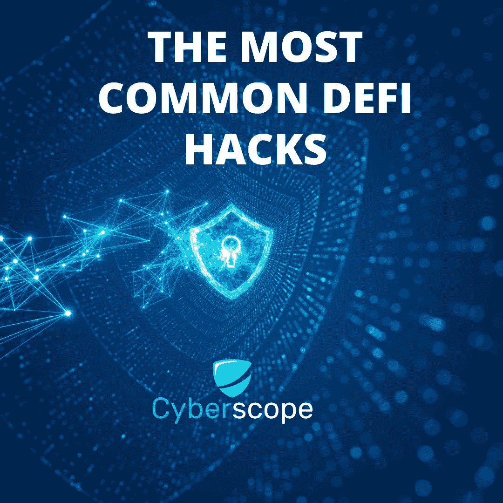
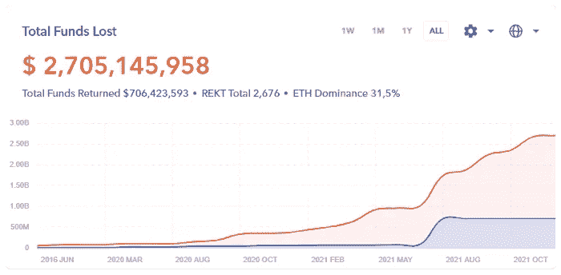

# 最常见的 DeFi 黑客以及如何防范它们

> 原文：<https://medium.com/coinmonks/the-most-common-defi-hacks-and-how-to-protect-against-them-d65770769d59?source=collection_archive---------33----------------------->

随着互联网日益成为金融交易的主要来源，越来越多的黑客试图利用该技术的漏洞来快速获利。最近的[区块链分析](https://blog.chainalysis.com/reports/2022-defi-hacks/)显示，越来越多的网络攻击正在 DeFi 空间发生，窃取了数百万投资者的资金。今天，我们来看看持续威胁 web3 安全的最常见的 DeFi 攻击模式和方法。

# 快速贷款

闪贷一直是黑客的首选方法。快速贷款基本上是一种无抵押贷款，可供程序员根据某些 DeFi 协议进行交易。黑客将获得贷款，通过与 DeFi 的智能合同交互来利用漏洞，偿还贷款并保留被盗资金的利润。为了防范闪贷，你需要确保你投资的 dapp 已经[审计了他们的智能合同，](https://www.cyberscope.io/#audit)对最终产品进行渗透测试也是一种常见的应对措施。

# 鲁格拉

在过去的一年里，Rugpulls 一直在以指数级的方式扰乱加密市场。Rugpull 的行为大部分时间是由项目所有者实施的，因此防范它需要结合合同安全性、检查流动性池令牌的储物柜以及信任团队，这就是为什么 [KYC 的](https://www.cyberscope.io/#kyc)项目往往表现更好并且更安全。

# 赌注池

Staking 是一个增强项目路线图的特性，并赋予其令牌价值。历史表明，赌注合同一直是黑客的目标，因为他们通常在合同中存储令牌，并且黑客一直试图利用智能合同的漏洞。它可能是一个简单的遗漏检查或权限修饰符，黑客可以利用它来耗尽所有赌注者的全部余额。这就是为什么审计你的智能合同如此重要。

# 交叉链桥

跨链桥允许用户在区块链之间转移加密货币。然而，它们容易受到外部攻击。类似地，就像赌注合同一样，代码中的简单漏洞可能对项目的安全性有害。数百万美元可能被盗，就像浪人和虫洞桥流行的黑客一样。

# 网络钓鱼攻击

网络钓鱼攻击呈上升趋势。然而，这种欺诈不仅限于 DeFi，因为它可能发生在任何活动领域。目标保持不变，那就是用户。黑客通常以特定平台上的用户群为目标。通过获取用户的个人数据或访问细节，黑客可以获得他们的财务信息。这不仅发生在 DeFi，也发生在其他地区。这些攻击非常流行，然而，防范这些攻击的责任完全在用户身上。你可以查看我们的指南中关于如何避免它。

# 如何防范黑客攻击

防范所有这些似乎是不可能的，但是你可以做一些事情。就像你开车时会系上安全带一样，你需要采取一切必要的措施，最大限度地提高自己不成为网络黑客受害者的几率。你可以做的几件事是投资审计定义 dapps。请阅读审计报告，以更好地理解智能合同的漏洞。一个常见的策略是将你的投资分散到多个来源，这样你可以将资本的风险降到最低。

在 [Cyberscope](https://www.cyberscope.io/) ，我们的使命是保护散户投资者和交易者免受骗子和欺诈者的侵害，因此，如果你怀疑有人试图诈骗你，请随时给我们发送消息！

…

*原载于*[*https://www . cyber scope . io*](https://www.cyberscope.io/)*。*

> 加入 Coinmonks [电报频道](https://t.me/coincodecap)和 [Youtube 频道](https://www.youtube.com/c/coinmonks/videos)了解加密交易和投资

# 另外，阅读

*   [CoinFLEX 评论](https://coincodecap.com/coinflex-review) | [AEX 交易所评论](https://coincodecap.com/aex-exchange-review) | [UPbit 评论](https://coincodecap.com/upbit-review)
*   [AscendEx 保证金交易](https://coincodecap.com/ascendex-margin-trading) | [Bitfinex 赌注](https://coincodecap.com/bitfinex-staking) | [bitFlyer 审核](https://coincodecap.com/bitflyer-review)
*   [Bitget 回顾](https://coincodecap.com/bitget-review) | [双子座 vs BlockFi](https://coincodecap.com/gemini-vs-blockfi) cmd| [OKEx 期货交易](https://coincodecap.com/okex-futures-trading)
*   [AscendEx Staking](https://coincodecap.com/ascendex-staking)|[Bot Ocean Review](https://coincodecap.com/bot-ocean-review)|[最佳比特币钱包](https://coincodecap.com/bitcoin-wallets-india)
*   [霍比审核](https://coincodecap.com/huobi-review) | [OKEx 保证金交易](https://coincodecap.com/okex-margin-trading) | [期货交易](https://coincodecap.com/futures-trading)
*   [网格交易机器人](https://coincodecap.com/grid-trading) | [Cryptohopper 审查](/coinmonks/cryptohopper-review-a388ff5bae88) | [Bexplus 审查](https://coincodecap.com/bexplus-review)