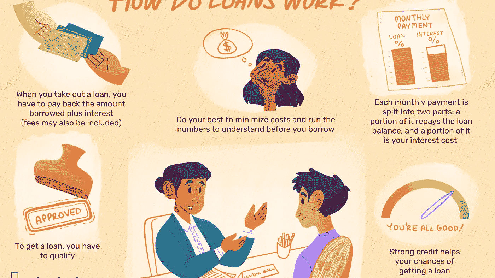

# 你早年可能犯的最常见的财务错误

> 原文：<https://medium.com/coinmonks/the-most-common-financial-mistakes-you-might-make-in-your-early-years-e02aa2a52256?source=collection_archive---------62----------------------->

你可能会在工作的头几年做出一些财务决定，尤其是在二三十岁的时候，然后后悔...这些是你可能会犯的最常见的财务错误...了解他们以及在这件事上避免他们的方法。

# 要求大量贷款

根据你借了多少钱，你会发现需要几年才能还清贷款。

# 信用卡逾期付款

信用卡还款逾期超过 90 天会降低你的信用评分，这是债权人在发放贷款前审查的评分。

# 忽视紧急储蓄

创建一个紧急储蓄账户，这样你就有足够的钱来支付汽车修理费、医药费、房屋修理费和其他意外开支，这样你就不用用信用卡支付了。

# 不要入不敷出

如果你用信用卡购买你想要的一切，超出了你的能力，这将导致你陷入债务陷阱，并支付高利率。

# 为退休储蓄

二十多岁就开始攒钱，早点退休。你将会有很多合同来为你的退休储备合理的钱。

# 减少你的开支

尽量减少你的开支。你一个月花的钱越少，你就有越多的钱可以长期投资。

# 要求增加

不要羞于要求加薪来协商更高的薪水或寻找另一份能给你带来更高经济利益的工作。

# 为你的孩子存钱

如果你有孩子或者打算结婚生子，就要考虑为孩子储蓄，尤其是大学教育，一年比一年贵。

> *加入 Coinmonks* [*电报频道*](https://t.me/coincodecap) *和* [*Youtube 频道*](https://www.youtube.com/c/coinmonks/videos) *了解加密交易和投资*

# 另外，阅读

*   [3 商业评论](/coinmonks/3commas-review-an-excellent-crypto-trading-bot-2020-1313a58bec92) | [Pionex 评论](https://coincodecap.com/pionex-review-exchange-with-crypto-trading-bot) | [Coinrule 评论](/coinmonks/coinrule-review-2021-a-beginner-friendly-crypto-trading-bot-daf0504848ba)
*   [莱杰 vs n 格拉夫](/coinmonks/ledger-vs-ngrave-zero-7e40f0c1d694) | [莱杰纳诺 s vs x](/coinmonks/ledger-nano-s-vs-x-battery-hardware-price-storage-59a6663fe3b0) | [币安评论](/coinmonks/binance-review-ee10d3bf3b6e)
*   [Bybit 交易所评论](/coinmonks/bybit-exchange-review-dbd570019b71) | [Bityard 评论](https://coincodecap.com/bityard-reivew) | [Jet-Bot 评论](https://coincodecap.com/jet-bot-review)
*   [3 commas vs crypto hopper](/coinmonks/3commas-vs-pionex-vs-cryptohopper-best-crypto-bot-6a98d2baa203)|[赚取加密利息](/coinmonks/earn-crypto-interest-b10b810fdda3)
*   最好的比特币[硬件钱包](/coinmonks/hardware-wallets-dfa1211730c6) | [BitBox02 回顾](/coinmonks/bitbox02-review-your-swiss-bitcoin-hardware-wallet-c36c88fff29)