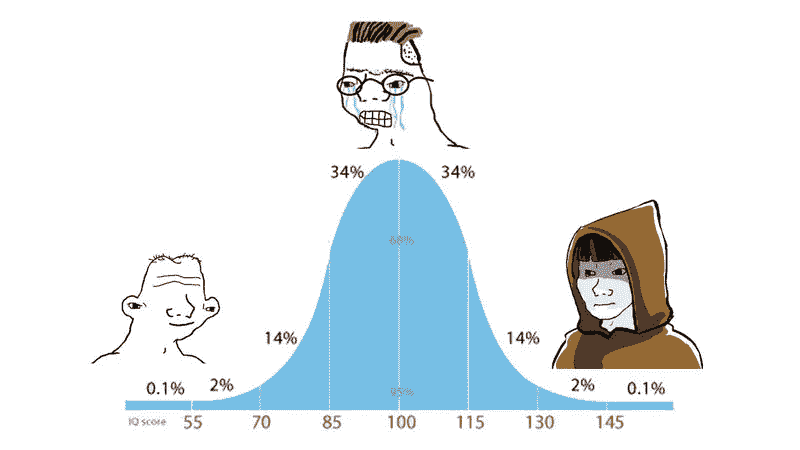

# 世界上最令人困惑的话题

> 原文：<https://medium.com/coinmonks/the-most-confusing-subject-in-the-world-ecf26e005ad1?source=collection_archive---------90----------------------->

如果你对加密感到困惑，不要难过——它可以说是世界上最令人困惑的主题。

为什么？

**不确定性**

加密是一项实时进行的激进实验。没有人能告诉你结果。非常聪明的人知道整个项目的走向。

**变化的速度**

空间正在以闪电般的速度变化。跟上革新的步伐将是一项全职工作。批评是无效的；实验可能会失败；可疑的想法可以藐视批评者，并证明是成功的；叙事可能会突然崩溃；新项目可以获得牵引力，并在一夜之间改变事情。

**叙事超载**

你会听到各种不同的声音，不知道加密的全部目的是什么。有一千个相互竞争的叙事框架。根据交谈对象的不同，您可能会听说:

*   技术创新——改进支付和结算技术
*   扰乱银行和金融中介
*   菲亚特实验的结束和“硬通货”的回归
*   对冲通货膨胀
*   金钱与国家的分离
*   自我主权，自由意志主义，自由
*   无银行账户者的银行业务
*   等等。

**多学科**

加密本质上是多学科的。相关领域包括密码学、工程、金融、交易、宏观经济学、监管法律、货币历史…等等。它还催生了全新的子领域，如秘密经济激励结构研究(令牌经济学)。

没有教授或公认的世界密码专家。对那个来说太新了。每个人都在一个适当组织的领域里接受了一些零星的预先训练，并在我们进行的过程中弄清楚了这一点。

**部落主义**

持有代币让你成为一个社区，一个部落的一部分。这不可避免地会影响你的思维——你会发现，一旦你对某个符号有了一些正面的了解，你就会开始更积极地看待它。这就是经济激励联盟的魔力——拥有代币的部落现在自然觉得有必要去宣传它。但是你需要认识到这种强大的认知偏见。

你会经常遇到特定符号的极端支持者，他们会淡化或诋毁其他一切，并将他们最喜欢的资产作为整个叙事的终点。

**误传**

批评 Crypto 的人经常指出它充满了欺诈和骗局，他们几乎是对的。您可能会收到各种各样的虚假或误导性信息，从在 Discord & Telegram 中向您发送钓鱼链接的机器人，到不诚实的开发人员，再到只是给你错误信息的好心人。

**接近度**

具有讽刺意味的是，Crypto 显而易见的易接近性帮助增加了混乱，因为人们认为他们明白了，包括那些将继续告诉你完全胡说八道的人。

加密不应该立即有意义。自然的反应应该是极度怀疑。在它开始有意义之前，它应该需要大量的工作；基本上我认识的每一个聪明人都花了很多时间来克服他们最初的怀疑。如果这看起来很容易，你可能是一个容易受骗和容易被误导的人。(见本文“智商钟形曲线效应”讨论:[雅皮士精英为何对比特币不屑一顾](https://www.citadel21.com/why-the-yuppie-elite-dismiss-bitcoin))。

结果，你会在 Crypto 中发现非常聪明的人和非常愚蠢的人的奇怪组合。“中间阶层”并不笨，但还没有投入工作，他们将会最挣扎。

**你应该放弃吗？**

综合所有这些因素，你会发现，对于一门学科的新手来说，这可能是有史以来最不友好、最令人困惑的学习环境。但是坚持下去，阿农。值了。