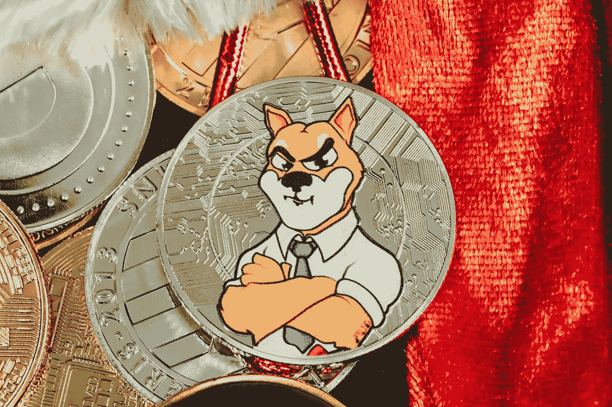

# 密码研究中最重要的事情是避免代价太高。

> 原文：<https://medium.com/coinmonks/the-most-crucial-thing-in-crypto-research-that-is-too-costly-to-avoid-e30e988297f6?source=collection_archive---------13----------------------->

## 关于 Marketcap 的一些需要知道的事情可以让你的加密游戏更上一层楼。



Photo by [Quantitatives](https://unsplash.com/@quantitatives?utm_source=unsplash&utm_medium=referral&utm_content=creditCopyText) on [Unsplash](https://unsplash.com/s/photos/crypto-research?utm_source=unsplash&utm_medium=referral&utm_content=creditCopyText)

这是大多数投资者在投资任何项目时都会犯的严重错误。在我投资之旅的最初几天，我总是寻找价格低于 1 美元的项目；背后的原因是 1 美元很便宜，我可以买很多硬币。其中的逻辑是，如果这些硬币涨到 10 美元甚至 100 美元，我就会变得非常富有。

> 你也有同感吗？你还在采用同样的方法吗？

如果你也有类似的想法，你需要看这篇文章；在你阅读的时候，我将揭示一些投资者经常坚持的冷酷事实和神话。

我将揭示采取这样一种策略的谬误，即挑选便宜的硬币而不去研究一个具体的细节- **市场资本和供给。**

在本文结束时，您将能够回答以下问题:

1.  为什么这样的策略可能会导致财务损失？
2.  什么是 Marketcap？
3.  它对消除流言有什么帮助？
4.  它如何有助于避免投机赌注？
5.  如何使用 Marketcap 筛选宝石？

> 你能帮我一个忙吗？我将要求你遵循三个步骤。遵循这些步骤，你将清楚为什么基础数学在加密中如此重要？

打开 [Coinmarketcap](https://coinmarketcap.com/) 网站，记下*柴犬*和*索拉纳*的当前价格。在撰写本文时，柴犬的价格为 0.00002436 美元，而索拉纳的价格为 114 美元。

现在，计算一下每笔投资你会有多少硬币。让我来帮你吧。如果你投资 114 美元到索拉纳和柴犬，你会有 47，50000 枚柴犬币和 1 枚索拉纳币。

这是我告诉你要做的最后一件事。推测柴犬的价格为 0.10 美元，并计算总投资。让我再帮你一次。如果柴犬连到 0.10 美元，你的 100 美元投资就变成了 416666 美元，大概是**416k 美元。**

> 哇，你现在投资 100 美元就发财了。这个策略很简单。我们应该经常投资 100 美元到所有这样的硬币上。

*小心！*

现在再次回到 Coinmarketcap，观察 Solana 和 Shiba Inu 当前的 marketcap。你会发现索拉纳目前的市值是 373.8 亿美元，柴犬是 133.8 亿美元。

如果我们的推测是准确的，那么让我们来计算柴犬的市值。柴犬在 0.10 美元价位的市值将约为 4166*13 = $ **54.15 万亿** ( *考虑目前流通币供应量*)。

目前整个加密市场的市值是 2 万亿美元，比特币的市值是 0 美元。 **816** 万亿。

> 这意味着柴犬将比特币和整个加密行业的当前市值翻了至少 27 倍。

> 你现在觉得有点难以消化吗？我也有同感。

你可以看到为什么这样的推测永远不可能是真的，投资于这样的信念无疑会导致财务损失。

即使你回到*2020 年 9 月 20 日，*索拉纳的价格是 2 美元，其市值是 1.07 亿美元，而比特币的价格是 1.1 万美元，其市值是 2020 亿美元。

索拉纳现在的交易价格是 114 美元(是价格的 57 倍)，市值 373.8 亿美元(是市值的 370 倍)。比特币现在的交易价格为 43，000 美元(是这个价格的 4 倍)，市值为 8160 亿美元(是这个市值的 4 倍)。

如果你回到同一个日期，你可以看到以太坊的交易价格为 370 美元，市值为 410 亿美元。目前，以太坊的交易价格为 3300 美元 T21(几乎是价格的 10 倍)，市值为 3880 亿美元(几乎是市值的 10 倍)。

> 告诉你这些有什么意义？

即使索拉纳同时期的价格上涨了 57 倍，也几乎没有超过以太坊的市值。与此同时，以太坊的价格只涨了**十倍。**

是巧合吗？

> 不，这就是 Marketcap 的魅力。加密硬币的市值越大，它遇到的阻力就越大。

我们还没有引入一个判断市值的关键参数。该参数为*循环供给。这在我们上面的例子中非常明显。你可以看到，从 2020 年 9 月到现在，比特币、以太坊的价格和市值的增长是一致的。*

例如，比特币价格上涨了四倍，而其市值也上涨了四倍。类似地，以太坊的价格增长了十倍，而其市值增长了十倍。

但为什么索拉纳的股价上涨了 57 倍，而市值却增长了 370 倍？

> 就是因为它的**循环供给。**

2020 年 9 月 20 日，比特币、以太坊、索拉纳的流通供应量分别为 1850 万、1.126 亿、3730 万。

如今，比特币、以太坊和索拉纳的流通供应量分别为 1900 万、1.203 亿和 3.27 亿。

因此，本质上，比特币、以太坊和索拉纳的流通供应量同期分别增加了 **2.7** %、 **7** %、 **783** %。

由于索拉纳的流通量增加了*7 倍*，其价格和市值之间存在这样的不一致，导致 *索拉纳币的高*通胀和索拉纳价格的贬值。**

如果索拉纳的流通供应量像比特币或以太坊那样略微增加 10%，让我们看看它的价格会是多少。

索拉纳的市值有可能增加 370 倍，因此如果索拉纳的供应量仅增加 10%，其流通供应量将为 4060 万份。现在索拉纳目前的市值为 373.8 亿美元，流通供应量为 4060 万，价格将为:

```
Marketcap = Circulating supply x Price of the coinPrice= Market cap / Circulating supply = $37.38 billion/ 40.6 million = $920
```

这意味着，如果索拉纳的流通供应量增幅被限制在 10%以内，索拉纳的价格应该是 920 美元。

> 那么，我们从这件事中学到了什么？

1.  首先，在研究任何项目时，观察硬币的当前市值。如果硬币目前的市值相对于其较低的价格来说太高，那么高价投机可能是徒劳的。
2.  其次，在评估硬币的回报潜力时，硬币的流通供应量很重要。假设硬币的流通供应量将在短期内大幅增加。在这种情况下，供应过剩很可能会影响其价格潜力，并使其价格大幅贬值。在索拉纳的案例中，价格几乎贬值了 1/10 倍
3.  第三，硬币的市值越高，价格潜力受到的阻力就越大。由于比特币的市值高于以太坊，比特币的价格上涨了 4 倍，而以太坊的价格上涨了 10 倍。同样，索拉纳的价格在同一时期上涨了 57 倍(T21)。

**关闭思路:**

当你调查任何一个项目时，如果项目的基本面良好，项目的市值越低，其多重回报的机会就越大。如果硬币的价格在其较低的市值下是可以承受的，那么它就是一种风险较低、回报非常高的硬币。

我将把这个想法留给你。

> *看币的市值而不是币的价格。*

*免责声明:此处阐述的部分或全部内容都不是任何财务建议。这篇文章是关于个人投资哲学和在金融旅程中产生意识的媒介。在做出任何财务决定之前，请咨询您的财务顾问。*

**对以上免责声明深表歉意！**

我希望你喜欢这些内容，并且值得你花时间。不开心！请让我知道。但是，如果你喜欢它的内容，你知道该怎么做。更多文章和更新，可以点击 ***关注*** *关注我或者订阅我的简讯。*

> 加入 Coinmonks [电报频道](https://t.me/coincodecap)和 [Youtube 频道](https://www.youtube.com/c/coinmonks/videos)了解加密交易和投资

# 另外，阅读

*   [比特币基地僵尸工具](/coinmonks/coinbase-bots-ac6359e897f3) | [AscendEX 审查](/coinmonks/ascendex-review-53e829cf75fa) | [OKEx 交易僵尸工具](/coinmonks/okex-trading-bots-234920f61e60)
*   [如何在印度购买比特币？](/coinmonks/buy-bitcoin-in-india-feb50ddfef94) | [瓦济克斯评论](/coinmonks/wazirx-review-5c811b074f5b)
*   [隐翅虫替代品](/coinmonks/cryptohopper-alternatives-d67287b16d27) | [HitBTC 审查](/coinmonks/hitbtc-review-c5143c5d53c2)
*   [CBET 评论](https://coincodecap.com/cbet-casino-review) | [库科恩 vs 比特币基地](https://coincodecap.com/kucoin-vs-coinbase)
*   [折叠 App 审核](https://coincodecap.com/fold-app-review) | [Kucoin 交易机器人](/coinmonks/kucoin-trading-bot-automate-your-trades-8cf0ca2138e0) | [Probit 审核](https://coincodecap.com/probit-review)