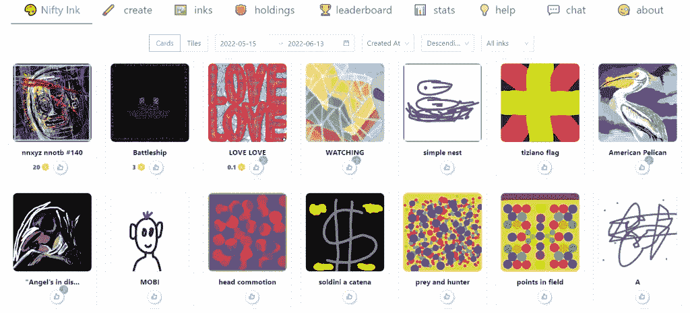
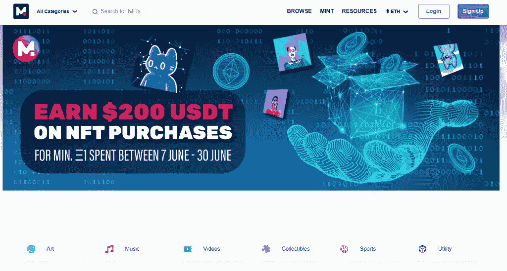
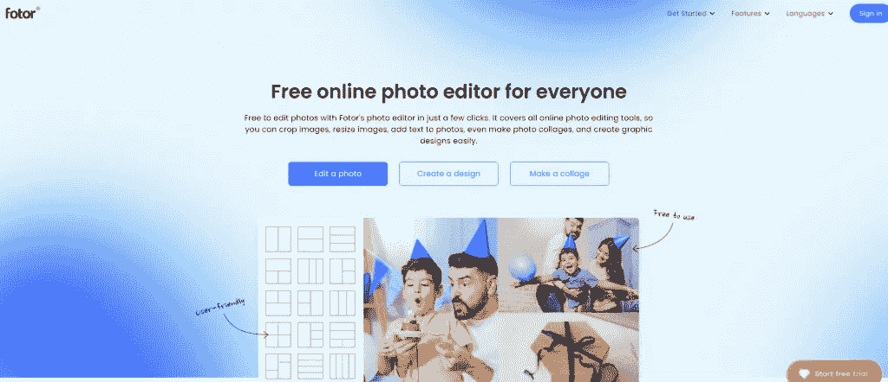
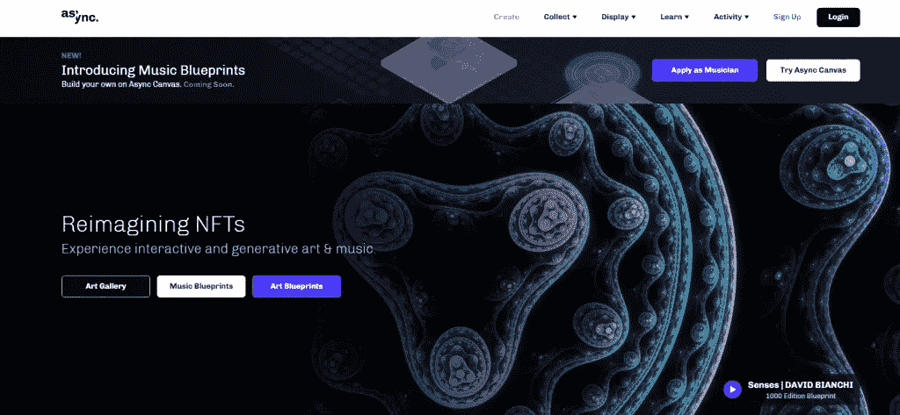

# 艺术家在创作 NFT 时使用的最有效的工具

> 原文：<https://medium.com/coinmonks/the-most-effective-tools-for-artists-to-use-in-the-creation-of-nfts-6b7df32b111a?source=collection_archive---------81----------------------->

随着非物质文化遗产市场的扩大，艺术和技术正在被意外地重塑。现代的 NFT 相当于拥有一件著名作家或插图画家亲笔签名的艺术品。如果你是一个对了解这种现象感兴趣的数字艺术家，考虑它的优点和缺点，并制作你自己的 NFTs，你已经找到了理想的位置。

在深入了解 NFT 创作的本质和挖掘 NFT 的技术复杂性之前，理解艺术的核心是至关重要的。随着技术的普及，越来越多的软件被开发出来帮助 NFT 用户。有没有某个 app 最有效？可能很难从所有可用选项中选择最可靠的选项。下面列出的 NFT 建筑软件包可以帮助你开始接触非艺术设计的艺术过程。

# NFT 艺术最好的工具是什么？

如果你是艺术家，你应该得到认可，因为这是一种罕见的技能。请记住，只有少数人能够创作出真正独一无二的高质量艺术作品。原创思想和主题被不可替代的象征性创作者搁置。这样，您就可以在素材中包含音频、视频和插图。要将虚拟绘画制作成非功能性绘画，艺术家可以使用以下 NFT 创作工具:

1.  **俏皮的墨迹**

你用 [Nifty Ink 的](https://nifty.ink/explore)白板和笔做什么由你决定。创建一个框架，并更改背景和油漆颜色。你不必学习区块链编程或支付汽油费来在 Nifty Ink 的市场上出售你的作品。总部位于区块链的喷墨打印机 Nifty Ink 的用户会发现它很容易操作。乍一看，制造和销售产品很简单。区块链技术的实施确保了所有的交易都是合法的。此外，您可以支付额外费用，在以太坊网络上将作品标记为 NFT。

1.  **可铸造的**

使用网络平台的艺术家有很多层次。多亏了这个平台，艺术家们可以在几分钟内完成 NFT 的作品。它最大的优点在于它的简单。谈到社交媒体，艺术家可以像使用脸书一样使用这个平台。同样，制定智能合同就像上传一张你的视觉艺术图片并点击一个按钮一样简单。

谈到 NFTs 和数字绘画，初学者可以按照自己的节奏学习。艺术家们也可以在自己的钱包里记录和移动他们的 NFT 作品。Mintable 也有一个艺术家出售作品的市场。

1.  **克里塔**

鉴于其作为最成熟的数字艺术程序之一的历史， [Krita](https://krita.org/en/#) 是创建 NFT 艺术的绝佳选择。由于该软件具有易于配置的用户友好设计，任何人都可以使用它，无论他们是专业人士还是新手。通过重新排列面板和堆叠物品，您可以设计自己的办公室。

有 100 个预装的专业设计的画笔，可以与该软件的九个不同的画笔引擎一起使用。这些引擎包括颜色涂抹和形状。为了增加您的画笔收藏，您可以导入其他艺术家的画笔。可定制的笔触允许广泛的修改和混合选择。您还可以使用环绕工具来创建无缝图案和纹理。

1.  **照片**

一个众所周知的、经常被用于制作数字 NFT 艺术品的图片编辑器叫做 [Fotor](https://www.fotor.com/) NFT 制作工具。NFT 创作，照片编辑和拼贴制作都包括在套件中。创作者可以在该平台的生态系统内铸造 NFT 艺术品。除了这些功能，该平台还兼容最流行的社交媒体平台。全世界的 NFT 爱好者现在可以从一开始就接触到用户的 NFT 作品。

该平台对国际摄影比赛的支持将推动 NFT 的采用。

1.  **异步**

[Async](https://async.art/) ，计划于 2020 年 2 月发布，相比竞争对手有几个明显的优势。你不能只是注册并开始使用它。它的功能更像一个社区，NFT 艺术家为平台用户提供决策服务。

第二，社区里对数字艺术有不同的态度。因此，艺术家可以在他们的作品中建立符号化的层次。改变外观的艺术效果现在是可能的了。这是其他 NFT 系统所没有的功能。

在常规艺术市场，艺术家很少从二次销售中获得补偿。正因为如此，该平台的经济前景是积极的。最初销售收入的 90%归艺术家所有。所有二次销售的 10%给了艺术家。数字和密码艺术具有这种内在特征。

# 选择 NFT 创作工具时要记住的事情

考虑到这一点，以下是选择 NFT 工具时需要牢记的最重要的注意事项:

1.  **编辑能力:**

如果你需要适应你的 NFT 艺术，你现在就应该这样做。因此，选择一个允许定制的 NFT 创建工具至关重要。有些 NFT 创作计划只提供基本的色调分级；然而，也有其他足够有说服力的方法让你改变你的形象。所以，你需要看一下所有的编辑工具，选择最适合你需要的一个。

1.  **模板和工具:**

为了使您的工作更容易，请确保您选择的软件有足够数量的工具和模板。不要忘记工具的缺乏会限制你的艺术能力。如果你是 NFT 创作的新手，搜索一下指南和教程。

1.  **精密**:

在购买之前，请确保您选择的 NFT creator 创作工具能够准确工作。回想一下，虽然某些艺术表达是自发的和可交流的，但其他类型的表达则更加明确和预先确定。因此，你应该有一个工具，可以让你尝试这两种艺术形式。你选择的 NFT 制造商计划也应该产生高质量的视觉效果，准确地描绘甚至是最微小的元素。

1.  **可编程水印:**

当您从工具中导出作品时，它可能包含由工具本身添加的水印。记住这一点，你应该确保你购买的 NFT 造币程序不包含任何这些类型的编程水印，因为你想确保你的作品没有被别人加水印。

# 结论

人们对在区块链商业中建立他们自己的不可替代的代币感兴趣，因为这是一个普遍的问题。然而，即使有了 NFT 生成工具的帮助，也只有少数人能够掌握这个复杂的过程。然而，有许多 NFT 创作工具可以帮助你前进！当购买 NFT 画笔或 NFT 铸造工具，你不会有任何问题。

> *加入 Coinmonks* [*电报频道*](https://t.me/coincodecap) *和* [*Youtube 频道*](https://www.youtube.com/c/coinmonks/videos) *了解加密交易和投资*

# 另外，阅读

*   [3 商业评论](/coinmonks/3commas-review-an-excellent-crypto-trading-bot-2020-1313a58bec92) | [Pionex 评论](https://coincodecap.com/pionex-review-exchange-with-crypto-trading-bot) | [Coinrule 评论](/coinmonks/coinrule-review-2021-a-beginner-friendly-crypto-trading-bot-daf0504848ba)
*   [莱杰 vs Ngrave](/coinmonks/ledger-vs-ngrave-zero-7e40f0c1d694) | [莱杰 nano s vs x](/coinmonks/ledger-nano-s-vs-x-battery-hardware-price-storage-59a6663fe3b0) | [币安评论](/coinmonks/binance-review-ee10d3bf3b6e)
*   [Bybit Exchange 评论](/coinmonks/bybit-exchange-review-dbd570019b71) | [Bityard 评论](https://coincodecap.com/bityard-reivew) | [Jet-Bot 评论](https://coincodecap.com/jet-bot-review)
*   [3 commas vs crypto hopper](/coinmonks/3commas-vs-pionex-vs-cryptohopper-best-crypto-bot-6a98d2baa203)|[赚取加密利息](/coinmonks/earn-crypto-interest-b10b810fdda3)
*   最好的比特币[硬件钱包](/coinmonks/hardware-wallets-dfa1211730c6) | [BitBox02 回顾](/coinmonks/bitbox02-review-your-swiss-bitcoin-hardware-wallet-c36c88fff29)