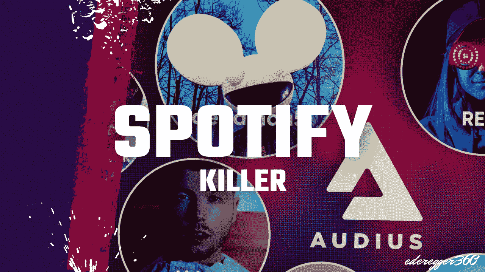

# 最令人兴奋的音乐加密项目投资

> 原文：<https://medium.com/coinmonks/the-most-exciting-music-based-crypto-project-to-invest-in-7cada67b9f0a?source=collection_archive---------5----------------------->

## 抖音合伙公司、迪德莫、凯蒂·佩里和史蒂夫·青木是其中的一些艺术家

Thumbnail mady by [Günter Ederegger](https://medium.com/u/4f0c50d16421?source=post_page-----7cada67b9f0a--------------------------------)

加密技术仍处于非常早期的阶段。虽然比特币和以太坊是最知名的形式，但许多其他项目正在后台出现。焦点不再是交易的简单处理。一…