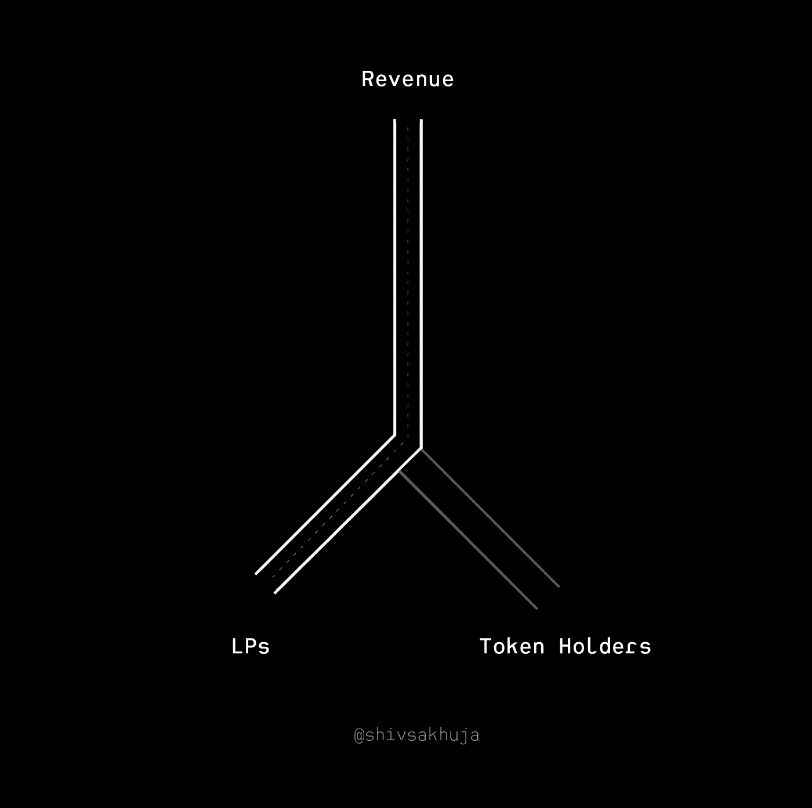
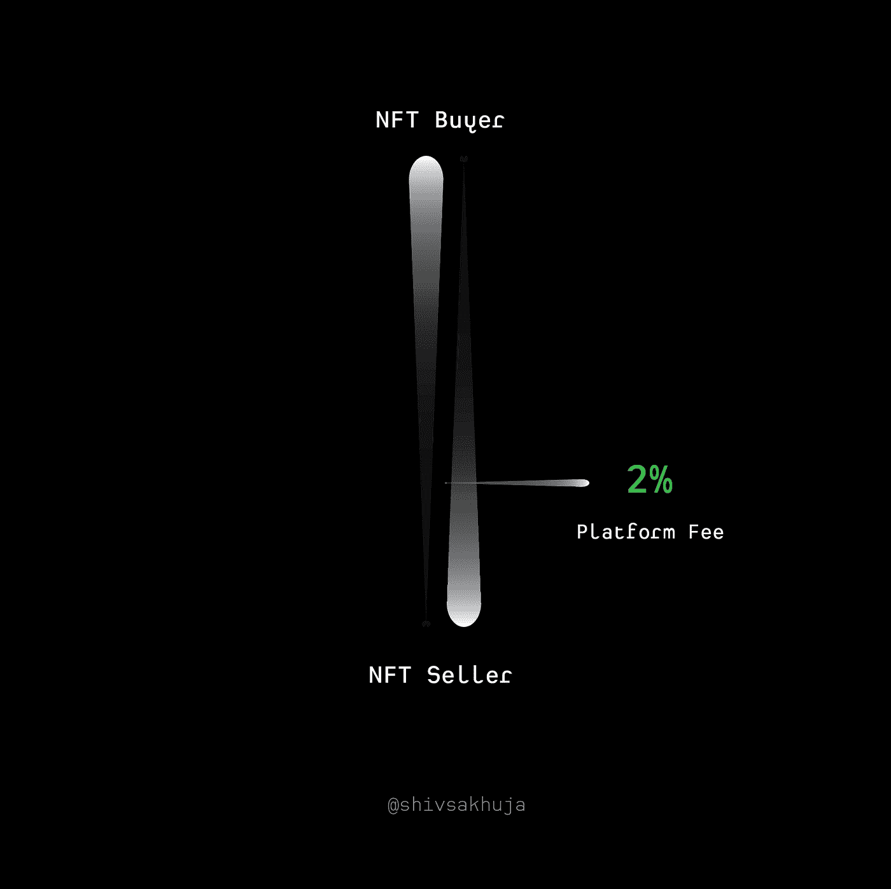
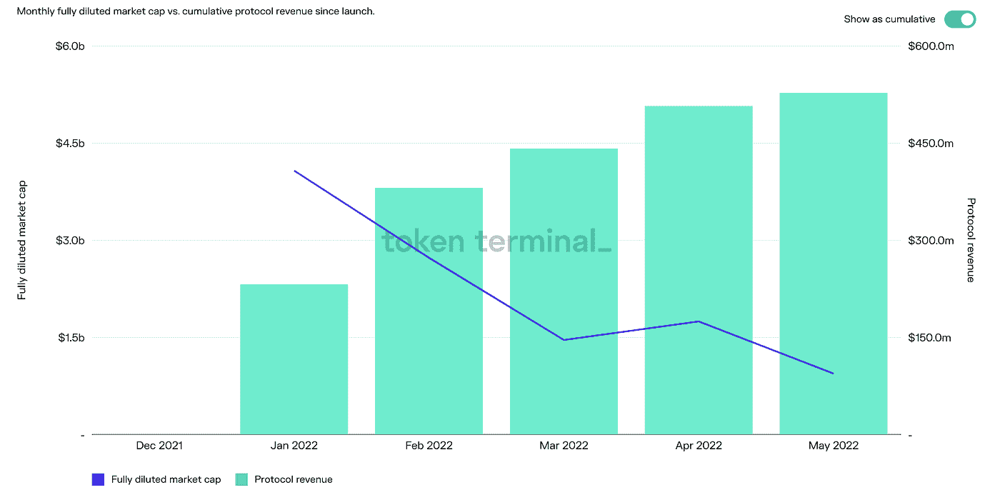
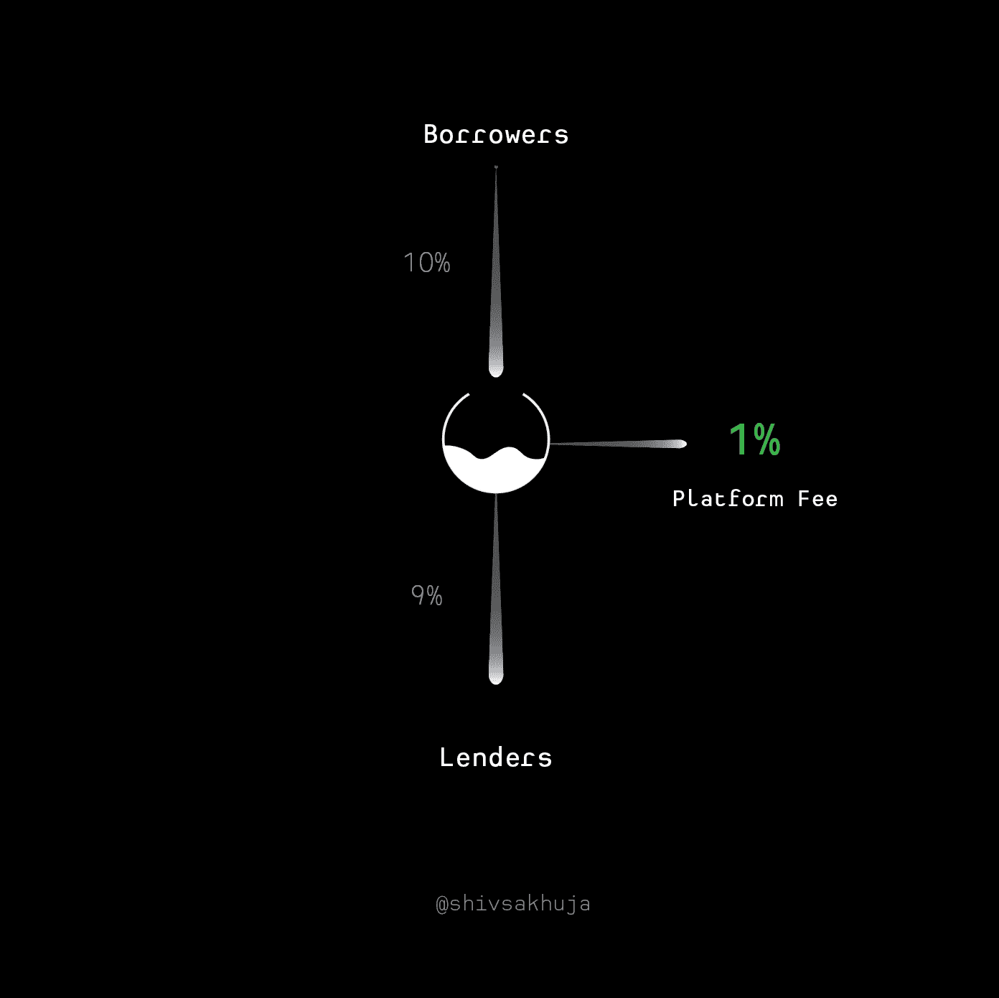
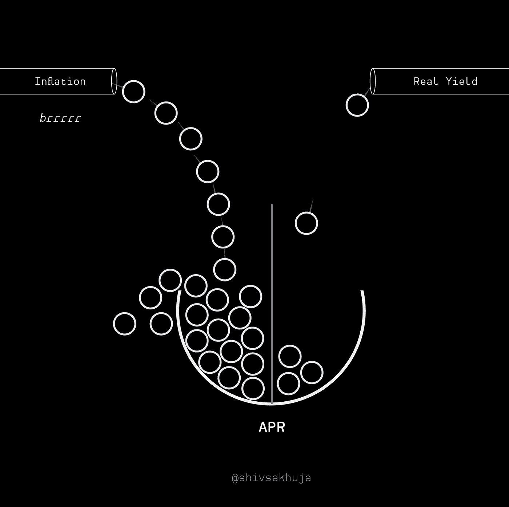
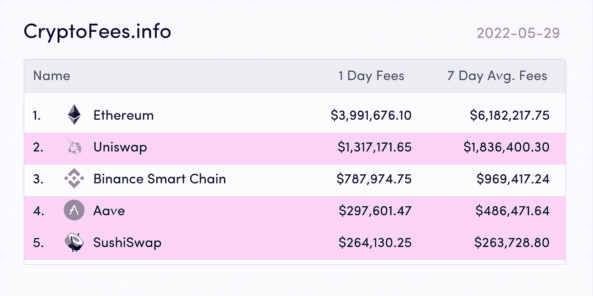
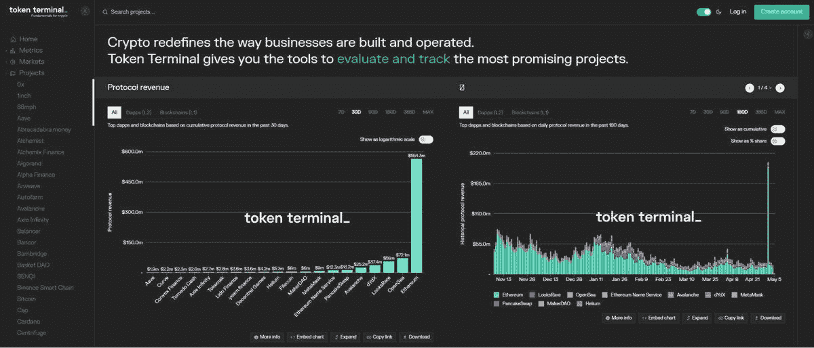
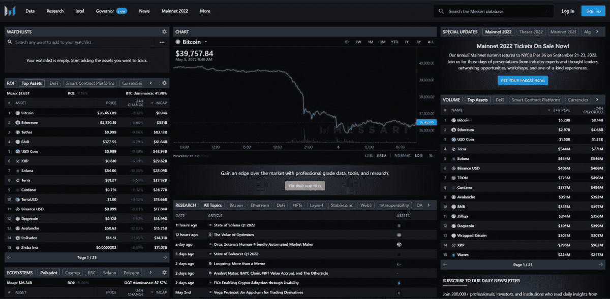

# 钱从哪里来？"

> 原文：<https://medium.com/coinmonks/the-most-important-question-for-crypto-investors-where-is-the-money-coming-from-5a3202aac720?source=collection_archive---------8----------------------->

*你可以在我的子栈*上阅读原帖

 [## 迪菲:钱从哪里来？

### “钱从哪里来？”这可能是 DeFi 中大多数投资者不会问的最重要的问题…

shivsak.substack.com](https://shivsak.substack.com/p/the-most-important-question-for-crypto-investors-where-is-the-money-coming-from-5a3202aac720) 

“钱从哪里来？”

这可能是 DeFi 中大多数投资者没有问的最重要的问题..👇 🧵

贷方、赌注者和流动性提供者从 DeFi 协议中获得%的奖励(APR ),作为他们存入硬币的交换。但这些收益率和承诺的年利率到底来自哪里？

许多项目建立在不可持续的庞兹经济学基础上，由通胀令牌支撑。重要的是确定项目的真正收入来源，其中大部分收入流向令牌持有者(即您)。

**以下是 DeFi 实际收入的一些例子:**

*   有限合伙人的交易费用
*   服务交易费
*   期权费/保险费
*   借款人利息

# 交易费用

交易者为能够在一对资产之间进行交易而支付的费用。

这些费用归那些为这一对提供流动性的人(即有限合伙人)所有。

有限合伙人通过以下方式获得其 APR:

1.  激励性奖励(不可持续)
2.  交易费用(真实)

APR 的很大一部分来自激励性奖励部分。这些奖励是通过象征性的通货膨胀资助的，是不可持续的。没有外部收入支持这些奖励。

另一方面，交易费是真正的收入。用户为有限合伙人提供的服务支付交易费。

*   [@traderjoe_xyz](https://twitter.com/traderjoe_xyz) 等少数指数收取 0.3%的交易费。
*   [@Uniswap](https://twitter.com/Uniswap) 交易手续费在 0.01% & 1%之间。

请注意，在 Uniswap 的案例中，UNI 持有者没有获得任何收入。所有这些都分配给了有限合伙人。

因此，尽管@Uniswap 已经处理了超过 1 万亿美元的交易量，但没有任何费用流向 UNI token 持有者。

> 关键要点:收入很重要，但最终你要寻找的是从收入中增值的令牌。(例如:通过向持有者分发或焚烧代币)

# 礼宾费

这些是支付给协议以换取提供服务的费用。

示例:

*   **过桥费:**过桥将资金从一个链条转移到另一个链条，他们向用户收取这项服务的费用。
*   **基金管理费:** [@iearnfinance](https://twitter.com/iearnfinance) 的 yVault 的对管理基金的服务收取 20%的绩效费和 2%的管理费。(与对冲基金相同)
*   **NFT 市场平台费:**像 [@LooksRareNFT](https://twitter.com/LooksRareNFT) 这样的 NFT 市场为卖家和买家牵线搭桥，促成交易。LooksRare 从每笔 NFT 销售中抽取 2%的平台费(私人销售除外)

[@LooksRareNFT](https://twitter.com/LooksRareNFT) 自年初推出以来，已经获得了价值 5 亿多美元的收入。这是人们为平台服务支付的真金白银。

你可以在 [@tokenterminal](https://twitter.com/tokenterminal) 上免费查看这样的分析。

# 借入利息

借款人的利息也是真实的收入，尽管其中大部分流入了贷方。协议保留并与令牌持有者分享的实际金额=借款人的利息-支付给贷款人的利息

# 不可持续的产量/陷阱

现在，让我们看看没有真正的、可持续的收入的协议的例子。

以下是 DeFi 中不可持续产量的一些来源，以及在评估方案时可能会陷入的一些常见陷阱。

## 通货膨胀收益率

哪个更大？6 片披萨还是 10 片披萨？都不是——是同一个该死的比萨饼。只是分成了更多的片。

## **通货膨胀收益率示例 1:有限合伙人激励性农业奖励**

农业奖励只是以通货膨胀为代价印刷和分发的代币。发行新代币的回报不是“真实”收益。

你可以通过短期的耕作和倾倒从它们那里潜在地赚取美元，但是它们不是真正的或可持续的收益来源。如果你是为了通货膨胀的象征性奖励而种田，一定要有奖励收获策略

 [## 奖励高产农民的收获策略

### 高产农民收获奖励策略简明指南...

0xilluminati.com](https://0xilluminati.com/e101ab9f64814b77ab6b00c112dce0f7) 

## **通胀收益率示例 2:通胀赌注收益率**

前 25 个 PoS 令牌的平均供应通胀率约为 8%。([来源](https://cointelegraph.com/news/without-staking-institutional-crypto-investors-cannot-escape-inflation))

赌注收益率来自:

*   新代币发行(供给膨胀)
*   交易费用(实际)

明白为什么识别多少是真实收入变得棘手了吗？

## 未知费用

支出可以是链外的，也可以是链内的，这使得评估现金流变得很困难。收入本身并不能让你了解资金流动的全貌。这只是一个数字，需要在更广阔的背景下来看待。

想象一下，在不知道一家企业花了多少钱的情况下，试图只根据收入来评估这家企业的价值。

WeWork 创造了数十亿美元的收入——听起来棒极了！…直到你发现它每年花费更多的数十亿美元=数十亿美元的损失😞

你应该寻找的是有多少价值的收入是去令牌。在大多数协议中，一部分收入回到令牌持有者手中。令牌持有者获得的协议收入几乎就像支付给股票股东的股息一样。

## 不可持续的收入

一些收入来源不可持续。

例如:Anchor 过去通过通胀奖励来补贴借款，以吸引更多的借款人需求。

利率波动，但有一段时间，你实际上可以从借款中获得回报。

借款人必须支付 20%，但他们也获得 27%的 ANC 代币奖励。

对借款人来说很好，但对 ANC 代币持有者来说就没那么好了。

当这些奖励枯竭时:

→借款需求骤降↓

→收入骤降↓

## 更多的嗅觉测试:

*   🚩完全依赖新代币购买者的收入
*   🚩如果没有奖励令牌协议不起作用

最后，这里有一些工具和资源，你可以用来跟踪资金流和 DYOR。

 [## 最佳工具

### 编辑描述

0xilluminati.com](https://0xilluminati.com/1f3a72793fc64eaca86f19a655610d94) 

*   https://cryptofees.info :非常适合查看一个协议赚取了多少费用

*   [令牌终端](https://twitter.com/shivsakhuja/status/1522502494198263808?s=20):区块链分析和协议[(https://tokenterminal.com/](https://t.co/ayE0wyP4rB))

*   关于加密市场的研究、情报和数据。( [https://messari.io](https://t.co/p85jfjiLxK) )

> DeFi 中最有价值的技能是能够找出如何从资金来源(外部收入)追踪到代币的价值累积点。

我将很快写下如何使用各种工具来跟踪资金。

在 Twitter 上关注我 [@shivsakhuja](https://twitter.com/shivsakhuja) 了解更多，并且[订阅我的博客了解更多](https://shivsak.substack.com/)关于 crypto 的真实用例。

> 交易新手？尝试[加密交易机器人](/coinmonks/crypto-trading-bot-c2ffce8acb2a)或[复制交易](/coinmonks/top-10-crypto-copy-trading-platforms-for-beginners-d0c37c7d698c)