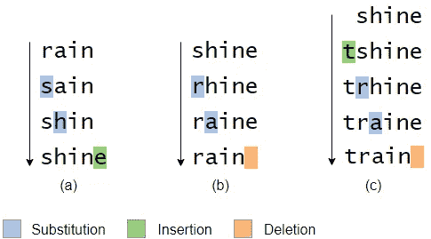
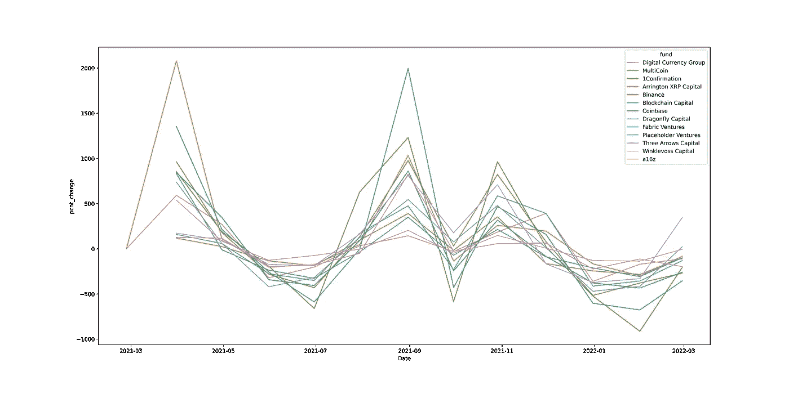
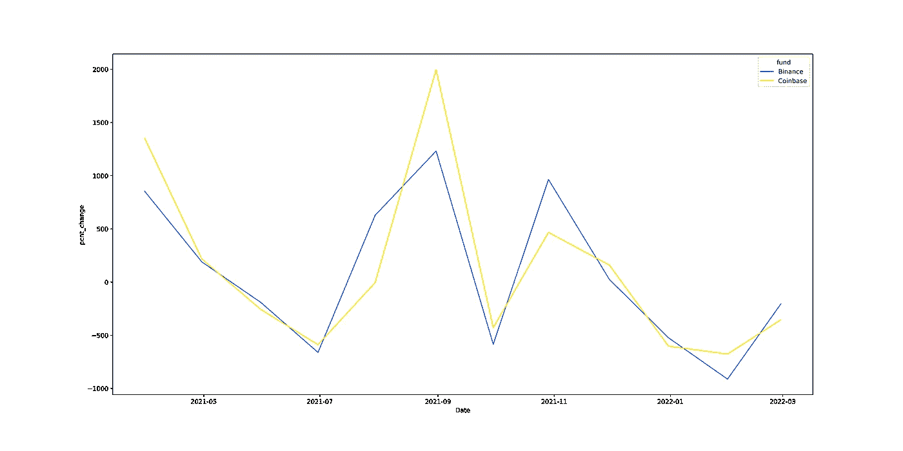
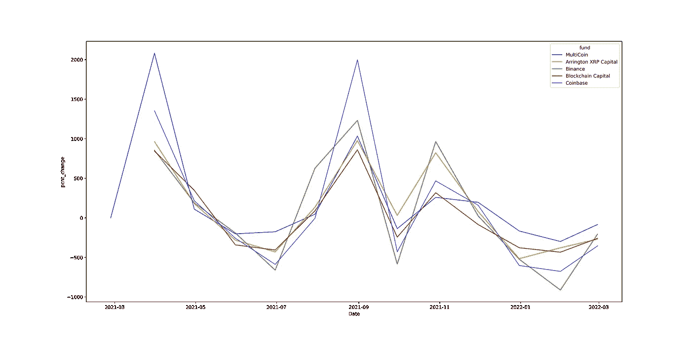

# 最受风投欢迎的加密硬币。

> 原文：<https://medium.com/coinmonks/the-most-popular-crypto-coins-for-vcs-c63a7fa9b820?source=collection_archive---------35----------------------->

## 以及哪只基金收益最大。


Photo by [Luke Chesser](https://unsplash.com/@lukechesser?utm_source=medium&utm_medium=referral) on [Unsplash](https://unsplash.com?utm_source=medium&utm_medium=referral)

我有兴趣看到一些风险资本家或对冲基金对不同加密硬币的投资。其中一个原因是当他们中的一个人在他们的投资组合中加入硬币时要保持警惕，另一个原因是要发现投资之间的任何交叉。

幸运的是，这个领域的许多风投会在网上公开展示他们的投资，https://www.coinbase.com/ventures 有[、https://labs.binance.com/有](https://www.coinbase.com/ventures)、币安有[。](https://labs.binance.com/)

## 刮痕

我写了一个 python 脚本，抓取我找到的不同资金([这里](https://github.com/WhatATragedy/Crypto_VC_Fund_Tracker))。这不是最好的，我手动检查了每一页，并用 bs4 提取投资组合。幸运的是，我只用请求就完成了所有的工作。这省去了下载 web 浏览器驱动程序和使用 Selenium 呈现 Javascript 动态内容的麻烦。

目前正在筹集的资金如下

```
MultiCoin
Binance
Coinbase
1Confirmation
a16z
Arrington XRP Capital
Blockchain Capital
Digital Currency Group
Dragonfly Capital
Fabric Ventures
Placeholder Ventures
Three Arrows Capital
Winklevoss Capital
```

如果你对代码感兴趣，请看看 GitHub repo—[https://github.com/WhatATragedy/Crypto_VC_Fund_Tracker](https://github.com/WhatATragedy/Crypto_VC_Fund_Tracker)

# 研究出投资最大的密码

我很快意识到，很多风投会投资同样的密码，但可能会写得稍有不同。一个很好的例子是“图形”，或者“Graph”或者“GRT ”,这使得连接比简单的字符串匹配更难。

> 方法 1 —使用顶级域名进行网站匹配(TLD)

许多风险投资基金会链接到该项目的网站，例如，图表也会链接到“[https://thegraph.com/en/](https://thegraph.com/en/)”。获得顶级部分，即“thegraph.com ”,我就可以使用它作为一个独立于 VCs 网站名称的连接。

> 方法 2 — Levenshtein 距离

如果你见过 Levenshtein distance，你就会知道它对这类问题有多好。如果没有，请给它一个谷歌，因为它会解释得比我好得多。

想象一下，你想知道“雨”离“光”有多近，Levenshtein 距离是到达那里的变化(插入、删除、替换)的数量。



## 顶级投资硬币

请击鼓…我们的 20 强是…

# 哪只基金表现最好

这就引出了我的下一个问题，去年哪家风投收益最好？不幸的是，风投网站并没有告诉我们他们何时买入或卖出硬币，但我认为大致看看发生了什么会很有趣

我想看的第一个情景是，如果他们在牛市的顶部卖出，即一年中的最高收盘价，谁赚得最多。

比特币基地赢了，如果他们在顶部卖出，会有 146177%的巨大收益！如果所有基金在 2021 年 1 月/2 月左右买入，它们将获得巨大收益。

我还计算了每月的滚动百分比增长，如下图所示。



中等大小的图像不够大，看不到上面的图像，但你可以看到，在 8 月份的 2021 年高点期间，许多基金表现良好，其中比特币基地领先。

比特币基地和币安的主要交易所是这样的—



排名前五的基金，看起来像这样—



# 网络应用

一段时间以来，我一直在研究神经经济学。上面你读到的关于寻找最受欢迎的风投硬币的工作已经被放入 AWS，我每 6 小时存储和更新一次。此处可查看:

 [## React 应用

### 使用 create-react-app 创建的网站

silly-bratt ain-56ba 53 . net lify . app](https://silly-brattain-56ba53.netlify.app/funds) 

有任何问题，请给我留言:)

亚历克斯

> 加入 Coinmonks [电报频道](https://t.me/coincodecap)和 [Youtube 频道](https://www.youtube.com/c/coinmonks/videos)了解加密交易和投资

# 另外，阅读

*   [如何开始用加密贷款赚取被动收入](https://coincodecap.com/passive-income-crypto-lending)
*   [BigONE 交易所评论](/coinmonks/bigone-exchange-review-64705d85a1d4) | [电网交易机器人](https://coincodecap.com/grid-trading)
*   [氹欞侊贸易评论](https://coincodecap.com/anny-trade-review) | [CoinSpot 评论](https://coincodecap.com/coinspot-review)
*   [新加坡十大最佳加密交易所](https://coincodecap.com/crypto-exchange-in-singapore) | [购买 AXS](https://coincodecap.com/buy-axs-token)
*   [投资印度的最佳加密软件](https://coincodecap.com/best-crypto-to-invest-in-india-in-2021) | [WazirX P2P](https://coincodecap.com/wazirx-p2p)
*   [7 个最佳零费用加密交易平台](https://coincodecap.com/zero-fee-crypto-exchanges)