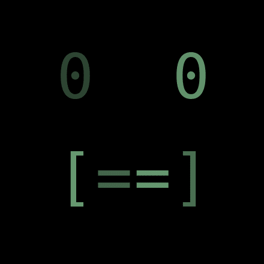

# 最流行的 NFT 标准让你的作品以代码的形式公开

> 原文：<https://medium.com/coinmonks/the-most-popular-nft-standards-make-your-art-publicly-available-in-code-189be4d75a01?source=collection_archive---------22----------------------->

在本文中，我们将探讨 NFT 如何工作的一些技术细节。我们将一起发现当前的 NFT 标准如何在代码层面上与保护您的艺术背道而驰，探索一些可能来自这种认识的新 NFT 思想，并学习如何更好地允许我们的 NFT 艺术向前发展。

# 那么什么是 NFT 呢？

显然，这是一个不可替代的令牌；一个独一无二的区块链，它有自己独特的价值、属性和所有权。

## 好吧，但是到底是什么？

实际上，NFT 是存储在智能合约中的函数和数据。NFT 的某些部分也可能存储在其他地方，比如 IPFS 或私人服务器。

我们感兴趣的 NFT 是符合 ERC721 和 ERC1155 标准的 NFT。这些是迄今为止最受欢迎的非功能性测试，几乎所有的非功能性测试都兼容 ERC721 或 ERC1155。虽然这些标准在实现上有所不同，但它们都提供了两组核心功能。

*   控制令牌所有权的函数。
*   从令牌中获取一些数据的函数。

出于我们的目的，我们对所有权函数不感兴趣。请记住，这些 NFT 可以在各种市场上买卖，这些市场知道如何与所有权功能进行交互。

返回数据的函数是我们要关注的地方。这在 ERC721 标准中称为 **tokenURI** ，在 ERC1155 标准中称为 **uri** 。我们的 NFT 的形象，动画，属性和任何其他媒体将由这个函数返回。

# 深入研究 tokenURI

让我们简化一下，只关注以太坊块链上的 ERC721 令牌。它们都有一个名为 **tokenURI** 的函数，返回 NFT 指向的数据。

当一个网站想知道 NFT 是什么样子时，它运行这个功能。无论该函数返回什么，都将定义网站以 NFT 的形式向用户显示什么。这通常包括图像或动画。

函数定义中有一堆定义其行为的关键字。我们特别感兴趣的是 **public** 。公开意味着任何人、任何地方都可以运行这个功能。对于谁可以请求用于显示 NFT 外观的数据没有限制。

您可能想知道“难道不是只有所有者才能运行这个功能吗？还是不应该以某种方式得到许可？”是的，理想情况下，那会更好，但是在网站上显示 NFT 会使事情变得更加复杂，所以标准只是让每个人都可以使用这个功能。这些细节经常被开发人员认为是理所当然的，没有进一步的思考，但是它们有一些奇怪而严肃的含义，我们马上就会看到。

**运行 tokenURI 函数是什么样子的？**

我们需要知道 NFT 的**合同地址**，假设是**0x 1337d 328458 b 15 CBD ad 00 b 368 add 0 c 1422 CAC 687**

我们还需要知道**令牌 id** ，假设在这种情况下是 **42** 。

运行该函数将如下所示

左侧告诉我们的系统，我们希望使用地址为 0x 1337d 328458 b 15 CBD ad 00 b 368 add 0 c 1422 CAC 687 的 ERC721 兼容合约。右边是说我们想用参数 42 调用它的 tokenURI 函数。

这将为我们获取感兴趣的 NFT 的图像和数据；位于 0x 1337d 328458 b 15 CBD ad 00 b 368 add 0 c 1422 CAC 687 的协定中的令牌 42。

# 将我们的知识转化为自身

虽然到目前为止我们一直保持事情相当简单，但现在我们要把它们放在一起，做一些新奇的事情。

我们知道如何创建自己的 tokenURI 函数来显示我们的 NFT..我们知道如何从 tokenURI 函数中获取数据，以查看令牌是什么样子的..

## 如果我们同时做这两件事呢？

好吧，这有点奇怪..

当有人运行我们的 tokenURI 函数时，我们的 tokenURI 函数将使用参数 42 运行契约 0x 1337d 328458 b 15 CBD ad 00 b 368 add 0 c 1422 CAC 687 的 tokenURI 函数。无论从该合同中返回什么图像和数据，我们的合同都会返回。

我们可以这样做，因为 tokenURI 函数是公共的，任何人都可以随时调用它，包括他们自己的 tokenURI 函数中的其他契约。

## 那么我们的 NFT 在网站上会是什么样子呢？

与我们称之为 tokenURI 的 NFT 完全相同！除了联系人姓名、合同地址和令牌 id 之外，它们可能都是不同的。但是 NFT 的图像和数据看起来是一样的。

# 我们能更进一步吗？

当然，如果我们添加一个函数来改变我们正在运行的 tokenURI 的 NFT 呢？

我们已经创建了几个变量(数据)来存储**目标契约**和**目标 id** 。我们还创建了一个名为 **setTarget** 的函数，任何人都可以运行它来更新这些值。

现在，当有人运行我们的 tokenURI 函数时，它将运行我们的 **targetContract** 和 **targetId** 指向的任何内容的 tokenURI 函数。我们 NFT 看起来就像 NFT 一样。如果有人运行 **setTarget** 并更改 **targetContract** 和 **targetId** ，那么我们的 NFT 将会在外观上发生变化，看起来像那个新的 NFT。

我们的 NFT 能够有效地变形，看起来像其他的 NFT，只用了几条结实的线。

# 作为一个严肃的 NFT，这会是什么样子呢？

很高兴你问了这个问题，我们还有很长的路要走，比如:

*   允许每个 NFT 管理他们自己的 targetContract 和 targetId。
*   支持 ERC1155 的 **uri** 功能。
*   根据 ERC1155 标准执行 tokenId 插值。
*   也许一些很酷的随机本地链上 SVG 艺术？
*   在设定 NFT 目标时，甚至可能是一些排他性的功能？

我们把所有这些都烹饪成了 Mimicus Etheriensis(又名 Mimic)。

如果你想在 mainnet 或 testnet 上找一个来玩，请到**模仿者协会** discord。

 [## 加入模仿者协会不和谐服务器！

### 在 Discord 上查看模仿者协会社区——和其他 21 个成员一起出去，享受自由的声音和…

不和谐. gg](https://discord.gg/7BWYQsv7ay) 

# 我们能阻止我们的 NFT 被这样代理吗？

当然，如果你的 NFT 是可升级的，或者你还在构建它们，那么这实际上是非常容易的。

我们增加了一个要求，即**消息.发送者.代码.长度**等于 **0** 。这意味着，如果我们的 **tokenURI** 函数由用户或网站运行，那么一切正常工作，他们将接收我们的图像和数据。但是如果 **tokenURI** 由另一个合同运行，那么我们告诉它抛出一个 fit，不要发送任何东西给他们。

我们也可以做一些更微妙的事情，像这样..

# 什么不能代理？

tokenURI 函数如此容易代理的原因是它实际上并没有做太多事情。在大多数情况下，它没有什么动态，也不关心谁在运行它。

随着 NFT 变得越来越普遍，互操作性越来越强，标准变得越来越强大，很可能这些新功能都不会对代理开放。如果 NFT 帮你解锁了一个网站，那就没办法代理了。如果 NFT 授予您在 DAO 中的投票权，也没有办法代理它。除非 NFT 明确允许这样做。

我们还可能看到 ERC721 和 ERC1155 标准的新版本变得更加流行。谁知道呢，也许这篇文章和相关的代码会为将来提供一些动力。

# 这种代码结构还有什么其他用途？

很难知道当一个新概念到来时，人们会如何创新。通常最佳用途在开始时并不明显。

一个应用可能是链上广告，其中大量用户持有(或者甚至被付费持有)广告 NFT。广告 NFTs 的控制器可以向第三方收费，以便在一段时间内将所有广告设置为特定内容。如果广告 NFT 的持有者喜欢他们的 NFT 在任何给定时间展示的东西，他们可以去市场购买实际的物品。

我们不确定这种程度的去中心化是否真的有必要解决这个问题，也许有更简单更集中的方法来做同样的事情。但至少这听起来像是一个伟大的黑客马拉松项目！

我们希望你喜欢阅读，也学到了一些东西。

—拟态学家协会

> 加入 Coinmonks [电报频道](https://t.me/coincodecap)和 [Youtube 频道](https://www.youtube.com/c/coinmonks/videos)了解加密交易和投资

# 另外，阅读

*   [麻雀交换评论](https://coincodecap.com/sparrow-exchange-review) | [纳什交换评论](https://coincodecap.com/nash-exchange-review)
*   最好的[加密税务软件](/coinmonks/best-crypto-tax-tool-for-my-money-72d4b430816b) | [硬币追踪评论](/coinmonks/cointracking-review-a-reliable-cryptocurrency-tax-software-5114e3eb5737)
*   [Stackedinvest 评论](https://coincodecap.com/stackedinvest-review) | [北海巨妖评论](/coinmonks/kraken-review-6165fc1056ac) | [bitFlyer 评论](https://coincodecap.com/bitflyer-review)
*   最佳[加密借贷平台](/coinmonks/top-5-crypto-lending-platforms-in-2020-that-you-need-to-know-a1b675cec3fa) | [杠杆代币](/coinmonks/leveraged-token-3f5257808b22)
*   最佳[加密制图工具](/coinmonks/what-are-the-best-charting-platforms-for-cryptocurrency-trading-85aade584d80) | [最佳加密交易所](/coinmonks/crypto-exchange-dd2f9d6f3769)