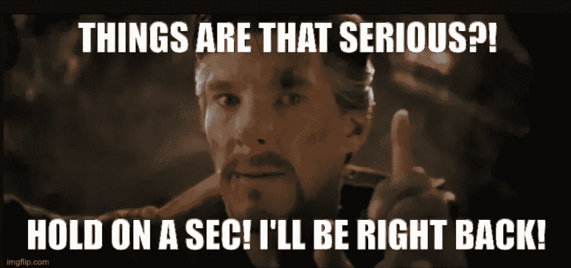
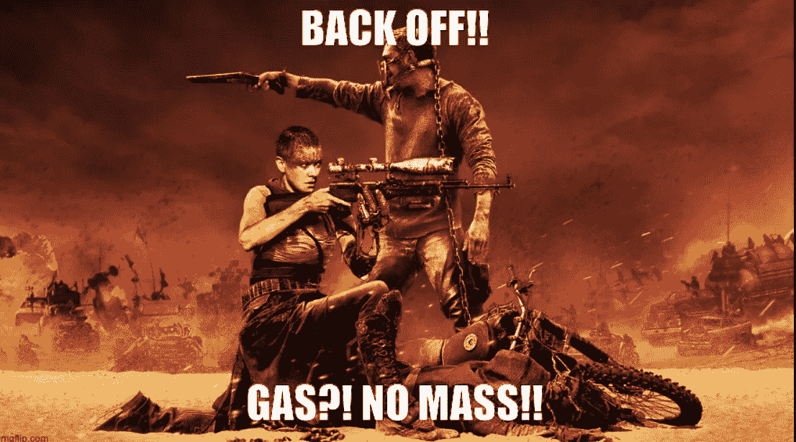
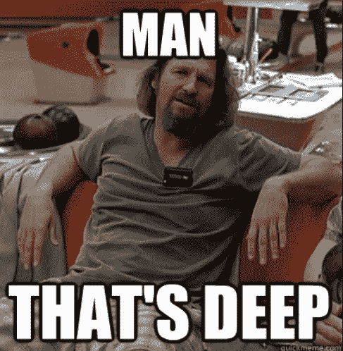
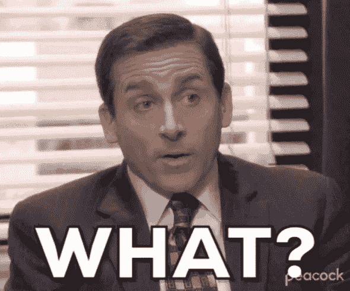
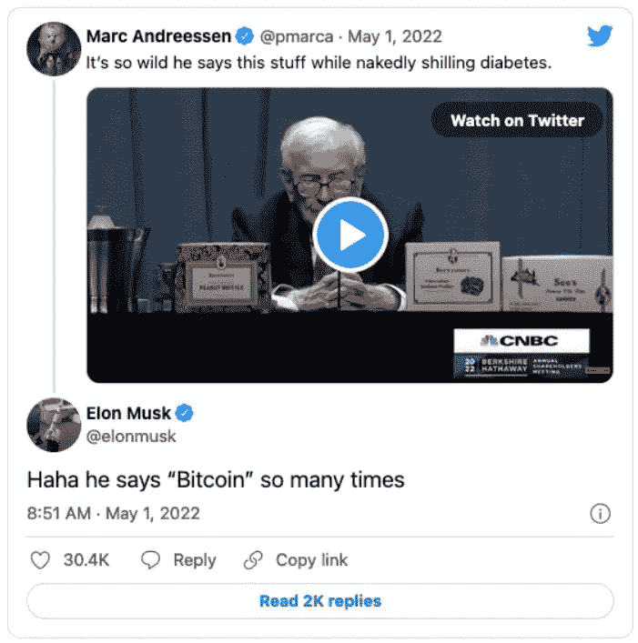
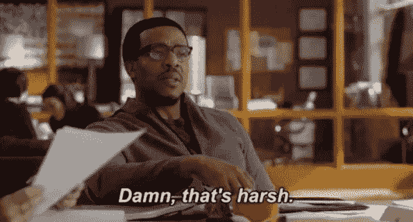
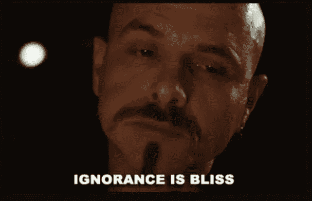

# 疯狂的多元宇宙:沃伦·巴菲特，埃隆·马斯克，通货膨胀与比特币

> 原文：<https://medium.com/coinmonks/the-multiverse-of-madness-warren-buffett-elon-musk-inflation-bitcoin-ca672ee3b708?source=collection_archive---------50----------------------->

因此，沃伦·巴菲特、埃隆·马斯克、通货膨胀和比特币都在同一句话中。这看起来像是某个笑话的开始。

但是，这并不是因为事情很严重。

疯狂的麦克斯很严肃。

绝望的时代呼唤古老而智慧的声音。“奥马哈先知”似乎是最佳人选。让我们听听沃伦·巴菲特对通货膨胀有什么看法。

这位 91 岁的老人周六表示:“你能做的最好的事情就是在某件事上表现得格外出色。”。以医生和律师等职业为例，巴菲特表示:“人们会给你他们生产的一些东西，以换取你提供的东西。”巴菲特补充道，与货币不同，技能是抗通胀的。如果你有一项技能是被需求的，那么无论美元值多少，它都将被需求。

唯一的问题是你得不到报酬。如果我做对了，我应该“生产”别人需要的东西，然后作为“交换”，我会得到我需要的东西——一个“产品”听起来是个可靠的计划。我可以写信来换取三明治。虽然我有法律学位，但我不能给你法律建议，但我没有通过律师考试，因为你知道——写作。因此，我们回到了良好的旧物物交换，即“两个或两个以上的当事人之间不使用金钱进行商品和服务的交换”。这是最古老的商业形式。”(投资媒体)

# 旧是金子，但实际上没有金子。比特币怎么样？

> *比特币经常被支持者吹捧为抵御通货膨胀的工具，被称为“数字黄金”(雅虎金融)*

太好了。问题解决了！毕竟，通货膨胀不能得到满足。为确保万无一失，请给我一点时间，快速与奥马哈先知沟通。

> *“如果你……拥有世界上所有的比特币，你出价 25 美元卖给我，我不会接受，”巴菲特说。“因为我会用它做什么？我不得不以这样或那样的方式把它卖给你。它不会做任何事情。”他将自己对农田和租赁房产相对于比特币的看法描述为“生产性资产和取决于下一个人比上一个人付给你更多钱的东西之间的区别”。*

你能从中得出什么结论？你要打电话给谁？啊，我知道。

# 比特币星系的守护者

这位“爸爸”是最先对沃伦·巴菲特咆哮的人之一。

另一方面，贝宝的“爸爸”一点也不温柔。

> 硅谷亿万富翁彼得·泰尔称沃伦·巴菲特是“来自奥马哈的反社会的爷爷”，尽管他谴责摩根大通老板杰米·戴蒙和贝莱德 CEO 拉里·芬克是“比特币的敌人”

泰尔“将巴菲特、芬克和戴蒙这三驾马车称为阻碍加密货币革命的‘老年政府’。”

我们就到此为止吧。那样更好。让我们把注意力集中在一些更紧迫的问题上。例如，在这些艰难时期，这些优秀的绅士们在做什么？

# 放松，亲爱的，跟着钱走

所有人都知道埃隆·马斯克用 440 亿美元做了什么，甚至包括那些尽最大努力试图生活在岩石下的人。沃伦·巴菲特呢？

[巴菲特告诉股东，就在 2 月 26 日他在年度信中告诉他们，他很难找到有吸引力的价格购买的东西后，伯克希尔在接下来的三周内花了 400 多亿美元购买股票。](https://apnews.com/article/business-earnings-omaha-warren-buffett-16d017b2579b9d7bb1cbff7f821e7578?ref=hackernoon.com)

等等！什么？伯克希尔。那是什么？

"伯克希尔·哈撒韦公司是一家美国跨国集团控股公司，总部设在内布拉斯加州的奥马哈."(维基)

那些钱都去哪里了？嗯，到处都是。你知道，只有安全的赌注。没有什么比 Twitter 更壮观和令人惊讶的了。石油行业、苹果公司和巴菲特的其他常见股票。

等等？通货膨胀时期投资于你的技能的演讲怎么了？“你”和“我”完全押韵，但只是在俗气的引用中。

巴菲特已经开始疯狂购物，这是自金融危机以来我们从未见过的

这是自 2008 年以来巴菲特在一个季度内在股票上花费的最多的现金…巴菲特，作为一个耐心等待便宜货的投资者，终于抓住了机会——而且是以外科手术般的精度抓住了机会

根据 Bespoke 投资集团的数据，他几乎 80%的购买发生在本季度最疲软的时候。这是一个非凡的时机 …可以说沃伦·巴菲特非常擅长“低买高卖”…但是还有第二个(也许更紧迫的)**因素促使巴菲特现在大举投资股票:通货膨胀** …当价格以 40 年来最快的速度上涨时，**现金就是垃圾。这有助于解释**巴菲特最大的 Q1 狂欢…

# 机器人会梦见电动绵羊和电动汽车吗？

哦，亲爱的塞弗，你说得太对了:

回到泰尔和他的这是斯巴达比特币“防御机制”，可以说，在一定程度上，我可以理解。但是埃隆呢？一只甜美的蓝色小鸟在他手里变成了社交媒体上的猛禽。为什么？如果他对加密很友好，那么他对加密并不热衷。Dogecoin 开始是一个玩笑，或者说我是生活在隐密岩石下的人。

# 马斯克就是放不下，不是吗？为什么？

你知道吗，巴菲特是中国“版”特斯拉——比亚迪的最大投资者(恕我直言，并为我对以下标签的无知道歉)？我不知道。

[“特斯拉是世界上最大的电动汽车制造商，第四季度交付了 308，600 辆电动汽车，高于第三季度的 241，300 辆、Q2 的 201，250 辆和 Q1 的 184，800 辆。但比亚迪正在迎头赶上。IBD 的埃德·卡森报道:“比亚迪去年 12 月售出 93，945 辆新能源汽车，同比增长 218%。”](https://cleantechnica.com/2022/02/02/warren-buffetts-byd-vs-elon-musks-tesla/?ref=hackernoon.com)

那条推特现在更有意义了，不是吗？

而且，埃隆是个能说会道的魔鬼，不仅仅是在推特上:

> *埃隆马斯克(Elon Musk)的电动汽车制造商报告称，3 月份销售强劲——其上海工厂交付了 65，814 辆汽车，同比增长 85%。该公司于 4 月 19 日重新开始生产——据* [*国营新华*](http://www.news.cn/fortune/2022-04/19/c_1128575346.htm?ref=hackernoon.com) *报道，甚至写信给上海市政府表示感谢，据* [*路透社*](https://www.reuters.com/business/autos-transportation/exclusive-shanghai-authorities-stepped-up-help-tesla-reopen-factory-letter-shows-2022-05-03/?ref=hackernoon.com) *。*

根据美国有线电视新闻网(CNN)上周的最新计算，至少有 27 个中国城市处于某种程度的封锁状态，影响了大约 1.8 亿居民，在这种情况下，一封感谢信是他最起码应该做的。

我们被困在疯狂、悲伤、痛苦和无助的多元宇宙中。我无法定义通货膨胀。我不是经济学家。但是，有件事我非常确定。在 Hacker Noon 上花时间写和读故事是不受通货膨胀影响的。保证！

*原载于 2022 年 5 月 6 日*[*【https://hackernoon.com】*](https://hackernoon.com/the-multiverse-of-madness-warren-buffett-elon-musk-inflation-and-bitcoin)*。*

> 加入 Coinmonks [电报频道](https://t.me/coincodecap)和 [Youtube 频道](https://www.youtube.com/c/coinmonks/videos)了解加密交易和投资

# 另外，阅读

*   [CoinDCX 评论](/coinmonks/coindcx-review-8444db3621a2) | [加密保证金交易交易所](https://coincodecap.com/crypto-margin-trading-exchanges)
*   [红狗赌场评论](https://coincodecap.com/red-dog-casino-review) | [Swyftx 评论](https://coincodecap.com/swyftx-review) | [CoinGate 评论](https://coincodecap.com/coingate-review)
*   [Bookmap 评论](https://coincodecap.com/bookmap-review-2021-best-trading-software) | [美国 5 大最佳加密交易所](https://coincodecap.com/crypto-exchange-usa)
*   [如何在 FTX 交易所交易期货](https://coincodecap.com/ftx-futures-trading) | [OKEx vs 币安](https://coincodecap.com/okex-vs-binance)
*   [CoinLoan 审核](https://coincodecap.com/coinloan-review) | [YouHodler 审核](/coinmonks/youhodler-4-easy-ways-to-make-money-98969b9689f2) | [BlockFi 审核](https://coincodecap.com/blockfi-review)