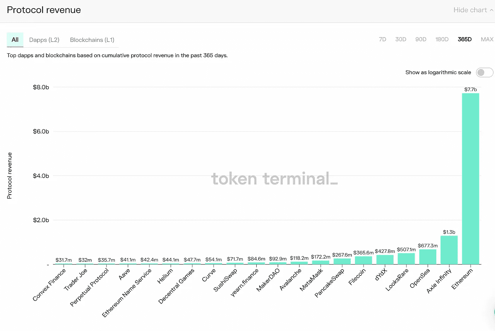

# 创造性破坏之舞

> 原文：<https://medium.com/coinmonks/the-musical-gale-of-creative-destruction-4a96c5b88748?source=collection_archive---------37----------------------->

多亏了 Web3，音乐人终于可以获得他们应得的份额了

Winslow Homer, [Summer Night](https://commons.wikimedia.org/wiki/File:Winslow_Homer_-_Summer_Night_(1890).jpg) (1890)

今天的音乐产业陷入了不公平和不稳定的平衡。音乐和舞蹈受到普遍喜爱，几乎和饮食一样是人类的基本要素。然而，当你比较音乐市场相对于这些必需品的规模时，似乎有些事情非常不对劲。

> 2021 年，人们在非音乐电视上的花费几乎是音乐的两倍(非音乐电视 440 亿美元，录音音乐 260 亿美元)，这是怎么回事？

当然，我们在食物上的花费比音乐多得多。这并不奇怪。但是这个比例惊人的大:去年人类在食物上的花费是音乐的 423 倍多:11 万亿美元在食品上对[260 亿美元在音乐上](https://www.statista.com/chart/4713/global-recorded-music-industry-revenues/)。虽然音乐显然没有食物重要，但 2021 年人们在非食物上的花费是音乐的近两倍(非食物 440 亿美元)，在视频游戏上的花费是音乐的五倍多(超过 2000 亿美元)。肯定有更多的人喜欢音乐而不是电子游戏吗？可以肯定的说，热爱音乐的人比非音乐专业的人多。这些数字表明，音乐行业存在根本性的问题。错误的是所谓的音乐寡头利用他们的市场力量阻止创新和变革，这将打开消费者的钱包和参与。

这并不是说音乐的生意没有被科技所触及。更确切地说，尽管发生了变化，但目前的大国还是设法保持了对资金流动的控制。制作和发行唱片的遥远工厂和漫长供应链已经一去不复返了；致力于储存和销售唱片、磁带和 CD 形式的音乐实体拷贝的庞大房地产网络已经不复存在；收音机、杂志和音乐电视频道这些复杂的营销和品味制造媒体(大部分)已经消失了。然而，即使在今天，所有这些庞大的基础设施都破产了，或者已经没有了以前的影子，音乐家们，这些创造者，没有他们就不会有一个产业，仍然像在这场变革之前一样，只获得他们音乐产生的收入的一小部分。

可以说，在流媒体和社交媒体创新之前，企业演员承担了成本和风险，从音乐人的收入中获得了公平的份额。世界已经变了，但音乐产业中的现有力量仍然抓住他们掠夺性和贪婪的经济租金不放。尽管它们的价值和用途已经不如以前那么重要，但音乐信托继续吞噬着所有音乐收入的 90%。他们的行为和经济主导地位阻止了新技术的引入和音乐进入新市场，抑制了这个最受欢迎的经济领域之一的潜在增长。

如果(当！)变革之风最终推翻了现任大国的统治地位？抖音的音乐活动预示着，一旦音乐家和乐迷们从寡头垄断强加给他们的枷锁中解放出来，将会发生什么。因为乐迷们能够使用抖音制作他们自己的音乐视频，并立即与世界分享，音乐市场在消费和参与方面经历了一个阶跃式的变化。抖音允许粉丝用他们最喜欢的音乐片段共同创造音乐体验，这个小小的事实打开了一扇通向音乐未来的窗户，向我们展示了当版权所有权的控制稍微放松时会发生什么。

数字描绘了画面。如今，苹果音乐(Apple Music)或 Spotify 等音乐流媒体服务上最受欢迎的歌曲通常会产生约 20 亿次累积播放，只有约 180 首歌曲的总播放量超过 10 亿次。相比之下，仅在 2021 年，抖音就有 430 首歌曲的浏览量超过了 10 亿次。更引人注目的是，抖音上最受欢迎的歌曲每年有 200 亿次点击*，几乎是 Spotify 上播放次数最多的歌曲的七倍(埃德·谢兰的《你的形状》累计播放次数为 3.1 亿次*)。**

> **抖音上最受欢迎的歌曲每年有大约 200 亿次*，比 Spotify 上播放次数最多的歌曲(Ed Sheran 的《Shape of You》播放次数为 3.1 亿次 ***累积播放次数*** 多近 7 倍。***

***如果这一项创新(允许粉丝制作自己的音乐视频)让一首歌的受众增加了 10 倍，那么竞争下一项音乐创新的整个世界肯定会让市场再增加 10 倍。或者更多？即使是目前规模的 100 倍，音乐产业仍然只有食品业的四分之一，比全球健康和人寿保险市场还要小。***

***真正激活蜂巢思维来重新想象音乐不仅需要在线传输和分享音乐的能力。这意味着允许艺术家拥有他们歌曲的版权，允许粉丝共同创作和拥有这些音乐。在区块链或“Web3”技术被广泛采用之前，这种所有权和价值共享是不可能的。***

***A16Z Partner Chris Dixon explains the difference between Web1, 2 & 3***

***正如 web 1(“Read”)允许任何人在任何地方即时获得每首歌曲的流媒体，web 2(“Read，Write”)允许任何人发布自己的音乐，Web3 和区块链世界(“Read，Write，own”)的出现允许价值流动，而没有任何中介和所有权被分割和共享。***

***在 2021 年，世界将会看到当人们被授权在元宇宙拥有不变的和独特的数字商品时会发生什么:***

*   ***九个协议现在产生了[>【1 亿美元的年收入](https://tokenterminal.com/terminal/metrics/protocol_revenue/cumulative)***
*   ***数字土地的累计销售额接近[十亿美元](https://www.cnbc.com/2022/02/01/metaverse-real-estate-sales-top-500-million-metametric-solutions-says.html)***
*   ***DeFi 已经达到[2000 亿美元的总价值锁定](https://defillama.com/)(高于 2020 年初的<10 亿美元)***
*   ***OpenSea 在 NFT 的年化销售额(使用 1 月份的数据)为 480 亿美元。***

******

***TTM Revenue for the top 20 crypto dApps & chains (source: [https://tokenterminal.com/terminal/metrics/protocol_revenue/cumulative](https://tokenterminal.com/terminal/metrics/protocol_revenue/cumulative))***

***未来一两年，随着音乐迁移到区块链，可能会看到类似的观念和价值的寒武纪大爆发。这已经开始发生了。像 [Weav Music](https://medium.com/u/c109eba918a8?source=post_page-----4a96c5b88748--------------------------------) 、 [Audius](https://medium.com/u/d2a18b7d79ed?source=post_page-----4a96c5b88748--------------------------------) 、 [royal](https://medium.com/u/8774f7bb130a?source=post_page-----4a96c5b88748--------------------------------) 、 [Bolero](http://boleromusic.com/) 、 [Arpeggi](https://www.arpeggi.io/) 、 [Asynch](https://async.art/) 、 [Rally.io](https://rally.io/) 、 [Descent](https://mirror.xyz/0x673Fc290d919684A1B1E46AA69152f7b56FBADD8/qsvUuJOGdjj_o49zqtIaSx8wh-92usgJMkkomv-LHNs) 、 [Sound.xyz](https://mirror.xyz/0x673Fc290d919684A1B1E46AA69152f7b56FBADD8/qsvUuJOGdjj_o49zqtIaSx8wh-92usgJMkkomv-LHNs) 、 [Catalog](https://beta.catalog.works/) 、 [Derive](https://derive.works/) 、 [MixCloud](https://www.mixcloud.com/)***

***感谢像这样的创新者，密码世界正处于摆脱当前行业僵化结构的尖端。这些先驱公司向我们展示了当区块链、NFTs 和 Web3 tokenomics 等技术融入音乐世界时，创造力、创新、参与和价值创造的可能性。他们向我们展示了像《无聊的猿》和《抖音音乐录影带》这样的 NFT 创新只是进入音乐创作、消费和所有权新世界的初步尝试。***

> ***加入 Coinmonks [电报频道](https://t.me/coincodecap)和 [Youtube 频道](https://www.youtube.com/c/coinmonks/videos)了解加密交易和投资***

# ***另外，阅读***

*   ***[如何开始通过加密贷款赚取被动收入](https://coincodecap.com/passive-income-crypto-lending)***
*   ***[BigONE 交易所点评](/coinmonks/bigone-exchange-review-64705d85a1d4) | [电网交易 Bot](https://coincodecap.com/grid-trading)***
*   ***[氹欞侊贸易评论](https://coincodecap.com/anny-trade-review) | [CoinSpot 评论](https://coincodecap.com/coinspot-review)***
*   ***[新加坡十大最佳加密交易所](https://coincodecap.com/crypto-exchange-in-singapore) | [购买 AXS](https://coincodecap.com/buy-axs-token)***