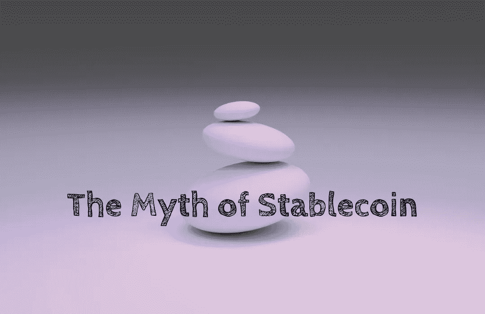

# 稳定币的神话

> 原文：<https://medium.com/coinmonks/the-myth-of-stablecoin-21ad507b617c?source=collection_archive---------38----------------------->

Photo by [Shubham Dhage](https://unsplash.com/@theshubhamdhage?utm_source=unsplash&utm_medium=referral&utm_content=creditCopyText) on [Unsplash](https://unsplash.com/s/photos/balance?utm_source=unsplash&utm_medium=referral&utm_content=creditCopyText)

稳定的硬币对 Defi 很重要。然而，稳定币并不像🧐.听起来那么稳定