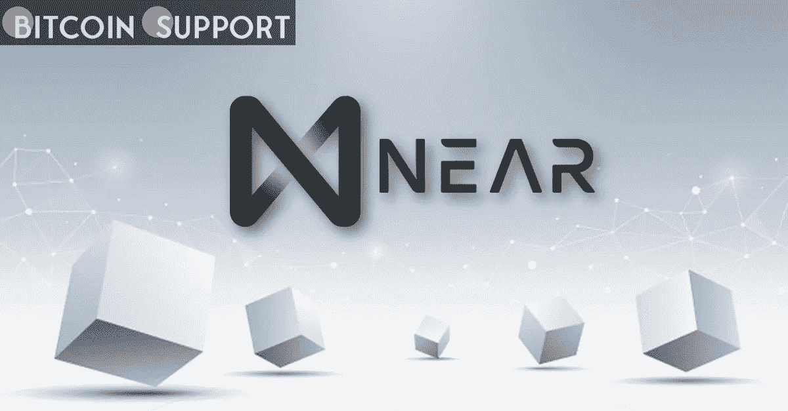

# NEAR Token 的价值在短短四周内翻了一番，原因如下

> 原文：<https://medium.com/coinmonks/the-near-token-has-doubled-in-value-in-just-four-weeks-heres-why-95f6b5255617?source=collection_archive---------42----------------------->

**Visit our website:-** [**https://bitcoinsupports.com/**](https://bitcoinsupports.com/)

由于风险投资家的信任投票和稳定的谣言，这种近币的价值持续上升。Near 是为 NEAR 的第一层区块链提供动力的硬币，它为加密市场传统上看涨的第二季度开了一个好头。

在四周内，代币的价值翻了一番，达到 20 美元，大大超过了主要的硬币:比特币在同一时期上涨了 15%，以太上涨了 30%。此外，根据数据来源 Messari 的数据，NEAR 是市值至少 10 亿美元的公司中的最大赢家。

据专家称，最近的一些发展，特别是风险投资基金对 Near 协议的注入，似乎引发了人们对硬币的新兴趣。DeFiance Capital 的投资分析师 CK·张解释说:“最近几轮融资表明，风险投资家对区块链有着强烈的信心。本周早些时候，该协议在对冲基金 Tiger Global 的资助下筹集了 3.5 亿美元，以加速 NEAR 生态系统的民主化。今年 1 月，Near 从知名加密货币投资公司获得了 1.5 亿美元。Trisolaris 是一个基于 Near 协议的去中心化交易所，本月早些时候，它宣布了来自 Electric Capital 的 450 万美元战略投资，以及来自 Jump Crypto、蜻蜓资本、Leminscap 和 Ethereal Ventures 的参与。该协议由前微软员工 Alexander Skidanov 和开发人员 Ilya Polosukhin 开发，是一个分散的可编程区块链，基于利益相关共识过程运行。去年 12 月，该公司推出了分片技术，以提高交易能力和速度，并降低整体支出。Messari 的汤姆邓利维(Tom Dunleavy)上个月在一篇研究文章中写道:“NEAR 开发了一种技术，可以实现快速(不到一秒)、快速完成(1-2 秒)、廉价(不到一便士)和安全的交易。”。因此，Near 似乎领先于全球最大的智能合约区块链以太坊(Ethereum)，后者尚未完成向股权证明方法的转变。“NEAR 似乎是以太坊 2 路线图的实现，”风险投资者 Naval Ravikant 在 1 月份关于第 1 层协议的一次对话中说道。根据加密评级公司 TokenInsight 的分析师鲁迪陈(Rudy Chen)的说法，附近的知名买家是最受欢迎的代币之一。

“附近的集会因各种原因而举行。首先是风险投资资金的涌入，其次是许多著名的意见领袖和有影响力的人目前正在附近举行并在推特上谈论它，”陈解释说。

“现在是大发现……DCG 新的第三大加密资产是……NEAR，”梅萨里的研究表明，NEAR 是 2021 年第四季度最广泛持有的加密资产之一。

著名的 Telegram group Crypto Insiders 的创始人佐兰·科尔(Zoran Schmidt)表示，Near 的开发者增长数字也非常出色。“他们拥有扩张最快的生态系统之一，在过去两年中，开发者总数增长了四倍。这种快速的开发者增长表明，该协议的采用和使用将在不久的将来继续，”科尔在周四的一篇博客文章中说。

[https://Twitter . com/Captain _ kole 1/status/1512270297126350851](https://twitter.com/Captain_Kole1/status/1512270297126350851)
**关于稳定币的建议**

根据协议推出两位数年收益率的稳定币(APY)的前景也可能提振投资者对加密货币的兴趣，陈建议。Crypto Insiders 的科尔周四宣布，算法稳定币 USN 可能于 4 月 20 日推出。这一高收益率将与 Terra 与美元挂钩的稳定 UST 币近 20%的年收益率相竞争，并将成为业内最高收益率之一。科尔在一篇帖子中说:“他们将给出极具吸引力的 20%的年百分比率，引发 DeFi 资本流入附近的生态系统，并将其他替代第一层协议中的总价值吸走。”。"随着吸引人的稳定币收益的叙述传播开来，这将导致一种接近 Terra (LUNA)的比较."

[https://twitter.com/resdegen/status/1512126024846303232](https://twitter.com/resdegen/status/1512126024846303232)

稳定货币(Stablecoins)，或其价值锁定于外部参考点(如美元)的加密货币，使用户能够逃避与其他加密货币相关的价格波动。由于 Luna Foundation Guard 选择收购比特币作为 UST 的储备，稳定币已经成为这个季节的特色。Frax 周五早些时候发布了类似的公告。

**访问我们的网站:-**[**https://bitcoinsupports.com/**](https://bitcoinsupports.com/)

**免责声明:以上为作者观点，不应视为投资建议。读者应该自己做研究。**

> 加入 Coinmonks [电报频道](https://t.me/coincodecap)和 [Youtube 频道](https://www.youtube.com/c/coinmonks/videos)了解加密交易和投资

# 另外，阅读

*   [Bookmap 点评](https://coincodecap.com/bookmap-review-2021-best-trading-software) | [美国 5 大最佳加密交易所](https://coincodecap.com/crypto-exchange-usa)
*   最佳加密[硬件钱包](/coinmonks/hardware-wallets-dfa1211730c6) | [Bitbns 评论](/coinmonks/bitbns-review-38256a07e161)
*   [新加坡十大最佳加密交易所](https://coincodecap.com/crypto-exchange-in-singapore) | [购买 AXS](https://coincodecap.com/buy-axs-token)
*   [红狗赌场评论](https://coincodecap.com/red-dog-casino-review) | [Swyftx 评论](https://coincodecap.com/swyftx-review) | [CoinGate 评论](https://coincodecap.com/coingate-review)
*   [投资印度的最佳密码](https://coincodecap.com/best-crypto-to-invest-in-india-in-2021)|[WazirX P2P](https://coincodecap.com/wazirx-p2p)|[Hi Dollar Review](https://coincodecap.com/hi-dollar-review)