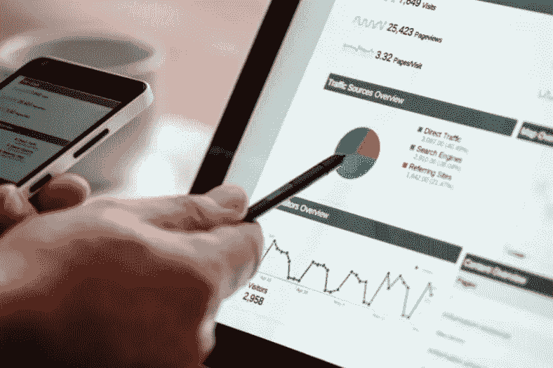

# 2022 年的最新加密趋势

> 原文：<https://medium.com/coinmonks/the-newest-crypto-trend-in-2022-a9714d3cb347?source=collection_archive---------44----------------------->

## Web 3.0 硬币



如今，一个新的术语已经占领了互联网:Web 3.0 或 Web 3。许多人声称这是未来。但是这到底意味着什么呢？在本文中，我们将讨论什么是 Web 3.0，2022 年的新兴加密趋势，Web 3.0 加密货币，以及如何在币安购买 Web 3.0 加密货币。

# **Web 3.0 是什么意思？**

未来的互联网，Web 3.0，旨在利用去中心化的区块链技术把权力还给用户和创造者。它承诺互联网将更少依赖于像谷歌或脸书这样的大公司，更多依赖于分散的网络。核心是，这是互联网的民主化，而不是我们今天看到的公司化，即这些大型企业集团或多或少地运营网络。

为了更好地理解 Web 3.0，我们需要了解它的前辈 Web 1.0 和 2.0。

## **Web 1.0**

Web 1.0 是第一个公开可用的网站。传统上，Web 1.0 是第一代万维网，其中网站大多是静态的，用于广播和浏览信息。Web 1.0 建立在去中心化和社区管理的协议上，用户群体主要是内容消费者而不是内容创造者。在这个时期，互联网大多只是只读页面的集合，没有任何真正的交互性。此外，绝大多数网站是由个人或小公司运营的。互联网巨头当时还不存在。

## **Web 2.0**

Web 2.0 改变了这种情况。Web 2.0 是我们今天熟悉和使用的互联网，包括更多用户生成的内容和越来越多的使用案例，而不是信息浏览，包括社交媒体互动和在线购物。Web 2.0 由一些公司运营的集中式服务所主导，这些公司有权审查用户生成的内容，并将数据存储在一个数据库或存储库中。

## **Web 2.0 与 Web 3.0 的对比**

Web 3.0 与其前身的不同之处在于，它是去中心化的，或多或少像 Web 1.0 一样，但像 Web 2.0 一样是交互式的。Web 3.0 依靠区块链技术和人工智能来打破大型科技公司对互联网的垄断，并将互联网还给普通人。尽管这有点像乌托邦，但由于 Web3 所需的大部分技术仍处于起步阶段，对于任何关注像 Meta 这样的大公司的统治地位及其控制人们如何体验互联网的愿望的人来说，这是一个有吸引力的愿景。

# **什么是 Web 3.0 加密货币？**

如今，加密货币正在推动 Web 3.0 的崛起。与 Web 3.0 相关的加密货币被称为 Web 3.0 令牌或 Web 3.0 加密货币。Web 3.0 拥有一个区块链驱动的分散式生态系统，用户可以在其中进行交互，而不用担心特定于数据的中央存储库。简单来说，在 Web 3.0 时代，搜索引擎、社交媒体平台、市场等。将建立在区块链上，并由加密货币推动，从而带来新的发展，如不受审查的内容和更具包容性的支付服务。与 Web 3.0 相关的加密货币被称为 Web 3.0 令牌或 Web 3.0 加密货币。理想情况下，Web 3.0 旨在借助分散的基础设施，让用户对其数字内容拥有更多控制权，将交易和许可的依赖性从中央机构转移出去。这对创造者经济来说是有希望的，当用户拥有或给在线社区带来数字数据和价值时，他们可以获得经济回报。

类似地，Web 3.0 可以为人们创造、购买和销售 NFTs 等商品提供基础。因为 Web 3.0 是一个分散平台上的应用程序和用户交互的集合，它很可能是高度可互操作的，并促进贸易和通信。事实上，Web 3.0 旨在托管更加开放、互联的网站，以获得更大的用户效用。Web 3.0 应用程序的一个例子是 Axie Infinity，一个连接游戏和分散金融(DeFi)的复杂游戏元宇宙。这款总部位于 NFT 的网络游戏要求用户首先购买一个 NFT 形式的 Axie 头像才能开始游戏，并使用虚拟货币 Axie Infinity Shards (AXS)和 Smooth Love 药水(SLP)。从玩到赚的游戏机制、自我调节供应和所有权激励是增加社区互动的几个功能，在 Web 3.0 时代，我们可能会看到更多这种类型的引人入胜的 DeFi metaverses 和 Web 3.0 令牌。

# 如何在币安购买 Web 3.0 加密货币？

自推出以来，Web 3.0 硬币已经获得了相当大的吸引力，最受欢迎的 Web 3.0 硬币可以在币安交易所找到。购买 Web 3.0 硬币有 3 个简单的步骤，如下所示。

> **第一步**

在币安上通过电子钱包转账或银行转账进行固定存款。一定要检查可用的法定渠道，寻找想要的货币。提示:将法定货币兑换成 BUSD 或 USDT 货币，这样你就可以交易更多种类的代币。

> **第二步**

通过钱包购买或直接使用信用卡/借记卡购买 Web 3.0 令牌。

> **第三步**

要使用您的 Web 3.0 令牌，请将令牌从币安加密地址传输到元掩码钱包地址。有关如何安装、配置和发送 Web 3.0 加密货币到您的 MetaMask 钱包的完整指南，请单击此处。

# **结论**

Web 3.0 硬币为塑造互联网的未来提供了巨大的潜力。只需购买或押注 Web 3.0 加密货币，即可参与这一激动人心的 Web 3.0 转变。

感谢您的阅读。关注我们以获取更多信息。

```
**Join us:**About X-Ra Gameverse:
X-Ra Gameverse(XRG) is a gaming guild providing the best P2E gaming experience for gamers from different alliances to utilize the functionality of guilds and maximize profits.[**Discord**](https://t.co/QVeGJm4eoo) **|** [**Twitter**](https://twitter.com/XRaGameverse)
```

> 加入 Coinmonks [Telegram group](https://t.me/joinchat/Trz8jaxd6xEsBI4p) 并了解加密交易和投资