# 下一个亚马逊，但是在区块链上？阿莱夫。Im 基本面分析

> 原文：<https://medium.com/coinmonks/the-next-amazon-but-on-the-blockchain-aleph-im-fundamental-analysis-ad183ab94bdf?source=collection_archive---------4----------------------->

这份基本面分析是 Crypto Consulting Institute 的付费时事通讯的一部分，提供市场洞察、可行的交易信号和基本面分析。更多信息请访问:【https://www.cryptoconsultinginstitute.com/newsletter 

你要的资料在二楼，第八个过道，从上面数第四个书架，从左边数第十二本书，第 182 页，第二段，第四行。

但是，如果这本书不在那里，而是被不恰当地放在了别处，会发生什么呢？

那么你不仅要努力找到这些信息，而且会对周围索引的准确性产生连锁反应。

星际文件存储(IPFS)允许对分散在网络中的数据进行内容识别，而不是索引。可以把它想象成由 BitTorrent 或 BitComet 这样的软件促成的点对点下载 Torrent。数据不是直接从一个来源下载的；取而代之的是，网络中的多个对等体贡献数据分组片段以聚集成一个文件。

比方说你下载一部电影；您可以从 20 个不同的网络参与者那里获得该数据集的一部分。即便如此，根据数据的性质，让 20 个独立的实体持有完整的数据集也是可疑的。这对音乐和电影等公开内容非常有用，但个人数据呢？

你会将个人数据的全部内容托付给 20 个陌生人吗？

如果您可以信任他们中的每一个人，并向他们提供数据碎片，使他们无法访问这些数据，那会怎么样？

但是，如果完成数据集的唯一方法是使用您的私钥将片段调用到一个完整的数据集中，那会怎么样呢？

继之前的 FAs 之后，您不断听到关于 IPFS 功能的消息，不仅仅是因为它是一项关键的功能，还因为 Web 3 的持续发展需要这种解决方案。

尽管我们可能希望将所有东西都放在区块链上，但链上数据存储非常昂贵，而且如果没有更大的数据集存储在链外存储，目前是不可行的。在这种情况下，区块链的作用是利用您的私钥来检索链外数据。

IPFS 将每个块标记为内容标识符哈希，而不是固定索引。如果这本书被放错了图书馆，它不会影响特定数据集的检索。

“不是你的钥匙，不是你的密码”很快就会演变成“不是你的钥匙，不是你的数据”。

虽然新兴的基于区块链的解决方案提供了不可变和抗审查的数据存储手段，但分散的云计算服务才刚刚开始成为远程托管本地应用程序且没有集中风险的可行手段。这是我们在整个 FAs 中尚未做出的关键区别。

存储数据是静态的，主要功能是上传和检索存储的数据。云计算包括利用处理能力运行 web 应用程序。

这是巨大的，不能低估。

许多项目正在开发针对静态数据集的 IPFS 功能，但很少有人寻求让分散的服务器运行计算过程，以确保任何有互联网连接的人都可以随时访问网站。

曾经想要运行一个 PoW 节点来挖掘加密货币(如 BTC 和 ETH ),但家里没有空间或必要的硬件？

你们中的一些人可能有运行自己的私有 AWS 或谷歌云服务器的经验，但是如果它们在源头被关闭会发生什么呢？

那么你的网站和对数据库内容的访问也会随之下降。

对 Web 3 有许多不同的定义。尽管如此，在基础设施层面，很少有像分散式云计算和 IPFS 那样至关重要的，它们将在第三代互联网中推动分散式 web 应用。

这篇文章将探索 Aleph 试图解决的问题。他们的技术在 Web 3 和互操作性环境中的含义。我们将回顾该项目的当前状态，以及可能阻止 Aleph 被认为是 Web 3 基础设施的关键部分的原因。

# 阿莱夫。Im 关键外卖；你的 TLDR 总结

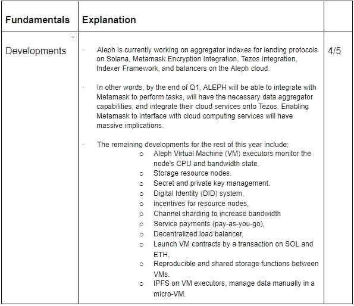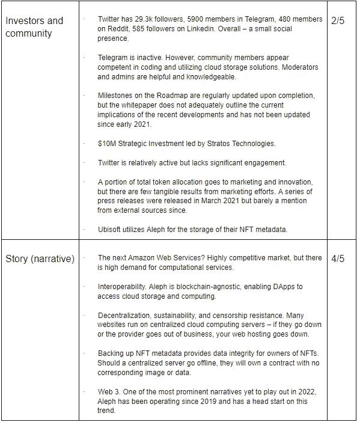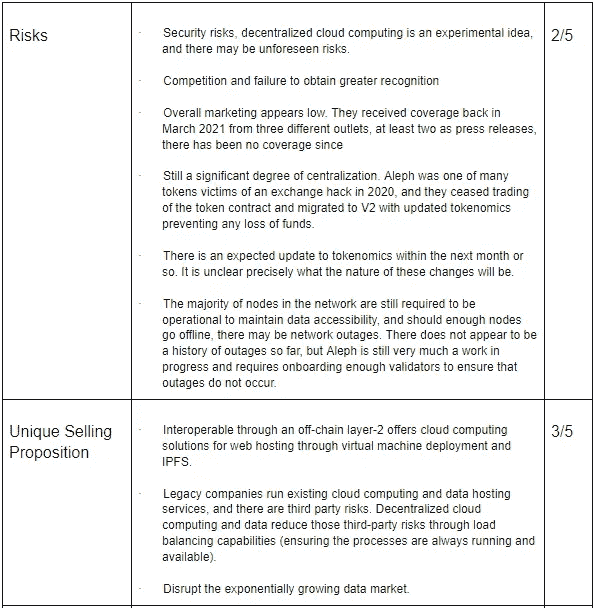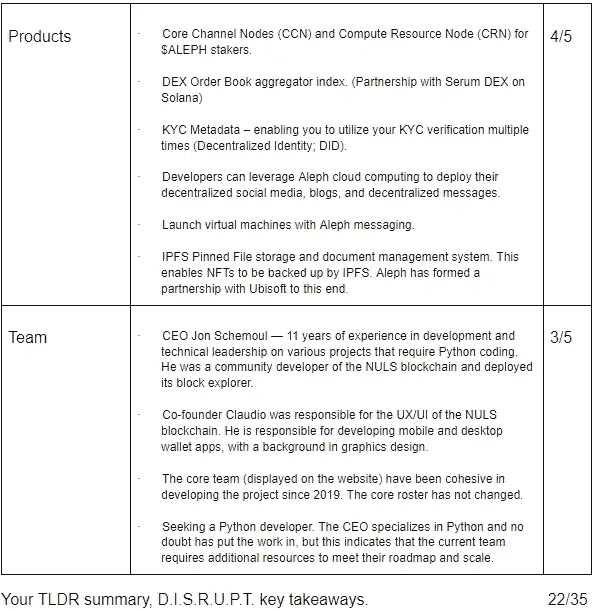

# 免费交出你的数据是昂贵的

世界正在向数字化的深渊越陷越深，以至于“数字主权”已经成为一个争论的话题。正如他们所说，“如果你不为产品付费，那么你就是产品”。许多人仍然认为中国是全球最大的国家。但考虑到像脸书这样的实体，更有可能的情况是，它是全球人口最多的数字主权，每月有 28.9 亿活跃用户。

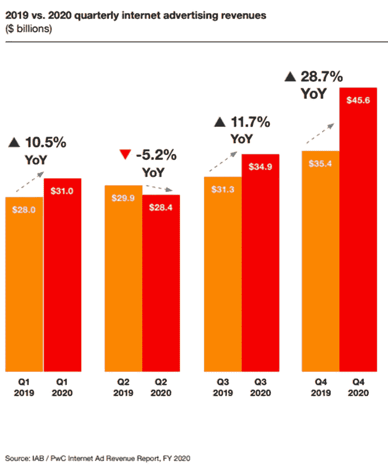

向第三方发布广告和出售个人数据是脸书和 Twitter 等社交媒体巨头每年获得数十亿美元收入的主要手段。

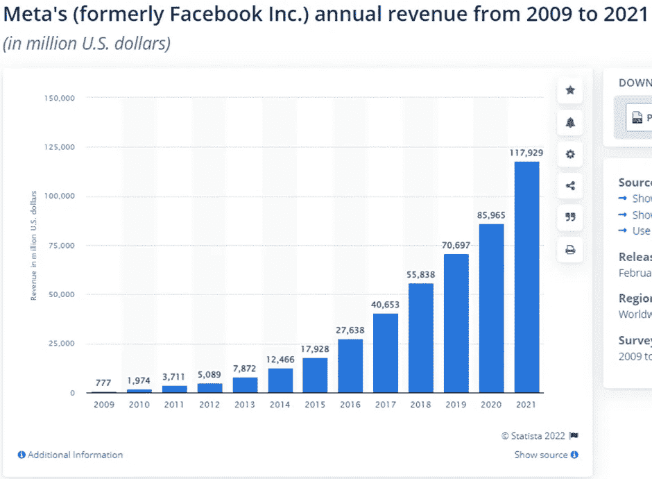

在这些企业应用这些创收措施之前，大数据市场在 2020 年的价值为 1389 亿美元，预计到 2025 年将达到 2294 亿美元。这是衡量公司在大数据上投资多少，而不是他们从中获得多少价值。尽管如此，它还是提供了一种大数据投入数据运营的资本有多少的感觉。

现在，这并不是说这些公司没有管理费用。维护数据中心和扩展存储容量以满足需求会产生间接成本。

我们数据的价值越来越明显。谷歌、脸书和推特不断收集我们的数据来瞄准我们的商业利益。

你们中有多少人对朋友说过“哦，也许我们下周末应该去露营”，过了一会儿，露营纪念品就会出现在你的新闻订阅上。抛开广告如何找到你的精确本质，提取数据来定位广告是可能的。

不管道德，你的数据让这些公司实现疯狂的利润。但是，如果标准的投注者能够参与维护一个分散的网络，并实现利润呢？

Web 3 的真正腾飞可能还需要一段时间，但考虑到数字领域现存的不平等反映了现实世界的权力斗争，这是不可避免的。大型科技公司控制着数据，并对你在网上能做什么和不能做什么拥有巨大的影响力。加密货币激励用户寻找分散的替代方案，为保护网络安全提供经济机会。

集中式数据库是一个重大的数据安全风险。我们已经在加密货币生态系统中的集中式交易所(Kucoin，Bitmex)和客户数据库(Ledger)的例子中看到了这种情况。MySpace、易贝、雅虎、全球关键基础设施和政府数据库都遭受过数据泄露和黑客攻击。当谈到集中式数据库时，这不是“如果”的问题，而是“何时”它们被外部参与者破坏的问题。

我们可以离线备份数据，但如果我们的系统被擦除，几乎不可能恢复。Web 2.0 的当前状态无法实现对数据的绝对控制和所有权。

尽管互联网从根本上改变了世界，但也不乏突出的问题。

# Aleph 你很高兴我没说 AWS

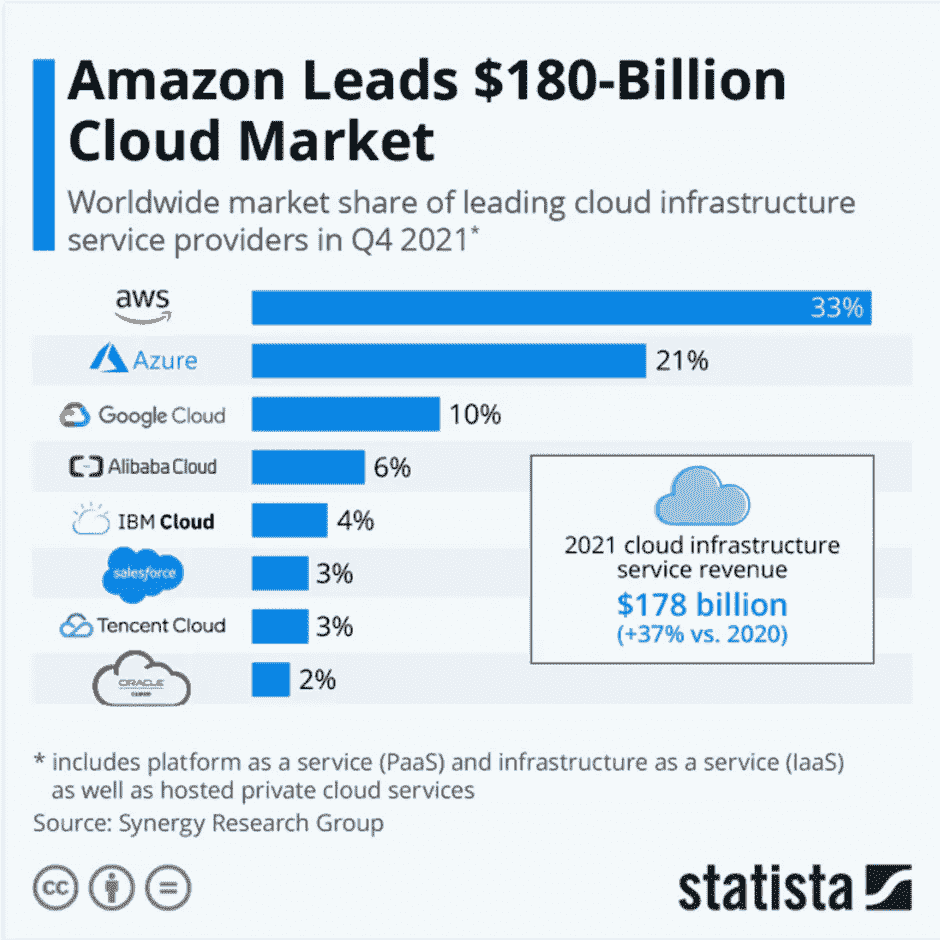

解决数据丢失的最新措施是越来越容易获得云存储服务。离线数据被同步到使用用户凭证访问的中央数据库中。但是正如提到的，当那些负责保护您的数据的人必须比那些利用您的数据获取非法利益的人领先一步时，在集中式数据库中就没有安全保证。用户也有责任管理他们的凭证，并使用比他们的狗的名字和他们高中毕业年份更难预测的密码。全球每天有近 40，000 人遭遇身份盗用。仅在 2019 年，身份盗窃就造成了约 169 亿美元的经济损失。

节点参与者较少讨论的一个问题是使用像 AWS 这样的集中式云计算服务。在区块链问题上达成共识的关键在于分权。正如我们已经提到的，存在不同程度的去中心化，但是如果 AWS 为网络中的大多数节点供电，则在服务器级别上为整个网络呈现单点故障。区块链的思想是，如果几个节点遇到连接问题，网络的其余部分可以补偿节点的损失。然而，进入 Aleph 网络的验证器和计算资源节点越多，数据变得越有弹性——分散的云计算可以进一步分散区块链共识，通过虚拟机部署远程提供动力。

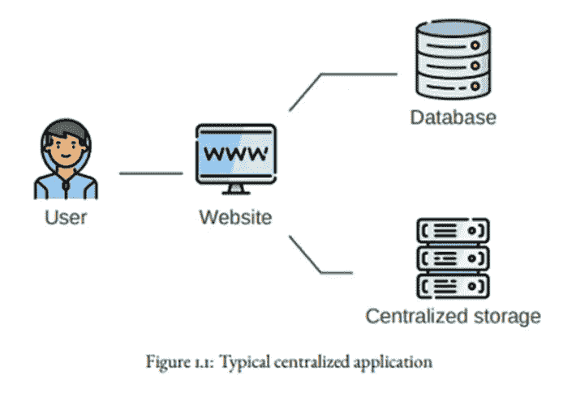

通常，用户与中央服务器上的网站进行交互，并存储在索引数据库中编目的数据。同样，一旦数据存储在服务器上，用户很难控制如何利用这些数据。有了脸书，你永远不会销毁你所有的数据。

那么，Aleph 的解是什么样的呢？

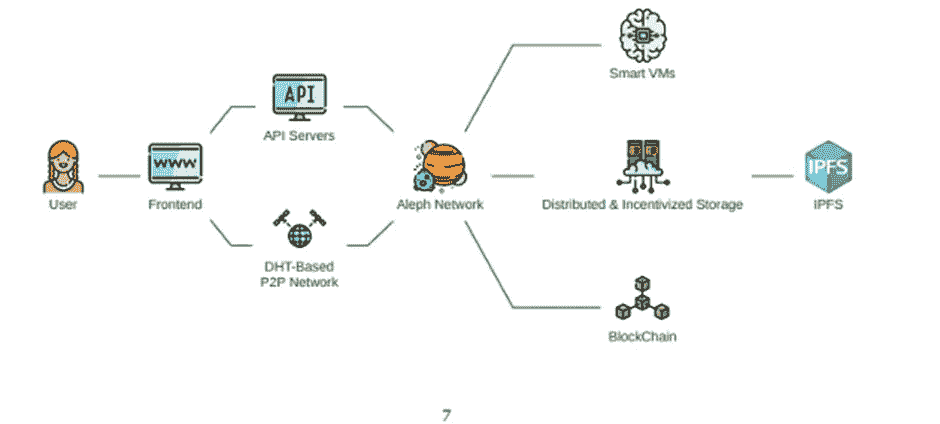

用户与前端交互以部署虚拟机(在由您的设备控制的远程服务器上安装操作系统)，作为 Aleph explorer 上可见的事务。访问数据的过程与访问加密钱包内容的过程相同。您使用一个 Web3 接口(在未来，Metamask，这是重要的)来签署允许访问您的数据集的事务。只有您的私钥可以访问这些数据。

假设您曾经在 AWS、Google Cloud 或 Vultr 上部署过虚拟机服务器。在这种情况下，除了使用您的私钥启动数据的上传和检索之外，这是一个非常相似的过程。

用户的初始输入开始了通过 Aleph 网络的旅程。该输入通过 API 服务器和对等(P2P)网络进行路由，以验证信息并将其传递给 Aleph 网络。

数据通过 ETH、SOL、NEO、BSC 等上传到 Aleph 网络。产生写入以太坊区块链的消息散列，与该散列相关的数据存储在 IPFS。您可以在以太网上上传数据，但希望在 BSC 上检索数据，所需要的只是散列消息。作为链外第二层解决方案，Aleph 试图创建一个数据桥，在流程中创建一个不可变的验证层。在检索和离线验证时，数据保持不变和不腐败。它可以从用户使用的区块链访问，换句话说，是交叉验证数据缓存的不可变参考点。

每个节点操作者通过网络存储数据包，这消除了集中式数据库的单点故障。$ALEPH 需要在“现收现付模式”下租赁云计算流程中使用的硬件。DApp 运营商可以在网络上运行一个节点，以优先处理与其 dApp 相关的数据，但他们不能忽视来自其他来源的数据流。它们还必须在存储网络中的碎片数据包方面发挥作用。这种 P2P 双向工作以最大化数据完整性，因为许多外来节点也存储它们的数据片段。

智能虚拟机或智能合同运行数据验证流程，解决数据真实性的争议。一旦满足要求，网络将能够从 IPFS 节点存储或检索数据，并从那里为部署的虚拟机维持计算过程。

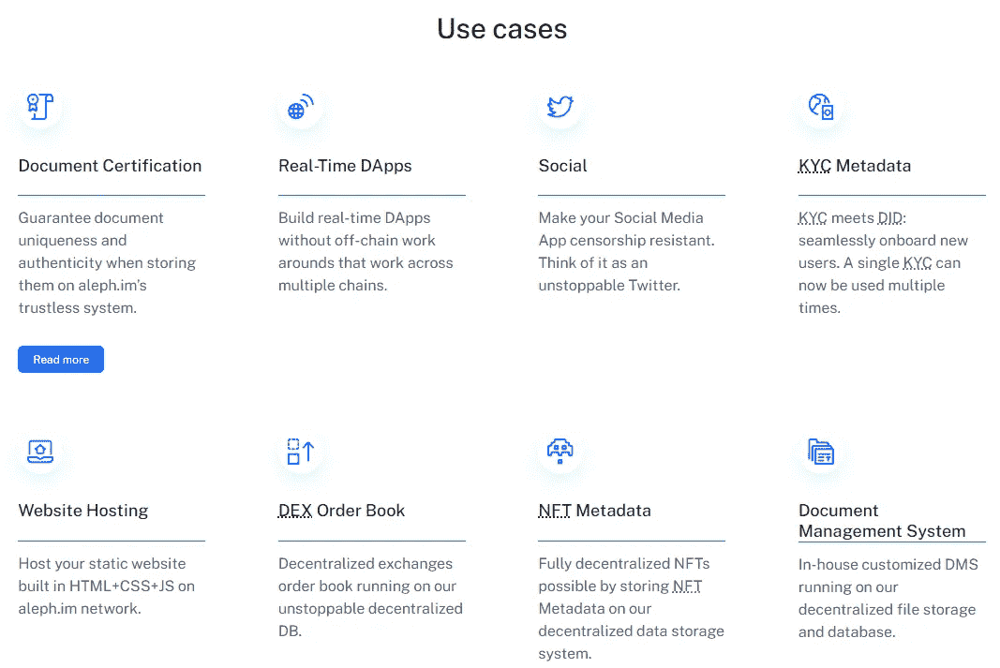

# $ALEPH Tokenomics

价格:0.386 美元

市值:74670254 美元

流通供应量:193414622

总供应量:5 亿

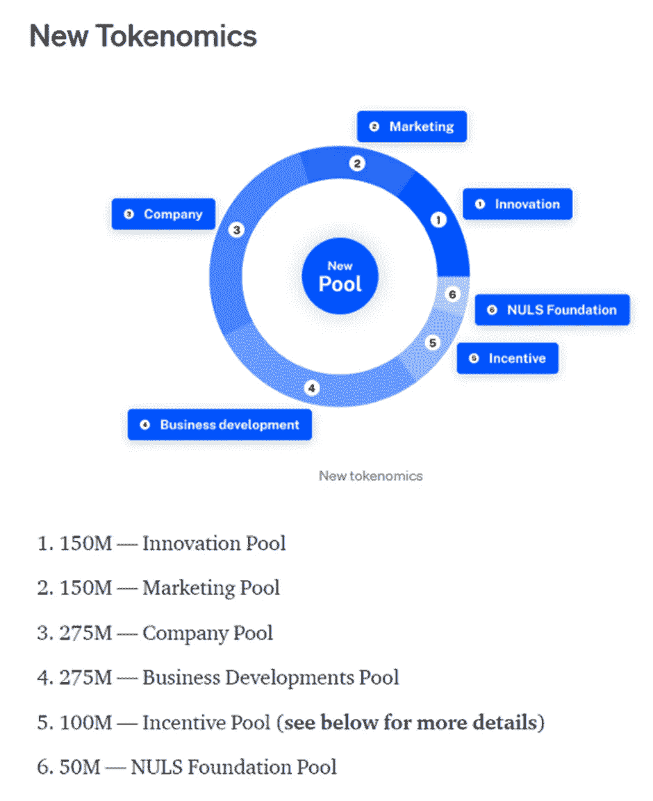

以上指的是令牌组学的更新版本，以实现跑马圈地和减少供应。总代币供应量为 10 亿。此外，有消息称，令牌组学即将进一步更新。

这些变化的确切性质尚不清楚，但很可能围绕计算资源节点的激励和流动性供应商激励的扩展。

下面标有$ALEPH 指标。

要操作一个验证器节点，需要 200，000 $ALEPH。

要授权，你需要 10，000 美元。

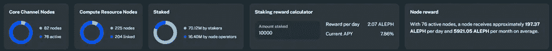

# 云中漫步—讨论

展望未来，一个需要考虑的大问题是互联网值多少钱？

不是每个人都有计算机科学和工程学位。尽管如此，每个人都明白互联网已经变得多么重要，尽管我们可能不明白是什么让它变得如此重要。

Web 3 的出现已经有一段时间了，但是定义仍然有些模糊，而且这个流行词本身的重复忽略了底层技术的细微差别。

每一个都在互联网的下一次发展中扮演着自己的角色，而且它也随着区块链技术在基础设施层面的快速发展而发展，这绝非巧合。

甲骨文、存储、数据令牌化、物联网(IoT)、钱包、P2P 音频和视频流、人工智能、大数据、网络安全和分析是合理符合 Web 3 范围的类别。当我们将这些类别分解时，它们共有三个基本功能:连接性、去中心化和不变性。

区块链的设计不连接外部系统。

智能合约也是不可变的，但使用 API 进行编码，通过 Chainlink、Band 协议和 API3 等 oracles 发送和接收外部数据，同时不能影响主机区块链的状态。这些外部信息可通过 Dapp 访问，用户通过 Dapp 访问虚拟机内的 Web 应用程序，并且需要 CPU 处理能力来维持虚拟机。

但是并不是每个人都有办法或愿望获得必要的硬件来成为网络上的验证者。此外，谁将托管服务器以确保 web 应用程序始终可用？

去中心化的云计算服务在未来将是必不可少的，以确保区块链不会危险地集中，并保持在共识水平上运行。当然，分散式云计算是推动下一代互联网的一部分，尽管是关键的一部分。

存储连接不同于云计算功能，但也是必不可少的。存储的文件是静态的，虽然 Arweave 在分散存储和 IPFS 服务方面领先，但缺乏计算虚拟机意味着它们不能提供运行时环境来支持应用程序。

Siacoin 提供云存储解决方案，以成为一个分散的 Dropbox，但受限于他们的区块链影响了他们的覆盖范围。ICP 有其复杂性，需要专门的硬件，此外，它们也受限于其本地网络。BitTorrent 是最分散的产品之一，它通过令牌奖励来激励更长的文件播种，但它们也大多局限于 Tron 网络。对于前面提到的以及 Holochain、Elastos 和许多其他软件来说，最大的限制是缺乏互操作性。当一个项目把自己限制在它的筒仓中时，他们这样做是危险的。

阿卡什似乎最有可能成为分散计算解决方案的主要参与者，但他们严重依赖宇宙 IBC 来实现互操作性。在某种程度上，他们未来的发展与宇宙同步。他们的优势在于他们可以接触到整个宇宙生态系统，并且可以跨链接触到 EVM 兼容的区块链。然而，它们仅限于 EVM 和与宇宙中心相连的生态系统。

让$ALEPH 与众不同的是，它是区块链不可知论者。它很少关心管理 Dapp 或区块链的代码，它只是提供了一种部署虚拟机的方法，节点运营商支持虚拟机来满足用户的特定计算需求。

从目前的情况来看，仅从市值来看，Filecoin 仍然远远领先于云计算解决方案，并且最近已经实现了与 Filecoin 虚拟机的高度互操作性。

正如您可能已经收集到的，Web 3 解决方案已经成为一个竞争异常激烈的领域，许多项目只是简单地利用一些时髦的词语，而不是给整个生态系统增加一些实质性的东西。市场仍在接受 Web 3 的简明定义及其发展的重要性顺序。例如，如果没有支持公用事业的基础设施，市场评估人工智能技术就没有什么意义。类似地，市场对第 1 层的重视程度超过了其配套的 DApps，因为没有前者，后者就不可能实现。

作为先行者是$ALEPH 的优势，这是其他可互操作的云存储解决方案所不具备的。他们已经实现了过去两年路线图中的目标，现在正进入第三年的发展阶段，我们应该会看到更多切实的使用案例出现。

不管怎样，虽然$ALEPH 有潜力，但他们可以从只开发了一年的 Filecoin 中学到很多东西。具体来说，就是通过细致入微的方式让用户参与到教育内容中。例如，构建这个 FA 需要将许多零散的信息放在一起。Filecoin 的登陆页面将带你进入一个连贯的互动之旅，体验他们的服务。他们经常发布博客，至少每周一次，在 Filecoin 虚拟机上的一个地方也有很多信息。此外，他们还与许多著名项目建立了合作关系，并继续定期宣布新项目。

现在，你可能会想，好吧，如果 Filecoin 这么棒，为什么不对他们做 FA 呢？

因为尽管他们在有利的市场条件下表现出色，我们可以合理地假设 10 倍，但你不会在短期内获得 100 倍，尤其是当他们处于 31.88 亿美元的水平，并在 2021 年 4 月达到 123 亿美元的高点时。如果你认为 Filecoin 可以获得这样的收益，我们必须证明云计算和存储是一个价值远高于 3.18 万亿美元的全球市场。根据传统云计算服务的市场数据，还有很长的路要走。尽管如此，在这些云计算生态系统中货币化区块链的数据需求可能是一个推动意外增长的变量。

Aleph 的市值为 7800 万美元。尽管这不会在一夜之间实现，但如果情况有变，我们也不会过于草率地认为，在有利的市场条件下，10 倍的市盈率是可能的。此外，78 亿美元的市值并非完全不可能实现 100 倍。如果 Filecoin 的历史新高是一个可靠的指标，这对 Aleph 来说可能会很快发生，因为它们符合主要投资叙事。

但是在你开始寻找代币之前，在 Aleph 起飞之前需要发生许多事情。

首先，他们需要解决缺乏营销的问题。“建立它，他们就会来”的方法是值得尊敬的，但考虑到 Aleph 有先发优势，并有一个工作产品，在我们看到结果之前，需要更大的努力来建立更大的追随者。Twitter 上 2.5 万名粉丝并不值得大书特书。鉴于分散云计算的竞争正在升温，Aleph 必须做出更大努力来开拓自己的领地。数据馅饼很大，有很多可以分配。

然而，鉴于他们的许多新闻稿都来自 2021 年 3 月，断言他们当时确实在寻求利用这种情绪并非不合理。但是营销缺乏一致性是他们的致命弱点。

第二，它们需要在建立伙伴关系方面更加雄心勃勃。虽然育碧、Serum 和区块链从合作的角度来看确实很重要，但他们的受众仍然有限。Aleph 确实寻求实现竞争的分散云计算服务所没有的功能。

将来能够从您的元掩码部署虚拟机智能合约确实是一件大事。简要考虑一下海洋协议也是有益的，该协议将数据集标记化，以便在数据市场上进行交易。运行分散式应用程序的 Aleph 虚拟机可以被令牌化，这使得买方可以使用这些分散式应用程序，而卖方可以开发高端分散式 web 应用程序来提供服务。

以上并不是要淡化 Aleph 迄今为止的努力。单靠一个项目无法解决 Web 3 实现中的所有挑战，这需要协作努力。但从投资者的角度来看，我们需要对冲我们的赌注。我们的分配应该与每个项目的风险状况和特定 Web 3 基础设施的整体重要性成比例。将我们所有的希望都放在一个项目上来交付下一代互联网是不明智的。

在试图预测哪些技术将在未来的互联网上发挥作用的背景下，Aleph 确实是一项值得接触的资产。他们已经开始推出一项关键技术，与 Filecoin 和 Akash 直接竞争，形成新互联网的基础，但口头传播不会切断它。

我们以前听说过，你可以建立世界上最好的技术，但如果没有人知道它或努力理解他们寻求实现的精确本质，它就没有多大价值。虚拟机及其含义不是特别直观。Aleph 需要通过教育更广泛的受众来加强营销，同时满足他们的发展里程碑。如果 ALEPH 能够坚持他们的路线图并解决营销中的缺点，那么获得指数增长的 Web3 蛋糕的大门将会打开。

# 参考

Aleph 网址: [https://aleph.im](https://aleph.im)

Aleph 白皮书，*可从网站*下载 PDF。

aleph 去中心化博客，《ICP 是骗局》，2021 年 6 月，[https://Blog test . aleph . im/s/f 062706745 b 060d 0e 88 efb 3 AFD 68 ce 12 BC 39d 5694d 15439 CB 46 BD 254494 ea 40 e](https://blogtest.aleph.im/s/f062706745b060d0e88efb3afd68ce12bc39d5694d15439cb46bd254494ea40e)

Cloudwards，“身份盗窃统计，2022 年你需要知道的事实和趋势”，2021 年 11 月 24 日，[https://www.cloudwards.net/identity-theft-statistics/](https://www.cloudwards.net/identity-theft-statistics/)

Cointelegraph，“Aleph 介绍 Dapp '备份' NFT 艺术作品”，2021 年 3 月 29 日，[https://coin telegraph . com/news/Aleph-introduces-Dapp-to-backup-NFT-art-pieces](https://cointelegraph.com/news/aleph-introduces-dapp-to-backup-nft-art-pieces)

挑衅地说，你真的拥有你的 NFT 吗？“机会是，你没有”，2021 年 3 月 31 日，[https://the defiant . io/do-You-really-own-your-NFT-chances-is-You-Don/](https://thedefiant.io/do-you-really-own-your-nft-chances-are-you-dont/)

以太网扫描 ALEPH 令牌合约:[https://以太网扫描. io/token/0x 27702 a 26126 e0b 3702 af 63 ee 09 a C4 D1 a 084 ef 628 #余额](https://etherscan.io/token/0x27702a26126e0b3702af63ee09ac4d1a084ef628#balances)

美国消费者新闻与商业频道，过去十年的十大数据黑客:[https://www . CNBC . com/2019/12/23/the-10-big-10-big-data-hacks-of-the-decade . html](https://www.cnbc.com/2019/12/23/the-10-biggest-data-hacks-of-the-decade.html)

无形中，‘你的数据值多少钱？2021 年的完整分解 2021 年 7 月 13 日[https://www.invisibly.com/learn-blog/how-much-is-data-worth](https://www.invisibly.com/learn-blog/how-much-is-data-worth)

准确地说，大数据值多少钱？很多，当它是质量数据:[https://www . precise . com/blog/big-Data/Quality-Data-big-Data-worth #:~:text = The % 20 big % 20 Data % 20 market % 20 is，他们% 20were % 20deriving % 20from % 20it。](https://www.precisely.com/blog/big-data/quality-data-big-data-worth#:~:text=The%20big%20data%20market%20is,they%20were%20deriving%20from%20it.)

Statista，“亚马逊引领 1800 亿美元的云市场”，2022 年 2 月 8 日，[https://www . statista . com/chart/18819/world wide-Market-share-of-leading-Cloud-infra structure-service-providers/](https://www.statista.com/chart/18819/worldwide-market-share-of-leading-cloud-infrastructure-service-providers/)

更新的 token omics($ ALEPH):[https://medium . com/ALEPH-im/update-on-ALEPH-im-token omics-and-incentives-programs-1961 ac7d 5109](/aleph-im/update-on-aleph-im-tokenomics-and-incentives-programs-1961ac7d5109)

雅虎财经，“金融服务提供商 Delchain 在 aleph.im 上推出核心渠道节点，以支持 DeFi 生态系统”，2021 年 3 月 26 日，[https://Finance . Yahoo . com/news/Financial-Provider-Delchain-launchs-Core-130000871 . html？。tsrc=fin-srch](https://finance.yahoo.com/news/financial-provider-delchain-launches-core-130000871.html?.tsrc=fin-srch)

你的密码图书馆，阿里夫。即时消息，2022 年 2 月 20 日，【https://yourcryptolibrary.com/coin/aleph-im-aleph/ 

> 加入 Coinmonks [电报频道](https://t.me/coincodecap)和 [Youtube 频道](https://www.youtube.com/c/coinmonks/videos)了解加密交易和投资

# 另外，阅读

*   [3 commas vs . Pionex vs . crypto hopper](https://coincodecap.com/3commas-vs-pionex-vs-cryptohopper)|[Bingbon Review](https://coincodecap.com/bingbon-review)
*   [加密复制交易平台](/coinmonks/top-10-crypto-copy-trading-platforms-for-beginners-d0c37c7d698c) | [如何在 WazirX 上购买比特币](/coinmonks/buy-bitcoin-on-wazirx-2d12b7989af1)
*   [货币评论](https://coincodecap.com/coinloan-review)|[Crypto.com 评论](/coinmonks/crypto-com-review-f143dca1f74c)
*   [如何在加拿大购买加密货币？](https://coincodecap.com/how-to-buy-cryptocurrency-in-canada)
*   [无聊猿游艇俱乐部(BAYC)评论](https://coincodecap.com/bored-ape-yacht-club-bayc-review)
*   [5 款最佳加密交易终端](https://coincodecap.com/crypto-trading-terminals) | [最佳 DeFi 应用](https://coincodecap.com/best-defi-apps)
*   [最佳网上赌场](https://coincodecap.com/best-online-casinos) | [币安评论](/coinmonks/binance-review-ee10d3bf3b6e) | [BitMEX 评论](https://coincodecap.com/bitmex-review)
*   [麻雀交换评论](https://coincodecap.com/sparrow-exchange-review) | [纳什交换评论](https://coincodecap.com/nash-exchange-review)
*   [美国最佳加密交易机器人](https://coincodecap.com/crypto-trading-bots-in-the-us) | [经常性回顾](https://coincodecap.com/changelly-review)