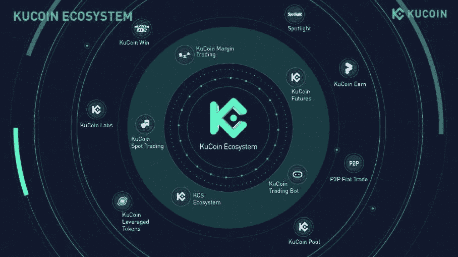

# 下一个大密码？

> 原文：<https://medium.com/coinmonks/the-next-big-crypto-4bbb7390a57f?source=collection_archive---------34----------------------->

(下文中表达的任何观点均为作者个人观点，不应构成投资决策的依据，也不应被解释为从事投资交易的建议或意见。)

当你在 crypto 中挑选下一个潜在的大硬币时，你到底在寻找什么？

市值？

或者可能是用例，可能是开发人员和项目团队。我知道很多人也研究硬币的技术分析。无论哪种方式，这都不是一个容易的过程，所以我会给你指出一个方向，可以减轻你的追求

$KCS

什么是库币代币(KCS)

● KCS 是库币的原生代币，允许交易者分享库币交易所的增长收益。

●持有至少 6 个 KCS 可以从平台上交易费用产生的 KuCoin 日营收的 50%中获得每日 KCS 奖金。

●使用 KCS 支付交易费用，享受 KuCoin 八折优惠。

●使用 KCS 参加 [Spotlight](/coinmonks/why-spotlight-is-the-easiest-way-to-10x-your-investment-in-a-short-time-edacac9c261a) (IEO)和 Burningdrop(新推出的泳池产品)，在 Travala 上预订行程，等等。

● KCS 被用作 KCC 唯一的燃料和本土代币，可用于支付燃气费和支持 KCC 上建设项目的开发。

●2022 年 3 月 29 日，KuCoin 与 KCS 管理基金会联合发布《KCS 白皮书》，开启了 KCS 的新时代。

●以“从极客到大众采纳”为愿景，KCS 正在区块链建立一个价值销售循环生态系统，旨在连接集权和分权的世界，探索 Web 3.0 世界。

你可以通过阅读[白皮书](https://www.kucoin.com/blog/kucoin-co-releases-kcs-whitepaper-with-kcs-management-foundation-revealing-the-20-million-kcs-burn)了解更多关于 KCS 的令牌经济学

Kucoin road map for KCS growth and adoption

KCS 是库币交易所和库币社区链(KCC)的本地令牌，并在 2022 年 Q1 奥运会上排名最高的交易所本地令牌。KCS 仍处于初级阶段，市值约为 12 亿美元，总发行量为 1.46 亿份，其中 65%已经流通。还值得一提的是，KCS 在本质上是通货紧缩的，这意味着 KCS 的一个标记部分将在给定的时间间隔内从流通中移除，直到其总供应量被限制在 1 亿 kCS。

你可能错过了币安·BNB，kucoin 平台的增长和一致性对 kcs 的增长至关重要，这对于爱好者和投资者来说是一个好消息，因为 kucoin 社区在各个方面都有强劲的增长，全球活跃用户增加了 200%以上，交易量排名前 5 位。所有这些都能够在不久的将来将 KCS 推向更高的高度。

与大多数其他加密资产相比，KCS 从峰值价格下跌了 65%以上，从历史高点下跌了约 40%，这是一种值得投资的加密货币，尤其是当你考虑到它仍然是低上限的，并且具有指数增长的基本基本面。

在进行了 77%的大幅修正后，尽管大多数替代硬币(包括许多好项目)都没有太大变化，KCS 仍然在绿色支持和第 15.0 回合附近保持强势

kcs analysis chart

根据我的交易风格，由于 KCS 在支撑位附近，我将在较低的时间框架内寻找多头反转设置，以确认多头准备好了另一次冲动(如双底，趋势线突破…)

除非我们跌破 15.0 支撑位，否则将会有一个运动，直到蓝色的较低支撑位，我将在那里寻找新的买入形态。

始终遵循你的交易计划，包括进场、风险管理和交易管理。

库币是世界上最大的密码交易所之一

💰该平台的总交易量为 6000 亿美元

🌎来自 207 个不同国家的 800 万注册用户

🖋库币被福布斯顾问评为最佳密码交易所

📌根据 Coinmarketcap 的数据，kucoin 在整体表现方面名列前三

⚙️特色:保证金交易/现货交易/交易机器人/赌注/采矿池和许多更多…

📈超过 600 个上市硬币和 960 个交易对！

通过以下链接创建一个帐户:

交易费 20%的折扣

[报名](https://www.kucoin.com/r/rf/r395ZQJ)