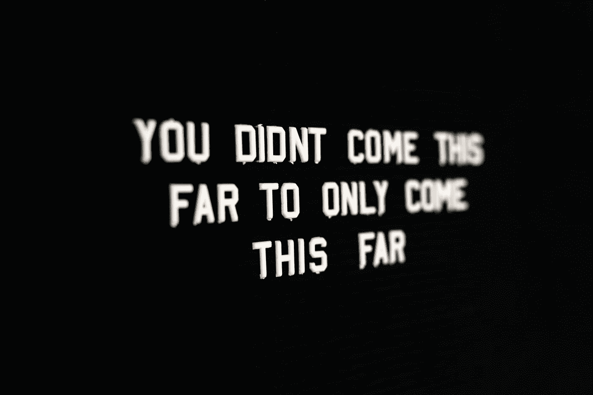

# NFT 氏症的下一步发展

> 原文：<https://medium.com/coinmonks/the-next-evolution-for-nfts-a6e3105df3e9?source=collection_archive---------17----------------------->

## 不，这不是更多的个人资料照片

*我们还没有看到任何东西……*

目前的 pfp(资料图片)爆炸对 NFT 理工大学来说不过是沧海一粟。

截至目前，还没有大 IP 大规模涉足数字收藏品领域。当我说大规模知识产权时，我指的是迪斯尼、网飞、苹果等真正的大公司。

想象一下，你可以用一张伪造成 NFT 的数字通行证进入所有迪士尼乐园度假区，欣赏独家艺术和参加特别活动。

你可以有不同的通行证，让你在迪士尼世界接触不同的产品和体验。不仅如此，你还能以一种简单、无摩擦的方式出售你的通行证并转让所有权。

迪士尼从每笔销售额中抽取 10%，你也可以把钱赚回来。

有些人可能永远不会卖。假设迪士尼为持有人提供了如此多的好处，以至于你不想离开。我说的是为长期持有人赚取迪士尼代币，独家访问等。

> 这是 NFT 潜力的下一个层次。现在所有这些侧面照片的移动都是小孩子的游戏。

NFT 理工大学在迪士尼层面的整合是这种方式成为主流的原因。你可以对任何体验做同样的事情，比如音乐节和剧院之旅。

所以，是的，就像所有那些 WL 邮报说的，我们来早了。只是不要去看亲民党的比赛。

下一关还在后头。

> *加入 Coinmonks* [*电报频道*](https://t.me/coincodecap) *和* [*Youtube 频道*](https://www.youtube.com/c/coinmonks/videos) *了解加密交易和投资*

# 另外，阅读

*   [3 商业评论](/coinmonks/3commas-review-an-excellent-crypto-trading-bot-2020-1313a58bec92) | [Pionex 评论](https://coincodecap.com/pionex-review-exchange-with-crypto-trading-bot) | [Coinrule 评论](/coinmonks/coinrule-review-2021-a-beginner-friendly-crypto-trading-bot-daf0504848ba)
*   [莱杰 vs n rave](/coinmonks/ledger-vs-ngrave-zero-7e40f0c1d694)|[莱杰 nano s vs x](/coinmonks/ledger-nano-s-vs-x-battery-hardware-price-storage-59a6663fe3b0) | [币安评论](/coinmonks/binance-review-ee10d3bf3b6e)
*   [Bybit Exchange 审查](/coinmonks/bybit-exchange-review-dbd570019b71) | [Bityard 审查](https://coincodecap.com/bityard-reivew) | [Jet-Bot 审查](https://coincodecap.com/jet-bot-review)
*   [3 commas vs Cryptohopper](/coinmonks/3commas-vs-pionex-vs-cryptohopper-best-crypto-bot-6a98d2baa203)|[赚取加密利息](/coinmonks/earn-crypto-interest-b10b810fdda3)
*   最好的比特币[硬件钱包](/coinmonks/hardware-wallets-dfa1211730c6) | [BitBox02 回顾](/coinmonks/bitbox02-review-your-swiss-bitcoin-hardware-wallet-c36c88fff29)
*   [block fi vs Celsius](/coinmonks/blockfi-vs-celsius-vs-hodlnaut-8a1cc8c26630)|[Hodlnaut 审核](/coinmonks/hodlnaut-review-best-way-to-hodl-is-to-earn-interest-on-your-bitcoin-6658a8c19edf) | [KuCoin 审核](https://coincodecap.com/kucoin-review)
*   [Bitsgap 审查](/coinmonks/bitsgap-review-a-crypto-trading-bot-that-makes-easy-money-a5d88a336df2) | [Quadency 审查](/coinmonks/quadency-review-a-crypto-trading-automation-platform-3068eaa374e1) | [Bitbns 审查](/coinmonks/bitbns-review-38256a07e161)