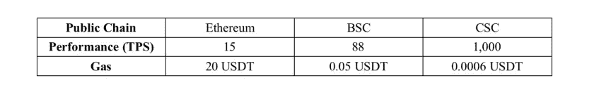

# 下一代区块链

> 原文：<https://medium.com/coinmonks/the-next-generation-blockchain-c112d9a35d14?source=collection_archive---------29----------------------->

***区块链***

*区块链技术的牵引力越来越大。市场表明，公司希望投资区块链解决方案，因此，选择一个可靠的区块链成为一项具有挑战性的任务。*

*那么，你如何拥抱这种炒作的趋势，并跟上创新的步伐呢？有没有可能寄希望于快速行驶的区块链列车将这个行业的潜力货币化？当然，你可以加入，但成功的关键是选择正确的区块链技术，这将推动你的创业成长。*

*已经不存在各种各样的主动区块链，但是选择最有效的一个对区块链行业的新手来说是一个巨大的挑战。最近，最受欢迎的区块链的崩溃引起了巨大的骚动，因为许多建立在这个生态系统上的项目一直在寻找挽救他们项目所剩无几的方法。在持续的危机中，Terra 区块链已经被停止，停止意味着没有新的区块可以在区块链网络上生成。区块链生态系统的崩溃导致其稳定的 UST 币崩溃，泰拉区块链也要求验证者(密码矿工)禁用链上交换。这使得开发者和投资者寻找一个值得信赖和稳定的公共链生态系统。*

****介绍*** [***CoinEx 智能链***](https://www.coinex.org/?lang=en_US)*

*[CoinEx 智能链——CSC 是一个去中心化、高效率的公链，由 CoinEx 公链团队为去中心化金融打造。它可以为开发者提供一个高效、低成本的链上环境来运行去中心化智能合约应用(DApps)和存储数字资产。CSC 致力于为区块链建设基础设施，并坚持分散化和无许可街区建设的原则。作为对高性能交易的支持，CSC 与 EVM 完全兼容，并应用 PoS 模型，以便所有用户都可以在没有任何许可的情况下通过标记令牌成为节点。](https://www.coinex.org/?lang=en_US)*

****选择区块链时需要考虑的因素。****

*随着 Web3.0 的爆炸式增长，我们现在在市场上有各种各样的区块链。有了这么多的选择，很难选择一个最适合你的项目。然而，在冒险开发项目之前，有几个因素你必须记住。*

## *1.交易速度*

*交易速度是区块链项目成败的主要因素之一。在所有可用的区块链中，具有较高事务速度的那个将在给定时间执行更多的事务。和区块链保安公司。*

*TPS(每秒事务数)是公共链性能的主要指标，指的是网络每秒可以处理的事务数。TPS 越高，公共链的效率越高， **CoinEx Smart Chain (CSC)号称 TPS 为 1000，这使得它比以太坊和 BSC 更高效。***

## *2.交易成本*

*交易速度也会显著影响交易成本。如果区块链的交易速度较慢，用户将不得不为优先于其他人的交易向矿商支付更高的费用。没有人愿意支付与交易本身价格相当的高额交易费。在开发区块链项目时，交易成本(燃气费)在项目的广泛采用中起着不可或缺的作用。如果你选择一个没有感觉结构的区块链，你可以在你的项目中吸引更多的兴趣。*

***中信建投效率极高，交易费用相对较低。**采用 POS 共识协议，CSC 秒生成一个 block，支持极高的 TPS，同时将交易费用保持在较低水平。*

**

*The Above statistics shows how CSC Strongarm's other blockchains.*

## *3.共识机制*

*有时，采用特定共识机制的区块链可能比其他共识机制更容易受到攻击。据统计，基于工作证明共识的平台比使用利益证明的平台面临更多的攻击。因此，在为您的项目选择区块链时，您可以使用利害关系证明共识或任何相关共识(如历史证明和权威证明)来区分优先顺序。最受欢迎的区块链以太坊也在考虑从当前的工作证明模型升级到以太坊 2.0 中的利益证明共识。区块链共识对环境也有重大影响，就像使用工作证明会导致高温室气体排放。*

***CSC 综合了 PoS 和 PoA 的特点，采用 PoS 作为底层的一致性机制，PoA 的块生成机制**。基于利害关系证明(PoS)的共识更环保，在性能方面优于基于 PoW 的共识(具有更少的块生成时间和更高的事务处理能力)。基于 PoS 的共识可以由社区灵活管理，而不会影响分散化。*

## *4.安全性*

*为项目选择区块链时，安全性是您必须考虑的另一个重要因素。随着区块链技术的发展，许多威胁也在增加。一些区块链容易受到特定的安全威胁，例如中间人攻击和 51%攻击。如前所述，工作验证共识更容易受到攻击，攻击者可以访问网络的大部分计算能力。如果您没有为您的项目开发选择安全的区块链，您可能会失去对攻击者的访问、数据和金钱。*

*交易速度也显著影响区块链安全性。凭借快速的交易速度，CSC 还增加了安全性，因为攻击者将有更短的时间。在 PoA 的分块生成机制下，CSC 网络中超过一半的 N/2+1 验证器是可靠可信的，大多数情况下网络可以安全正常运行。CSC 的可用性依赖于 PoS 共识中的验证器集合中的每个节点，它们可以及时生成块。*

## *5.跨链交换*

*在当前的多链宇宙中，跨不同链的资产交换需求越来越强。当 DeFi、NFT、GameFi 等类别的链上项目带来的回报在一定时期内出现波动时，这种需求会变得尤为明显。因此，对于公共链，跨链交换是生态系统扩张的主要部分，也是评估其潜力的标准之一。*

*目前，包括 BSC、Avalanche、Solana、NEAR 和 CSC 在内的公共链都引入了本机跨链桥，其中大多数只支持以太坊和部署它们的公共链之间的资产交换。而 CSC 桥则允许用户将资产从以太坊、BSC、TRON 转移到 CSC，反之亦然，满足了更多用户的需求，创造了更广泛的应用场景。*

## *6.智能合同功能*

*智能合约是任何 Web3 项目的基础，因为它们定义了区块链上两个实体之间的交易条款和条件。平台的整体安全性取决于智能合约，因此您必须拥有复杂且精心制作的智能合约。选择具有强大可靠的智能合约功能的区块链对于避免安全威胁至关重要。区块链采用的智能合同语言也是一个重要因素。*

*CSC 致力于其最初的开放、透明和易于操作的原则，已经与 ETH 和 BSC 上的智能合同完全兼容，使其对开发人员更加友好。*

***外卖 ***

*区块链技术的优势和好处很多。区块链集成到许多行业和公司，已经在数据保护方式上引发了一场地震式的转变，工作已经基本完成。通过区块链，带来组织挑战的关键领域现在可以轻松解决。*

*要获得更多资源，*

*   *加入 CSC 的[电报组](https://t.me/CoinExChain)。*
*   *关注 CSC 的[推特](https://twitter.com/CoinEx_CSC)账号。*
*   *加入 CSC 的[不和](https://discord.gg/5uBGRW9qSp)小组。*

*关注我的[推特](https://twitter.com/kryptmystro)获取更多更新。*

> *加入 Coinmonks [电报频道](https://t.me/coincodecap)和 [Youtube 频道](https://www.youtube.com/c/coinmonks/videos)了解加密交易和投资*

# *另外，阅读*

*   *[如何在印度购买比特币？](/coinmonks/buy-bitcoin-in-india-feb50ddfef94) | [WazirX 审查](/coinmonks/wazirx-review-5c811b074f5b)*
*   *[CryptoHopper 替代品](/coinmonks/cryptohopper-alternatives-d67287b16d27) | [HitBTC 审查](/coinmonks/hitbtc-review-c5143c5d53c2)*
*   *[CBET 评论](https://coincodecap.com/cbet-casino-review) | [库库恩 vs 比特币基地](https://coincodecap.com/kucoin-vs-coinbase)*
*   *[折叠 App 审核](https://coincodecap.com/fold-app-review) | [Kucoin 交易机器人](/coinmonks/kucoin-trading-bot-automate-your-trades-8cf0ca2138e0) | [Probit 审核](https://coincodecap.com/probit-review)*
*   *[如何匿名购买比特币](https://coincodecap.com/buy-bitcoin-anonymously) | [比特币现金钱包](https://coincodecap.com/bitcoin-cash-wallets)*
*   *[币安 vs FTX](https://coincodecap.com/binance-vs-ftx) | [最佳(索尔)索拉纳钱包](https://coincodecap.com/solana-wallets)*