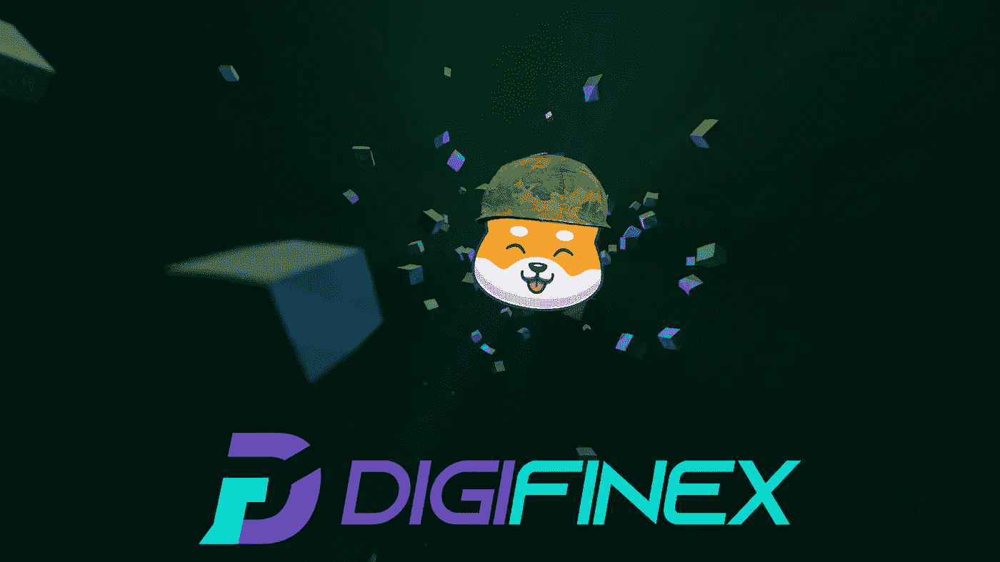

# $SHIBARMY 的下一个上市机会——DIGIFINEX

> 原文：<https://medium.com/coinmonks/the-next-listing-opportunity-for-shibarmy-digifinex-58170e317dfe?source=collection_archive---------30----------------------->

## 在我们刚刚与 VinDAX 进行的第一次 CEX 上市谈判中，我们有机会也在 Digifinex 上市，但我们需要社区来这样做！

我们的项目已经过审核，适合参加 Digifinex 交易所的上市活动！

主要集中在亚洲市场，Digifinex 将允许我们大大扩展我们的市场。亚洲投资者已经是我们项目中最大的投资者群体之一。考虑到 Digifinex 提供高端流动性和交易量，我们认为这个机会值得追求。

Digifinex 是排名前 50 的 CEX，日均交易量超过 750，000，000 美元，对我们的项目来说将是一个不可思议的补充。

## 我们需要在接下来的 72 小时内注册至少 50 个新用户！

1.  3 天预热投票:
    我们需要至少 50 名用户在 Digifinex
    上的**未来 3 天**注册链接:[https://www.digifinex.com/en-ww/from/9QoxcH?channelCode=ljaUPp](https://www.digifinex.com/en-ww/from/9QoxcH?channelCode=ljaUPp)
    推荐代码: **9QoxcH**
2.  下一步将是为新上市做 3 天准备后的 7 天投票期。它与 Digifinex 频道上的公告相结合，宣布我们的令牌将开始为上市活动投票。
3.  注册用户需要在他们的 DigiFinex 帐户中存入**比**多**的价值 50 $USDT 的密码**或**50 $ 50**的等值 **$SHIBARMY** 才能在活动中投票，这仅适用于第二个 7 天步骤。

> 加入 coin monks[Telegram group](https://t.me/joinchat/Trz8jaxd6xEsBI4p)学习加密交易和投资

## 关于 Digifinex

该交易平台由澳大利亚监管的数字货币交易服务提供商和新加坡货币管理局(MAS)对安全的区块链技术进行适当监管。内部开发的安全性具有多重故障安全层和双因素身份验证，为您的加密货币提供强大保护。

它有一个基本的专业用户界面，为各种交易习惯提供了合适的工具。

**官网:**【https://www.digifinex.com/】

**用户群:**
全球超过 400 万用户

**总部:**
香港，新加坡

**交易对:**
支持 150+对

**法定货币:**
10+

**支持国家:**
150+个国家

#SHIBARMY 功能:
💥- 8% #Shib 奖励
💥- 1%用于流动性
💥- 1%用于营销。

📌令牌信息:
🔸股票代码:$SHIBARMY
🔸合同地址:0x 940230 b 6 b 7 ef 1979 a28f 32196 a8e 3439 c 645 ba 49
💥将滑动设置为 11%-15%

网址:[https://shibarmybsc.com/](https://shibarmybsc.com/)

国际电报:[https://t.me/ShibarmyToken](https://t.me/ShibarmyToken)

中国电报:[https://t.me/Shibarmy_CHN](https://t.me/Shibarmy_CHN)

德国电报:[https://t.me/Shibarmy_DE](https://t.me/Shibarmy_DE)

土耳其电报:[https://t.me/shibarmy_TR](https://t.me/shibarmy_TR)

荷兰电报:[https://t.me/Shibarmy_NL](https://t.me/Shibarmy_NL)

https://www.reddit.com/r/ShibArmyBscToken/

推特:[https://twitter.com/shibarmybsc](https://twitter.com/shibarmybsc)

YouTube:[https://www.youtube.com/channel/UCaLMFOIqF5VHo4zVrIO_ydQ](https://www.youtube.com/channel/UCaLMFOIqF5VHo4zVrIO_ydQ)

BSCSCAN:[https://BSCSCAN . com/token/0x 940230 b 6 b 7 ef 1979 a28f 32196 a8e 3439 c 645 ba 49](https://bscscan.com/token/0x940230b6b7ef1979a28f32196a8e3439c645ba49)