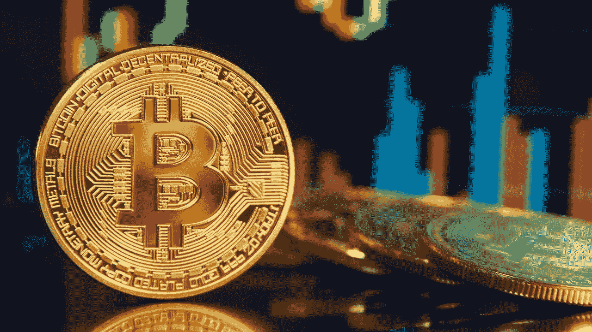
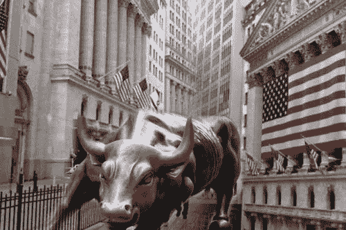
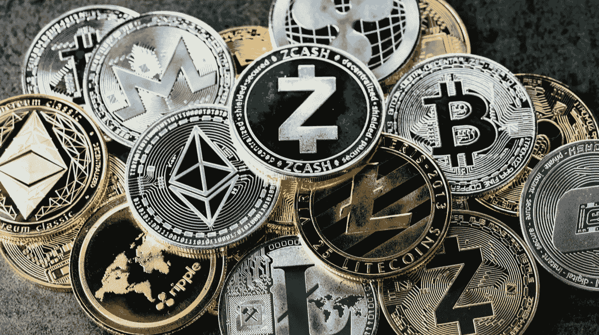
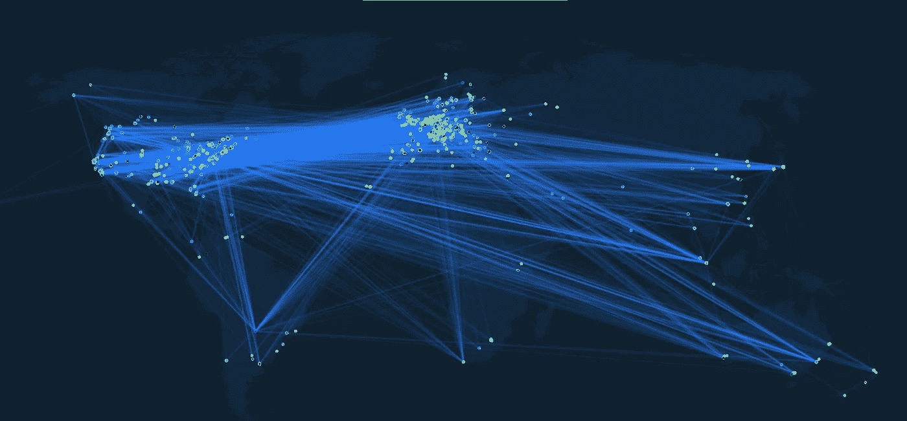
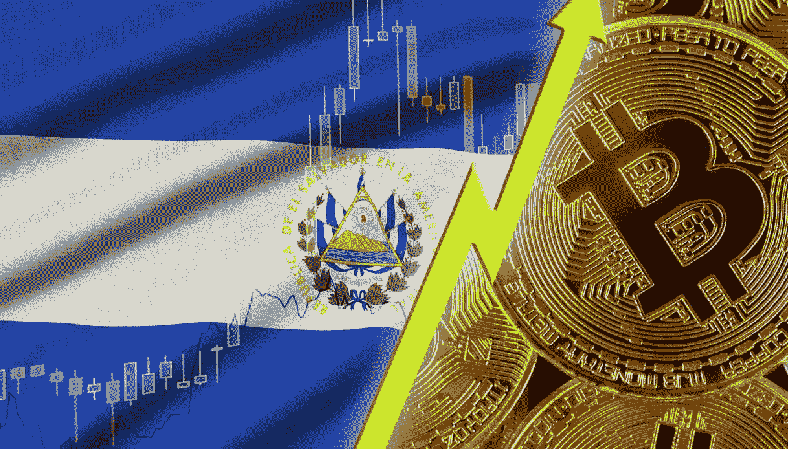

# 加密货币世界的下一步

> 原文：<https://medium.com/coinmonks/the-next-step-in-the-cryptocurrency-world-829e679c530d?source=collection_archive---------32----------------------->

我是区块链/加密货币技术的爱好者，我经常思考它的未来会是怎样的。首先，我认为它们没有单一的未来，这也是因为加密货币领域内各种区块链之间在技术上存在太多差异。

我认为，PoW 共识方法将——正确地——仅限于比特币。我正试图了解短期内影响会有多大，以及如何影响，但我相信，由于越来越高效的 ASIC 芯片和可再生解决方案，比特币挖矿在未来不会成为问题。路已经描好了，在我看来，用 GPU 做挖矿会随着时间变得不方便。ASICs 将取代 GPU，随着破坏 BTC 的难度越来越大，显卡将不再需要。

然而，我不太确定市场对比特币的意图是好的，让我解释一下:

一段时间以来，这些基金和各种拥有优秀金融资源的“有影响力”的人已经意识到了加密世界、尤其是比特币的经济波动性。并非所有的风险投资都热爱技术，有些人只是喜欢投机和快速致富，而没有考虑到他们的举动可能会在“经济上”摧毁行业或破坏信任。我不是说比特币会被抛售或什么的，我也不是在这里给出或做出经济预测。我只是怕一些对技术没心没肺的人。与此同时，欢迎有资本的企业家/风投，他们准备好帮助项目——显然是为了充实自己——并通过机构推进技术和清除技术。

如果我们看看其他项目，如以太坊，索拉纳，雪崩，泰洛斯，月神，附近，宇宙，多边形，以及许多其他项目。时间将根据综合费用和速度进行选择。在我看来，市场将转向这两个原则，因为人们将需要一个可靠的高 TPS 和低费用的区块链来发送金额。还是说这些连锁，在我看来，索拉纳未来可以做 IPO。退出加密空间，进入受监管的股权空间。我有这种感觉，但我可能是错的。

我借此机会谈谈与零核心技术的伪造令牌相关的骗局，这些骗局只是为了欺骗人们而创建的。我认为这肯定是加密货币行业的一次折叠，我们可以在不诉诸政府立法的情况下反击。通常，这些代币是通过 Pancake、Uniswa、p 或其他 DEX 上的拍卖来创建和出售的。在我看来，有一个清晰而明确的解决方案来阻止这一行业的灾难。

我也确信，许多目前过度资本化的代币将很快被搁置一旁。技术的善良会战胜一切。

我们还讨论了第 2 层的未来。第 2 层是第 1 层之上的一层，当您想到第 2 层时，您会想到可以扩展某些项目并使它们更灵活、更便宜的技术。只要想想有比特币的闪电网就知道了。一个仍处于测试阶段的项目，该项目承诺为比特币网络带来更多交易和更低成本。

但是第 2 层是解决方案吗？我不相信。至少不是在所有情况下，一些第 1 层将被放弃或由于其技术效率低下而失去市场份额。如果用户可以选择，他将总是选择使用第 1 层来增加安全性。

说到各种区块链，技术层面的关键点将是桥梁

各种区块链之间的桥梁是实现 web3 所需的互操作性的基础。我熟悉与桥接安全相关的问题，我并不是说今天它作为技术是安全的，可以大规模使用。但这是一个重要的因素，密码社区将不得不为这项技术努力工作。

我相信，随着越来越多的资本流动和桥梁成为现实，将需要某种基于智能合约的保险。

我还想谈谈立法。我担心欧洲对这个问题没有深入了解，可能会限制技术发展，让美国和亚洲失去阵地，并导致就业机会和财富的损失。幸运的是，对 PoW 加密禁令的投票还没有通过，但现在他们正试图跟踪各个交易所之间的动向。我担心官僚主义会减缓一些独特的加密货币流程。我不是在谈论加密货币作为法定系统的替代品，而是作为一个技术部门和一个专门为网络设计的系统。

然而，在立法问题上，我认为萨尔瓦多不会是一个孤立的例子。一些发展中国家或低收入国家将尝试使用加密货币。

总之，我愿意认为，一如既往，技术只能被推迟，而不能完全停止。即将到来的技术浪潮是毁灭性的，我们必须准备好研究它，并以最佳方式利用它。

> 加入 Coinmonks [电报频道](https://t.me/coincodecap)和 [Youtube 频道](https://www.youtube.com/c/coinmonks/videos)了解加密交易和投资

# 另外，阅读

*   [比特币基地跑马圈地](https://coincodecap.com/coinbase-staking) | [Hotbit 点评](/coinmonks/hotbit-review-cd5bec41dafb) | [KuCoin 点评](https://coincodecap.com/kucoin-review)
*   购买 Dogecoin 的 7 种最佳方式 | [ZebPay 评论](https://coincodecap.com/zebpay-review)
*   [iTop VPN 审核](https://coincodecap.com/itop-vpn-review) | [曼陀罗交易所审核](https://coincodecap.com/mandala-exchange-review)
*   [比特币基地 vs 瓦济克斯](https://coincodecap.com/coinbase-vs-wazirx) | [比特鲁点评](https://coincodecap.com/bitrue-review) | [波洛涅克斯 vs 比特鲁](https://coincodecap.com/poloniex-vs-bittrex)
*   [美国最佳加密交易机器人](https://coincodecap.com/crypto-trading-bots-in-the-us) | [经常性回顾](https://coincodecap.com/changelly-review)