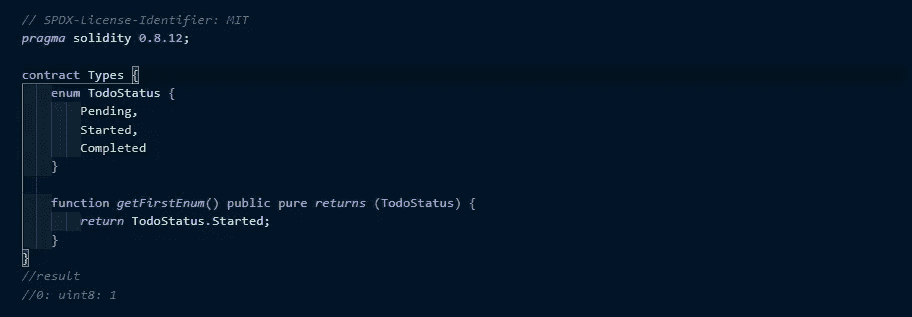
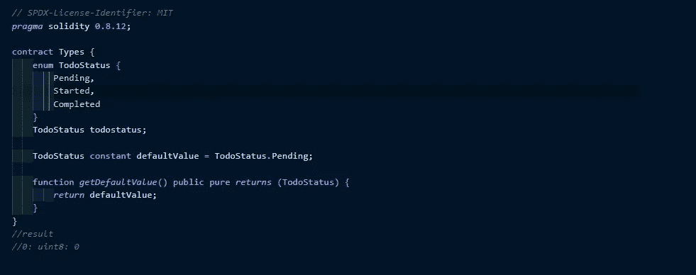

# 实性中值类型的本质

> 原文：<https://medium.com/coinmonks/the-nitty-gritty-of-value-types-in-solidity-9f557f146ebc?source=collection_archive---------11----------------------->


> 如果变量是容器，那么数据类型就是容器的类型。容器的类型决定了能装什么样的东西。例如，你不想把鲜花存放在一个封闭的麻袋里*🤷‍♀️。同样，你也不想在数据类型为字符串的变量中存储整数值…*

Solidity 是一种静态类型语言，这意味着我们必须明确定义每个变量的类型。

与其他编程语言一样，solidity 中的数据类型可以分为两种主要类型:

*   值类型
*   参考类型

实值类型和引用类型的区别主要在于它们被赋给变量和存储在以太坊虚拟机(EVM)中的方式。

就本文的范围而言，我们将强调可靠性中的值类型。

***什么是真正的值类型？***

值类型是一种将数据存储在自己的内存中的数据类型。它们被称为值类型，因为这些类型的变量总是通过值传递。嗯,🤔*按值传递……什么意思？这仅仅意味着当它们被赋值给另一个变量或者作为参数传递给一个函数时，它们总是被复制。*

以下是 solidity 中的值类型:

*   布尔运算
*   整数
*   地址
*   固定大小的字节数组
*   枚举
*   定点数(尚不完全支持这些类型)

*让我们逐一深入探讨吧！*🚀

**布尔型**

布尔值可以保存两个可能的值。这些值是常量，可以是`true` 或`false`。solidity 完全支持`!`、`&&`、`||`、`==`、`!=`等所有布尔运算符。

```
bool public myFirstBool;
```

**整数**

solidity 中的整数是一种用于存储整数值的数据类型，它们有两种类型:

*   声明为`int`的有符号整数

```
int public myFirstInt;
```

*   声明为`uint`的无符号整数

```
uint public myFirstUint;
```

有符号和无符号整数分别具有从`int8` 到`int256` 和`uint8` 到`uint256` 的各种大小，步长为 8(有符号或无符号的 8 到 256 位)。

整数支持以下运算符:

*   比较运算符:`<=`、`<`、`==`、`!=`、`>=`、`>`
*   位操作符:`&`、`|`、`^`、`~`
*   轮班操作员:`<<`、`>>`
*   算术运算符:`+`、`-`、`*`、`/`、`**`、`%`

点击了解更多关于这些运算符如何处理整数的信息。

**地址**

通常，address 类型的变量包含 20 个字节，这是以太坊地址的大小。地址有两种类型:

*   地址
*   应付地址

地址和应付地址几乎相同，但也有所不同。好的……那么它们有什么不同呢？

`address`和`address payable`的区别在于`address payable`是一个可以发送以太的地址，而`address`是不能发送以太的。另外，`address payable`还有额外的[成员](https://docs.soliditylang.org/en/v0.8.11/units-and-global-variables.html#address-related):即`transfer`和`send`。

地址可以通过两种方式从一种类型转换到另一种类型:隐式转换和显式转换。

*   **隐式转换:**允许从`address payable`到`address`的隐式转换，但是从`address`到`address payable`的转换必须通过`payable(address)`显式完成。
*   **显式转换:** `uint160`、整数文字、`bytes20`和契约类型允许与`address`之间的显式转换。

**固定大小的字节数组**

字节用于存储固定大小的字符集，而字符串用于存储等于或大于一个字节的字符集。字节的长度从 1 到 32 ( `byte1`、`byte2`、`byte3`、…、`byte32`)，而字符串的长度是动态的。与字符串相比，字节的优势在于它使用的气体更少，所以当我们知道数据的长度时更好使用。

Bytes 支持布尔运算符、比较运算符和按位运算符。

**枚举**

枚举将变量限制为只有几个预定义值中的一个。这个枚举列表中的值被称为枚举，这使得契约更具可读性、可维护性，并且更不容易出错。枚举的选项可以由从 0 开始的无符号整数值表示。

参见下面的例子



我们还可以在这里设置一个默认值👇



**固定点数**

按照 solidity 文档，Solidity 还不完全支持这些数据类型。对于不同大小的有符号和无符号定点数，它们可以分别声明为固定的和不固定的。

**结论:**

在本文中，我们学习了 solidity 值类型以及它们各自的工作原理。

谢谢你🤗为了坚持到底。喜欢读这篇文章吗？😉请留下您的反馈，关注更多精彩的文章。

> 加入 Coinmonks [电报频道](https://t.me/coincodecap)和 [Youtube 频道](https://www.youtube.com/c/coinmonks/videos)了解加密交易和投资

# 另外，阅读

*   [Coinswitch 俱吠罗评论](/coinmonks/coinswitch-kuber-review-1a8dc5c7a739) | [电网交易机器人](https://coincodecap.com/grid-trading) | [比特币基地收费](/coinmonks/coinbase-fees-831e77d4f2c5)
*   [Bitget 评论](https://coincodecap.com/bitget-review) | [双子星 vs BlockFi](https://coincodecap.com/gemini-vs-blockfi) | [OKEx 期货交易](https://coincodecap.com/okex-futures-trading)
*   [OKEx vs KuCoin](https://coincodecap.com/okex-kucoin) | [摄氏替代品](https://coincodecap.com/celsius-alternatives) | [如何购买 VeChain](https://coincodecap.com/buy-vechain)
*   [币安期货交易](https://coincodecap.com/binance-futures-trading)|[3 commas vs Mudrex vs eToro](https://coincodecap.com/mudrex-3commas-etoro)
*   [在印度利用加密套利赚取被动收入](https://coincodecap.com/crypto-arbitrage-in-india)
*   [德国最佳加密交易所](https://coincodecap.com/crypto-exchanges-in-germany) | [WazirX P2P](https://coincodecap.com/wazirx-p2p)
*   [如何购买 Monero](https://coincodecap.com/buy-monero) | [IDEX 评论](https://coincodecap.com/idex-review) | [BitKan 交易机器人](https://coincodecap.com/bitkan-trading-bot)
*   [加拿大最好的加密交易机器人](https://coincodecap.com/5-best-crypto-trading-bots-in-canada) | [赌注加密](https://coincodecap.com/staking-crypto)
*   [如何在印度购买比特币？](/coinmonks/buy-bitcoin-in-india-feb50ddfef94) | [瓦济克斯评论](/coinmonks/wazirx-review-5c811b074f5b)
*   [最佳在线赌场](https://coincodecap.com/best-online-casinos) | [硬件钱包](/coinmonks/hardware-wallets-dfa1211730c6) | [Jet-Bot 评论](https://coincodecap.com/jet-bot-review)