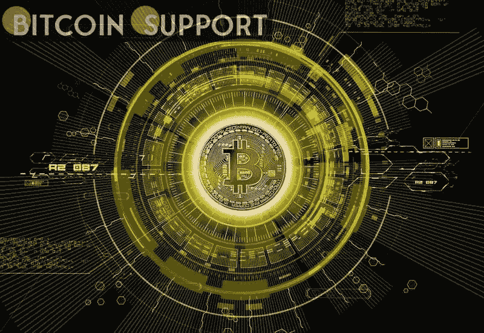

# 仅仅一年时间，秘密亿万富翁的数量激增了 60%:谁登上了福布斯年度榜单？

> 原文：<https://medium.com/coinmonks/the-number-of-crypto-millionaires-has-increased-by-60-in-a-year-who-made-forbes-yearly-list-7e31294400c0?source=collection_archive---------42----------------------->

**Visit our website:-** [**https://bitcoinsupports.com/**](https://bitcoinsupports.com/)

现在，加密富豪榜上有 19 名亿万富翁，另有 7 名高管和创始人加入了该行业最富有的行列。《福布斯》的加密亿万富翁名单已经修改，通过数字资产积累了巨额财富的个人数量显著增加。

加密精英榜目前包括 19 位亿万富翁，比去年多了 7 位，比前一年增长了 58%。该报于 4 月 5 日公布了世界上最富有的加密货币的最新名单，但这种作物的国王仍然没有改变。

【长鹏“CZ”】创始人兼首席执行官赵仍是商界首富，由于其相对较新的财富积累，他的排名已升至世界第 19 位。据该网站称，CZ 的价值已从去年的 960 亿美元降至目前的 650 亿美元。这仍然使他成为业内最富有的人。FTX 公司创始人兼首席执行官萨姆·班克曼-弗里德以 240 亿美元的净资产排在《财富》杂志之后，位居第二。他被称为“秘密罗宾汉”，因为他一再声明，他希望放弃自己的大部分财富。然而，手头还有 240 亿美元，他肯定还没有这样做。比特币基地创始人兼首席执行官布莱恩·阿姆斯壮以 66 亿美元排名第三。Ripple 公司的克里斯·拉森和双子座的文克莱沃斯双胞胎兄弟依然榜上有名，他们的身价都在 40 亿美元左右。FTX 联合创始人兼首席技术官王微拥有该公司 16%的股份，净资产为 56 亿美元，是 crypto 亿万富翁名单的新成员。& Alchemy 联合创始人尼基尔·维斯瓦纳坦和刘銮雄。这两个人的净资产加起来有 24 亿美元，排名世界第 12 位。OpenSea NFT 市场的联合创始人德文·芬泽尔和亚历克斯·阿塔拉也是今年加密富豪榜的新人，他们的净资产估计都有 22 亿美元。此外，这份名单还包括宋驰-亨，韩国 Upbit 交易所的创始人，据说他拥有 37 亿美元的资产。韩国 Dunamu 的执行副总裁 Kim Hyoung-nyon 持有 Upbit 约 13%的股份，对他的估值为 19 亿美元。MicroStrategy 首席执行官迈克尔·塞勒(Michael Saylor)保持了他的秘密亿万富翁身份，估计净资产为 16 亿美元。由于一次成功的比特币赌博，该公司的股票价值在过去两年中翻了两番。

《福布斯》于 2018 年首次发布了首届加密精英榜，只有少数企业高管入围。当时的门槛要低得多，要求拥有 3.5 亿美元的财富。

**访问我们的网站:-**[**https://bitcoinsupports.com/**](https://bitcoinsupports.com/)

**免责声明:以上为作者观点，不应视为投资建议。读者应该自己做研究。**

> *加入 Coinmonks* [*电报频道*](https://t.me/coincodecap) *和* [*Youtube 频道*](https://www.youtube.com/c/coinmonks/videos) *了解加密交易和投资*

# 另外，阅读

*   [Bookmap 评论](https://coincodecap.com/bookmap-review-2021-best-trading-software) | [美国 5 大最佳加密交易所](https://coincodecap.com/crypto-exchange-usa)
*   最佳加密[硬件钱包](/coinmonks/hardware-wallets-dfa1211730c6) | [Bitbns 评论](/coinmonks/bitbns-review-38256a07e161)
*   [新加坡十大最佳加密交易所](https://coincodecap.com/crypto-exchange-in-singapore) | [购买 AXS](https://coincodecap.com/buy-axs-token)
*   [红狗赌场评论](https://coincodecap.com/red-dog-casino-review) | [Swyftx 评论](https://coincodecap.com/swyftx-review) | [CoinGate 评论](https://coincodecap.com/coingate-review)
*   [投资印度的最佳密码](https://coincodecap.com/best-crypto-to-invest-in-india-in-2021)|[WazirX P2P](https://coincodecap.com/wazirx-p2p)|[Hi Dollar Review](https://coincodecap.com/hi-dollar-review)